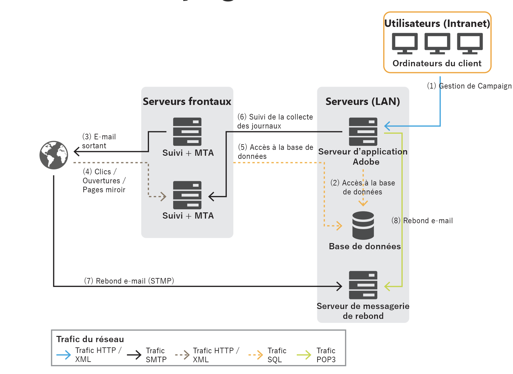

# Architecture générale{#general-architecture}

Un déploiement classique de la solution Adobe Campaign comprend les composants suivants :

* **Environnement client personnalisé**

   Interface graphique intuitive dans laquelle les utilisateurs peuvent communiquer et suivre les offres marketing, créer des campagnes, passer en revue et gérer toutes les activités, programmes et plans marketing, notamment les e-mails, les workflows et les landing pages, créer et gérer les profils des clients et créer les audiences.

* **Environnement de développement**

   Logiciel côté serveur qui exécute les campagnes marketing par le biais des canaux de communication sélectionnés, notamment e-mail, SMS, notification push, courrier, web ou social, en fonction des règles et des workflows définis dans l&#39;interface utilisateur.

* **Conteneurs de base de données**

   Reposant sur la technologie de base de données relationnelle, la base de données cloud d&#39;Adobe Campaign stocke toutes les informations, les composants de campagne, les offres, les workflows, ainsi que les résultats de campagne dans des conteneurs de base de données.

## Environnement client personnalisé {#client-env}

L&#39;application est accessible de différentes manières : client riche, client léger ou intégration via une API.

 [En savoir plus sur la couche de présentation de Campaign](../start/ac-components.md).

## Environnement de développement {#dev-env}

Adobe Campaign est une plateforme unique comprenant différentes applications visant à créer une architecture ouverte et évolutive. La plateforme Adobe Campaign est écrite sur une couche d&#39;application flexible. Elle est facilement configurable pour répondre aux besoins de votre entreprise. L&#39;architecture distribuée assure une évolutivité linéaire du système, capable de passer de milliers de messages à des millions.

Certains modules Campaign fonctionnent en continu, tandis que d&#39;autres sont démarrés ponctuellement pour effectuer des actions d&#39;administration (par exemple configurer la connexion à la base de données) ou lancer une tâche récurrente (par exemple consolider les informations de tracking).

On distingue trois types de modules Adobe Campaign :

* **Modules multi-instances** : un seul processus est exécuté pour toutes les instances. Cela s&#39;applique aux modules suivants : web, syslogd, trackinglogd et watchdog.
* **Modules mono-instances** : un processus est exécuté par instance. Cela s&#39;applique aux modules suivants : mta, wfserver, inMail, sms et stat.
* **Modules utilitaires** : il s&#39;agit de modules démarrés occasionnellement pour réaliser des opérations ponctuelles ou récurrentes (nettoyage, configuration, téléchargement de logs de tracking, etc.).

Les principaux processus sont les suivants :

* **Serveur applicatif** (nlserver web)  - Ce processus expose l’ensemble des fonctionnalités d’Adobe Campaign via les API de services web (SOAP / HTTP + XML). De plus, il peut générer dynamiquement les pages Web utilisées pour l’accès par HTML (rapports, formulaires Web, etc.). Pour ce faire, ce processus comprend un serveur JSP Apache Tomcat. Il s’agit du processus auquel la console se connecte.

* **Moteur de workflow** (nlserver wfserver) : ce processus exécute les processus de workflow définis dans l’application. Il prend également en charge les workflows techniques qui s&#39;exécutent périodiquement, et notamment les suivants :

   * **Tracking** : récupère et consolide les logs de tracking, de façon à ce que vous puissiez obtenir les logs du serveur de redirection et créer les indicateurs agrégés utilisés par le module de reporting.
   * **Nettoyage** : nettoie la base de données, vide les anciens enregistrements et évite que la base de données ne se développe de manière exponentielle.
   * **Facturation** : envoie un rapport d&#39;activité pour la plateforme (taille de la base, nombre d&#39;actions marketing, etc.).

* **Serveur de diffusion** (nlserver mta) : Adobe Campaign dispose d’une fonctionnalité de diffusion d’emails native. Ce processus fonctionne comme un agent de transfert d’e-mails SMTP (MTA). Il effectue une personnalisation « un à un » des messages et gère leur diffusion physique. Il s&#39;exécute à l&#39;aide de traitements de diffusion et gère les reprises automatiques. De plus, lorsque le tracking est activé, il remplace automatiquement les URL afin qu&#39;elles pointent vers le serveur de redirection. Ce processus peut assurer la personnalisation et l&#39;envoi automatique vers un prestataire externe pour les diffusions de type SMS, Fax ou Courrier papier.

* **Serveur de redirection** (nlserver webmdl)  - Pour les e-mails, Adobe Campaign gère automatiquement le suivi des ouvertures et des clics (le suivi transactionnel au niveau du site Web est une autre possibilité). Pour ce faire, les URL intégrées dans les e-mails sont réécrites afin de pointer vers ce module qui enregistre la transmission de l’utilisateur Internet avant de le rediriger vers l’URL requise.

   Pour garantir une disponibilité maximale, ce processus est totalement indépendant de la base de données : les autres processus serveur communiquent uniquement avec elle à l&#39;aide d&#39;appels SOAP (HTTP, HTTP(S) et XML). Techniquement, cette fonctionnalité est implémentée dans un module d&#39;extension d&#39;un serveur HTTP (extension ISAPI dans IIS, ou module DSO Apache, etc.) et est disponible uniquement sous Windows.

D&#39;autres processus plus techniques sont également disponibles :

* **Gestion des mails rebonds** (nlserver inMail)  - Ce processus permet de récupérer automatiquement les e-mails des boîtes de réception configurées pour recevoir les messages rebonds renvoyés en cas d’échec de la diffusion. Ces messages sont ensuite soumis à un traitement selon des règles afin de déterminer les raisons de leur non-diffusion (destinataire inconnu, dépassement de quota, etc.) et pour mettre à jour le statut de la diffusion dans la base de données. Toutes ces opérations sont entièrement automatiques et préconfigurées.

* **Etat de diffusion des SMS** (nlserver sms)  - Ce processus interroge à intervalles réguliers le routeur des messages SMS afin de collecter les états d&#39;avancement des diffusions et de mettre à jour la base de données.

* **Écriture des messages de log** (nlserver syslogd) : ce processus technique capture les messages de logs et les traces générés par les autres processus et les écrit sur le disque dur. De ce fait, de nombreuses informations sont disponibles pour le diagnostic en cas de problème.

* **Écriture des logs de tracking** (nlserver trackinglogd) : ce processus enregistre sur disque les logs de tracking générés par le processus de redirection.

* **Écriture des événements entrants** (nlserver interactiond) : ce processus assure l’enregistrement sur disque des événements entrants, dans le cadre d&#39;Interaction.

* **Supervision des modules** (nlserver watchdog) : ce processus technique agit comme un processus principal qui génère les autres. Il les surveille également et les relance automatiquement en cas d&#39;incident, ce qui permet de maintenir un temps d&#39;activité du système.

* **Serveur de statistiques** (nlserver stat) : ce processus gère les statistiques sur le nombre de connexions, les messages envoyés pour chaque serveur de messagerie vers lequel les messages sont envoyés, ainsi que leurs limitations (nombre maximum de connexions simultanées, de messages par heure et/ou connexion). Il permet également de fédérer plusieurs instances ou machines si elles partagent les mêmes adresses IP publiques.

## Conteneurs de base de données {#db-containers}

La base de données cloud d&#39;Adobe Campaign repose sur [!DNL Snowflake], qui contient les données fonctionnelles (profils, abonnements, contenu, etc.), les données techniques (traitement et journaux de diffusion, logs de tracking, etc.) ainsi que les données de travail (achats, leads) pour la solution. En outre, tous les composants Adobe Campaign communiquent avec la base de données afin d&#39;exécuter leurs tâches spécifiques.

Vous pouvez déployer Adobe Campaign à l&#39;aide de la base de données et des schémas prédéfinis. Si nécessaire, cet environnement prédéfini peut être étendu. Toutes les données du datamart sont accessibles par Adobe Campaign via des appels SQL. Adobe Campaign fournit également un ensemble complet d&#39;outils Extract Transform and Load (ETL) pour importer et exporter des données dans et en dehors du système.

>[!CAUTION]
>
>Avec **Campaign Managed Cloud Services**, votre environnement et votre configuration initiale ont été définis par Adobe, conformément aux termes de votre contrat de licence. Vous n&#39;êtes pas autorisé à modifier les packages, les schémas ou les rapports natifs installés.
>
>Si vous devez utiliser un module complémentaire Campaign ou une fonctionnalité spécifique qui n&#39;a pas été configurée pour vous, vous devez contacter **l&#39;assistance clientèle Adobe**.