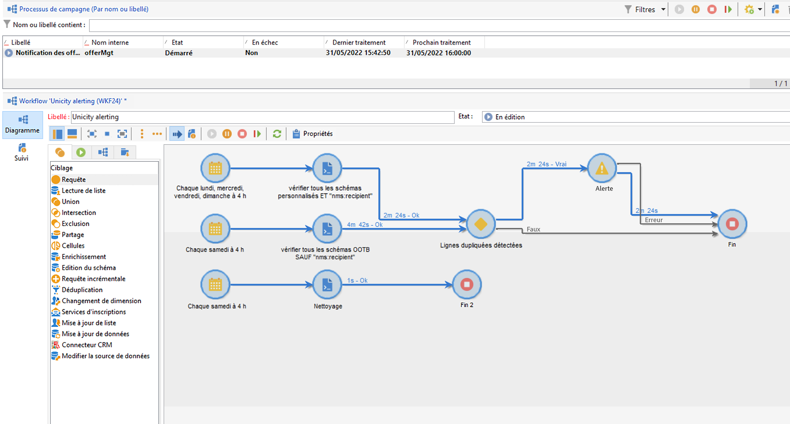
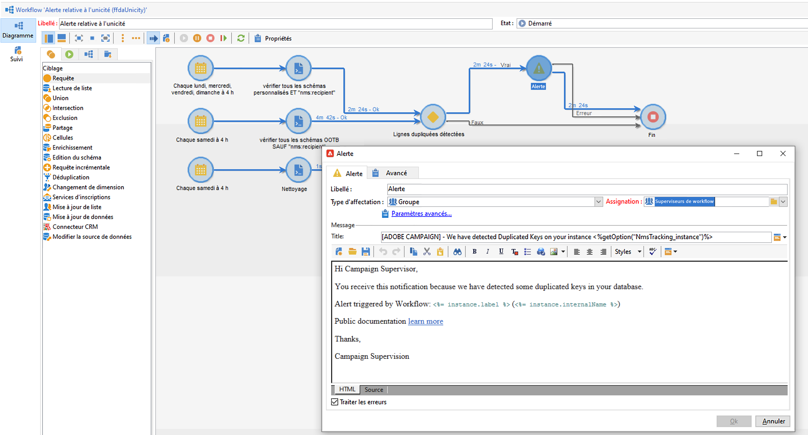
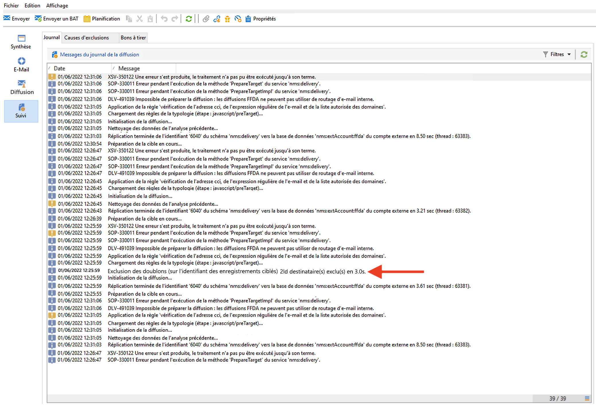
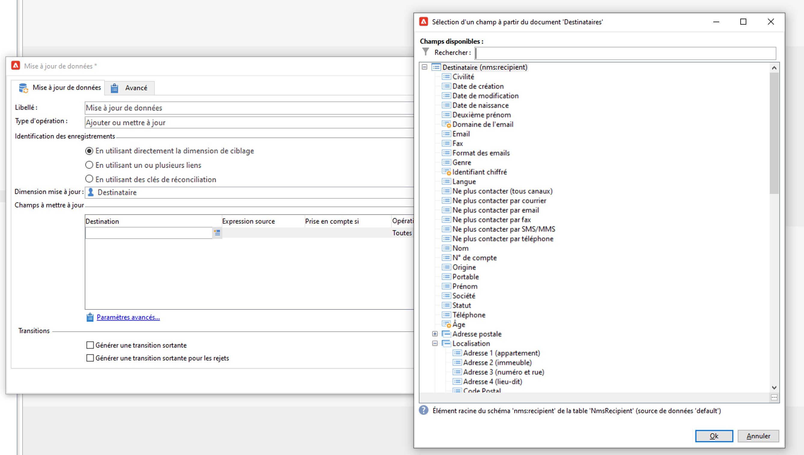
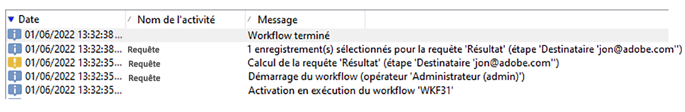

# Gestion des clés et unicité {#key-management}

Dans le contexte d’un [Déploiement Entreprise (FFDA)](enterprise-deployment.md), la clé primaire est un UUID (Universally Unique IDentifier), qui est une chaîne de caractères. Pour créer cet UUID, l’élément principal du schéma doit contenir les attributs **autouuid** et **autopk** définis sur **true**.

Adobe Campaign v8 utilise [!DNL Snowflake] comme base de données principale. L’architecture distribuée de la base de données [!DNL Snowflake] ne fournit pas de mécanisme permettant de gérer l’unicité d’une clé dans une table. Les utilisateurs finaux assurent la cohérence des clés au sein de la base de données Adobe Campaign.

Pour préserver la cohérence de la base de données relationnelle, il est obligatoire d&#39;éviter les doublons sur les clés, et notamment sur les clés primaires. Les doublons sur des clés primaires entraînent des problèmes avec les activités de workflow de gestion des données telles que **Requête**, **Réconciliation**, **Mise à jour de données**, etc. Cette étape est essentielle pour définir des critères de réconciliation appropriés lors de la mise à jour des tables [!DNL Snowflake].

>[!CAUTION]
>
>Les clés dupliquées ne sont pas limitées aux UUID. Cela peut se produire avec les identifiants, y compris les clés personnalisées créées dans les tables personnalisées.

## Unicity Service{#unicity-service}

Unicity Service est un composant Cloud Database Manager qui permet aux utilisateurs de préserver et surveiller l’intégrité des contraintes de clé uniques dans les tables Cloud Database. Cela permet de réduire le risque d’insertion de clés en double.

Comme Cloud Database n’applique pas les contraintes d’unicité, Unicity Service réduit le risque d’insertion de doublons lors de la gestion des données avec Adobe Campaign.

### Workflow d’unicité{#unicity-wf}

Unicity Service est fourni avec le workflow **[!UICONTROL Alerte relative à l’unicité]** intégré dédié qui permet de surveiller les contraintes d’unicité et d’alerter en cas de détection de doublons.

Ce workflow technique est disponible à partir du nœud **[!UICONTROL Administration > Exploitation > Workflows techniques > Unicité FFDA complète]** de l&#39;explorateur Campaign. **Il ne doit pas être modifié**.

Ce workflow vérifie tous les schémas personnalisés et intégrés afin de détecter les lignes dupliquées.

Si le workflow **[!UICONTROL Alerte relative à l’unicité]** (ffdaUnicity) détecte certaines clés en double, elles sont ajoutées à une table **Audit de l’unicité** spécifique qui inclut le nom du schéma, le type de clé, le nombre de lignes impactées et la date. Vous pouvez accéder à des clés dupliquées à partir du nœud **[!UICONTROL Administration > Audit > Unicité des clés]**.

En tant qu’administrateur de base de données, vous pouvez utiliser une activité SQL pour supprimer les doublons ou contacter l’Assistance clientèle d’Adobe pour plus d’informations.

### Alerte{#unicity-wf-alerting}

Une notification spécifique est envoyée au groupe d’opérateurs **[!UICONTROL Superviseurs de workflow]** lorsque des clés dupliquées sont détectées. Le contenu et l’audience de cette alerte peuvent être modifiés dans l’activité **Alerte** du workflow **[!UICONTROL Alerte relative à l’unicité]**.

## Mécanismes de sécurisation supplémentaires{#duplicates-guardrails}

Campaign est fourni avec un ensemble de nouveaux mécanismes de sécurisation qui empêchent l’insertion de clés dupliquées dans la base de données [!DNL Snowflake].

>[!NOTE]
>
>Ces mécanismes de sécurisation sont disponibles à partir de Campaign v8.3. Pour vérifier votre version, reportez-vous à [cette section](../start/compatibility-matrix.md#how-to-check-your-campaign-version-and-buildversion)

### Préparation de la diffusion{#remove-duplicates-delivery-preparation}

Adobe Campaign supprime automatiquement tout UUID dupliqué d’une audience lors de la préparation de la diffusion. Ce mécanisme empêche toute erreur lors de la préparation d&#39;une diffusion. En tant qu&#39;utilisateur final, vous pouvez vérifier ces informations dans les logs de diffusion : certains destinataires peuvent être exclus de la cible principale en raison de la clé dupliquée. Dans ce cas, l&#39;avertissement suivant s&#39;affiche : `Exclusion of duplicates (based on the primary key or targeted records)`.

### Mise à jour de données dans un workflow{#duplicates-update-data}

Dans le contexte d’un [Déploiement Enterprise (FFDA)](enterprise-deployment.md), vous ne pouvez pas sélectionner de clé interne (UUID) comme champ pour mettre à jour les données dans un workflow.

### Requête sur un schéma avec des doublons{#query-with-duplicates}

Lorsqu’un workflow démarre l’exécution de la requête sur un schéma, Adobe Campaign vérifie si un enregistrement dupliqué est signalé dans la variable [Table d’audit d’unicité](#unicity-wf). Si tel est le cas, le workflow consigne un avertissement, car l’opération suivante sur les données dupliquées peut avoir une incidence sur le résultat du workflow.

Ce contrôle est effectué dans les activités de workflow suivantes :

* Requête
* Requête incrémentale
* Lecture de liste