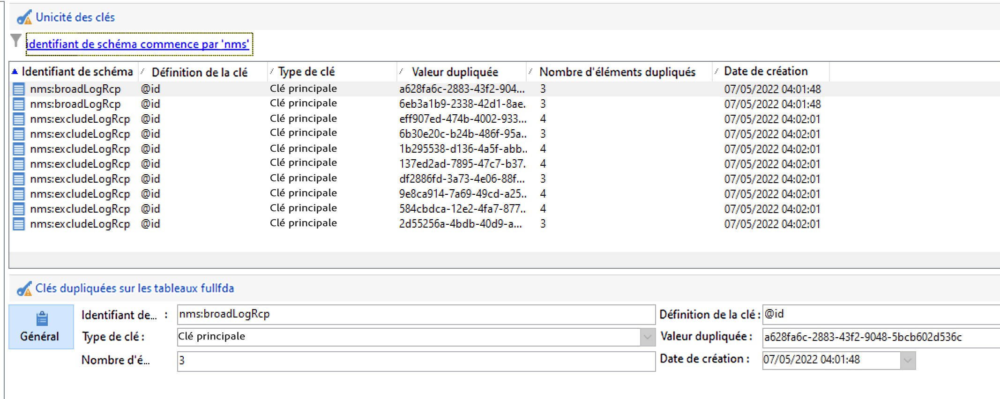

# Gestion des clés et unicité {#key-management}

Dans le contexte d’un [Déploiement Entreprise (FFDA)](enterprise-deployment.md), la clé Principale est un identifiant unique universel (UUID), qui est une chaîne sur les caractères. Pour créer cet UUID, l&#39;élément principal du schéma doit contenir les attributs **autouuid** et **autopk** définis sur **true**.

Adobe Campaign v8 utilise [!DNL Snowflake] comme base de données principale. L’architecture répartie du [!DNL Snowflake] La base de données ne fournit pas de mécanisme pour assurer l’unicité d’une clé dans un tableau : les utilisateurs finaux sont responsables de la cohérence des clés au sein de la base de données Adobe Campaign.

Pour préserver la cohérence de la base de données relationnelle, il est obligatoire d&#39;éviter les doublons sur les clés, et notamment sur les clés primaires. Les doublons sur des clés primaires entraînent des problèmes avec les activités de workflow de gestion des données telles que **Requête**, **Réconciliation**, **Mise à jour de données**, etc. Cette étape essentielle pour définir des critères de réconciliation appropriés lors de la mise à jour [!DNL Snowflake] des tables.

>[!CAUTION]
>
>Les clés dupliquées ne sont pas limitées aux UUID. Cela peut se produire avec les identifiants, y compris les clés personnalisées créées dans les tables personnalisées.

## Unicity Service{#unicity-service}

Unicity Service est un composant Cloud Database Manager qui aide les utilisateurs à préserver et à surveiller l’intégrité des contraintes de clé uniques dans les tables Cloud Database. Cela permet de réduire le risque d’insertion de clés en double.

Comme Cloud Database n’impose pas de contraintes d’unicité, le service d’unicité réduit le risque d’insertion de doublons lors de la gestion des données avec Adobe Campaign.

### Processus d’unicité{#unicity-wf}

Unicity Service est fourni avec un service dédié **[!UICONTROL Alertes d’annulation]** workflow intégré permettant de surveiller les contraintes d’unicité et d’alerter en cas de détection de doublons.

Ce workflow technique est disponible à partir du **[!UICONTROL Administration > Exploitation > Workflows techniques > Unicité FFDA complète]** noeud de l’Explorateur Campaign. **Il ne doit pas être modifié**.

Ce workflow vérifie tous les schémas personnalisés et intégrés afin de détecter les lignes dupliquées.

Si la variable **[!UICONTROL Alertes d’annulation]** Le workflow (ffdaUnicity) détecte certaines clés en double, elles sont ajoutées à une **Analyse de l’unité** qui inclut le nom du schéma, le type de clé, le nombre de lignes impactées et la date. Vous pouvez accéder à des clés dupliquées à partir de la **[!UICONTROL Administration > Audit > Unicité des clés]** noeud .

En tant qu’administrateur de base de données, vous pouvez utiliser une activité SQL pour supprimer les doublons ou contacter l’assistance clientèle d’Adobe pour plus d’informations.

### Alertes{#unicity-wf-alerting}

Une notification spécifique est envoyée au **[!UICONTROL Superviseurs de workflow]** groupe d’opérateurs lorsque des clés dupliquées sont détectées. Le contenu et l’audience de cette alerte peuvent être modifiés dans la variable **Alerte** l’activité **[!UICONTROL Alertes d’annulation]** workflow.

## Barrières de sécurité supplémentaires{#duplicates-guardrails}

Campaign est fourni avec un ensemble de nouvelles barrières de sécurité pour empêcher l&#39;insertion de clés dupliquées dans [!DNL Snowflake] base de données.

>[!NOTE]
>
>Ces protections sont disponibles à partir de Campaign v8.3. Pour vérifier votre version, reportez-vous à la section [cette section](../start/compatibility-matrix.md#how-to-check-your-campaign-version-and-buildversion)

### Préparation de la diffusion{#remove-duplicates-delivery-preparation}

Adobe Campaign supprime automatiquement tout UUID dupliqué d’une audience lors de la préparation de la diffusion. Ce mécanisme empêche toute erreur lors de la préparation d&#39;une diffusion. En tant qu&#39;utilisateur final, vous pouvez vérifier ces informations dans les logs de diffusion : certains destinataires peuvent être exclus de la cible principale en raison de la clé dupliquée. Dans ce cas, l&#39;avertissement suivant s&#39;affiche : `Exclusion of duplicates (based on the primary key or targeted records)`.

### Mise à jour de données dans un workflow{#duplicates-update-data}

Dans le contexte d’un [Déploiement Entreprise (FFDA)](enterprise-deployment.md), vous ne pouvez pas sélectionner de clé interne (UUID) comme champ pour mettre à jour les données dans un workflow.

Lors de l’utilisation de la clé de réconciliation explicite, la variable **Mise à jour de données** l’activité assure automatiquement l’unicité du schéma de destination en fonction de cette clé :

1. Dédupliquer les données entrantes (depuis la transition)
1. Déduplication des données avec la table de destination (fusion)

>[!CAUTION]
>
>Cette protection s’applique uniquement avec l’option . **[!UICONTROL Utiliser les clés de réconciliation]**.

### Requête sur un schéma avec des doublons{#query-with-duplicates}

Lorsqu’un workflow démarre l’exécution de la requête sur un schéma, Adobe Campaign vérifie si un enregistrement dupliqué est signalé dans la variable [Table d’unité de contrôle](#unicity-wf). Si tel est le cas, le workflow consigne un avertissement, car l’opération suivante sur les données dupliquées peut avoir une incidence sur le résultat du workflow.

Ce contrôle est effectué dans les activités de workflow suivantes :

* Requête
* Requête incrémentale
* Lecture de liste