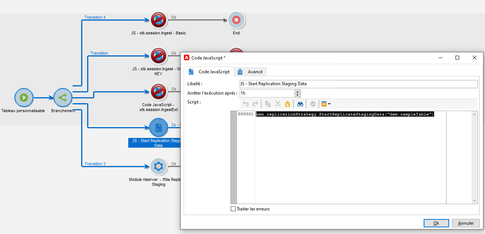
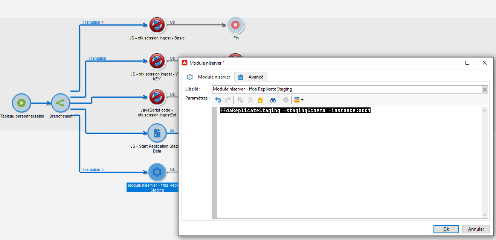

# Workflows techniques et réplication des données {#wf-data-replication}

## Workflows techniques {#tech-wf}

Dans le contexte d’un [Déploiement Enterprise (FFDA)](enterprise-deployment.md), Adobe Campaign est fourni avec un ensemble de workflows techniques intégrés. Les workflows techniques exécutent des processus ou des traitements planifiés de manière régulière sur le serveur.

Ces workflows effectuent des opérations de maintenance sur la base de données, tirent parti des informations de tracking contenues dans les logs de diffusion, créent des campagnes récurrentes, etc.

 La liste complète des workflows techniques est détaillée sur [cette page](https://experienceleague.adobe.com/docs/campaign/automation/workflows/introduction/wf-type/technical-workflows.html?lang=fr)

Outre ces workflows techniques, Campaign v8 s&#39;appuie sur des workflows techniques spécifiques pour gérer la [réplication des données](#data-replication).

* **[!UICONTROL Répliquer les tables de référence]**
Ce workflow effectue une réplication automatique des tables intégrées qui doivent être présentes dans la base de données locale de Campaign (Postgres) et la base de données cloud ([!DNL Snowflake]). Il est planifié pour s&#39;exécuter toutes les heures, quotidiennement. Si le champ **lastModified** existe, la réplication se produit de manière incrémentielle. Dans le cas contraire, la table entière est répliquée. L&#39;ordre des tables dans le tableau ci-dessous correspond à celui utilisé par le workflow de réplication.
* **[!UICONTROL Répliquer les données Staging]**
Ce workflow réplique les données Staging pour les appels unitaires. Il est planifié pour s&#39;exécuter toutes les heures, quotidiennement.
* **[!UICONTROL Déployer immédiatement FFDA]**\
  Ce workflow effectue un déploiement immédiat dans la base de données cloud.
* **[!UICONTROL Répliquer les données FFDA immédiatement]**
Ce workflow réplique les données XS pour un compte externe donné.

Ces workflows techniques sont disponibles à partir du nœud **[!UICONTROL Administration > Exploitation > Workflows techniques > Réplication FFDA complète]** de l&#39;explorateur Campaign. **Ils ne doivent pas être modifiés.**

Si nécessaire, vous pouvez lancer manuellement la synchronisation des données. Pour ce faire, cliquez avec le bouton droit de la souris sur l&#39;activité **Planificateur** et sélectionnez **Traitement anticipé de la (des) tâche(s)**.

## Réplication des données {#data-replication}

Certains tableaux natifs sont répliqués de la base de données Campaign locale vers la base de données cloud [!DNL Snowflake] par le biais de workflows dédiés décrits ci-dessus.

Identifiez les bases de données utilisées par Adobe Campaign v8, les raisons de la réplication des données, les données qui sont répliquées et le fonctionnement du processus de réplication.

>[!VIDEO](https://video.tv.adobe.com/v/334460?quality=12)


### Politiques de réplication de données {#data-replication-policies}

Les politiques de réplication sont basées sur la taille des tables. Certaines tables sont répliquées en temps réel. D&#39;autres le sont sur une base horaire. Certaines tables sont mises à jour de manière incrémentielle tandis que d&#39;autres sont remplacées.

Outre le workflow technique intégré **Répliquer les tables de référence**, vous pouvez forcer la réplication des données dans vos workflows.

Vous pouvez ainsi :

* ajouter une activité **Code JavaScript** spécifique avec le code suivant :

```
nms.replicationStrategy.StartReplicateStagingData("dem:sampleTable")
```




* ajouter une activité **nlmodule** spécifique avec la commande suivante :

```
nlserver ffdaReplicateStaging -stagingSchema -instance:acc1
```




**Rubriques connexes**

* [Découvrez la prise en main des workflows](https://experienceleague.adobe.com/docs/campaign/automation/workflows/introduction/about-workflows.html?lang=fr)

* [Périodes de conservation des données](../dev/datamodel-best-practices.md#data-retention)
