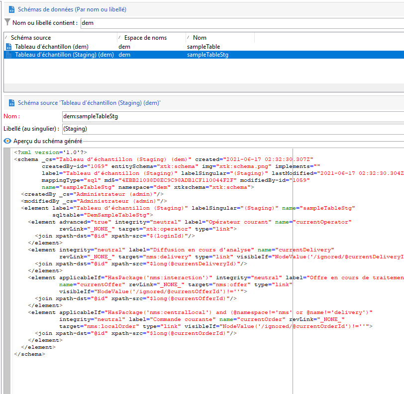

# Mécanisme d&#39;évaluation de l&#39;API Campaign

Dans le contexte d’un [Déploiement Entreprise (FFDA)](enterprise-deployment.md), il n’est pas recommandé de dynamiser les appels unitaires en ce qui concerne les performances (latence et simultanéité). L&#39;opération par lots est toujours préférable. Afin d’améliorer les performances, les API d&#39;ingestion sont redirigées vers la base de données locale.

La fonctionnalité d&#39;évaluation de Campaign est activée par défaut sur certains schémas prédéfinis. Nous pouvons également l&#39;activer sur un schéma personnalisé. Description du mécanisme d&#39;évaluation :

* La structure du schéma de données est dupliquée dans la table d&#39;évaluation locale.
* Les nouvelles API dédiées pour l&#39;ingestion des données se déplacent directement dans la table d&#39;évaluation locale. [En savoir plus](new-apis.md)
* Un workflow planifié se déclenche toutes les heures et resynchronise les données vers la base de données cloud. [En savoir plus](replication.md)

Certains schémas natifs sont évalués par défaut, tels que nmsSubscriptionRcp, nmsAppSubscriptionRcp, nmsRecipient.

Les API de Campaign Classic v7 sont toujours disponibles, mais ne peuvent pas bénéficier de ce nouveau mécanisme d&#39;évaluation : les appels d&#39;API sont acheminés directement vers la base de données cloud. Adobe recommande d&#39;utiliser le nouveau mécanisme d&#39;évaluation autant que possible afin de réduire la pression globale et la latence sur la base de données cloud de Campaign.

>[!CAUTION]
>
>* Grâce à ce nouveau mécanisme, la synchronisation des données pour les désinscriptions de canaux, les abonnements, les désabonnements ou l&#39;enregistrement mobile est désormais **asynchrone**.
>
>* L&#39;évaluation s’applique uniquement aux schémas stockés dans la base de données cloud. N&#39;activez pas l&#39;évaluation sur les schémas répliqués. N&#39;activez pas l&#39;évaluation sur les schémas locaux. N&#39;activez pas l’évaluation sur un schéma évalué
>


## Étapes d&#39;implémentation{#implement-staging}

Pour mettre en œuvre le mécanisme d&#39;évaluation de Campaign sur une table spécifique, procédez comme suit :

1. Créez un exemple de schéma personnalisé sur la base de données cloud de Campaign. Aucune évaluation n&#39;est activée à cette étape.

   ```
   <srcSchema _cs="Sample Table (dem)" created="YYYY-DD-MM"
           entitySchema="xtk:srcSchema" img="xtk:schema.png" label="Sample Table"
           lastModified="YYYY-DD-MM HH:MM:SS.TZ" mappingType="sql" md5="XXX"
           modifiedBy-id="0" name="sampleTable" namespace="dem" xtkschema="xtk:srcSchema">
   <element autopk="true" autouuid="true" dataSource="nms:extAccount:ffda" label="Sample Table"
           name="sampleTable">
       <attribute label="Test Col 1" length="255" name="testcol1" type="string"/>
       <attribute label="Test Col 2" length="255" name="testcol2" type="string"/>
   </element>
   </srcSchema>
   ```

    Pour en savoir plus sur la création de schémas personnalisés, consultez [cette page](../dev/create-schema.md).

1. Enregistrez et mettez à jour la structure de la base de données.  [En savoir plus](../dev/update-database-structure.md)

1. Activez le mécanisme d&#39;évaluation dans la définition du schéma en ajoutant le paramètre **autoStg=&quot;true&quot;**.

   ```
   <srcSchema _cs="Sample Table (dem)" "YYYY-DD-MM"
           entitySchema="xtk:srcSchema" img="xtk:schema.png" label="Sample Table"
           lastModified="YYYY-DD-MM HH:MM:SS.TZ" mappingType="sql" md5="XXX"
           modifiedBy-id="0" name="sampleTable" namespace="dem" xtkschema="xtk:srcSchema">
   <element autoStg="true" autopk="true" autouuid="true" dataSource="nms:extAccount:ffda" label="Sample Table"
           name="sampleTable">
       <attribute label="Test Col 1" length="255" name="testcol1" type="string"/>
       <attribute label="Test Col 2" length="255" name="testcol2" type="string"/>
   </element>
   </srcSchema>
   ```

1. Enregistrez la modification. Un nouveau schéma d&#39;évaluation est disponible, qui est une copie locale du schéma initial.

   

1. Mise à jour de la structure de la base de données. La table d&#39;évaluation sera créée sur la base de données locale de Campaign.
