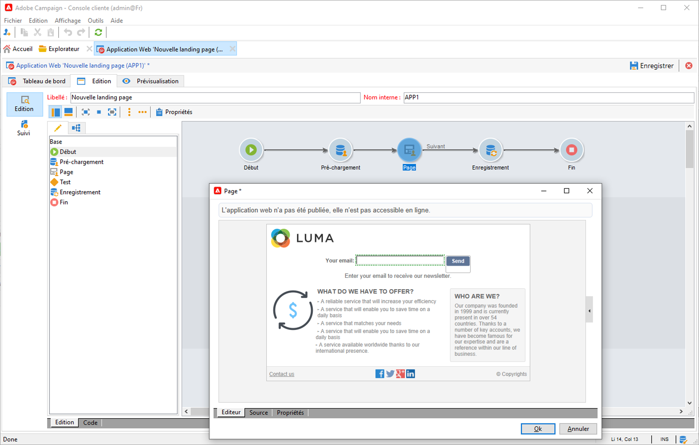

# Collecter et mettre à jour des profils avec des formulaires web

Utilisez Campaign pour créer des formulaires web, et collecter et gérer facilement et efficacement les données de profil. Vous pouvez partager ces formulaires sur votre site web, ce qui permet à vos contacts de fournir facilement leurs informations. Les données sont envoyées à Campaign pour créer ou mettre à jour leur profil.

 Découvrez comment créer des formulaires web dans la [documentation de Campaign Classic v7](https://experienceleague.adobe.com/docs/campaign-classic/using/designing-content/web-forms/about-web-forms.html?lang=fr){target=&quot;_blank&quot;}.
