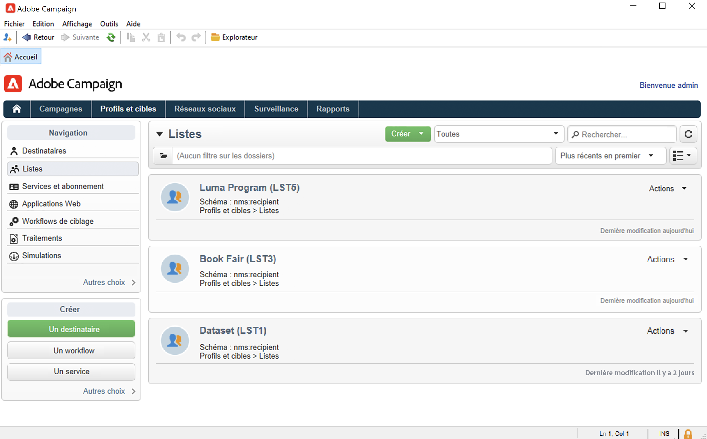
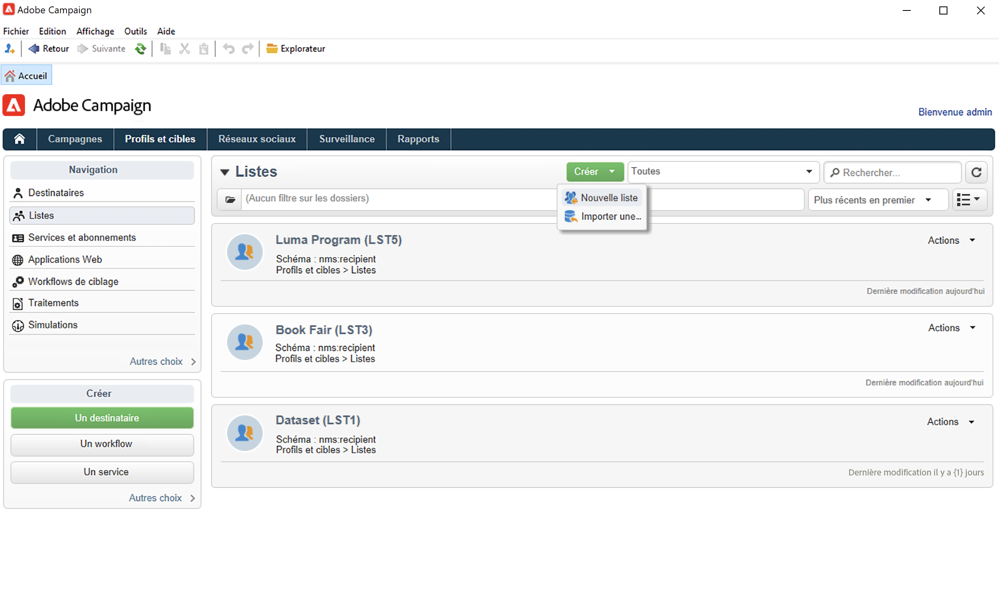
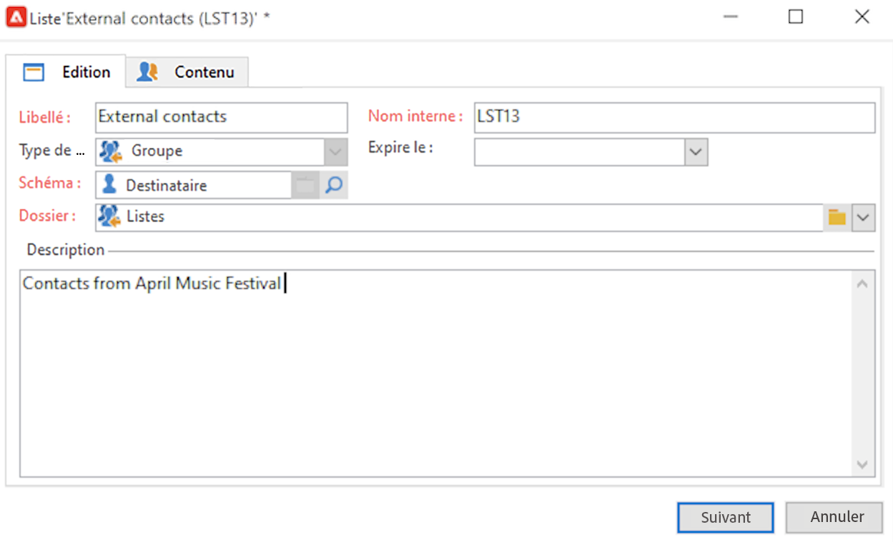
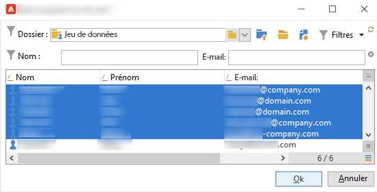
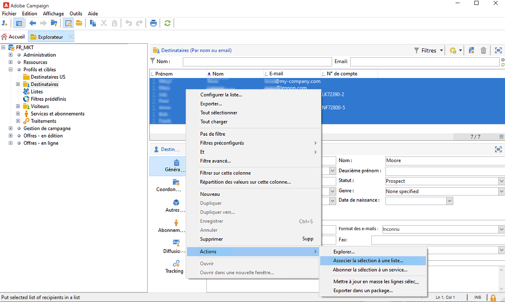
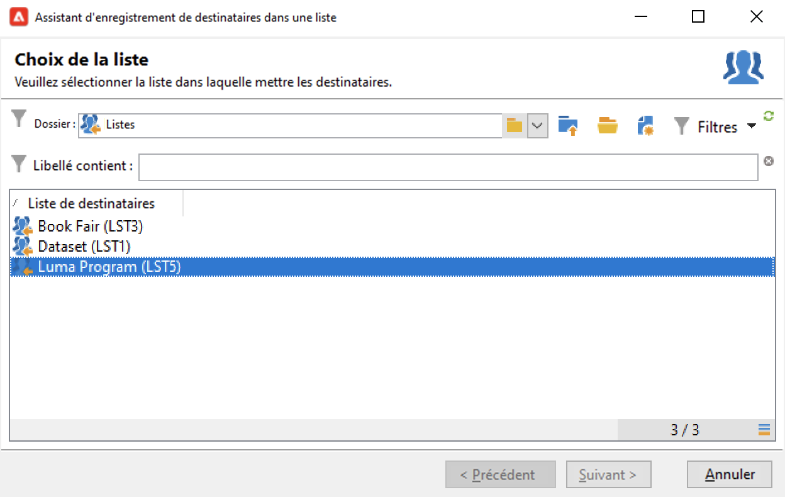
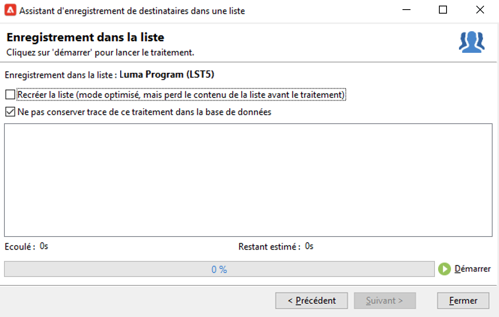
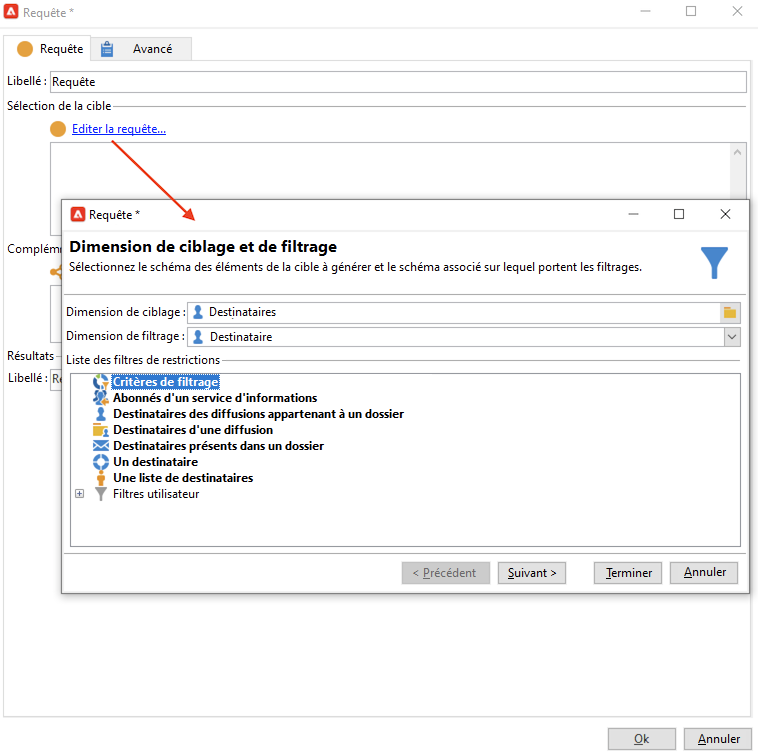
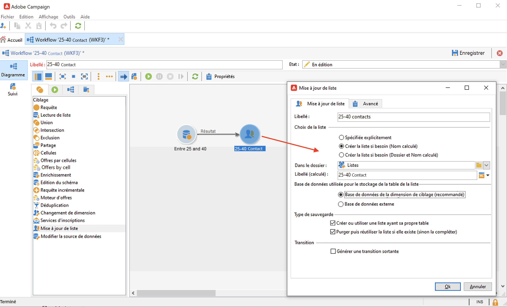
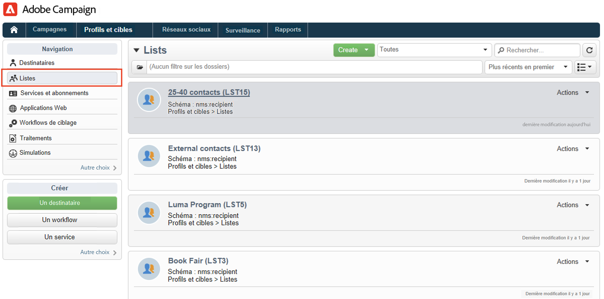

# Créer une audience dans une liste{#create-segments}

Utilisez les listes de campagnes pour créer et organiser vos audiences.

Une liste est un ensemble statique de contacts qui peut être ciblé dans les actions de diffusion ou mis à jour lors d&#39;un import ou d&#39;une autre action de workflow. Par exemple, une population extraite de la base via une requête peut être stockée en tant que liste.

Les listes sont créées et gérées à partir du lien **[!UICONTROL Listes]** dans l&#39;onglet **[!UICONTROL Profils et cibles.]** Ces listes sont basées sur la table des profils Adobe Campaign par défaut (nms:recipient). [En savoir plus](../dev/datamodel.md#ootb-profiles.md)

Vous pouvez créer une liste à l’aide du **Mettre à jour la liste** dans un workflow. Cette activité stocke la population résultante dans une liste. Utilisez-le pour créer une liste ou mettre à jour une liste existante. Pour créer des listes contenant d&#39;autres types de données que la table de profils intégrée, vous devez exécuter un workflow. Par exemple, en utilisant une requête sur la table des visiteurs puis en mettant à jour la liste, vous pouvez créer une liste de visiteurs. [En savoir plus](#create-a-list-wf).

Regardez cette vidéo pour en savoir plus sur la gestion des listes dans Adobe Campaign.

>[!VIDEO](https://video.tv.adobe.com/v/334909?quality=12)

## Créer une liste de contacts {#create-a-list-of-contacts}

Pour créer une liste de contacts, procédez comme suit :

1. Cliquez sur le bouton **[!UICONTROL Créer]** et choisissez **[!UICONTROL Nouvelle liste]**.

   

1. Renseignez les informations dans l&#39;onglet **[!UICONTROL Edition]** de la fenêtre de création de la liste.

   

   * Saisissez le nom de la liste dans le champ **[!UICONTROL Libellé]** et, au besoin, modifiez le nom interne.
   * Ajoutez une description pour cette liste.
   * Vous pouvez définir une date d&#39;expiration : lorsque cette date est atteinte, la liste est purgée et automatiquement supprimée.

1. Dans l&#39;onglet **[!UICONTROL Contenu]**, cliquez sur **[!UICONTROL Ajouter]** pour sélectionner les profils appartenant à la liste.

   

   Vous pouvez créer un nouveau profil et l&#39;ajouter dans la liste directement depuis cette fenêtre à l&#39;aide du **[!UICONTROL Créer]** icône . Le profil sera ajouté à la base de données.

1. Cliquez sur le bouton **[!UICONTROL Enregistrer]** pour enregistrer cette liste. Elle est alors ajoutée dans la vue d&#39;ensemble des listes.

## Convertir des contacts filtrés en liste {#convert-data-to-a-list}

Vous pouvez sélectionner des profils et les ajouter à une liste. Pour ce faire, suivez les étapes ci-après :

1. Dans l&#39;Explorateur de Campaign, sélectionnez les profils et cliquez avec le bouton droit de la souris.

   Ces profils peuvent être filtrés pour répondre à des critères spécifiques.

1. Sélectionnez **[!UICONTROL Actions > Associer la sélection à une liste...]**.

   

1. Sélectionnez une liste existante ou créez-en une, puis cliquez sur **[!UICONTROL Suivant]**.

   

1. Cliquez sur le bouton **[!UICONTROL Démarrer]** pour lancer l&#39;opération.

   

Sélectionnez la **[!UICONTROL Recréer la liste]** pour supprimer le contenu existant de la liste et optimiser la création de la liste (aucune requête n&#39;est nécessaire pour vérifier si les profils sont déjà associés à la liste).

Si vous décochez l&#39;option **[!UICONTROL Ne pas conserver trace de ce traitement dans la base de données]**, vous pouvez sélectionner (ou créer) le dossier d&#39;exécution où seront stockées les informations relatives à ce traitement.

La section supérieure de la fenêtre vous permet de suivre l&#39;exécution. Le bouton **[!UICONTROL Arrêter]** vous permet de stopper l&#39;opération. Les contacts déjà traités seront toutefois associés à la liste.

Une fois l’exécution terminée, accédez à la **[!UICONTROL Profils et cibles > Listes]** et sélectionnez la liste : la valeur **[!UICONTROL Contenu]** affiche les profils associés à cette liste.

## Créer une liste avec un workflow  {#create-a-list-wf}

Vous pouvez utiliser la variable **[!UICONTROL Mise à jour de liste]** pour créer une liste ou ajouter une population à une liste de destinataires.

Dans l&#39;exemple ci-dessous, vous créez une liste de tous les destinataires compris entre 25 et 40 ans.

1. Sélectionner **[!UICONTROL Profils et cibles]**, et **[!UICONTROL Workflows de ciblage]**, puis créez un workflow à partir de l’événement **[!UICONTROL Créer]** bouton .
1. Saisissez un libellé pour ce workflow, par exemple &#39;25-40 contacts&#39;, ajoutez une description, puis cliquez sur **[!UICONTROL Suivant]**.

   

1. Insérer une **[!UICONTROL Requête]** activité pour définir la population cible et éditer la requête.

   

1. Définissez les conditions de filtrage, comme ci-dessous :

   

   Découvrez comment créer une requête dans un workflow dans [Documentation de Campaign Classic v7](https://experienceleague.adobe.com/docs/campaign-classic/using/automating-with-workflows/targeting-activities/query.html?lang=fr#creating-a-query){target=&quot;_blank&quot;}

1. Ajoutez un libellé pour cette requête et enregistrez vos modifications.
1. Ajouter un **[!UICONTROL Mise à jour de liste]** et modifiez-la.

   

1. Saisissez le libellé de l’activité.
1. Sélectionnez la **[!UICONTROL Créez la liste si nécessaire (Nom calculé)]** pour indiquer que la liste sera créée une fois le premier workflow exécuté, puis mise à jour avec les exécutions suivantes.
1. Sélectionnez un dossier et saisissez le libellé de la liste.
1. Sélectionnez la **[!UICONTROL Base de données de la dimension de ciblage]** pour stocker la table.
1. Laissez le champ **[!UICONTROL Purger la liste si elle existe (sinon la complète)]** option cochée pour supprimer les destinataires ne correspondant pas aux critères de ciblage, et pour en insérer de nouveaux dans la liste.
1. Laissez également l&#39;option **[!UICONTROL Créer ou utiliser une liste ayant sa propre table]** sélectionnée.
1. Laissez l&#39;option **[!UICONTROL Générer une transition sortante]** désélectionnée.
1. Cliquez sur **[!UICONTROL Ok]** et enregistrez le workflow.
1. Démarrez le workflow.

   La liste des destinataires correspondants est alors créée. Vous pouvez accéder à cette liste à partir du **[!UICONTROL Listes]** entrée de la page d’accueil.

   

   Vous pouvez rendre ce workflow récurrent en ajoutant un planificateur au workflow. Apprenez-en davantage dans la [documentation de Campaign Classic v7](https://experienceleague.adobe.com/docs/campaign-classic/using/automating-with-workflows/flow-control-activities/scheduler.html){target=&quot;_blank&quot;}.

## Retirer un profil d’une liste {#remove-a-profile-from-a-list}

Pour supprimer un profil d’une liste, modifiez la liste, puis sélectionnez le profil dans le **[!UICONTROL Contenu]** , puis cliquez sur le bouton **[!UICONTROL Supprimer]** icône .

## Supprimer une liste de profils {#delete-a-list-of-profiles}

Pour supprimer une liste, accédez-la à partir de l&#39;Explorateur Campaign, sélectionnez-la et cliquez avec le bouton droit de la souris. Choisir **[!UICONTROL Supprimer]**. Un message d’avertissement vous demande de confirmer la suppression.

>[!NOTE]
>
>Lorsque vous supprimez une liste, les profils qui appartenaient à cette liste ne sont pas affectés. Les données de leur profil seront toutefois mises à jour.
