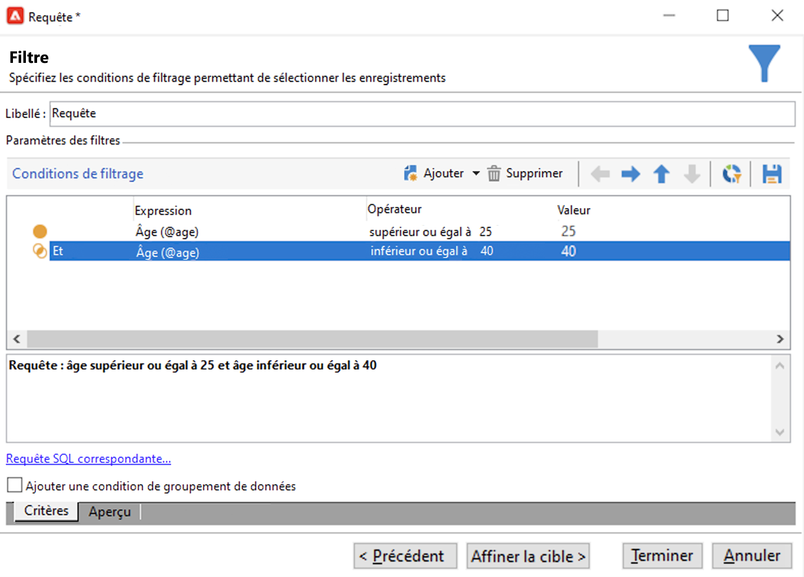

# Créer une audience dans une liste {#create-segments}

Utilisez les listes Campaign pour créer et organiser vos audiences.

Une liste est un ensemble statique de contacts qui peut être ciblé dans des actions de diffusion ou mis à jour pendant une importation ou lors d&#39;une autre action de workflow. Par exemple, une population extraite de la base de données via une requête peut être stockée en tant que liste.

Les listes sont créées et gérées à partir du lien **[!UICONTROL Listes]** dans l&#39;onglet **[!UICONTROL Profils et cibles.]** Ces listes sont basées sur la table des profils Adobe Campaign par défaut (nms:recipient). [En savoir plus](../dev/datamodel.md#ootb-profiles.md)

Vous pouvez créer une liste à l&#39;aide de l&#39;activité **Mettre à jour la liste** dans un workflow. Cette activité stocke la population résultante dans une liste. Utilisez-la pour créer une liste ou mettre à jour une liste existante. Pour créer des listes contenant d&#39;autres types de données que la table de profils intégrée, vous devez exécuter un workflow. Par exemple, en utilisant une requête sur la table des visiteurs puis en mettant à jour la liste, vous pouvez créer une liste de visiteurs. [En savoir plus](#create-a-list-wf).

Regardez cette vidéo pour en savoir plus sur la gestion des listes dans Adobe Campaign.

>[!VIDEO](https://video.tv.adobe.com/v/334909?quality=12)

## Créer une liste de contacts {#create-a-list-of-contacts}

Pour créer une liste de contacts, procédez comme suit :

1. Cliquez sur le bouton **[!UICONTROL Créer]** et choisissez **[!UICONTROL Nouvelle liste]**.

   

1. Renseignez les informations dans l&#39;onglet **[!UICONTROL Edition]** de la fenêtre de création de la liste.

   

   * Saisissez le nom de la liste dans le champ **[!UICONTROL Libellé]** et, au besoin, modifiez le nom interne.
   * Ajoutez une description pour cette liste.
   * Vous pouvez définir une date d&#39;expiration : lorsque cette date est atteinte, la liste est purgée et automatiquement supprimée.

1. Dans l&#39;onglet **[!UICONTROL Contenu]**, cliquez sur **[!UICONTROL Ajouter]** pour sélectionner les profils appartenant à la liste.

   

   Vous pouvez créer un nouveau profil et l&#39;ajouter dans la liste directement depuis cette fenêtre à l&#39;aide de l&#39;icône **[!UICONTROL Créer]**. Le profil sera ajouté à la base de données.

1. Cliquez sur le bouton **[!UICONTROL Enregistrer]** pour enregistrer cette liste. Elle est alors ajoutée dans la vue d&#39;ensemble des listes.

## Convertir des contacts filtrés en liste {#convert-data-to-a-list}

Vous pouvez sélectionner des profils et les ajouter à une liste. Pour ce faire, suivez les étapes ci-après :

1. Dans l&#39;explorateur Campaign, sélectionnez les profils et effectuez un clic droit.

   Ces profils peuvent être filtrés pour répondre à des critères spécifiques.

1. Sélectionnez **[!UICONTROL Actions > Associer la sélection à une liste...]**.

   

1. Sélectionnez une liste existante ou créez-en une, puis cliquez sur **[!UICONTROL Suivant]**

   

1. Cliquez sur le bouton **[!UICONTROL Démarrer]** pour lancer l&#39;opération.

   

Sélectionnez l&#39;option **[!UICONTROL Recréer la liste]** pour supprimer le contenu existant de la liste et optimiser la création de la liste (aucune requête n&#39;est nécessaire pour vérifier si les profils sont déjà associés à la liste).

Si vous décochez l’option **[!UICONTROL Ne pas conserver trace de ce traitement dans la base de données]**, vous pouvez sélectionner (ou créer) le dossier d’exécution où seront stockées les informations relatives à ce traitement.

La section supérieure de la fenêtre permet de suivre l’exécution. Le bouton **[!UICONTROL Arrêter]** vous permet d’arrêter le traitement. Les contacts déjà traités sont liés à la liste.

Une fois l&#39;exécution terminée, accédez au menu **[!UICONTROL Profils et cibles > Listes]** et sélectionnez la liste : l&#39;onglet **[!UICONTROL Contenu]** affiche les profils associés à cette liste.

## Créer une liste avec un workflow  {#create-a-list-wf}

Vous pouvez utiliser l&#39;activité **[!UICONTROL Mise à jour de liste]** pour créer une liste ou ajouter une population à une liste de destinataires.

Dans l&#39;exemple ci-dessous, vous créez une liste de tous les destinataires compris entre 25 et 40 ans.

1. Sélectionnez **[!UICONTROL Profils et cibles]**, et **[!UICONTROL Workflows de ciblage]**, puis créez un workflow avec le bouton **[!UICONTROL Créer]**.
1. Saisissez un libellé pour ce workflow, par exemple « contacts 25-40 », ajoutez une description, puis cliquez sur **[!UICONTROL Suivant]**.

   

1. Insérez une activité **[!UICONTROL Requête]** pour définir la population cible et modifier la requête.

   

1. Définissez les conditions de filtrage, comme ci-dessous :

   

   Découvrez comment créer une requête dans un workflow dans [cette section](https://experienceleague.adobe.com/docs/campaign/automation/workflows/wf-activities/targeting-activities/query.html?lang=fr){target="_blank"}.

1. Ajoutez un libellé pour cette requête et enregistrez vos modifications.
1. Ajoutez une activité **[!UICONTROL Mise à jour de liste]** et modifiez-la.

   

1. Saisissez le libellé de l&#39;activité.
1. Sélectionnez l&#39;option **[!UICONTROL Créer la liste si besoin (Nom calculé)]** afin d&#39;indiquer que la liste sera créée lors de la première exécution du workflow, puis mise à jour lors des exécutions suivantes.
1. Sélectionnez un dossier et saisissez le libellé de la liste.
1. Sélectionnez la **[!UICONTROL Base de données de la dimension de ciblage]** pour stocker la table.
1. Laissez l&#39;option **[!UICONTROL Vider la liste si elle existe (sinon la compléter)]** sélectionnée afin de supprimer les destinataires ne correspondant plus aux critères de ciblage, et d&#39;y insérer les nouveaux.
1. Laissez également l&#39;option **[!UICONTROL Créer ou utiliser une liste ayant sa propre table]** sélectionnée.
1. Laissez l&#39;option **[!UICONTROL Générer une transition sortante]** désélectionnée.
1. Cliquez sur **[!UICONTROL OK]** et enregistrez le workflow.
1. Démarrez le workflow.

   La liste de destinataires correspondante est alors créée. Vous pouvez accéder à cette liste à partir de l&#39;entrée **[!UICONTROL Listes]** de la page d&#39;accueil.

   

   Vous pouvez rendre ce workflow récurrent en ajoutant un planificateur au workflow. [En savoir plus](https://experienceleague.adobe.com/docs/campaign/automation/workflows/wf-activities/flow-control-activities/scheduler.html?lang=fr){target="_blank"}.

## Retirer un profil d&#39;une liste {#remove-a-profile-from-a-list}

Pour supprimer un profil d&#39;une liste, modifiez la liste, puis sélectionnez le profil dans l&#39;onglet **[!UICONTROL Contenu]**, et cliquez sur l&#39;icône **[!UICONTROL Supprimer]**.

## Supprimer une liste de profils {#delete-a-list-of-profiles}

Pour supprimer une liste, accédez à celle-ci à partir de l&#39;explorateur Campaign, sélectionnez-la et effectuez un clic droit. Choisissez **[!UICONTROL Supprimer]**. Un message d&#39;avertissement vous demande de confirmer la suppression.

>[!NOTE]
>
>Lorsque vous supprimez une liste, les profils qui appartenaient à cette liste ne sont pas affectés. Les données de leur profil seront toutefois mises à jour.
