# Utilisation des filtres{#create-filters}

Le filtrage des données est le processus par lequel un jeu de données est limité aux enregistrements qui correspondent à des critères spécifiques. Ce sous-ensemble peut ensuite être utilisé pour des actions ciblées (telles que des mises à jour ou la création d’audiences) ou pour des analyses.

Lors de la navigation dans Campaign, les données sont affichées dans des listes. Vous pouvez appliquer des filtres intégrés pour accéder rapidement à un sous-ensemble défini, tel que des adresses en quarantaine, des destinataires non ciblés ou des enregistrements situés dans une plage d’âge spécifique ou à une date de création spécifique.

En outre, vous pouvez créer des filtres personnalisés, les enregistrer pour une utilisation ultérieure et les partager avec d’autres utilisateurs de Campaign.

Les filtres sont appliqués **dynamiquement** : à chaque modification des données, les résultats filtrés sont automatiquement mis à jour.

>[!NOTE]
>
>Les paramètres de configuration de l’interface utilisateur sont définis localement pour l’appareil. Il peut parfois être nécessaire de nettoyer ces données, en particulier si des problèmes surviennent lors de leur actualisation. Pour ce faire, utilisez le menu **[!UICONTROL Fichier > Vider le cache local]**.

Les types de filtres suivants sont disponibles dans Adobe Campaign :

* [Filtres prédéfinis](#predefined-filters)
* [Filtres rapides](#quick-filters)
* [Filtres personnalisés avancés](#advanced-filters)

## Filtres prédéfinis{#predefined-filters}

### Filtres prédéfinis dans les tableaux de bord

Par défaut, Adobe Campaign affiche tous les enregistrements de base de données que l’opérateur est autorisé à lire. Vous pouvez filtrer ces données à l’aide des options disponibles dans la section supérieure de la fenêtre du navigateur.

Plusieurs modes de filtrage des données à afficher sont possibles. Si nécessaire, ils peuvent être utilisés ensemble. Parcourez les onglets ci-dessous pour en savoir plus sur les options de filtrage.

>[!BEGINTABS]

>[!TAB Filtrer par dossier]

Pour filtrer les données en fonction de leur dossier, cliquez sur l’icône **[!UICONTROL Dossier]** et sélectionnez le dossier contenant les données à afficher.

Seuls les profils du dossier s’affichent :

Utilisez la croix située à droite du champ de sélection du dossier pour revenir à un mode d&#39;affichage par défaut.

>[!TAB Filtrer par statut]

Selon le type d’informations affichées, vous pouvez appliquer un filtre par statut ou par état.

Pour les diffusions, par exemple, vous pouvez choisir de n’afficher que les diffusions terminées, comme illustré ci-dessous :

>[!TAB Classer par]

Vous pouvez sélectionner l&#39;ordre de tri des données proposées dans les pages à partir de la liste déroulante située à droite du champ de filtrage par dossier. Le contenu de ce filtre dépend du type de données de la page.

Vous pouvez, par exemple, trier les tâches par priorité, date de création ou ordre alphabétique.

>[!TAB Recherche rapide ]

Utilisez le champ de recherche pour accéder rapidement à l&#39;élément souhaité : saisissez les caractères contenus dans le libellé ou le nom interne de l&#39;élément à afficher puis validez pour appliquer un filtre automatique sur les données de la page.

Pour afficher à nouveau tous les éléments, cliquez sur la croix afin de supprimer le contenu du champ de recherche.

>[!ENDTABS]

### Filtres prédéfinis dans l’explorateur

Les filtres prédéfinis sont disponibles à partir du bouton **Filtres** au-dessus de chaque liste.

Par exemple, pour les profils, les filtres intégrés suivants sont disponibles :

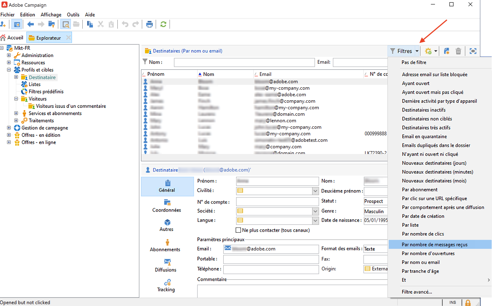

Vous pouvez accéder aux détails des filtres dans le nœud **[!UICONTROL Profils et cibles > Filtres prédéfinis]** de l&#39;explorateur.

>[!NOTE]
>
>Pour toutes les autres listes de données, les filtres prédéfinis sont stockés dans le nœud **[!UICONTROL Administration > Configuration > Filtres prédéfinis]**.

Sélectionnez un filtre pour afficher sa définition.

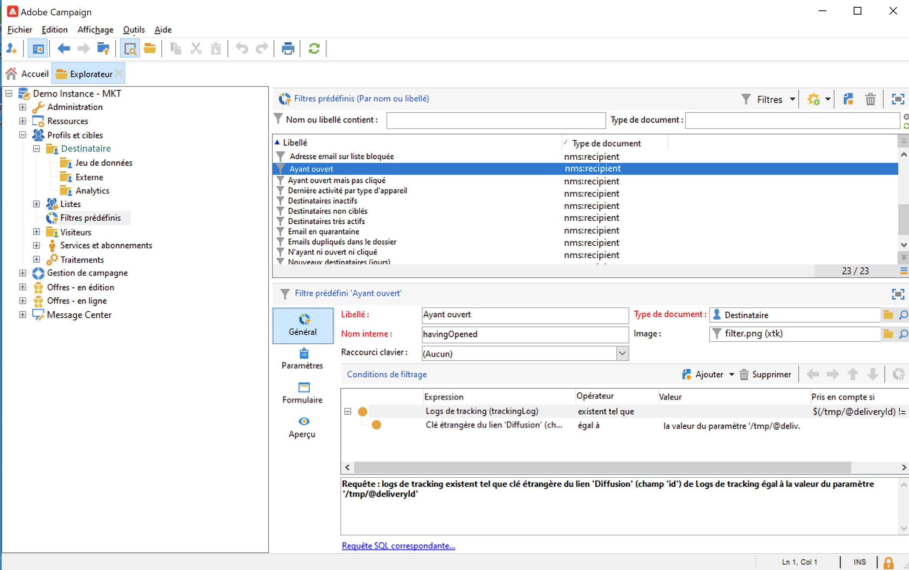

Utilisez le dernier onglet pour prévisualiser les données filtrées.

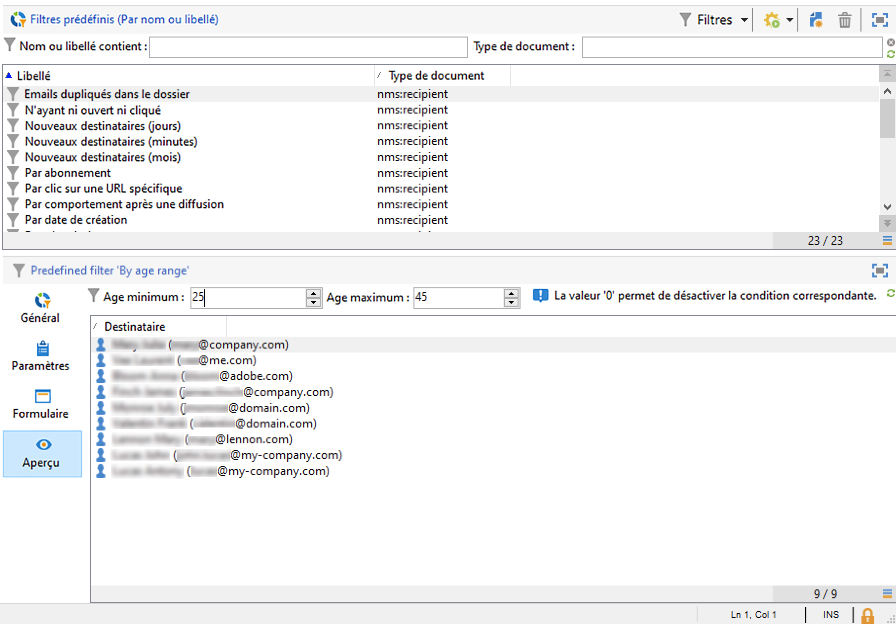

+++  Filtres prédéfinis intégrés pour les profils

<table> 
 <tbody> 
  <tr> 
   <td> <strong>Libellé</strong>  </td> 
   <td> <strong>Requête</strong>  </td> 
  </tr> 
  <tr> 
   <td> Ayant ouvert  </td> 
   <td> Sélection des destinataires qui ont ouvert une diffusion.  </td> 
  </tr> 
  <tr> 
   <td> Ayant ouvert mais pas cliqué  </td> 
   <td> Sélection des destinataires qui ont ouvert une diffusion mais n'ont pas cliqué sur un lien.  </td> 
  </tr> 
  <tr> 
   <td> Destinataires inactifs  </td> 
   <td> Sélection des destinataires qui n'ont pas ouvert une diffusion depuis X mois.  </td> 
  </tr> 
  <tr> 
   <td> Dernière activité par type d'appareil  </td> 
   <td> Sélection des destinataires qui ont cliqué ou ouvert une diffusion Y depuis un appareil de type X dans les Z derniers jours.  </td> 
  </tr> 
  <tr> 
   <td> Dernière activité par type d'appareil (Tracking)  </td> 
   <td> Sélection des destinataires qui ont cliqué ou ouvert une diffusion Y depuis un appareil de type X dans les Z derniers jours.  </td> 
  </tr> 
  <tr> 
   <td> Destinataires non ciblés  </td> 
   <td> Sélection des destinataires qui n'ont jamais été ciblés sur un canal Y depuis X mois.  </td> 
  </tr> 
  <tr> 
   <td> Destinataires très actifs  </td> 
   <td> Sélection des destinataires qui ont cliqué dans une diffusion au moins X fois dans les Y derniers mois.  </td> 
  </tr> 
  <tr> 
 <td> Adresse email sur liste bloquée  </td> 
    <td> Sélectionne les destinataires dont l'adresse email se trouve sur la liste bloquée.  </td>
  </tr> 
  <tr> 
   <td> Email en quarantaine  </td> 
   <td> Sélection des destinataires dont l'email est en quarantaine.  </td> 
  </tr> 
  <tr> 
   <td> E-mails dupliqués dans le dossier  </td> 
   <td> Sélection des destinataires dont l’e-mail est dupliqué dans le dossier.  </td> 
  </tr> 
  <tr> 
   <td> N'ayant ni ouvert ni cliqué  </td> 
   <td> Sélection des destinataires qui n'ont ni ouvert une diffusion, ni cliqué dans une diffusion.  </td> 
  </tr> 
  <tr> 
   <td> Nouveaux destinataires (jours)  </td> 
   <td> Sélection des destinataires qui ont été créés dans les X derniers jours.  </td> 
  </tr> 
  <tr> 
   <td> Nouveaux destinataires (minutes)  </td> 
   <td> Sélection des destinataires qui ont été créés dans les X dernières minutes.  </td> 
  </tr> 
  <tr> 
   <td> Nouveaux destinataires (mois)  </td> 
   <td> Sélection des destinataires qui ont été créés dans les X derniers mois.  </td> 
  </tr> 
  <tr> 
   <td> Par abonnement  </td> 
   <td> Sélection des destinataires par abonnements.  </td> 
  </tr> 
  <tr> 
   <td> Par clic sur une URL spécifique  </td> 
   <td> Sélection des destinataires qui ont cliqué sur une URL particulière dans une diffusion.  </td> 
  </tr> 
  <tr> 
   <td> Par comportement après une diffusion  </td> 
   <td> Sélection des destinataires en fonction de leur comportement après la réception d'une diffusion.  </td> 
  </tr> 
  <tr> 
   <td> Par date de création  </td> 
   <td> Sélection des destinataires par date de création, sur une période entre X mois (date courante moins n mois) et Y mois (date courante moins n mois).  </td> 
  </tr> 
  <tr> 
   <td> Par liste  </td> 
   <td> Sélection des destinataires par liste.  </td> 
  </tr> 
  <tr> 
   <td> Par nombre de clics  </td> 
   <td> Sélection des destinataires qui ont cliqué dans une diffusion dans les X derniers mois.  </td> 
  </tr> 
  <tr> 
   <td> Par nombre de messages reçus  </td> 
   <td> Sélection des destinataires en fonction du nombre de messages qu'ils ont reçus.  </td> 
  </tr> 
  <tr> 
   <td> Par nombre d'ouvertures  </td> 
   <td> Sélection des destinataires qui ont ouvert entre X et Y diffusions dans une période de temps Z.  </td> 
  </tr> 
  <tr> 
   <td> Par nom ou email  </td> 
   <td> Sélection des destinataires en fonction de leur nom ou de leur email.  </td> 
  </tr> 
  <tr> 
   <td> Par tranche d'âge  </td> 
   <td> Sélection des destinataires en fonction de leur âge.  </td> 
  </tr> 
 </tbody> 
</table>

+++

#### Filtres par défaut{#default-filters}

Les champs situés au-dessus de chaque liste permettent d&#39;utiliser le **filtre par défaut prédéfini** pour cette liste. Pour la liste des destinataires, vous pouvez par défaut filtrer par nom et adresse e-mail.

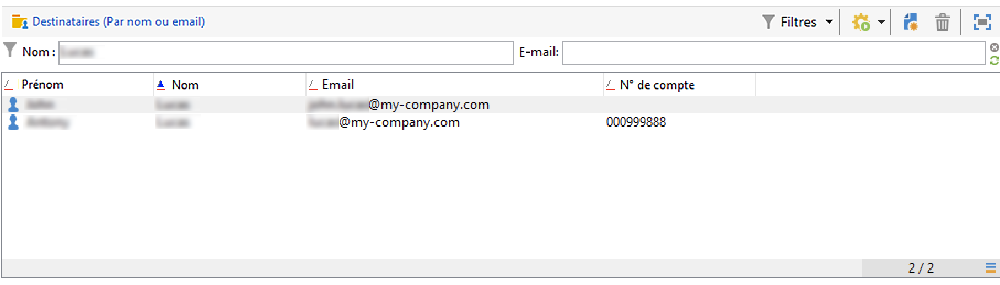

>[!NOTE]
>
>Le caractère **%** remplace n&#39;importe quelle chaîne de caractères. Par exemple, saisissez `%@gmail.com` dans le champ E-mail pour afficher tous les profils ayant une adresse Gmail. Saisissez `%@L` dans le champ Nom pour afficher tous les profils dont le nom contient un L.

Pour modifier le filtre par défaut d&#39;une liste de destinataires, accédez au nœud **[!UICONTROL Profils et cibles > Filtres prédéfinis]**.

Pour tout autre type de données, configurez le filtre par défaut à partir du noeud **[!UICONTROL Administration > Paramétrage > Filtres prédéfinis]**.

Les étapes sont les suivantes :

1. Dans la liste des filtres, sélectionnez le filtre que vous souhaitez voir proposé par défaut.
1. Cliquez sur l&#39;onglet **[!UICONTROL Paramètres]** et cochez l&#39;option **[!UICONTROL Filtre par défaut pour le type de document associé]**.

   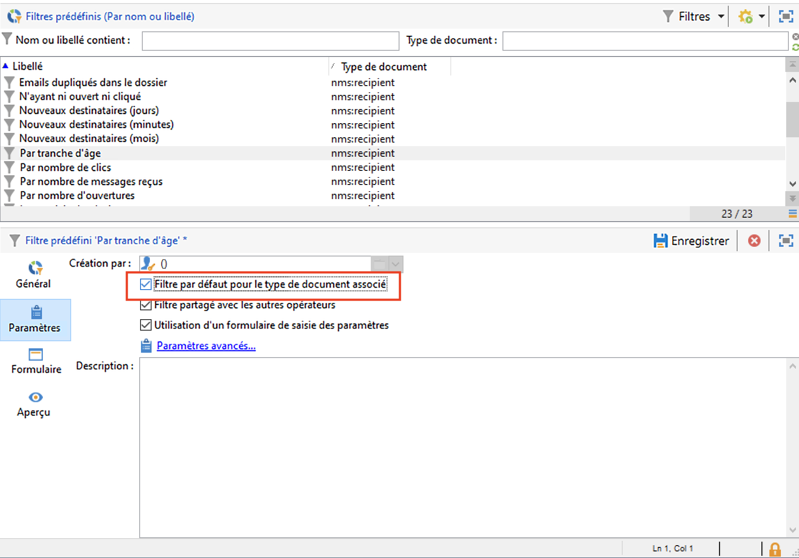

1. Décochez cette même option pour le filtre prédéfini par défaut actuel.
1. Cliquez sur le bouton **[!UICONTROL Enregistrer]** pour appliquer ce filtre.
1. Accédez au dossier Destinataire et cliquez sur l&#39;icône **[!UICONTROL Supprimer ce filtre]** à droite du filtre actuel : le nouveau filtre par défaut est disponible.
   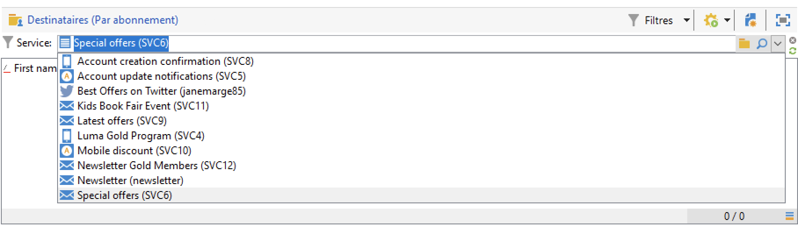

## Filtres rapides{#quick-filters}

Vous pouvez définir et combiner des **filtres rapides** pour créer des filtres personnalisés sur des champs spécifiques.

Une fois ajoutés, les champs de filtre rapide s&#39;affichent au-dessus de la liste de données, les uns après les autres. Ils peuvent être supprimés indépendamment les uns des autres.

Les filtres rapides sont spécifiques à chaque opérateur et opératrice et sont réinitialisés à chaque fois que celui-ci ou celle-ci vide le cache de la console cliente.

Si vous devez réutiliser un filtre, créez un **filtre avancé** et enregistrez-le. [En savoir plus](#advanced-filters).

Pour créer un **filtre rapide**, procédez comme suit :

1. Cliquez avec le bouton droit sur le champ sur lequel vous souhaitez filtrer les données et choisissez **[!UICONTROL Filtrer sur ce champ]**.

   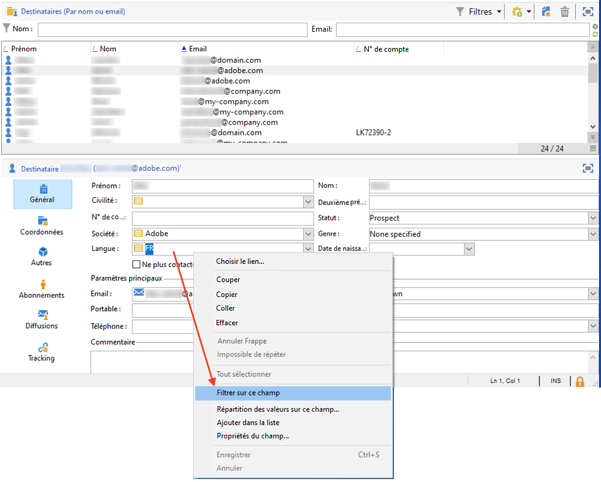

   Les champs de filtrage par défaut s&#39;affichent au-dessus de la liste.

   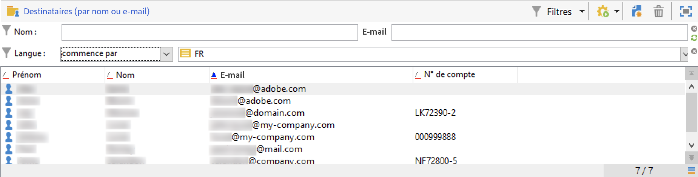

1. Sélectionnez les options de filtrage.
1. Si nécessaire, utilisez l&#39;icône grise sur le côté droit d&#39;un filtre pour le supprimer.
1. Vous pouvez combiner des filtres pour affiner votre filtrage.

   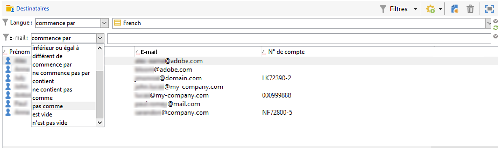

Si vous devez filtrer sur un champ qui n’est pas disponible dans le formulaire, mais dans les colonnes, et filtrer sur cette colonne. Pour ce faire :

1. Cliquez sur l&#39;icône **[!UICONTROL Configurer la liste]**.

   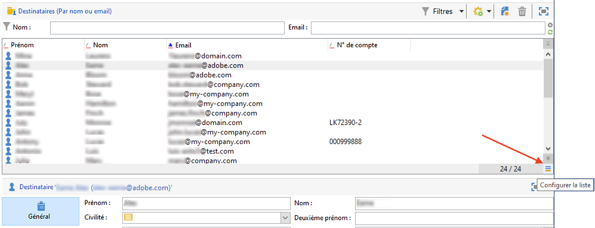

1. Sélectionnez la colonne à afficher, par exemple l&#39;âge des destinataires, puis cliquez sur **OK**.

   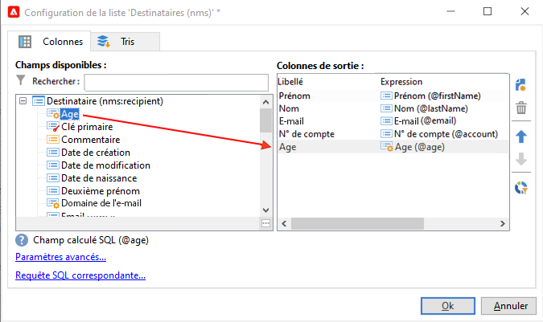

1. Cliquez ensuite avec le bouton droit dans la liste des destinataires, dans la colonne **Age**, et choisissez **[!UICONTROL Filtrer sur cette colonne]**.

   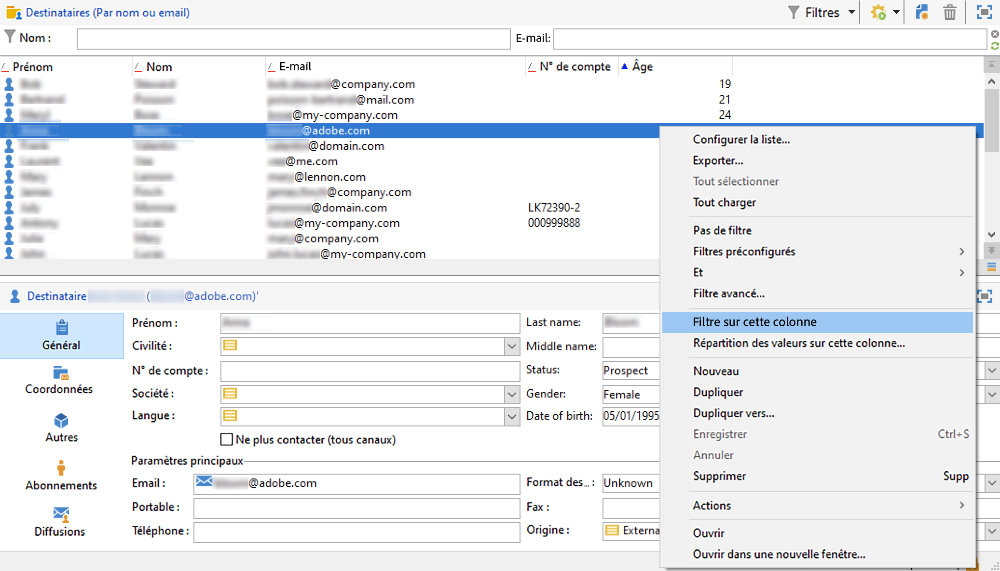

   Vous pouvez alors sélectionner les options de filtrage sur l&#39;âge. Ajoutez un autre filtre sur l&#39;âge pour définir une plage.

   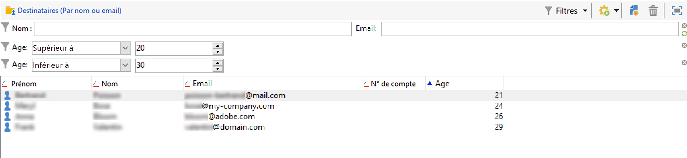

## Filtres avancés{#advanced-filters}

Combinez des critères complexes dans des **personnalisésFiltres avancés**. Utilisez ces filtres pour créer une requête complexe ou une combinaison de requêtes sur vos données. Ces filtres peuvent être enregistrés et partagés avec d&#39;autres utilisateurs de Campaign.

### Créer un filtre avancé{#create-adv-filters}

Pour créer un **filtre avancé**, cliquez sur le bouton **[!UICONTROL Filtres]** et sélectionnez **[!UICONTROL Filtre avancé...]**.

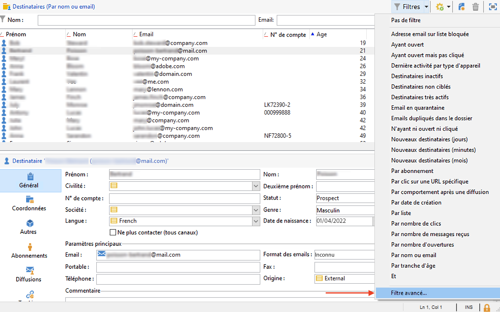

Vous pouvez également cliquer avec le bouton droit dans la liste de données et sélectionner **[!UICONTROL Filtre avancé...]**.

Définissez les conditions de filtrage. Dans l&#39;exemple ci-dessous, vous allez filtrer les destinataires dont le numéro de compte ne commence pas par NL et qui résident à Paris ou Los Angeles.

1. Cliquez sur l&#39;icône **[!UICONTROL Modifier l&#39;expression]** de la colonne **[!UICONTROL Expression]**.

   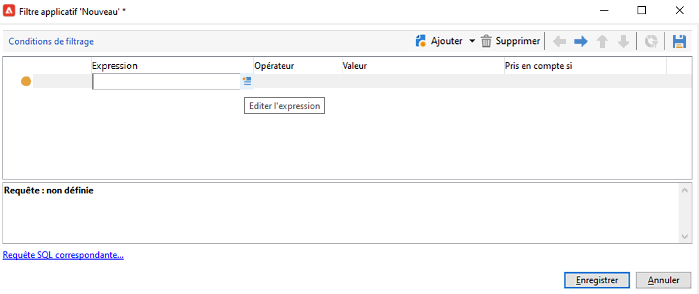

1. Sélectionnez le champ sur lequel appliquer le filtre.
1. Sélectionnez l&#39;opérateur à appliquer dans la liste déroulante.

   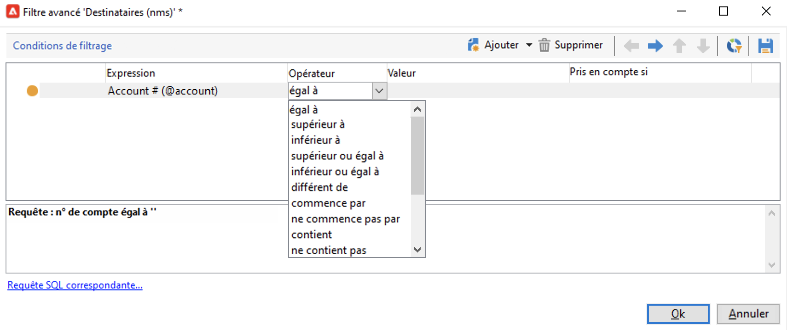

1. Sélectionnez une valeur attendue dans la colonne **[!UICONTROL Valeur]**. Vous pouvez combiner plusieurs filtres pour affiner votre requête. Pour ajouter une condition de filtre, cliquez sur **[!UICONTROL Ajouter]**.

   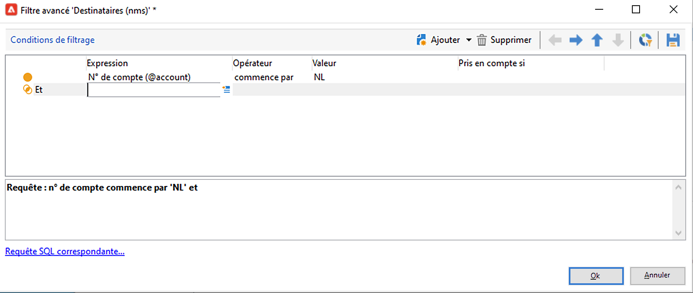

   >[!NOTE]
   >
   >Vous pouvez hiérarchiser les expressions ou modifier l’ordre des expressions de la requête en utilisant les flèches de la barre d’outils.

1. Trois opérateurs sont disponibles pour combiner des expressions :  **Et**, **Ou**, **Sauf**. Cliquez sur la flèche pour passer à **Ou**.

   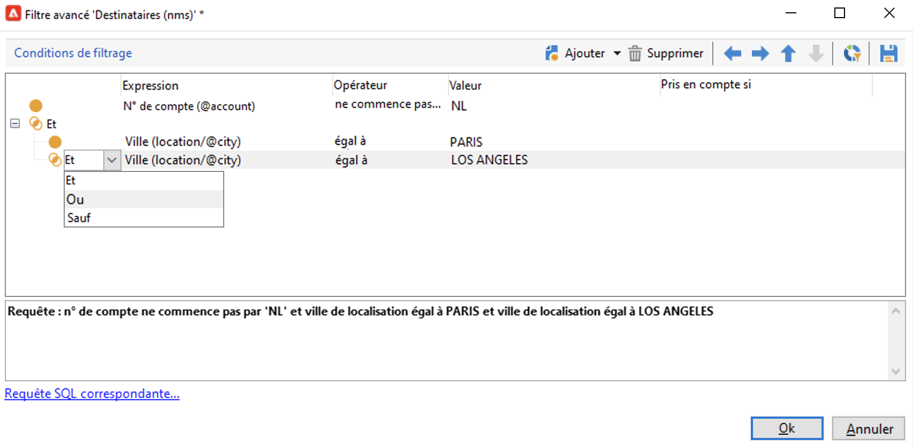

1. Cliquez sur **[!UICONTROL OK]** pour créer le filtre et l&#39;appliquer à la liste actuelle.

Le filtre appliqué est affiché au-dessus de la liste.

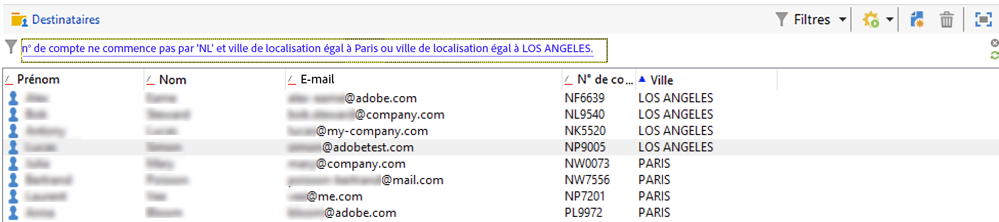

Pour éditer ou modifier ce filtre, cliquez sur son lien de description en bleu, au-dessus de la liste.

### Enregistrer un filtre avancé{#save-adv-filters}

Vous pouvez enregistrer un filtre avancé en tant que [filtre prédéfini](#predefined-filters), afin de pouvoir le réutiliser et le partager avec les autres utilisateurs de Campaign.

Pour enregistrer un filtre avancé, procédez comme suit :

1. Cliquez sur la description du filtre pour le modifier.
1. Cliquez sur l&#39;icône **[!UICONTROL Enregistrer en tant que filtre]** dans la section supérieure droite de la fenêtre.

   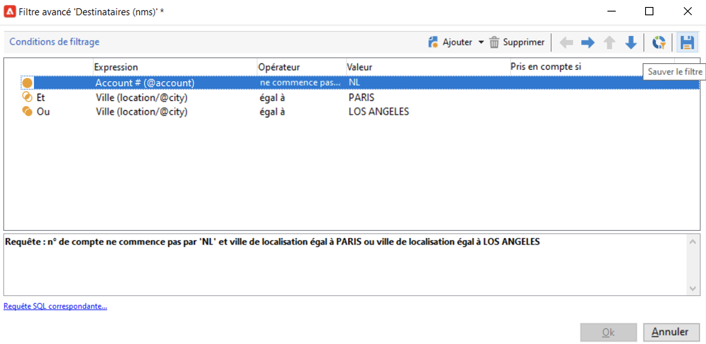

1. Saisissez le nom de ce filtre et enregistrez-le.

   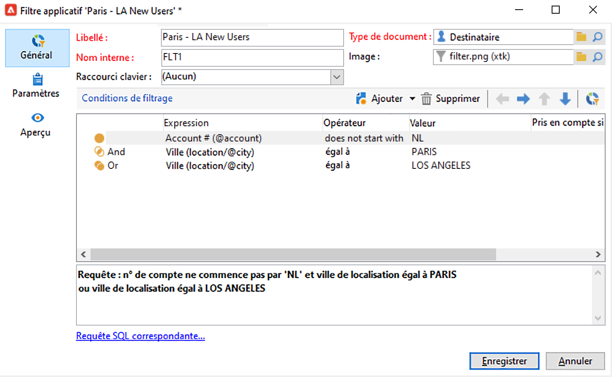

Le filtre est ajouté aux [filtres prédéfinis](#predefined-filters). Il peut être mis à jour à partir de ce nœud.

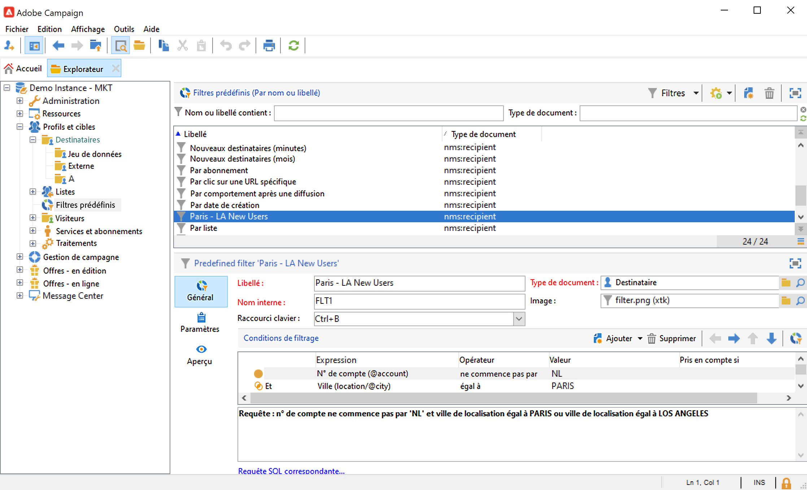

>[!NOTE]
>
>Vous pouvez ajouter un raccourci pour votre filtre afin de l&#39;activer à partir du clavier.

Ce filtre est également disponible dans les filtres prédéfinis de la liste des destinataires.

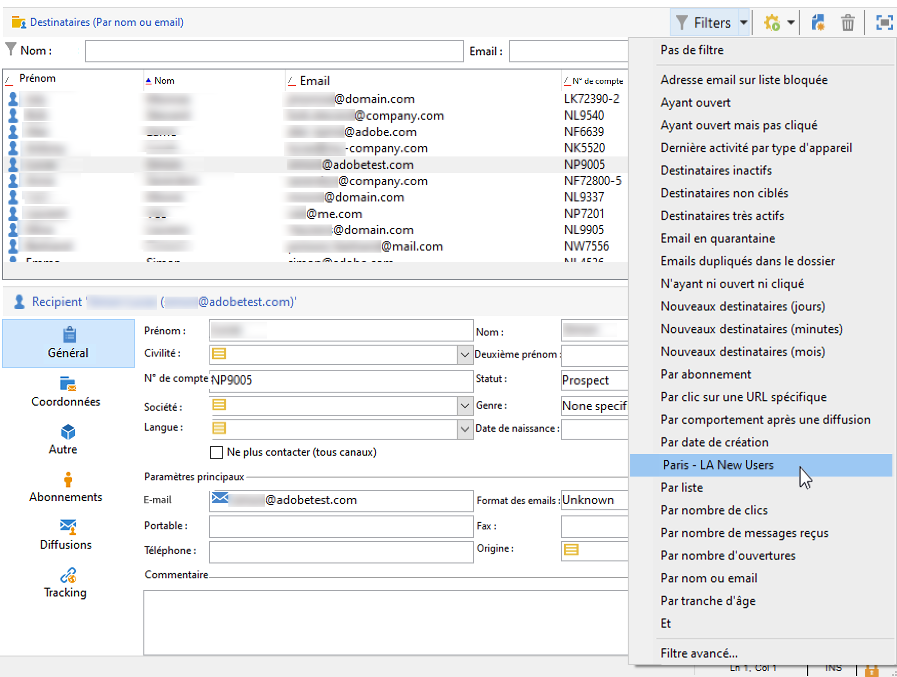

### Utiliser un filtre pour définir un segment {#filter-as-segment}

Vous pouvez utiliser et combiner des filtres pour créer un segment de population cible.

Une fois enregistrés, des filtres avancés sont disponibles lors de la sélection de la population cible d&#39;un message, dans la section **[!UICONTROL Filtres utilisateur]**.

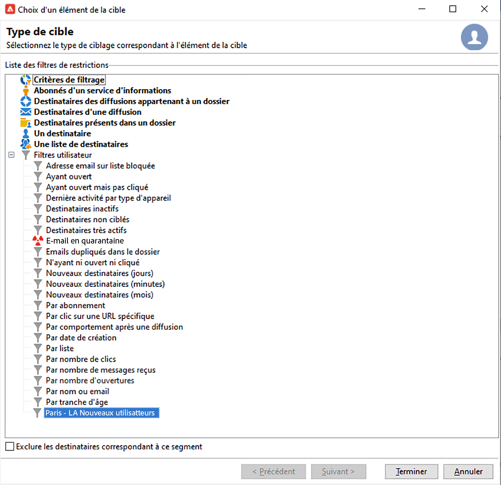

>[!NOTE]
>
>Utilisez la variable **[!UICONTROL Exclure les destinataires correspondant à ce segment]** pour cibler uniquement les contacts qui ne correspondent pas aux critères de filtre.

### Utiliser des fonctions pour créer des filtres avancés{#use-functions-adv-filters}

Pour effectuer des fonctionnalités de filtre avancé, utilisez des fonctions pour définir le contenu du filtre. L&#39;éditeur de filtres avancés exploite toutes les fonctionnalités du requêteur de Campaign.

Découvrez comment créer des requêtes avancées dans ces exemples complets :

* Découvrez comment cibler des attributs destinataires simples sur [cette page](https://experienceleague.adobe.com/docs/campaign/automation/workflows/wf-activities/targeting-activities/query.html?lang=fr){target="_blank"}.
* Découvrez comment filtrer les destinataires non contactés au cours des 7 derniers jours sur [cette page](https://experienceleague.adobe.com/docs/campaign/automation/workflows/use-cases/designing-queries/query-many-to-many-relationship.html?lang=fr){target="_blank"}.
* Découvrez comment la liste des opérateurs peut être filtrée par comptes actifs sur [cette page](https://experienceleague.adobe.com/docs/campaign/automation/workflows/use-cases/designing-queries/create-a-filter.html?lang=fr){target="_blank"}.
* Découvrez comment créer une audience d’envoi d’e-mail d’anniversaire sur [cette page](https://experienceleague.adobe.com/docs/campaign/automation/workflows/use-cases/deliveries/send-a-birthday-email.html?lang=fr){target="_blank"}.

### Paramètres avancés des filtres prédéfinis {#param-for-data-filters}

Des paramètres avancés sont disponibles pour les filtres prédéfinis. Pour y accéder, accédez à l&#39;onglet **[!UICONTROL Paramètres]** du filtre.

* Pour afficher le filtre par défaut pour toutes les listes basées sur ce type de document, sélectionnez l&#39;option **[!UICONTROL Filtre par défaut pour le type de document associé]**.

  Par exemple, le filtre **[!UICONTROL Par nom ou nom d&#39;utilisateur]** est appliqué aux opérateurs. Cette option est sélectionnée afin que le filtre soit systématiquement proposé sur toutes les listes d&#39;opérateurs.

* Pour mettre un filtre à disposition de tous les opérateurs Campaign, sélectionnez l&#39;option **[!UICONTROL Filtre partagé avec les autres opérateurs]**.

* Pour définir un formulaire de sélection des critères de filtrage, sélectionnez l&#39;option **[!UICONTROL Utiliser le formulaire de saisie des paramètres]**. Ce formulaire doit être saisi au format XML dans l&#39;onglet **[!UICONTROL Formulaire]**. Par exemple, le filtre prédéfini intégré **[!UICONTROL Destinataires ayant ouvert]**, disponible dans la liste des destinataires, affiche un champ de filtre qui permet de sélectionner la diffusion à laquelle s&#39;applique le filtre.

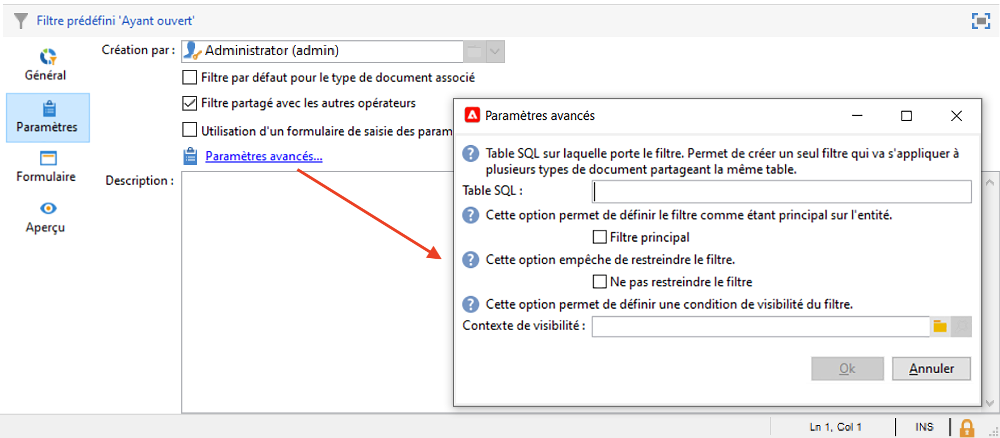

* Le lien **[!UICONTROL Paramètres avancés]** permet de définir des paramètres supplémentaires.

   * Vous pouvez associer une table SQL au filtre pour qu&#39;elle soit commune à tous les éditeurs qui la partagent.
   * Pour empêcher un utilisateur de remplacer le filtre, sélectionnez l&#39;option **[!UICONTROL Ne pas restreindre le filtre]**. Par exemple, cette option est active pour les filtres « Destinataires d’une diffusion » et « Destinataires des diffusions appartenant à un dossier » disponibles dans l’assistant de diffusion. Ces filtres ne peuvent pas être surchargés.

