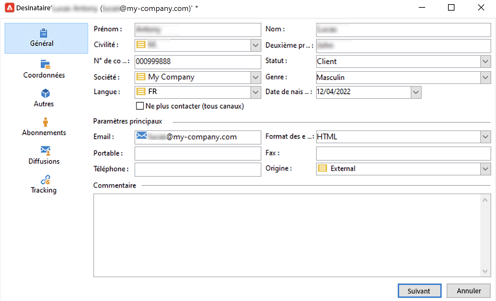

# Créer manuellement des profils{#create-profiles-manual}

Pour renseigner votre base de données Campaign, vous pouvez [importer des profils](import-profiles.md) ou les ajouter manuellement comme indiqué ci-dessous.

Pour créer un destinataire manuellement, procédez comme suit :

1. Accédez à l&#39;onglet **[!UICONTROL Profils et cibles]** et sélectionnez la catégorie **[!UICONTROL Destinataires]**.

   

   Par défaut, les destinataires sont stockés dans le nœud **[!UICONTROL Profils et cibles > Destinataires]** de l&#39;arborescence. Vous pouvez également créer des destinataires à partir de cette vue.

1. Cliquez sur le bouton **[!UICONTROL Créer]**.
1. Saisissez les données du profil.

   

   Apprenez-en davantage sur le formulaire intégré du destinataire dans [cette page](view-profiles.md#edit-a-profiles).

1. Cliquez sur **[!UICONTROL Enregistrer]** : le profil est ajouté à Campaign, dans le dossier des destinataires par défaut.
