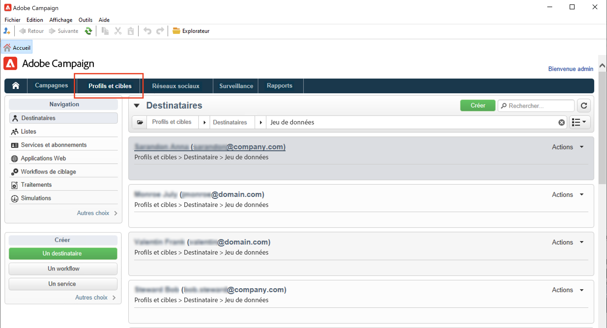

# Création manuelle de profils{#create-profiles-manual}

Pour renseigner votre base de données Campaign, vous pouvez : [profils d&#39;import](import-profiles.md) ou ajoutez-les manuellement comme indiqué ci-dessous.

Pour créer manuellement un destinataire, procédez comme suit :

1. Accédez à **[!UICONTROL Profils et cibles]** et sélectionnez l’option **[!UICONTROL Destinataires]** catégorie.

   

   Par défaut, les destinataires sont stockés dans la variable **[!UICONTROL Profils et cibles > Destinataires]** du noeud de l’arborescence. Vous pouvez également créer des destinataires à partir de cette vue.

1. Cliquez sur le bouton **[!UICONTROL Créer]**.
1. Saisissez les données du profil.

   

   En savoir plus sur le formulaire intégré du destinataire dans [cette page](view-profiles.md#edit-a-profiles).

1. Cliquez sur **[!UICONTROL Enregistrer]**: le profil est ajouté à Campaign, dans le dossier des destinataires par défaut.
