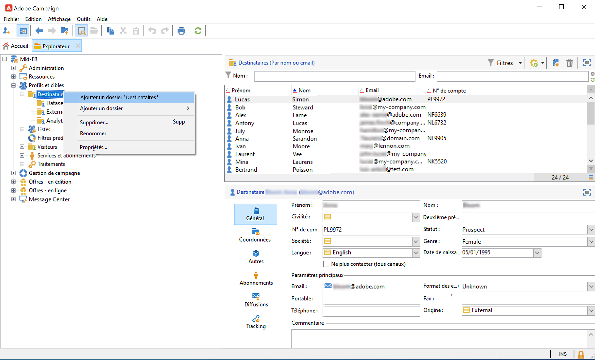
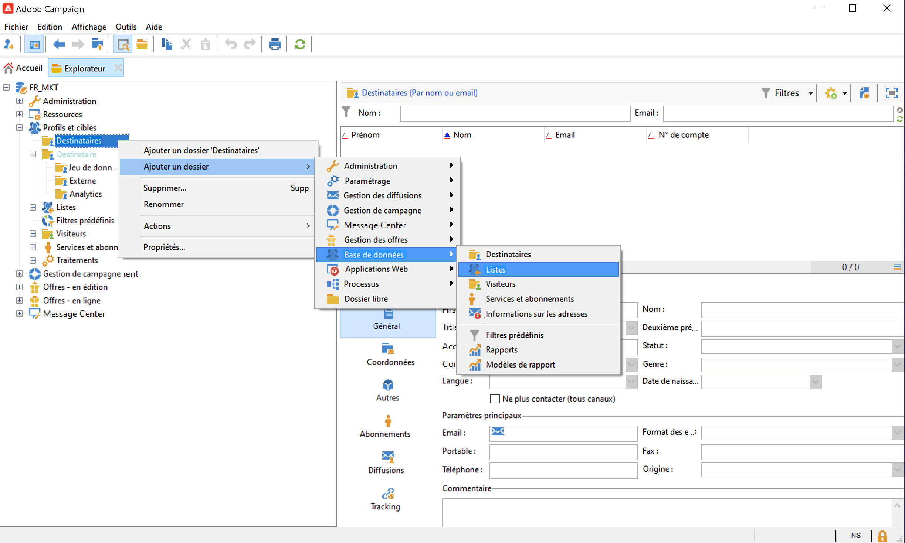
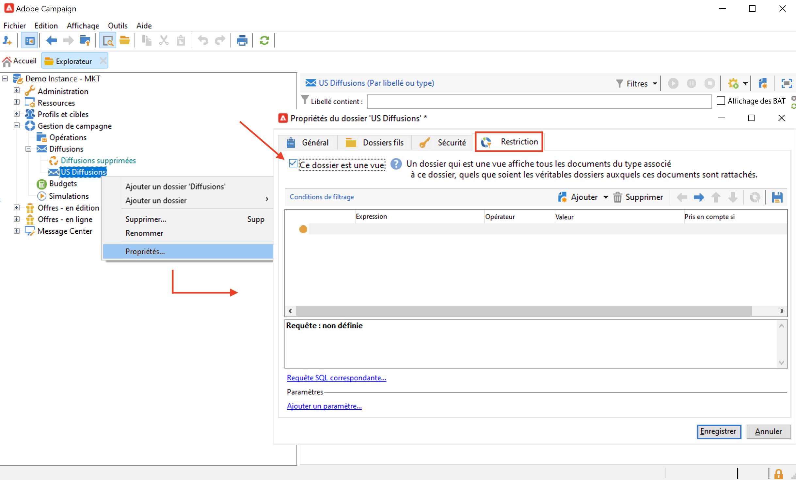
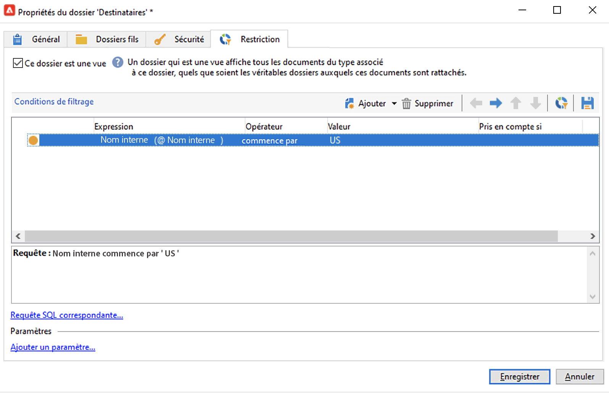
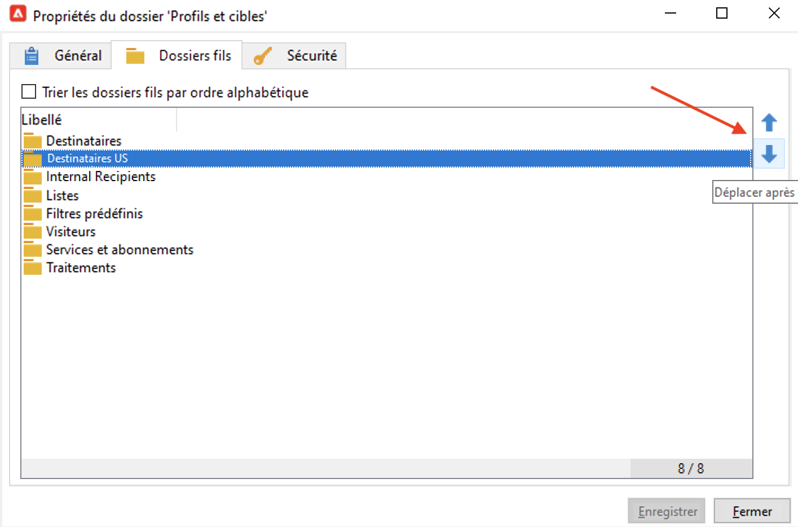
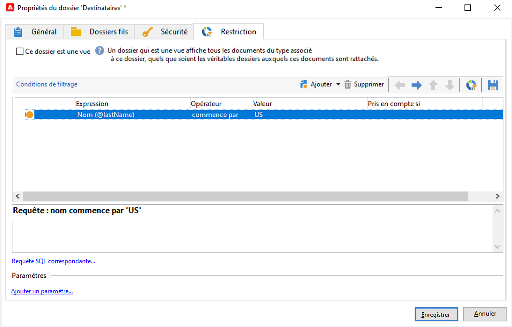
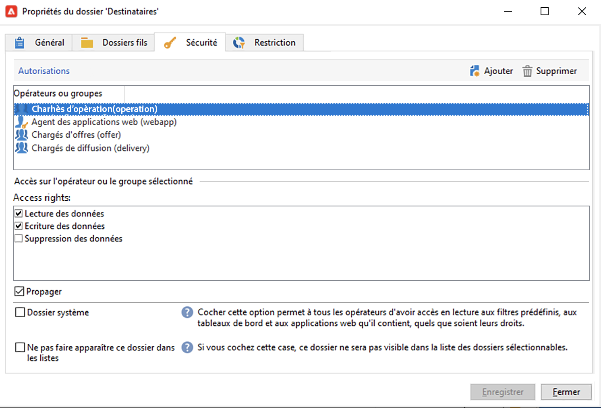

# Gestion des dossiers et des vues {#folders-and-views}

Les dossiers de campagne sont des noeuds dans l’arborescence de l’explorateur. Selon leur type, ils contiennent certains types de données.

Une vue est un dossier spécifique qui ne contient aucune donnée, mais affiche des données physiquement stockées dans d’autres dossiers du même type. Par exemple, si vous convertissez un dossier de diffusions en vue, ce dossier affiche toutes les diffusions. Ces données peuvent ensuite être filtrées.

>[!NOTE]
>Pour distinguer les vues des dossiers standard, leur nom s’affiche en bleu clair et non en noir.

Notez que vous pouvez attribuer des autorisations aux dossiers pour restreindre l’accès à certaines données. [En savoir plus](#restrict-access-to-a-folder)

## Bonnes pratiques relatives à l’utilisation des dossiers

* **Utilisation de dossiers intégrés** pour faciliter l’utilisation, la maintenance et le dépannage de l’application pour toutes les personnes impliquées dans le projet. Evitez de créer des structures de dossiers personnalisées pour les destinataires, les listes, les diffusions, etc., mais utilisez les dossiers standard tels que **Administration**, **Profils et cibles**, **Gestion de campagne**.

* **Création de sous-dossiers**, par exemple, enregistrez vos workflows techniques sous le dossier intégré : **[!UICONTROL Administration > Exploitation > Workflows techniques]** et créer des sous-dossiers par type de workflow.

* **Définition et application d’une convention d’affectation des noms**, par exemple, vous pouvez nommer les workflows par ordre alphabétique afin qu&#39;ils apparaissent triés dans l&#39;ordre d&#39;exécution, par exemple :

   A1 - import des destinataires, à 10h00 ; A2 - import de tickets, à 11h00.

## Création d’un dossier{#create-a-folder}

Pour créer un dossier, cliquez avec le bouton droit de la souris sur un dossier existant et utilisez le menu contextuel.

Pour créer le même type de dossier que celui que vous avez sélectionné, choisissez la première option du menu contextuel. Par exemple, dans un dossier Destinataires, sélectionnez **[!UICONTROL Créer un dossier &#39;Destinataires&#39;]**.

Vous pouvez faire glisser et déposer le nouveau dossier pour organiser l&#39;arborescence de l&#39;explorateur Campaign selon vos besoins.

Pour créer un autre type de dossier, cliquez avec le bouton droit de la souris sur un dossier existant et sélectionnez **[!UICONTROL Ajouter un nouveau dossier]**. Vous pouvez créer tous les types de dossiers, selon les données à stocker.

>[!CAUTION]
>Ces modifications s’appliquent à tous les utilisateurs de Campaign.

## Transformer un dossier en vue{#turn-a-folder-to-a-view}

Une vue est un dossier spécifique qui ne contient aucune donnée, mais affiche des données physiquement stockées dans d’autres dossiers du même type.

Vous pouvez transformer n’importe quel dossier en vue, mais le dossier doit être vide. Toutes les données stockées dans le dossier sont supprimées lorsque vous convertissez le dossier en vue.

>[!CAUTION]
>
>Une vue affiche les données et permet d’y accéder, même si les données ne sont pas physiquement stockées dans le dossier d’affichage. Pour avoir accès au contenu, l&#39;opérateur doit disposer des permissions adéquates dans les dossiers sources, au moins un accès en lecture.
>
>Pour accorder l’accès à une vue sans accorder l’accès à son dossier source, n’accordez pas l’accès en lecture au noeud parent du dossier source.

Dans l&#39;exemple ci-dessous, nous allons créer un dossier afin de n&#39;afficher que les diffusions E.U., en fonction de leur nom interne.

1. Créez un **[!UICONTROL Diffusions]** et nommez-le **Diffusions américaines**.
1. Cliquez avec le bouton droit sur ce dossier et choisissez **[!UICONTROL Propriétés...]**.
1. Depuis l&#39;onglet **[!UICONTROL Restriction]**, sélectionnez l&#39;option **[!UICONTROL Ce dossier est une vue]** : toutes les diffusions de la base y seront alors affichées.

   

1. Définissez les critères de filtrage à partir du requêteur, dans la section centrale de la fenêtre : seules les diffusions correspondant au filtre sont affichées dans le dossier.

   

   >[!NOTE]
   >
   >Découvrez comment concevoir des requêtes dans [cette page](create-filters.md#advanced-filters)

>[!CAUTION]
>
>Lors de la gestion [messages transactionnels](../send/transactional.md) les événements, **[!UICONTROL Événements en temps réel]** ou **[!UICONTROL Événements batch]** Les dossiers ne doivent pas être définis comme des vues sur les instances d’exécution, car cela peut entraîner des problèmes d’autorisation.

## Organisation des dossiers{#organize-your-folders}

Par défaut, un nouveau dossier est ajouté en haut de la hiérarchie.

Parcourez les **Sous-dossiers** d’un dossier pour organiser ses sous-dossiers.

Vous pouvez déplacer les dossiers avec les flèches à droite ou sélectionner le **[!UICONTROL Trier les sous-dossiers par ordre alphabétique]** pour les trier automatiquement.

## Filtrage des données dans un dossier{#filter-data-in-a-folder}

Pour filtrer les données stockées dans un dossier, accédez aux propriétés du dossier et sélectionnez l&#39;onglet Restriction .

Par exemple, le dossier ci-dessous contiendra uniquement des contacts avec une adresse email et dont l&#39;origine n&#39;est pas marquée comme &#39;Externe&#39; ou est vide.

## Limitation de l’accès à un dossier{#restrict-access-to-a-folder}

Utilisez les permissions sur les dossiers pour organiser et contrôler l&#39;accès aux données de Campaign.

Pour modifier les autorisations sur un dossier Campaign spécifique, procédez comme suit :

1. Cliquez avec le bouton droit sur le dossier et sélectionnez **[!UICONTROL Propriétés...]**.
1. Accédez au **[!UICONTROL Sécurité]** pour visualiser les autorisations sur ce dossier.

   

* À **autoriser un groupe ou un opérateur**, cliquez sur le bouton **[!UICONTROL Ajouter]** et sélectionnez le groupe ou l&#39;opérateur auquel attribuer les autorisations pour ce dossier.
* À **interdire un groupe ou un opérateur**, cliquez sur **[!UICONTROL Supprimer]** et sélectionnez le groupe ou l&#39;opérateur pour supprimer l&#39;autorisation de ce dossier.
* À **sélectionner les droits attribués à un groupe ou à un opérateur**, sélectionnez le groupe ou l’opérateur, sélectionnez les droits d’accès que vous souhaitez accorder, puis désélectionnez les autres.

### Propager les autorisations {#propagate-permissions}

Pour propager les autorisations et les droits d&#39;accès, sélectionnez l&#39;option **[!UICONTROL Propager]** dans les propriétés du dossier.

Les autorisations définies dans cette fenêtre seront alors appliquées à tous les sous-dossiers du noeud courant. Vous pouvez toujours surcharger ces autorisations pour chacun des sous-dossiers.

>[!NOTE]
>
>Décochez la variable **[!UICONTROL Propager]** pour un dossier ne l’active pas pour les sous-dossiers : vous devez l’effacer explicitement pour chacun des sous-dossiers.

### Accorder l&#39;accès à tous les opérateurs {#grant-access-to-all-operators}

Dans le **[!UICONTROL Sécurité]** , sélectionnez la variable **[!UICONTROL Dossier système]** pour permettre l&#39;accès à tous les opérateurs, quelles que soient leurs permissions.

Si cette option n&#39;est pas sélectionnée, vous devez ajouter explicitement l&#39;opérateur (ou son groupe) dans la liste des autorisations d&#39;accès.
