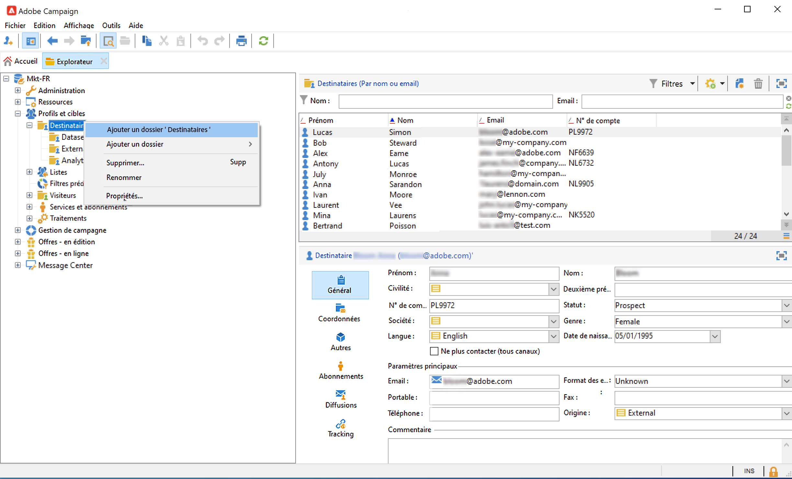
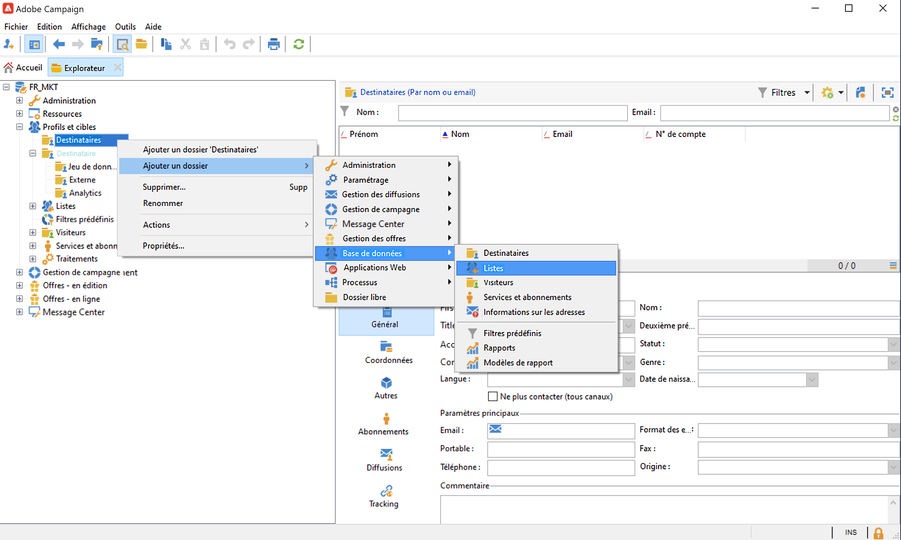
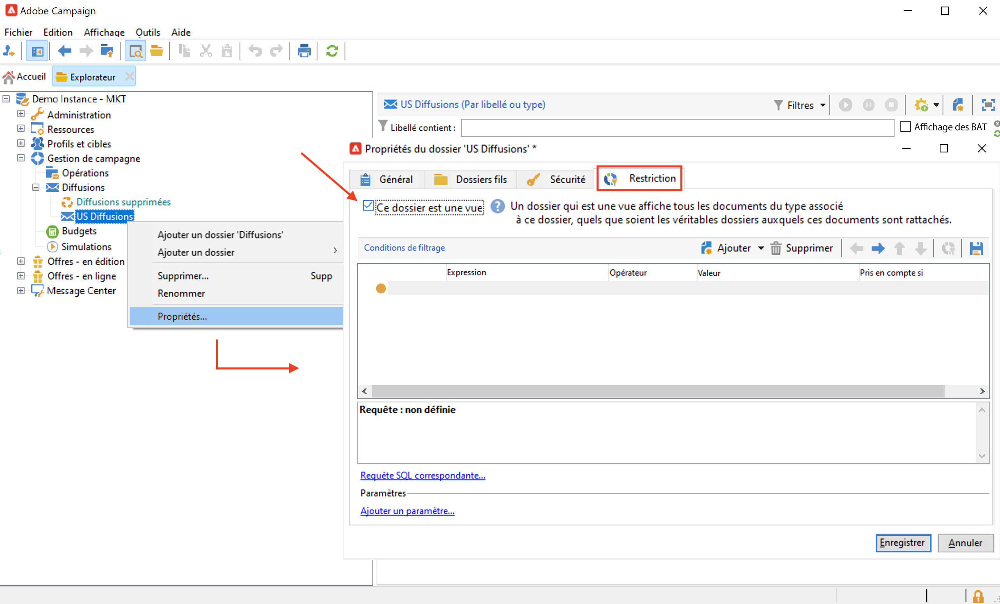
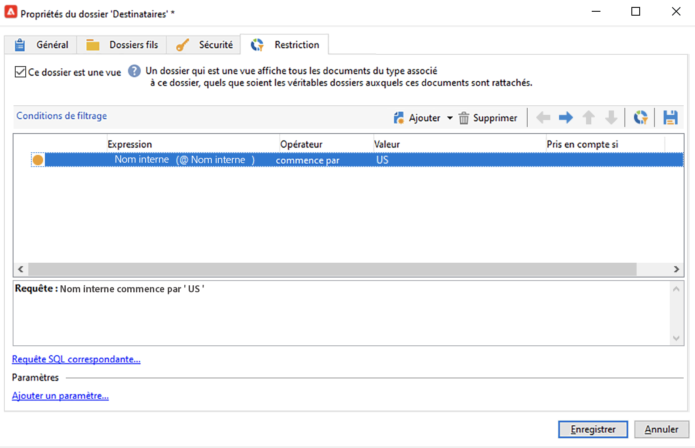
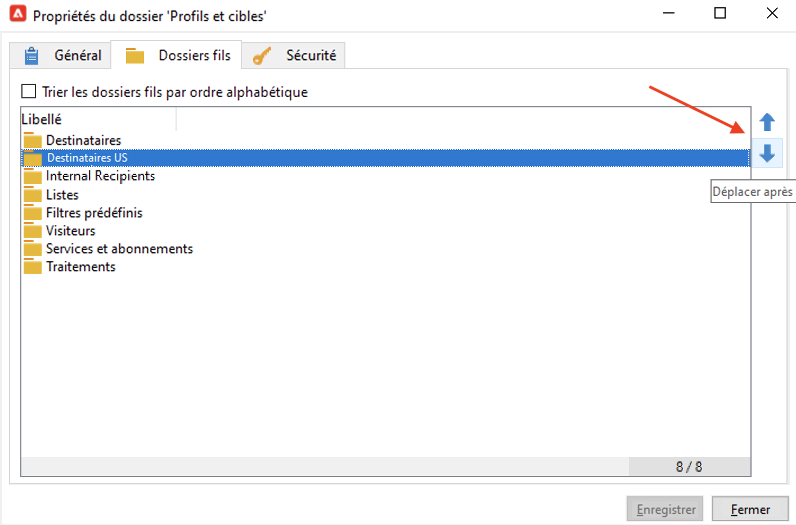
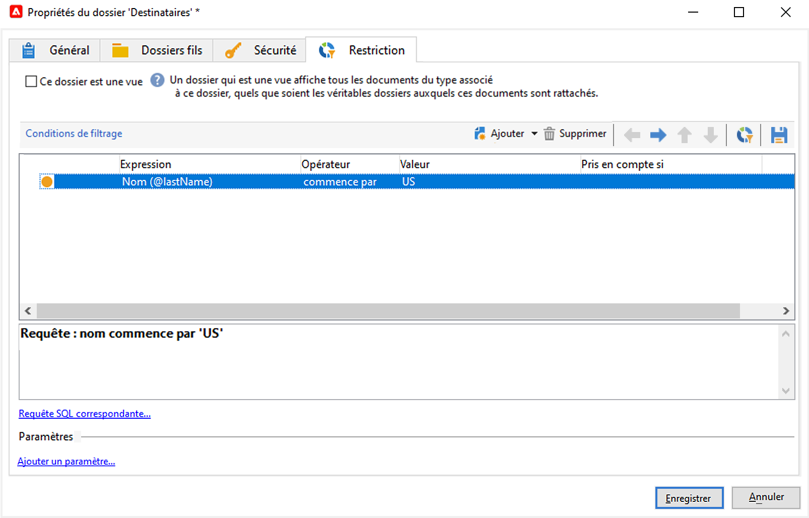

# Gérer les dossiers et les vues {#folders-and-views}

Les dossiers Campaign sont des nœuds dans l&#39;arborescence de l&#39;explorateur. Selon leur type, ils contiennent certains types de données.

Une vue est un dossier spécifique qui ne contient aucune donnée, mais affiche des données physiquement stockées dans d&#39;autres dossiers du même type. Par exemple, si vous convertissez un dossier diffusion en vue, ce dossier affiche toutes les diffusions. Ces données peuvent ensuite être filtrées.

>[!NOTE]
>
>Pour distinguer les vues des dossiers standard, leur nom s&#39;affiche en bleu clair et non en noir.

Notez que vous pouvez attribuer des autorisations aux dossiers pour restreindre l&#39;accès à certaines données. [En savoir plus](#restrict-access-to-a-folder)

## Bonnes pratiques relatives à l&#39;utilisation des dossiers{#best-practices-folders}

* **Utilisez des dossiers intégrés** pour faciliter l&#39;utilisation, la maintenance et le dépannage de l&#39;application pour toutes les personnes impliquées dans le projet. Évitez de créer des structures de dossiers personnalisées pour les destinataires, les listes, les diffusions, etc. Utilisez plutôt les dossiers standard comme **Administration**, **Profils et cibles**, **Gestion de campagne**.

* **Créez des sous-dossiers** pour, par exemple, enregistrer vos workflows techniques sous le dossier intégré : **[!UICONTROL Administration > Exploitation > Workflows techniques]**, et créez des sous-dossiers par type de workflow.

* **Définissez et appliquez une convention de nommage**, par exemple, vous pouvez nommer les workflows par ordre alphabétique afin qu&#39;ils apparaissent triés dans l&#39;ordre d&#39;exécution, par exemple :

  A1 - import des destinataires, à partir de 10 :00 ;
A2 - import de tickets, commence à 11:00.

## Créer un dossier{#create-a-folder}

Pour créer un dossier, cliquez avec le bouton droit de la souris sur un dossier existant et utilisez le menu contextuel.

Pour créer le même type de dossier que celui que vous avez sélectionné, choisissez la première option du menu contextuel. Par exemple, dans un dossier Destinataires, sélectionnez **[!UICONTROL Créer un dossier « Destinataires »]**.

Vous pouvez faire un glisser-déposer du nouveau dossier pour organiser l&#39;arborescence de l&#39;explorateur Campaign selon vos besoins.

Pour créer un autre type de dossier, cliquez avec le bouton droit de la souris sur un dossier existant et sélectionnez **[!UICONTROL Ajouter un nouveau dossier]**. Vous pouvez créer tous les types de dossiers, selon les données à stocker.

>[!CAUTION]
>
>Ces modifications s&#39;appliquent à tous les utilisateurs de Campaign.

## Transformer un dossier en vue{#turn-a-folder-to-a-view}

Une vue est un dossier spécifique qui ne contient aucune donnée, mais affiche des données physiquement stockées dans d&#39;autres dossiers du même type.

Vous pouvez transformer n&#39;importe quel dossier en vue, mais le dossier doit être vide. Toutes les données stockées dans le dossier sont supprimées lorsque vous convertissez le dossier en vue.

>[!IMPORTANT]
>
>Les dossiers prêts à l’emploi ne doivent pas être transformés en vue.

>[!CAUTION]
>
>Une vue affiche les données et permet d&#39;y accéder, même si les données ne sont pas physiquement stockées dans le dossier de vue. Pour avoir accès au contenu, l&#39;opérateur doit disposer des autorisations adéquates dans les dossiers sources, au moins un accès en lecture.
>
>Pour donner accès à une vue sans donner accès à son dossier d&#39;origine, ne donnez pas de droit en lecture sur le nœud parent du dossier source.

Dans l&#39;exemple ci-dessous, nous allons créer un dossier afin de n&#39;afficher que les diffusions US, en fonction de leur nom interne.

1. Créez un dossier de **[!UICONTROL diffusions]** et nommez-le **Diffusions US**.
1. Cliquez avec le bouton droit sur ce dossier et choisissez **[!UICONTROL Propriétés...]**.
1. Dans l&#39;onglet **[!UICONTROL Restriction]**, sélectionnez **[!UICONTROL Ce dossier est une vue]**. Toutes les diffusions de la base s’affichent alors.

   

1. Définissez les critères de filtrage à partir du requêteur, dans la section centrale de la fenêtre : seules les diffusions correspondant au filtre sont affichées dans le dossier.

   

   >[!NOTE]
   >
   >Découvrez comment concevoir des requêtes dans [cette page](create-filters.md#advanced-filters)

>[!CAUTION]
>
>Lors de la gestion des événements de [messagerie transactionnelle](../send/transactional.md), les dossiers **[!UICONTROL Événements temps réel]** ou **[!UICONTROL Événements batch]** ne doivent pas être définis comme des vues sur les instances d&#39;exécution, car cela pourrait entraîner des problèmes d&#39;autorisation.

## Organiser vos dossiers{#organize-your-folders}

Par défaut, un nouveau dossier est ajouté en haut de la hiérarchie.

Parcourez l&#39;onglet **Sous-dossiers** des propriétés d&#39;un dossier pour organiser ses sous-dossiers.

Vous pouvez déplacer les dossiers avec les flèches à droite ou sélectionner l&#39;option **[!UICONTROL Trier les sous-dossiers par ordre alphabétique]** pour les trier automatiquement.

## Filtrer les données dans un dossier{#filter-data-in-a-folder}

Pour filtrer les données stockées dans un dossier, accédez aux propriétés du dossier et sélectionnez l&#39;onglet Restriction.

Par exemple, le dossier ci-dessous contiendra uniquement des contacts avec une adresse e-mail et dont l&#39;origine n&#39;est pas marquée comme « Externe » ou est vide.

## Limiter l&#39;accès à un dossier{#restrict-access-to-a-folder}

Utilisez les autorisations sur les dossiers pour organiser et contrôler l’accès aux données de Campaign. Pour en savoir plus sur les autorisations de dossier, consultez [cette section](../start/folder-permissions.md).
