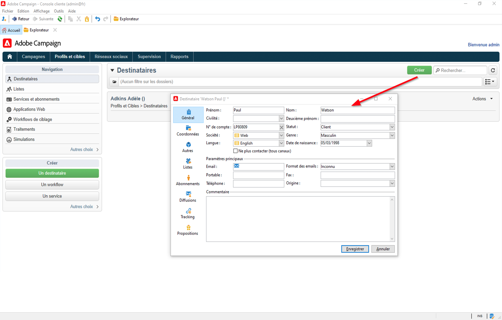

# Prise en main des profils et des audiences dans Campaign{#gs-profiles-and-audiences}

Les profils sont des contacts stockés dans la base de données Campaign, tels que des clients, des abonnés à un service ou des prospects. De nombreux mécanismes d&#39;acquisition de profils et de constitution de cette base de données sont possibles : collecte en ligne via des formulaires web, import manuel ou automatique de fichiers texte, réplication avec des bases de données de l&#39;entreprise ou d&#39;autres systèmes d&#39;information. Adobe Campaign vous permet d&#39;intégrer des données d&#39;historique marketing, des informations d&#39;achat, des données de préférences, des données CRM et des données d&#39;informations personnelles pertinentes dans une vue consolidée afin d&#39;effectuer une analyse et de prendre des mesures. Les profils contiennent toutes les informations requises pour le ciblage, la qualification et le suivi des individus.

Un profil est un enregistrement dans la table **nmsRecipient** ou une table externe qui stocke tous les attributs de profil, tels que le prénom, le nom, l&#39;adresse e-mail, un identifiant de cookie, l&#39;identifiant client, l&#39;identifiant mobile ou d&#39;autres informations relatives à un canal particulier. D&#39;autres tables liées à la table des destinataires contiennent des données relatives aux profils, par exemple la table des logs de diffusion qui contient les enregistrements de toutes les diffusions envoyées aux destinataires. En savoir plus sur les profils intégrés et les tables de destinataires dans [cette section](../dev/datamodel.md#ootb-profiles).

Dans Adobe Campaign, les **destinataires** sont les profils par défaut ciblés pour l&#39;envoi de diffusions (e-mails, SMS, etc.). Les données de destinataire stockées dans la base de données permettent de filtrer la cible qui recevra une diffusion donnée et d&#39;ajouter des données de personnalisation dans le contenu de votre diffusion. D&#39;autres types de profils existent dans la base de données. Ils sont conçus pour différents usages. Par exemple, les profils de contrôle servent à tester vos diffusions avant leur envoi vers la cible finale.

Pour remplir Adobe Campaign avec des données de profil, vous pouvez :

* [importer des fichiers de données](../start/import.md) provenant d&#39;une source de données externe telle qu&#39;un système CRM ;
* [créer des formulaires web](../dev/webapps.md) pour permettre aux clients de saisir leurs propres informations et de créer leur propre profil ;
* [mapper à une base de données externe](../connect/fda.md) dans laquelle les profils sont stockés ;
* saisissez les profils manuellement dans la console cliente, comme ci-dessous :

<!--You can also select your message audience in an external file: recipients are stored not in the database, but in files. These are known as “external” deliveries. These contacts can be imported or not in Adobe Campaign. [Learn more](external-profiles.md).-->
