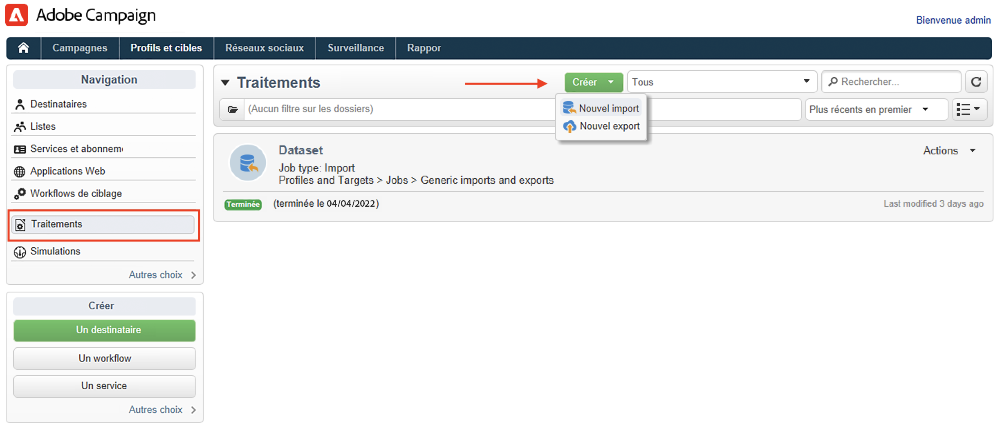

# Importer des profils depuis un fichier{#create-profiles}

Pour renseigner votre base de données Campaign, vous pouvez : [ajouter manuellement des profils](create-profiles.md) ou importer des profils comme décrit ci-dessous. Vous pouvez également utiliser des fichiers importés pour mettre à jour les données de contact.

## Importer des profils avec un workflow {#import-profiles-with-a-wf}

Les workflows peuvent être utiles pour automatiser certains de vos imports. Que vous importiez des données à partir d&#39;un fichier local ou d&#39;un serveur SFTP, vous pouvez utiliser des workflows pour standardiser vos procédures de Data Management.

### Utiliser les données d&#39;une liste : lecture de liste {#data-from-read-list}

Préparez et structurez vos données dans un fichier pour les importer avec un workflow. [En savoir plus](https://experienceleague.adobe.com/docs/campaign/automation/workflows/wf-activities/targeting-activities/read-list.html?lang=fr){target="_blank"}.

### Charger des données depuis un fichier {#data-from-a-file}

Les données traitées dans un workflow peuvent êtes extraites d&#39;un fichier structuré pour qu’elles puissent être importées dans Adobe Campaign. [En savoir plus](https://experienceleague.adobe.com/docs/campaign/automation/workflows/wf-activities/action-activities/data-loading--file-.html?lang=fr){target="_blank"}.

Une fois les données collectées, vous pouvez les utiliser dans vos workflows, par exemple pour enrichir une diffusion ou mettre à jour la base de données. Pour plus d’informations, consultez [cette section](https://experienceleague.adobe.com/docs/campaign/automation/workflows/introduction/use-workflow-data.html?lang=fr){target="_blank"}.

## Imports ponctuels{#import-jobs}

Adobe Campaign offre une fonctionnalité d&#39;import générique qui permet, par exemple, d&#39;extraire une liste de clients ou de prospects qui feront alors partie d&#39;une population cible, ou de fournir à votre base de données des données provenant de fichiers externes.

Les imports génériques sont gérés à partir du menu **[!UICONTROL Profils et cibles > Tâches]** de la page d&#39;accueil d&#39;Adobe Campaign.

Les étapes d&#39;un import générique sont détaillées dans la documentation de [Campaign Classic v7](https://experienceleague.adobe.com/docs/campaign-classic/using/getting-started/importing-and-exporting-data/generic-imports-exports/about-generic-imports-exports.html?lang=fr){target="_blank"}.
