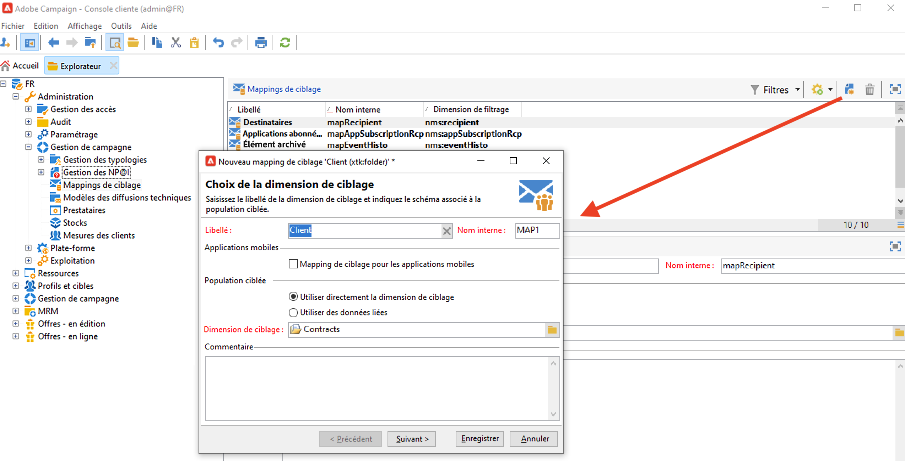
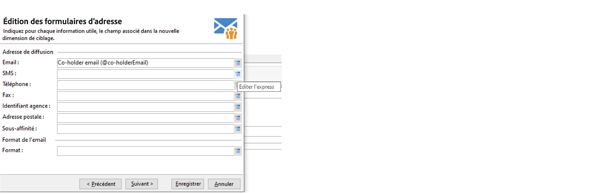
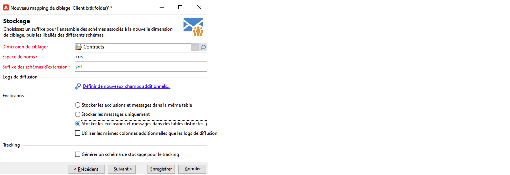
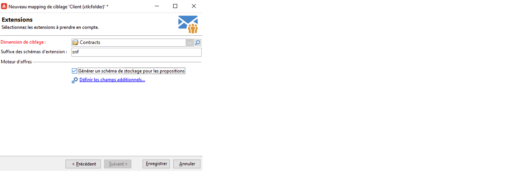

# Utiliser les mappings de ciblage{#gs-target-mappings}

Par défaut, les modèles de diffusion par e-mail et SMS ciblent les **[!UICONTROL destinataires]**. Leur mapping de ciblage utilise donc les champs du tableau **nms:recipient**.

Pour les notifications push, le mapping de ciblage par défaut est **Applications Abonnés (nms:appSubscriptionRcp)**, qui est lié au tableau des destinataires.

Vous pouvez utiliser d’autres mappings de ciblage pour vos diffusions ou créer un nouveau mapping de ciblage.

## Mappings de ciblage intégrés {#ootb-mappings}

Adobe Campaign est fourni avec les mappings de ciblage intégrés suivants :

| Nom | Utilisation | Schéma |
|---|---|---|
| Destinataires | Diffuser aux destinataires (tableau de destinataires intégré) | nms:recipient |
| Visiteurs | Diffuser aux visiteurs dont les profils ont été collectés par le biais d’une recommandation (marketing viral), par exemple. | mns:visitor |
| Abonnements  | Diffuser aux destinataires abonnés à un service d&#39;information, par exemple une newsletter | nms:subscription |
| Abonnements des visiteurs | Diffuser à des visiteurs abonnés à un service d&#39;information | nms:visitorSub |
| Opérateurs | Diffuser aux opérateurs Adobe Campaign | nms:operator |
| Fichier externe | Diffuser depuis un fichier contenant les toutes informations nécessaires à la diffusion | Aucun schéma associé, aucune cible renseignée |
| Applications abonnés | Diffuser aux destinataires abonnés à une application | nms:appSubscriptionRcp |

## Créer un mapping de ciblage {#new-mapping}

Vous pouvez également créer un mapping de ciblage. Vous devrez peut-être ajouter un mapping de ciblage personnalisé, par exemple si :

* vous utilisez un tableau de destinataires personnalisé,
* vous paramétrez une dimension de filtrage différente de la dimension de ciblage intégrée dans l’écran des mappings de ciblage.

Pour en savoir plus sur la création des tableaux de destinataires personnalisés, consultez [cette page](../dev/custom-recipient.md).

L’assistant de création de mapping de ciblage Adobe Campaign vous permet de créer tous les schémas nécessaires pour utiliser votre mapping de ciblage personnalisé.

1. Accédez à **[!UICONTROL Administration]** `>` **[!UICONTROL Gestion de campagne]** `>` **[!UICONTROL Mappings de ciblage]** à partir de l&#39;explorateur Adobe Campaign.

1. Créez un nouveau mapping de ciblage et sélectionnez votre schéma personnalisé comme dimension de ciblage.

   

1. Indiquez les champs où sont stockées les informations de profil : nom, prénom, e-mail, adresse, etc.

   

1. Indiquez les paramètres relatifs au stockage des informations, et notamment le suffixe des schémas d&#39;extension, pour qu&#39;ils soient facilement identifiables.

   

   Vous pouvez choisir de stocker ou non les exclusions (**excludelog**), avec les messages (**broadlog**) ou dans une table distincte.

   Vous pouvez également gérer ou non le tracking pour ce mapping de diffusion (**trackinglog**).

1. Sélectionnez ensuite les extensions à prendre en compte. Le type d’extension dépend de vos paramètres de campagne et de vos modules complémentaires.

   

   Cliquez sur le bouton **[!UICONTROL Enregistrer]** pour lancer la création du mapping de diffusion : toutes les tables liées sont créées automatiquement, selon les paramètres sélectionnés.
