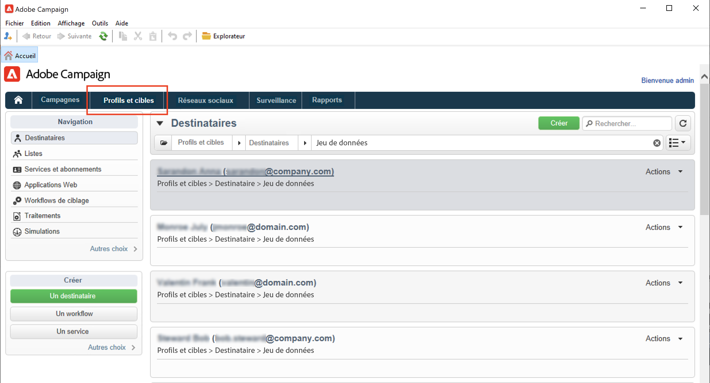
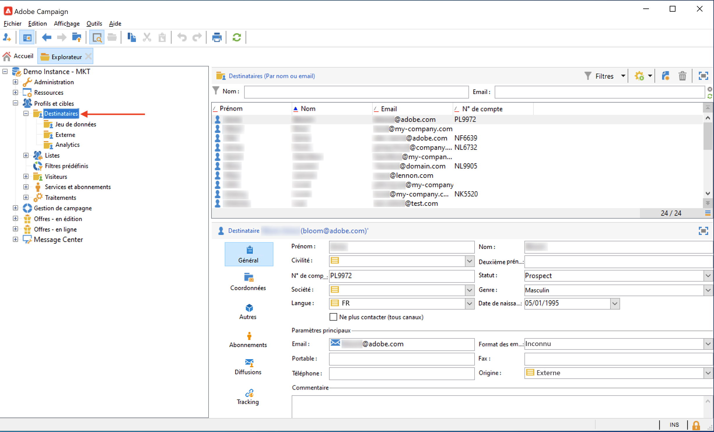
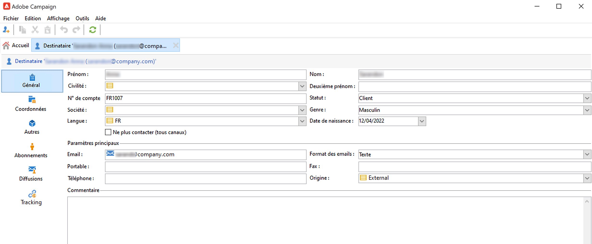
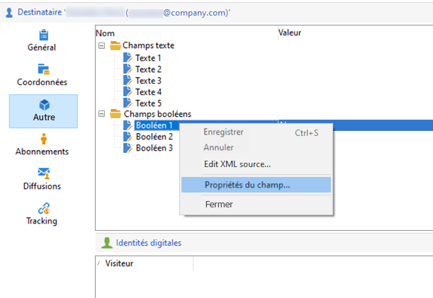
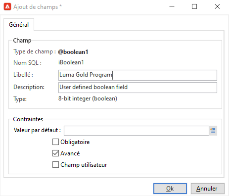
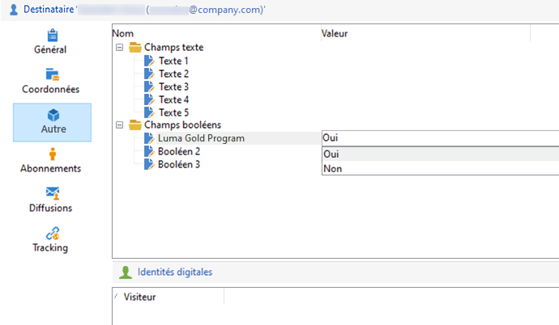
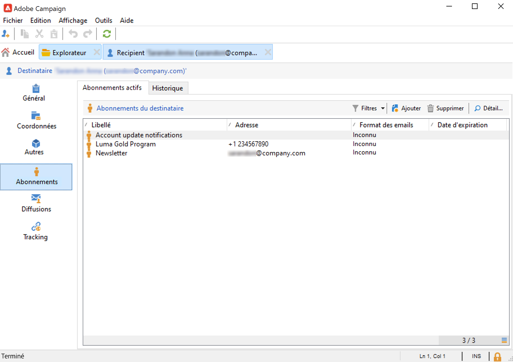

# Affichage des profils existants{#view-profiles}

Accédez à **[!UICONTROL Profils et cibles]** pour accéder aux destinataires stockés dans la base de données Adobe Campaign.

À partir de cette page, vous pouvez [créer un nouveau destinataire](create-profiles.md), modifier un destinataire existant et accéder aux détails de son profil.

Pour des manipulations de profils plus avancées, accédez à l&#39;arborescence de Campaign à partir du lien **[!UICONTROL Explorateur]** sur la page d&#39;accueil d&#39;Adobe Campaign.

>[!CAUTION]
>
>L&#39;écran de destinataire intégré est défini par le biais d&#39;un schéma XML et de son formulaire associé. Le schéma XML est stocké dans le nœud **[!UICONTROL Administration > Configuration > Schémas de données]** de l&#39;arborescence de l&#39;explorateur Adobe Campaign. Seuls les utilisateurs experts peuvent apporter des modifications à ces schémas.

## Modification d&#39;un profil{#edit-a-profiles}

Sélectionnez un profil pour afficher les détails dans un nouvel onglet.

Les données relatives à un profil sont regroupées dans des onglets. Ces onglets et leur contenu dépendent de vos paramètres spécifiques et des packages installés.

Pour un destinataire intégré standard, vous pouvez accéder aux onglets suivants :

* **[!UICONTROL Général]**, pour toutes les données de profil générales. Il contient notamment le nom, le prénom, l&#39;adresse e-mail, le format des e-mails, etc.

   Cet onglet stocke également l&#39;indicateur **opt-out** pour le profil : lorsque l&#39;option **[!UICONTROL Ne plus contacter (tous canaux)]** est sélectionnée, le profil est sur liste bloquée. Ces informations sont ajoutées aux données de contact si le destinataire a cliqué sur un lien de désinscription dans une newsletter par exemple. Ce destinataire ne sera plus ciblé sur aucun canal (e-mail, courrier, etc.). Pour en savoir plus, reportez-vous à [cette page](../send/quarantines.md).

* L&#39;onglet **Coordonnées**, qui contient l&#39;adresse postale du profil sélectionné.

   Vous pouvez vérifier dans cet écran l&#39;indice de qualité de l&#39;adresse et le nombre d&#39;erreurs que contient l&#39;adresse. Ces informations sont directement utilisées par le prestataire de services postaux, en fonction du nombre d&#39;erreurs rencontrées lors des diffusions précédentes, et ne peuvent pas être modifiées manuellement.

* L&#39;onglet **Autre**, pour des champs spécifiques qui peuvent être personnalisés et renseignés selon vos besoins.

   Utilisez le menu contextuel **[!UICONTROL Propriétés du champ...]** pour modifier les noms des champs et définir leur format.

   

   Saisissez les nouveaux paramètres comme ci-dessous :

   

   Vérifiez la mise à jour dans l&#39;interface utilisateur :

   

   >[!CAUTION]
   >Les modifications s&#39;appliquent à tous les destinataires.

* L&#39;onglet **Abonnements**, pour tous les abonnements principaux aux services. Utilisez l&#39;onglet **Historique** pour accéder aux détails des abonnements et des désabonnements de ce contact.

   

   Apprenez-en davantage sur les abonnements dans [cette section](../start/subscriptions.md).

* L&#39;onglet **Diffusions**, pour tous les logs de diffusion du profil sélectionné. Utilisez cet onglet pour accéder à l&#39;historique marketing du contact : libellés, dates et état de toutes les actions de diffusion adressées au profil via tous les canaux.

* L&#39;onglet **Tracking**, pour tous les logs de tracking du profil sélectionné. Ces informations sont utilisées pour effectuer le suivi du comportement des profils suite aux diffusions. Cet onglet présente le cumul de toutes les URL trackées dans les diffusions. La liste est paramétrable et contient généralement : l&#39;URL cliquée, la date et l&#39;heure du clic, le document dans lequel l&#39;URL figurait

   Apprenez-en davantage sur le tracking dans [cette section](../start/tracking.md).

## Profils actifs {#active-profiles}

Les profils actifs sont les profils qui sont comptabilisés à des fins de facturation.

La facturation ne concerne que les profils **actifs**. Un profil est considéré comme actif s&#39;il a été ciblé ou s&#39;il a reçu des communications au cours des 12 derniers mois via n&#39;importe quel canal.

Un profil qui a été ciblé par plusieurs diffusions n&#39;est comptabilisé qu&#39;une seule fois.

Le nombre de profils actifs est disponible pour les **instances marketing** uniquement. Il n&#39;est pas disponible pour les instances d&#39;exécution, c&#39;est-à-dire les instances MID (mid-sourcing) et RT (Message Center / messagerie en temps réel).

>[!NOTE]
>
>Vous pouvez également surveiller le nombre de profils actifs utilisés sur vos instances directement à partir du Panneau de contrôle de Campaign. Pour plus d&#39;informations, consultez la [documentation du Panneau de contrôle](https://experienceleague.adobe.com/docs/control-panel/using/performance-monitoring/active-profiles-monitoring.html?lang=fr).
