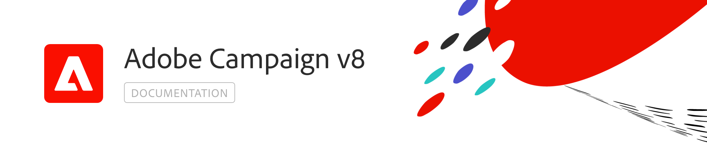

# Centre d&#39;aide {#campaign-documentation}

## Nouveautés

* **[En quoi consiste ? [!DNL Adobe Campaign]](start/get-started.md)** - Principales fonctionnalités et cas d&#39;utilisation

* **[Nouveautés de v8](start/whats-new.md)** - Découvrez les fonctionnalités de Campaign v8

* **[Instructions d&#39;implémentation](start/implement.md)** - Découvrez comment démarrer votre implémentation.

* **[De v7 à v8](start/capability-matrix.md)** - Comment passer de Campaign Classic v7 à v8 ? Découverte des différences principales

## Prise en main

<table>
<tr>
  <td valign="bottom">
    
    

    <a href="start/connect.md">Connexion à Campaign</a>
    

     
  </td>

<td valign="bottom">
      
    
<a href="start/import.md">Import de profils</a>
    

     
  </td>
  <td valign="bottom">
    
    

    <a href="start/create-message.md">Création d'un e-mail</a>
    

     
  </td>
</tr>
</table>

## Plus de ressources

* [Limites connues](start/known-limitations.md)
* [Architecture](dev/architecture.md)
* [Mesure et suivi](start/reporting.md)
* [Connexion à d&#39;autres solutions](connect/integration.md)
* [FAQ Campaign v8](start/campaign-faq.md)
* [Description du produit Adobe Campaign v8](https://helpx.adobe.com/legal/product-descriptions/adobe-campaign-managed-cloud-services.html)
