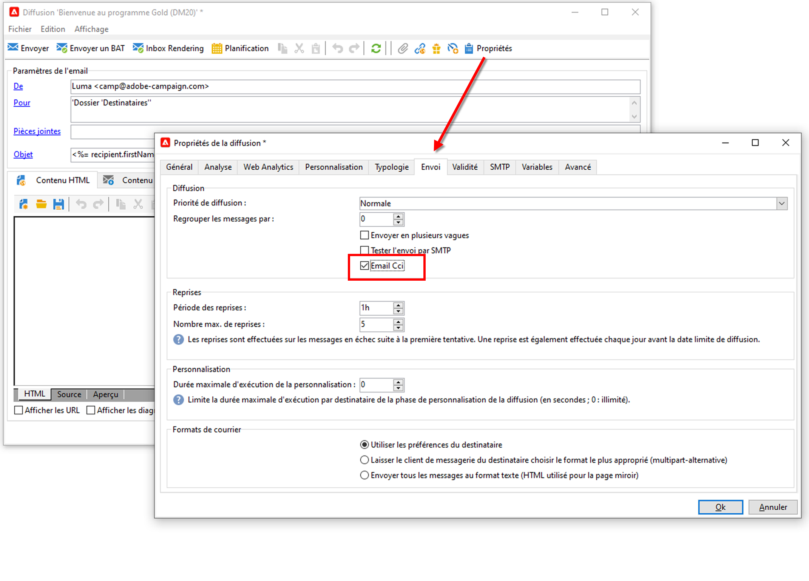

# Paramètres du canal email Campaign

## Email Cci

Vous pouvez paramétrer Adobe Campaign pour conserver une copie des emails envoyés depuis votre plateforme.

>[!NOTE]
>La fonctionnalité Email Cci est facultative. Veuillez vérifier votre accord de licence.

Adobe Campaign ne gère pas les fichiers archivés. Il vous permet d’envoyer les messages de votre choix à une adresse dédiée, à partir de laquelle ils peuvent être traités et archivés au moyen d’un système externe.

Pour ce faire, les fichiers .eml correspondant aux emails envoyés sont transférés vers un serveur distant, comme un serveur de messagerie SMTP. La destination de l&#39;archivage est une adresse email en Cci (invisible aux destinataires de la diffusion) que vous devez spécifier.

Notez que :

* Vous ne pouvez utiliser que **une** adresse email en Cci.

* Seuls les emails envoyés sont pris en compte, les retours ne le sont pas.

[!DNL :speech_balloon:] En tant qu’utilisateur Cloud Services géré,  [contactez ](../start/campaign-faq.md#support) Adobe pour activer la fonctionnalité Email Cci dans Campaign. L&#39;adresse email en Cci de votre choix doit être fournie à l&#39;équipe Adobe qui la configurera pour vous.

Une fois que la fonctionnalité Email Cci est configurée, assurez-vous qu&#39;elle est activée dans le modèle de diffusion ou dans la diffusion via l&#39;option **Email Cci.**

**Rubriques connexes** dans la documentation de Campaign Classic v7 :

[!DNL :arrow_upper_right:] [Générer la page miroir](https://experienceleague.adobe.com/docs/campaign-classic/using/sending-messages/sending-emails/sending-an-email/email-parameters.html#generating-mirror-page)

[!DNL :arrow_upper_right:] [Sélectionner le format d&#39;email](https://experienceleague.adobe.com/docs/campaign-classic/using/sending-messages/sending-emails/sending-an-email/email-parameters.html#selecting-message-formats)

[!DNL :arrow_upper_right:] [Sélectionner le codage des caractères](https://experienceleague.adobe.com/docs/campaign-classic/using/sending-messages/sending-emails/sending-an-email/email-parameters.html#character-encoding)

[!DNL :arrow_upper_right:] [Définition de l’adresse email rebond](https://experienceleague.adobe.com/docs/campaign-classic/using/sending-messages/sending-emails/sending-an-email/email-parameters.html#managing-bounce-emails)

[!DNL :arrow_upper_right:] [Utiliser des modèles de diffusion email](https://experienceleague.adobe.com/docs/campaign-classic/using/sending-messages/using-delivery-templates/about-templates.html)

[!DNL :arrow_upper_right:] [Présentation des diffusions en échec](https://experienceleague.adobe.com/docs/campaign-classic/using/sending-messages/monitoring-deliveries/understanding-delivery-failures.html)
