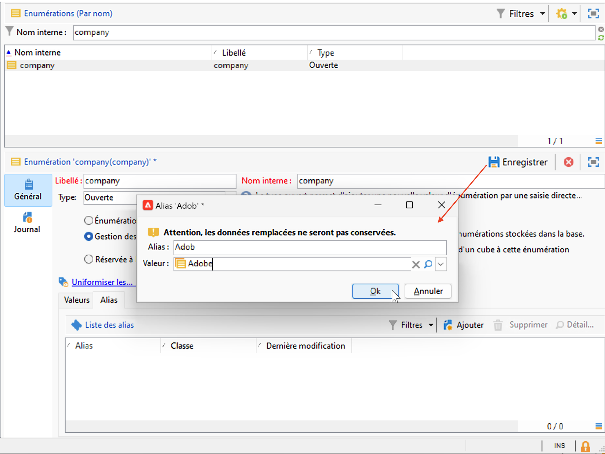
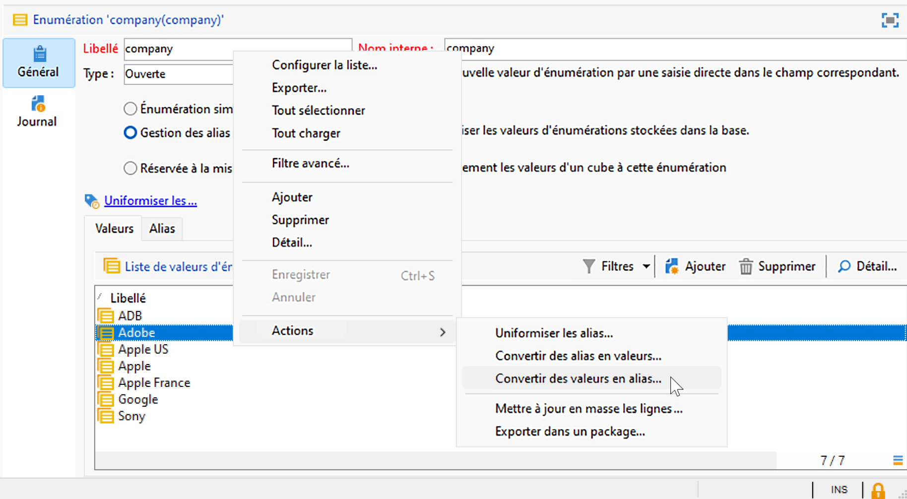
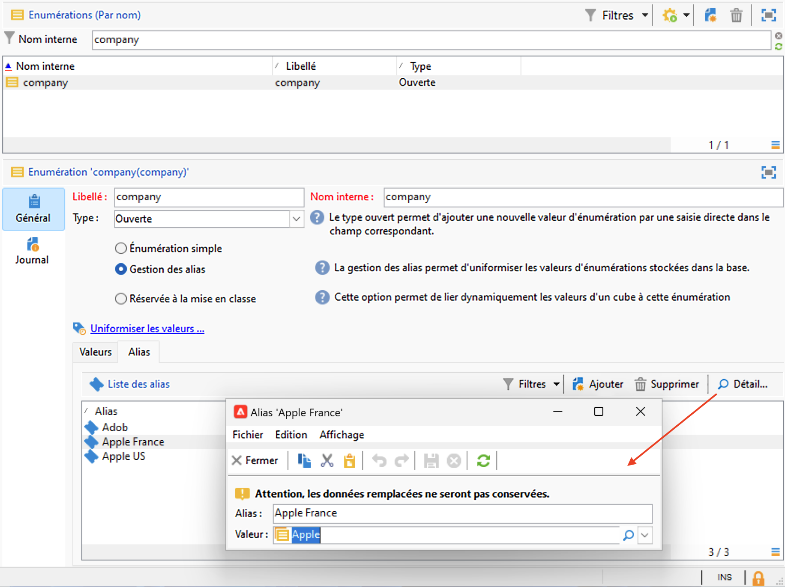

# Utiliser les énumérations {#enumerations}

Une énumération (également appelée liste détaillée) est une liste prédéfinie de valeurs que vous pouvez utiliser pour renseigner certains champs. Les énumérations permettent de normaliser les valeurs de champ, de rendre la saisie de données plus cohérente et de simplifier les requêtes.

Lorsqu’elles sont disponibles, les valeurs s’affichent dans une liste déroulante. Vous pouvez sélectionner une valeur directement ou commencer à saisir : l’entrée prédictive suggère des valeurs correspondantes et les complète automatiquement.

Certains champs de console sont configurés avec des énumérations. Si une énumération est **ouverte**, vous pouvez également ajouter de nouvelles valeurs directement dans le champ.

## Types d’énumération {#types-of-enum}

Les énumérations sont stockées dans le dossier **[!UICONTROL Administration > Plateforme > Énumérations]** de l’explorateur.

Celles-ci peuvent être : Ouverte, Système, Émoticône ou Fermée.

* Une énumération **Ouverte** permet aux utilisateurs et utilisatrices d’ajouter des valeurs directement dans les champs à partir de cette énumération.
* Une énumération **Fermée** a une liste fixe de valeurs qui ne peut être modifiée qu’à partir du dossier **[!UICONTROL Administration > Plateforme > Énumérations]** de l’explorateur.
* Une énumération **Émoticône** est utilisée pour mettre à jour la liste des émoticônes. En savoir plus
* Une énumération **Système** est associée aux champs système et est fournie avec un nom interne.

Pour les énumérations **Ouverte** et **Fermée**, des options spécifiques sont disponibles :

* L’**énumération simple** est le type standard.
* L’énumération **Cleansing des alias** est utilisée pour harmoniser les valeurs d’énumération stockées dans la base de données. [En savoir plus](#alias-cleansing)
* **Réservée à la mise en classe** est une option permettant de lier les valeurs d’un cube à cette énumération. [En savoir plus](../reporting/gs-cubes.md)

## Cleansing des alias {#alias-cleansing}

Dans les champs d’énumération, vous pouvez sélectionner une valeur ou saisir une valeur personnalisée qui n’est pas disponible dans la liste déroulante. Les valeurs personnalisées peuvent être ajoutées aux valeurs d’énumération existantes, en tant que nouvelles. Dans ce cas, l’option **[!UICONTROL Ouverte]** doit être sélectionnée. Ces valeurs personnalisées peuvent être nettoyées à l’aide des fonctionnalités de cleansing des alias. Par exemple, si un utilisateur ou une utilisatrice accède à `Adob` au lieu de `Adobe`, le processus de cleansing des alias peut le remplacer automatiquement par le terme correct.

>[!CAUTION]
>
>La normalisation des données est un processus critique qui affecte les données de la base. En effet, Adobe Campaign procède à la mise à jour en masse de données, ce qui peut impliquer la suppression de certaines valeurs. Cette opération est donc réservée à des utilisateurs et utilisatrices avertis.

Activez l’option **[!UICONTROL Cleansing des alias]** pour utiliser les fonctionnalités de normalisation des données pour une énumération. Lorsque cette option est sélectionnée, l’onglet **[!UICONTROL Alias]** s’affiche au bas de la fenêtre.

Lorsqu’un utilisateur ou une utilisatrice saisit une valeur qui n’existe pas dans une énumération Cleasing des alias, elle est ajoutée à la liste de **valeurs**. Vous pouvez [créer des alias à partir de ces valeurs](#convert-to-alias) ou [créer de nouveaux alias](#create-alias).

### Créer un alias{#create-alias}

Pour créer un alias, procédez comme suit :

1. Cliquez sur le bouton **[!UICONTROL Ajouter]** de l’onglet **[!UICONTROL Alias]**.
1. Saisissez l’alias à convertir et sélectionnez la valeur à appliquer dans la liste déroulante.

   

1. Cliquez sur **[!UICONTROL Ok]** pour confirmer.

1. Enregistrez vos modifications. Le remplacement des valeurs est effectué par le workflow **Cleansing des alias** exécuté toutes les nuits. Pour plus d’informations, consultez la section [Exécuter le cleansing des données](#running-data-cleansing).

Pour tous les champs basés sur cette énumération, lorsqu’un utilisateur ou une utilisatrice saisit la valeur **Adob** dans un champ « société » (dans la console cliente Adobe Campaign ou dans un formulaire web), cette valeur sera automatiquement remplacée par la valeur **Adobe**.

### Convertir une valeur incorrecte en alias{#convert-to-alias}

Vous pouvez également convertir une valeur d’énumération existante en alias. Procédez comme suit :

1. Dans la liste des valeurs d’une énumération, faites un clic droit et accédez à **[!UICONTROL Actions... > Convertir les valeurs en alias...]**.

   

1. Sélectionnez les valeurs à convertir en alias et cliquez sur **[!UICONTROL Suivant]**.
1. Cliquez sur **[!UICONTROL Démarrer]** pour lancer la conversion.

   Une fois l’exécution terminée, des alias sont ajoutés à la liste, dans l’onglet **Alias**. Vous pouvez associer une valeur correcte pour remplacer les entrées incorrectes. Procédez comme suit :

1. Sélectionnez une valeur à nettoyer.
1. Cliquez sur le bouton **Détail...**
1. Sélectionnez la nouvelle valeur dans la liste déroulante.

   

>[!NOTE]
>
>Vous pouvez effectuer le suivi des occurrences d’un alias dans la colonne **[!UICONTROL Accès]** du sous-onglet **[!UICONTROL Alias]**. Cette action permet d’afficher le nombre de fois où cette valeur a été saisie.  [En savoir plus](#calculate-entry-occurrences).

### Exécuter le cleansing des données {#running-data-cleansing}

Le cleansing des données est effectué par le workflow technique **[!UICONTROL Cleansing des alias]**. Par défaut, il est exécuté quotidiennement.

Vous pouvez également déclencher le cleansing via le lien **[!UICONTROL Nettoyer les valeurs...]**.

Le lien **[!UICONTROL Paramètres avancés...]** permet de définir la date de prise en compte des valeurs collectées.

Cliquez sur le bouton **[!UICONTROL Démarrer]** pour lancer l&#39;uniformisation des données.

### Surveiller les occurrences {#calculate-entry-occurrences}

Le sous-onglet **[!UICONTROL Alias]** d’une énumération peut afficher le nombre d’occurrences d’un alias parmi toutes les valeurs renseignées. Ces informations sont une estimation qui sera affichée dans la colonne **[!UICONTROL Accès]**.

>[!CAUTION]
>
>Le calcul des occurrences de saisie d’un alias peut prendre beaucoup de temps.
>

Vous pouvez lancer manuellement le calcul des occurrences via le lien **[!UICONTROL Nettoyer les valeurs...]**. Pour ce faire, cliquez sur le lien **[!UICONTROL Paramètres avancés...]** et sélectionnez une ou plusieurs options.

* **[!UICONTROL Actualiser le nombre d&#39;apparitions des alias]** : permet de mettre à jour les occurrences déjà calculées, à partir de la date de prise en compte renseignée.
* **[!UICONTROL Recalculer depuis le début le nombre d&#39;apparitions des alias]** : permet de réinitialiser tout le calcul sur l&#39;ensemble de la plateforme Adobe Campaign.

Vous pouvez également créer un workflow dédié afin que ce calcul s&#39;exécute automatiquement pour une période donnée, par exemple toutes les semaines.

Pour cela, créez une copie du workflow **[!UICONTROL Gestion des alias]**, modifiez le planificateur et utilisez les paramètres suivants dans l&#39;activité **[!UICONTROL Uniformisation des valeurs des énumérations]** :

* **updateHits** pour actualiser le nombre d’apparitions des alias,
* **-updateHits:full** pour recalculer tous les accès aux alias.
