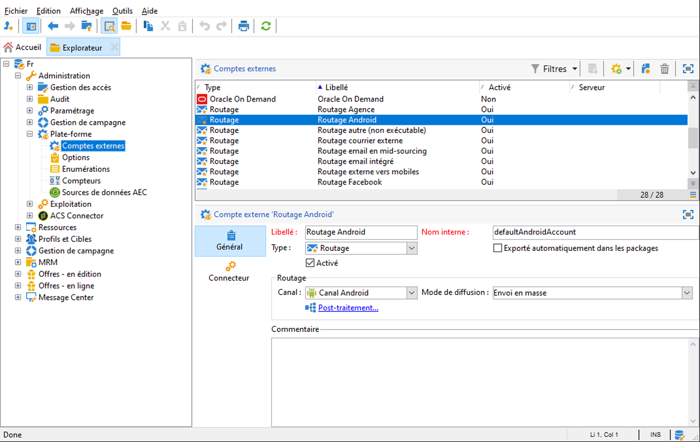
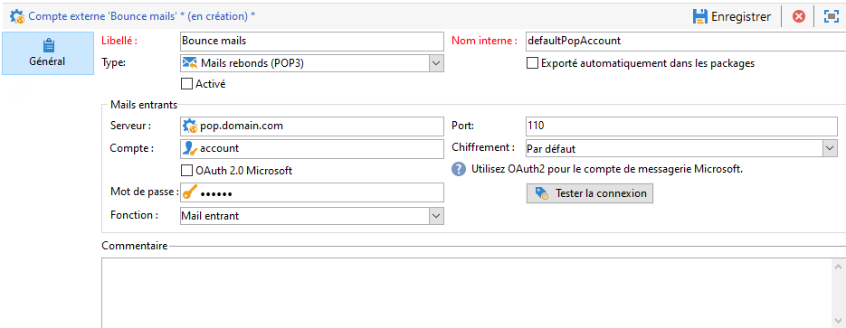
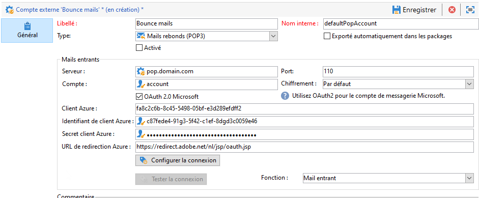

# Configuration de vos comptes externes

Un ensemble de comptes externes prédéfinis est livré avec Adobe Campaign. Pour établir des connexions avec des systèmes externes, vous pouvez créer des comptes externes.

Les comptes externes sont utilisés par les processus techniques comme les workflows techniques ou de campagne. Par exemple, lors de la configuration d&#39;un transfert de fichier dans un workflow ou d&#39;un échange de données avec une autre application (Adobe Target, Experience Manager, etc.), vous devez sélectionner un compte externe.

Vous pouvez accéder aux comptes externes à partir de l&#39;**[!UICONTROL Explorateur]** Adobe Campaign : accédez à **[!UICONTROL Administration]** `>` **[!UICONTROL Plateforme]** `>` **[!UICONTROL Comptes externes]**.




>[!CAUTION]
>
>Dans le contexte d’un [Déploiement Enterprise (FFDA)](../architecture/enterprise-deployment.md), un compte externe **[!UICONTROL Full FDA]** (ffda) gère la connexion entre la base de données locale Campaign et la base de données Cloud ([!DNL Snowflake]).
></br>En tant qu&#39;utilisateur Managed Cloud Services, ce compte externe est configuré pour votre instance par Adobe. Il ne doit pas être modifié.

## Comptes externes spécifiques à Campaign

Adobe Campaign utilise les comptes techniques suivants pour activer et exécuter des processus spécifiques.

  En tant qu’utilisateur Managed Cloud Services, Adobe configure tous les comptes externes spécifiques à Campaign pour vous.

### Mails rebonds {#bounce-mails-external-account}

>[!NOTE]
>
>L&#39;authentification OAuth 2.0 de Microsoft Exchange Online pour la fonctionnalité POP3 est disponible à partir de Campaign v8.3. Pour vérifier votre version, consultez [cette section](../start/compatibility-matrix.md#how-to-check-your-campaign-version-and-buildversion)

Le compte externe **Mails rebonds** spécifie le compte externe POP3 à utiliser pour se connecter au service de messagerie. Tous les serveurs configurés pour l&#39;accès POP3 peuvent être utilisés pour recevoir les retours d&#39;e-mail.

 Apprenez-en davantage sur les e-mails entrants dans la [documentation de Campaign Classic v7](https://experienceleague.adobe.com/docs/campaign-classic/using/automating-with-workflows/event-activities/inbound-emails.html?lang=fr){target="_blank"}



Pour configurer le compte externe **[!UICONTROL Mails rebonds (defaultPopAccount)]** :

* **[!UICONTROL Serveur]**

   URL du serveur POP3.

* **[!UICONTROL Port]**

   Numéro de port de la connexion POP3. Le port par défaut est 110.

* **[!UICONTROL Compte]**

   Nom de l&#39;utilisateur.

* **[!UICONTROL Mot de passe]**

   Mot de passe du compte de l&#39;utilisateur.

* **[!UICONTROL Chiffrement]**

   Type de chiffrement choisi entre **[!UICONTROL Par défaut]**, **[!UICONTROL POP3 + STARTTLS]**, **[!UICONTROL POP3]** ou **[!UICONTROL POP3S]**.
Le compte externe **Mails rebonds** spécifie le compte externe POP3 à utiliser pour se connecter au service de messagerie. Tous les serveurs configurés pour l&#39;accès POP3 peuvent être utilisés pour recevoir les retours d&#39;e-mail.

* **[!UICONTROL Fonction]**

   E-mail entrant ou routeur SOAP



>[!IMPORTANT]
>
>Avant de configurer votre compte externe POP3 à l’aide de Microsoft OAuth 2.0, vous devez enregistrer votre application sur le portail Azure. Pour en savoir plus à ce sujet, consultez cette [page](https://docs.microsoft.com/fr-fr/azure/active-directory/develop/quickstart-register-app).

Pour configurer un environnement externe POP3 à l’aide de Microsoft OAuth 2.0, cochez la case **[!UICONTROL Microsoft OAuth 2.0]** et renseignez les champs suivants :

* **[!UICONTROL Client Azure]**

   L’ID Azure (ou l’ID de répertoire (client)&rbrace; se trouve dans le menu déroulant **Essentiels** de la présentation de votre application dans le portail Azure.

* **[!UICONTROL Identifiant de client Azure]**

   L’ID client (ou l’ID d’application (client)) se trouve dans le menu déroulant **Essentiels** de la présentation de votre application dans le portail Azure.

* **[!UICONTROL Secret client Azure]**:

   L’ID de secret client se trouve dans la variable **Secrets client** du menu **Certificats et secrets** de votre application dans le portail Azure.

* **[!UICONTROL URL de redirection Azure]**:

   L’URL de redirection se trouve dans le menu **Authentification** de votre application dans le portail Azure. Elle doit se terminer par la syntaxe suivante : `nl/jsp/oauth.jsp`, par exemple `https://redirect.adobe.net/nl/jsp/oauth.jsp`.

Après avoir saisi les différentes informations d’identification, vous pouvez cliquer sur **[!UICONTROL Configurer la connexion]** pour terminer la configuration de votre compte externe.

### Routage  {#routing}

Le compte externe **[!UICONTROL Routage]** vous permet de configurer chaque canal disponible dans Adobe Campaign en fonction des packages installés.

>[!CAUTION]
>
>Le compte externe **[!UICONTROL Routage e-mail intégré]** (defaultEmailBulk) **ne doit pas** être activé dans Adobe Campaign v8.

### Instance d&#39;exécution {#execution-instance}

Dans le contexte des messages transactionnels, les instances d&#39;exécution sont liées à l&#39;instance de pilotage et les connectent. Les modèles de messages transactionnels sont déployés vers l&#39;instance d&#39;exécution.

 Pour en savoir plus sur l&#39;architecture de Message Center, consultez [cette page](../architecture/architecture.md#transac-msg-archi).

## Accès aux comptes externes de systèmes externes

* **Base de données externe (FDA)**

   Utilisez le compte externe de type **Base de données externe** pour vous connecter à une base de données externe via FDA.

   Les bases de données externes compatibles avec Adobe Campaign v8 sont répertoriées dans la [matrice de compatibilité](../start/compatibility-matrix.md)

    Apprenez-en davantage sur l&#39;option Federated Data Access (FDA) dans [cette section](../connect/fda.md).

## Comptes externes d&#39;intégration de solutions Adobe

* **Adobe Experience Cloud**

   Le compte externe **[!UICONTROL Adobe Experience Cloud]** est utilisé pour implémenter l’IMS d’Adobe pour se connecter à la console Adobe Campaign à l’aide d’un Adobe ID.

    Apprenez-en davantage sur le service Identity Management (IMS) d’Adobe dans [cette section](../start/connect.md#connect-ims).

* **Web Analytics**

   Utilisez le compte externe **[!UICONTROL Web Analytics (Adobe Analytics)]** pour configurer le transfert de données d&#39;Adobe Analytics vers Adobe Campaign.

    Pour en savoir plus sur l&#39;intégration Adobe Campaign - Adobe Analytics, consultez [cette page](../connect/ac-aa.md).

     En tant qu’utilisateur Managed Cloud Services, [contactez Adobe](../start/campaign-faq.md#support) pour intégrer Adobe Analytics à Campaign.

   * **Adobe Experience Manager**

   Le compte externe **[!UICONTROL AEM]** permet de gérer le contenu de vos diffusions e-mail, ainsi que vos formulaires directement dans Adobe Experience Manager.

    Pour en savoir plus sur l&#39;intégration Adobe Campaign - Adobe Analytics, consultez [cette page](../connect/ac-aem.md).

     En tant qu’utilisateur Managed Cloud Services, [contactez Adobe](../start/campaign-faq.md#support) pour intégrer Adobe Experience Manager à Adobe Campaign.


## Comptes externes du connecteur CRM

* **Microsoft Dynamics CRM**

   Le compte externe **[!UICONTROL Microsoft Dynamics CRM]** vous permet d&#39;importer et d&#39;exporter des données Microsoft Dynamics vers Adobe Campaign.

   Pour en savoir plus sur l&#39;intégration Adobe Campaign - Microsoft Dynamics CRM, [consultez cette page](../connect/ac-ms-dyn.md).

* **Salesforce.com**

   Le compte externe **[!UICONTROL Salesforce CRM]** vous permet d’importer et d’exporter des données Salesforce vers Adobe Campaign.

   Pour en savoir plus sur l&#39;intégration Adobe Campaign - Salesforce.com CRM, [consultez cette page](../connect/ac-sfdc.md).

## Comptes externes de transfert de données

Ces comptes externes peuvent être utilisés pour importer ou exporter des données vers Adobe Campaign à l&#39;aide d&#39;une activité de workflow **[!UICONTROL Transfert de fichier]**.

 Apprenez-en davantage sur le transfert de fichier dans les workflows dans la [documentation de Campaign Classic v7](https://experienceleague.adobe.com/docs/campaign-classic/using/automating-with-workflows/event-activities/file-transfer.html?lang=fr){target="_blank"}

* **FTP et SFTP**

   Le compte externe **FTP** vous permet de configurer et de tester l&#39;accès à un serveur en dehors d&#39;Adobe Campaign. Pour configurer des connexions avec des systèmes externes comme des serveurs SFTP ou FTP 898 utilisés pour les transferts de fichiers, vous pouvez créer vos propres comptes externes.
Pour ce faire, spécifiez dans ce compte externe l&#39;adresse et les informations de connexion utilisées pour établir la connexion au serveur SFTP ou FTP.

* **Amazon Simple Storage Service (S3)**

   Le connecteur **AWS S3** peut être utilisé pour importer ou exporter des données vers Adobe Campaign à l&#39;aide d&#39;une activité de workflow **[!UICONTROL Transfert de fichier]**. Lors de la configuration de ce nouveau compte externe, vous devez indiquer les informations suivantes :

   * **[!UICONTROL Serveur du compte AWS S3]**: URL de votre serveur, renseignée comme suit :   ```<S3bucket name>.s3.amazonaws.com/<s3object path>```

   * **[!UICONTROL ID de la clé d&#39;accès AWS]** : apprenez à trouver votre ID de clé d&#39;accès AWS en consultant la [documentation Amazon](https://docs.aws.amazon.com/general/latest/gr/aws-sec-cred-types.html#access-keys-and-secret-access-keys).

   * **[!UICONTROL Clé d&#39;accès secrète à AWS]** : apprenez à trouver votre clé d&#39;accès secrète à AWS en consultant la [documentation Amazon](https://aws.amazon.com/fr/blogs/security/wheres-my-secret-access-key/).

   * **[!UICONTROL Région AWS]** : pour en savoir plus sur les régions AWS, consultez la [documentation Amazon](https://aws.amazon.com/fr/about-aws/global-infrastructure/regions_az/).

   * La case à cocher **[!UICONTROL Utiliser le chiffrement coté serveur]** vous permet de stocker votre fichier en mode chiffré dans S3. Apprenez à trouver l&#39;ID de clé d&#39;accès et la clé d&#39;accès secrète en consultant la [documentation Amazon](https://docs.aws.amazon.com/general/latest/gr/aws-sec-cred-types.html#access-keys-and-secret-access-keys).

* **Stockage Azure Blob**

   Le compte externe **Azure** peut être utilisé pour importer ou exporter des données vers Adobe Campaign à l&#39;aide d&#39;une activité de workflow **[!UICONTROL Transfert de fichier]**. Pour configurer le compte externe **Azure** afin de l&#39;utiliser avec Adobe Campaign, vous devez fournir les informations suivantes :

   * **[!UICONTROL Serveur]** : URL de votre serveur de stockage Azure Blob.

   * **[!UICONTROL Chiffrement]** : type de chiffrement, **[!UICONTROL Aucun]** ou **[!UICONTROL SSL]**.

   * **[!UICONTROL Clé d&#39;accès]** : apprenez à trouver votre **[!UICONTROL clé d&#39;accès]** en consultant la [documentation Microsoft](https://docs.microsoft.com/fr-fr/azure/storage/common/storage-account-keys-manage?tabs=azure-portal).
