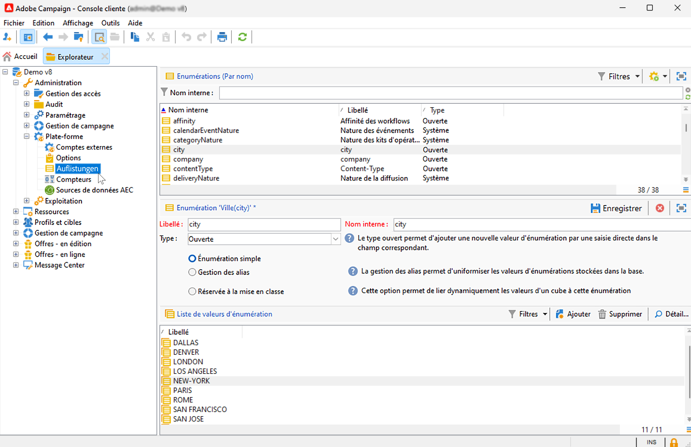
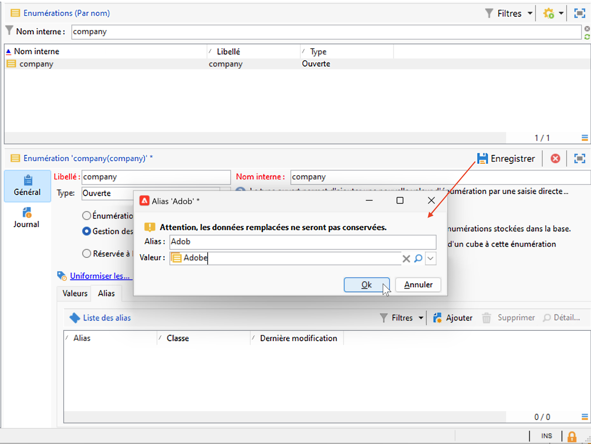
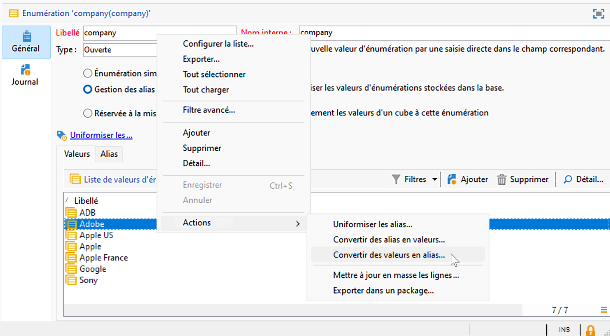
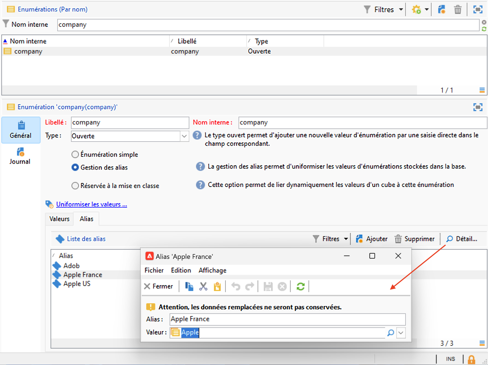

# Paramètres de l’interface utilisateur de Campaign {#ui-settings}

## Unités par défaut {#default-units}

Dans Adobe Campaign, pour les champs qui expriment une durée (par exemple la période de validité des ressources, la date limite de validation d’une tâche, etc.), les valeurs peuvent être exprimées dans les **unités** suivantes :

* **[!UICONTROL s]** pour les secondes
* **[!UICONTROL mn]** pour les minutes
* **[!UICONTROL h]** pour les heures
* **[!UICONTROL j]** pour les jours

## Personnaliser l&#39;explorateur Campaign{#customize-explorer}

Vous pouvez ajouter des dossiers à l&#39;explorateur Campaign, créer des vues et attribuer des autorisations.

Découvrez comment gérer les dossiers et les vues dans [cette page](../audiences/folders-and-views.md)

## Gérer et personnaliser des listes{#customize-lists}

Dans la console cliente Campaign, les données sont affichées sous forme de listes. Vous pouvez adapter ces listes à vos besoins. Vous pouvez par exemple ajouter des colonnes, filtrer les données, comptabiliser les enregistrements, enregistrer et partager vos paramètres.

En outre, vous pouvez créer et enregistrer des filtres.  Pour en savoir plus sur les filtres, consultez [cette page](../audiences/create-filters.md).

### Nombre d’enregistrements {#number-of-records}

Par défaut, Adobe Campaign charge en mémoire les 200 premiers enregistrements d&#39;une liste. Par conséquent, l&#39;affichage ne propose pas nécessairement l&#39;intégralité des enregistrements de la table dont vous affichez le contenu. Vous pouvez lancer un décompte du nombre d&#39;enregistrements de la liste et déclencher le chargement en mémoire d&#39;enregistrements supplémentaires.

En bas à droite de l&#39;écran de liste, un **compteur** indique le nombre d&#39;enregistrements chargés en mémoire par rapport au nombre total d&#39;enregistrements dans la base (après application de tous les filtres éventuels) :

Si un point d’interrogation apparaît à la place du nombre de droite, par exemple `240/?`, cliquez sur le compteur pour lancer le calcul.

Pour charger et afficher des enregistrements supplémentaires, cliquez sur **[!UICONTROL Continuer le chargement]**. Par défaut, 200 enregistrements sont chargés. Pour modifier le nombre d’enregistrements chargés par défaut, cliquez sur l’icône **[!UICONTROL Configurer la liste]**, en bas à droite de la liste. Dans la fenêtre de configuration de la liste, cliquez sur **[!UICONTROL Paramètres avancés]** (en bas à gauche) et modifiez le nombre de lignes à récupérer.

Si vous souhaitez charger l’intégralité des enregistrements, cliquez dans la liste avec le bouton droit et sélectionnez **[!UICONTROL Tout charger]**.

>[!CAUTION]
>
>Lorsqu’une liste contient un grand nombre d’enregistrements, le chargement complet peut prendre un certain temps.
>

### Ajouter et supprimer des colonnes {#add-columns}

Pour chaque liste, la configuration des colonnes intégrée peut être adaptée pour afficher davantage d’informations ou masquer les colonnes inutilisées.

Lorsque des données sont visibles dans le détail d’un enregistrement, cliquez avec le bouton droit sur le champ et sélectionnez **[!UICONTROL Ajouter dans la liste]**.

La colonne est ajoutée à droite des colonnes déjà affichées.

Vous pouvez également utiliser l’écran de configuration de la liste pour ajouter et supprimer des colonnes :

1. Dans une liste d’enregistrements, cliquez sur l’icône **[!UICONTROL Configurer la liste]** dans la section inférieure droite.
1. Faites un double clic sur les champs à ajouter dans la liste **[!UICONTROL Champs disponibles]** : ils sont ajoutés à la liste **[!UICONTROL Colonnes de sortie]**.

   

   >[!NOTE]
   >
   >Par défaut, les champs avancés ne sont pas affichés. Pour les afficher, cliquez sur l’icône **Afficher les champs avancés**, dans la section inférieure droite de la liste des champs disponibles.
   >
   >Les champs sont identifiés par des icônes spécifiques : champs SQL, tables liées, champs calculés, etc. Pour chaque champ sélectionné, la description est affichée sous la liste des champs disponibles.
   >

1. Utilisez les flèches haut/bas pour modifier l’**ordre d’affichage**.

1. Cliquez sur **[!UICONTROL OK]** pour valider la configuration et visualiser le résultat.

Si vous devez supprimer une colonne, sélectionnez-la et cliquez sur l’icône **Corbeille**.

Vous pouvez utiliser l’icône **[!UICONTROL Répartition des valeurs]** pour visualiser la répartition des valeurs du champ sélectionné dans le dossier courant.

### Créer une nouvelle colonne {#create-a-new-column}

Vous pouvez créer de nouvelles colonnes pour afficher des champs supplémentaires dans la liste.

Pour créer une colonne, procédez comme suit :

1. Dans une liste d’enregistrements, cliquez sur l’icône **[!UICONTROL Configurer la liste]** dans la section inférieure droite.
1. Cliquez sur l’icône **[!UICONTROL Ajouter]** pour afficher un nouveau champ dans la liste.
1. Configurez le champ à ajouter à la colonne.

### Affichage des données dans des sous-dossiers {#display-sub-folders-records}

Les listes peuvent afficher :

* Tous les enregistrements contenus dans le dossier sélectionné (par défaut)
* Tous les enregistrements contenus dans le dossier sélectionné et ses sous-dossiers

Pour basculer d’un mode d’affichage à l’autre, cliquez sur l’icône **[!UICONTROL Afficher les sous-niveaux]** dans la barre d’outils Campaign.

### Enregistrer une configuration de liste {#saving-a-list-configuration}

Les configurations de liste sont définies localement pour chaque utilisateur et utilisatrice. Lorsque le cache local est effacé, les configurations locales sont désactivées.

Par défaut, les paramètres s’appliquent à toutes les listes avec le type de dossier correspondant. Lorsque vous modifiez l’affichage de la liste de destinataires à partir d’un dossier, cette configuration est appliquée à tous les autres dossiers de destinataires.

Vous pouvez enregistrer plusieurs configurations à appliquer à différents dossiers du même type. La configuration est enregistrée avec les propriétés du dossier contenant les données et peut être réappliquée.

Pour enregistrer cette configuration de liste en vue de la réutiliser, procédez comme suit :

1. Dans l’explorateur, faites un clic droit sur le dossier contenant les données affichées.
1. Sélectionnez **[!UICONTROL Propriétés]**.
1. Cliquez sur **[!UICONTROL Paramètres avancés]** et indiquez un nom dans le champ **[!UICONTROL Configuration]**.
1. Cliquez sur **[!UICONTROL OK]**, puis sur **[!UICONTROL Enregistrer]**.

Vous pouvez ensuite appliquer cette configuration à tout autre dossier du même type. Pour en savoir plus sur les dossiers, consultez [cette page](../audiences/folders-and-views.md).

### Export d’une liste {#exporting-a-list}

Pour exporter les données d’une liste, vous devez utiliser l’assistant d’export. Pour y accéder, sélectionnez les éléments de la liste à exporter, cliquez avec le bouton droit de la souris et choisissez **[!UICONTROL Exporter...]**.

<!--The use of the import and export functions is explained in [Generic imports and exports](../../platform/using/about-generic-imports-exports.md).-->

>[!CAUTION]
>
>Les éléments d’une liste ne doivent pas être exportés via la fonction Copier/Coller.

### Tri d’une liste {#sorting-a-list}

Les listes peuvent contenir un grand nombre de données. Vous pouvez trier ces données ou appliquer des filtres simples ou avancés. Le tri permet d&#39;afficher les données dans un ordre ascendant ou descendant, tandis que les filtres permettent de définir et de combiner des critères afin de n&#39;afficher qu&#39;une sélection de données.

Cliquez sur l&#39;en-tête de la colonne pour appliquer un tri ascendant, un tri descendant ou annuler le tri des données. Une flèche bleue devant le libellé de la colonne indique qu&#39;un tri est actif et l&#39;ordre du tri. Un tiret rouge devant le libellé de la colonne indique que le tri est appliqué à des données indexées depuis la base de données. Ce mode de tri permet d&#39;optimiser les actions de tri.

Vous pouvez également paramétrer le tri ou combiner les critères de tri. Pour cela, procédez comme suit :

1. Cliquez sur **[!UICONTROL Configurer la liste]** en bas à droite de la liste.
1. Dans la fenêtre de configuration de la liste, cliquez sur l&#39;onglet **[!UICONTROL Tris]**.
1. Sélectionnez les champs à trier et le sens du tri (ascendant/descendant).
1. La priorité du tri est définie par l&#39;ordre des colonnes de tri. Pour changer la priorité, modifiez l&#39;ordre des colonnes à partir des icônes correspondantes.

   La priorité du tri n&#39;a aucune incidence sur l&#39;affichage des colonnes de la liste.

1. Cliquez sur **[!UICONTROL OK]** pour valider ce paramétrage et visualiser le résultat dans la liste.

## Utiliser les énumérations {#enumerations}

Une énumération est une liste de valeurs proposées par le système pour renseigner les champs. Utilisez des énumérations pour normaliser les valeurs de ces champs, faciliter la saisie de données ou les utiliser dans des requêtes.

La liste des valeurs s’affiche sous forme d’une liste déroulante dans laquelle vous pouvez sélectionner la valeur à renseigner dans le champ. La liste déroulante permet également une entrée prédictive : saisissez les premières lettres et l’application remplit le reste.

La définition des valeurs des champs de ce type et l’administration globale de ces champs (ajout/suppression d’une valeur) s’effectue depuis le nœud **[!UICONTROL Administration > Plateforme > Énumérations]** de l’arborescence.

### Types d’énumération {#types-of-enum}

Les énumérations sont stockées dans le dossier **[!UICONTROL Administration > Plateforme > Énumérations]** de l’explorateur.

Celles-ci peuvent être : Ouverte, Système, Émoticône ou Fermée.

* Une énumération **Ouverte** permet aux utilisateurs et utilisatrices d’ajouter des valeurs directement dans les champs à partir de cette énumération.
* Une énumération **Fermée** a une liste fixe de valeurs qui ne peut être modifiée qu’à partir du dossier **[!UICONTROL Administration > Plateforme > Énumérations]** de l’explorateur.
* Une énumération **Émoticône** est utilisée pour mettre à jour la liste des émoticônes. En savoir plus
* Une énumération **Système** est associée aux champs système et est fournie avec un nom interne.

Pour les énumérations **Ouverte** et **Fermée**, des options spécifiques sont disponibles :

* L’**énumération simple** est le type standard.
* L’énumération **Cleansing des alias** est utilisée pour harmoniser les valeurs d’énumération stockées dans la base de données. [En savoir plus](#alias-cleansing)
* **Réservée à la mise en classe** est une option permettant de lier les valeurs d’un cube à cette énumération. [En savoir plus](../reporting/gs-cubes.md)

### Cleansing des alias {#alias-cleansing}

Dans les champs d’énumération, vous pouvez sélectionner une valeur ou saisir une valeur personnalisée qui n’est pas disponible dans la liste déroulante. Les valeurs personnalisées peuvent être ajoutées aux valeurs d’énumération existantes, en tant que nouvelles. Dans ce cas, l’option **[!UICONTROL Ouverte]** doit être sélectionnée. Ces valeurs personnalisées peuvent être nettoyées à l’aide des fonctionnalités de cleansing des alias. Par exemple, si un utilisateur ou une utilisatrice accède à `Adob` au lieu de `Adobe`, le processus de cleansing des alias peut le remplacer automatiquement par le terme correct.

>[!CAUTION]
>
>La normalisation des données est un processus critique qui affecte les données de la base. En effet, Adobe Campaign procède à la mise à jour en masse de données, ce qui peut impliquer la suppression de certaines valeurs. Cette opération est donc réservée à des utilisateurs et utilisatrices avertis.

Activez l’option **[!UICONTROL Cleansing des alias]** pour utiliser les fonctionnalités de normalisation des données pour une énumération. Lorsque cette option est sélectionnée, l’onglet **[!UICONTROL Alias]** s’affiche au bas de la fenêtre.

Lorsqu’un utilisateur ou une utilisatrice saisit une valeur qui n’existe pas dans une énumération Cleasing des alias, elle est ajoutée à la liste de **valeurs**. Vous pouvez [créer des alias à partir de ces valeurs](#convert-to-alias) ou [créer de nouveaux alias](#create-alias).

#### Créer un alias{#create-alias}

Pour créer un alias, procédez comme suit :

1. Cliquez sur le bouton **[!UICONTROL Ajouter]** de l’onglet **[!UICONTROL Alias]**.
1. Saisissez l’alias à convertir et sélectionnez la valeur à appliquer dans la liste déroulante.

   

1. Cliquez sur **[!UICONTROL Ok]** pour confirmer.

1. Enregistrez vos modifications. Le remplacement des valeurs est effectué par le workflow **Cleansing des alias** exécuté toutes les nuits. Pour plus d’informations, consultez la section [Exécuter le cleansing des données](#running-data-cleansing).

Pour tous les champs basés sur cette énumération, lorsqu’un utilisateur ou une utilisatrice saisit la valeur **Adob** dans un champ « société » (dans la console cliente Adobe Campaign ou dans un formulaire web), cette valeur sera automatiquement remplacée par la valeur **Adobe**.

#### Convertir une valeur incorrecte en alias{#convert-to-alias}

Vous pouvez également convertir une valeur d’énumération existante en alias. Procédez comme suit :

1. Dans la liste des valeurs d’une énumération, faites un clic droit et accédez à **[!UICONTROL Actions... > Convertir les valeurs en alias...]**.

   

1. Sélectionnez les valeurs à convertir en alias et cliquez sur **[!UICONTROL Suivant]**.
1. Cliquez sur **[!UICONTROL Démarrer]** pour lancer la conversion.

   Une fois l’exécution terminée, des alias sont ajoutés à la liste, dans l’onglet **Alias**. Vous pouvez associer une valeur correcte pour remplacer les entrées incorrectes. Procédez comme suit :

1. Sélectionnez une valeur à nettoyer.
1. Cliquez sur le bouton **Détail...**
1. Sélectionnez la nouvelle valeur dans la liste déroulante.

   

>[!NOTE]
>
>Vous pouvez effectuer le suivi des occurrences d’un alias dans la colonne **[!UICONTROL Accès]** du sous-onglet **[!UICONTROL Alias]**. Cette action permet d’afficher le nombre de fois où cette valeur a été saisie.  [En savoir plus](#calculate-entry-occurrences).

#### Exécuter le cleansing des données {#running-data-cleansing}

Le cleansing des données est effectué par le workflow technique **[!UICONTROL Cleansing des alias]**. Par défaut, il est exécuté quotidiennement.

Vous pouvez également déclencher le cleansing via le lien **[!UICONTROL Nettoyer les valeurs...]**.

Le lien **[!UICONTROL Paramètres avancés...]** permet de définir la date de prise en compte des valeurs collectées.

Cliquez sur le bouton **[!UICONTROL Démarrer]** pour lancer l&#39;uniformisation des données.

##### Surveiller les occurrences {#calculate-entry-occurrences}

Le sous-onglet **[!UICONTROL Alias]** d’une énumération peut afficher le nombre d’occurences d’un alias parmi toutes les valeurs saisies. Cette information est une estimation. Elle sera affichée dans la colonne **[!UICONTROL Accès]**.

>[!CAUTION]
>
>Le calcul des occurrences de saisie d’un alias peut prendre beaucoup de temps.
>

Vous pouvez lancer manuellement le calcul des occurrences via le lien **[!UICONTROL Nettoyer les valeurs...]**. Pour ce faire, cliquez sur le lien **[!UICONTROL Paramètres avancés...]** et sélectionnez une ou plusieurs options.

* **[!UICONTROL Actualiser le nombre d&#39;apparitions des alias]** : permet de mettre à jour les occurrences déjà calculées, à partir de la date de prise en compte renseignée.
* **[!UICONTROL Recalculer depuis le début le nombre d&#39;apparitions des alias]** : permet de réinitialiser tout le calcul sur l&#39;ensemble de la plateforme Adobe Campaign.

Vous pouvez également créer un workflow dédié afin que ce calcul s&#39;exécute automatiquement pour une période donnée, par exemple toutes les semaines.

Pour cela, créez une copie du workflow **[!UICONTROL Gestion des alias]**, modifiez le planificateur et utilisez les paramètres suivants dans l&#39;activité **[!UICONTROL Uniformisation des valeurs des énumérations]** :

* **updateHits** pour actualiser le nombre d’apparitions des alias,
* **-updateHits:full** pour recalculer toutes les apparitions des alias.
