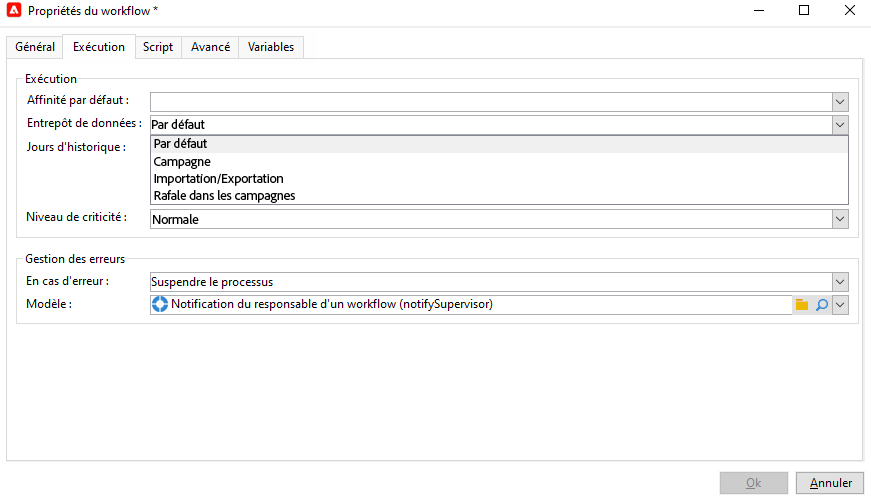
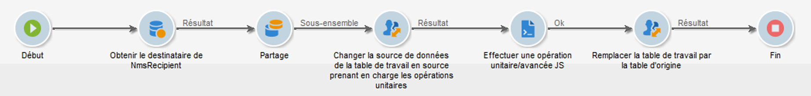

# Gestion et automatisation des processus

Configurez Campaign afin de tirer parti de ses puissantes fonctionnalités d&#39;automatisation des campagnes marketing.

Ce que vous pouvez configurer :

* Workflows
* Opérations récurrentes
* Cycle de validation de bout en bout
* Alertes
* Envoi automatique de rapports
* Événements déclenchés

## Conception et utilisation de workflows{#gs-ac-wf}

Utilisez les workflows d&#39;Adobe Campaign pour améliorer la vitesse et l&#39;échelle relatives à chaque aspect de vos campagnes marketing, de la création de segments à la préparation des messages, en passant par leur diffusion.

Découvrez comment concevoir des workflows dans ces [cas d&#39;utilisation complets](#end-to-end-uc).

Pour en savoir plus sur l&#39;interface utilisateur et l&#39;exécution des workflows, consultez la documentation de Campaign Classic v7 :

* [Prise en main des workflows](https://experienceleague.adobe.com/docs/campaign-classic/using/automating-with-workflows/introduction/about-workflows.html?lang=fr#automating-with-workflows){target=&quot;_blank&quot;}

* [Bonnes pratiques relatives aux workflows](https://experienceleague.adobe.com/docs/campaign-classic/using/automating-with-workflows/introduction/workflow-best-practices.html?lang=fr){target=&quot;_blank&quot;}

* [Workflows techniques natifs](https://experienceleague.adobe.com/docs/campaign-classic/using/automating-with-workflows/advanced-management/about-technical-workflows.html?lang=fr){target=&quot;_blank&quot;}

* [Surveillance de l’exécution des workflows](https://experienceleague.adobe.com/docs/campaign-classic/using/automating-with-workflows/monitoring-workflows/monitoring-workflow-execution.html?lang=fr){target=&quot;_blank&quot;}

* [Création d’une audience dans un workflow de campagne marketing](https://experienceleague.adobe.com/docs/campaign-classic/using/orchestrating-campaigns/orchestrate-campaigns/marketing-campaign-target.html?lang=fr#building-the-main-target-in-a-workflow){target=&quot;_blank&quot;}

## Activités de workflow {#wf-activities}

 En savoir plus sur les activités de workflow disponibles dans la [documentation de Campaign Classic v7](https://experienceleague.adobe.com/docs/campaign-classic/using/automating-with-workflows/introduction/about-activities.html?lang=fr){target=&quot;_blank&quot;}

Les activités de workflow sont regroupées par catégorie. Les quatre catégories d’activités disponibles sont les suivantes :

* [Activités de ciblage](https://experienceleague.adobe.com/docs/campaign-classic/using/automating-with-workflows/targeting-activities/about-targeting-activities.html?lang=fr){target=&quot;_blank&quot;} : requête, lecture de liste, enrichissement, union, etc.
* [Activités de contrôle du flux](https://experienceleague.adobe.com/docs/campaign-classic/using/automating-with-workflows/flow-control-activities/about-flow-control-activities.html?lang=fr){target=&quot;_blank&quot;} : planificateur, branchement, alerte, signal externe, etc.
* [Activités d&#39;action](https://experienceleague.adobe.com/docs/campaign-classic/using/automating-with-workflows/action-activities/about-action-activities.html?lang=fr){target=&quot;_blank&quot;} : diffusions cross-canal, code JavaScript, activités CRM, mise à jour d&#39;agrégat, etc.
* [Activités d&#39;événement](https://experienceleague.adobe.com/docs/campaign-classic/using/automating-with-workflows/action-activities/about-action-activities.html){target=&quot;_blank&quot;} : transfert de fichiers, téléchargement web, etc.

### Activité Modifier la source de données {#change-data-source-activity}

L&#39;activité **[!UICONTROL Modifier la source de données]** permet de modifier la source de données d&#39;un workflow **[!UICONTROL Table de travail]**. Vous bénéficiez ainsi d’une plus grande flexibilité pour gérer les données entre différentes sources de données, telles que FDA, FFDA et base de données locale.

La **[!UICONTROL table de travail]** permet au workflow Adobe Campaign de gérer les données et de partager les données avec les activités de workflow.
Par défaut, la **[!UICONTROL table de travail]** est créée dans la même base de données que la source des données sur lesquelles nous effectuons une requête.

Par exemple, lors de l’interrogation de la table **[!UICONTROL Profils]** stockée dans la base de données cloud, vous allez créer une **[!UICONTROL table de travail]** sur la même base de données cloud.
Pour modifier ce paramètre, vous pouvez ajouter l’activité **[!UICONTROL Modifier la source de données]** afin de choisir une autre source de données pour votre **[!UICONTROL table de travail]**.

Notez que lorsque vous utilisez l’activité **[!UICONTROL Modifier la source de données]**, vous devez revenir à la base de données cloud pour continuer l’exécution des workflows.

Pour utiliser l’activité **[!UICONTROL Modifier la source de données]** :

1. Créez un workflow.

1. Interrogez vos destinataires ciblés avec une activité **[!UICONTROL Requête]**.

   Pour plus d&#39;informations sur l&#39;activité **[!UICONTROL Requête]**, consultez la page [Requête](https://experienceleague.adobe.com/docs/campaign-classic/using/automating-with-workflows/targeting-activities/query.html?lang=fr#creating-a-query) de la documentation de Campaign Classic V7.

1. Dans l’onglet **[!UICONTROL Ciblage]**, ajoutez une activité **[!UICONTROL Modifier la source de données]** et double-cliquez dessus pour sélectionner **[!UICONTROL Source de données par défaut]**.

   La table de travail, qui contient le résultat de votre requête, est ensuite déplacée vers la base de données PostgreSQL par défaut.

1. Dans l’onglet **[!UICONTROL Actions]**, effectuez un glisser-déposer d’une activité **[!UICONTROL Code JavaScript]** pour réaliser des opérations unitaires sur la table de travail.

   Pour plus d&#39;informations sur l&#39;activité **[!UICONTROL Code JavaScript]**, consultez la page [Code JavaScript et Code JavaScript avancé](https://experienceleague.adobe.com/docs/campaign-classic/using/automating-with-workflows/action-activities/sql-code-and-javascript-code.html?lang=fr#javascript-code) de la documentation Campaign Classic V7.

1. Ajoutez une autre activité **[!UICONTROL Modifier la source de données]** pour revenir à la base de données cloud.

   Double-cliquez sur votre activité et sélectionnez **[!UICONTROL Compte externe FDA actif]** puis le compte externe correspondant.

1. Vous pouvez maintenant démarrer votre workflow.

## Gestion des entrepôts virtuels {#warehouse}

Après avoir créé votre workflow, vous pouvez accéder à d’autres options à l’aide de la **[!UICONTROL Propriétés]** pour effectuer d’autres paramétrages.

 En savoir plus sur **Propriétés du workflow** in [Documentation de Campaign Classic v7](https://experienceleague.adobe.com/docs/campaign-classic/using/automating-with-workflows/advanced-management/workflow-properties.html?lang=en){target=&quot;_blank&quot;}

Dans la **[!UICONTROL Exécution]** de votre workflow. **[!UICONTROL Propriétés]**, vous pouvez choisir de lier votre workflow à différents entrepôts et optimiser la gestion de votre charge de travail. Pour plus d’informations sur **Entrepôts**, reportez-vous à la section [Documentation du Snowflake](https://docs.snowflake.com/en/user-guide/warehouses-overview.html).

Selon l’objectif de votre workflow, vous pouvez choisir parmi les trois entrepôts suivants parmi les **[!UICONTROL Entrepôt]** menu déroulant :

* **[!UICONTROL Par défaut]** / **[!UICONTROL Campagne]**: défini par défaut lors de la création d’un nouveau workflow.

* **[!UICONTROL Importer/Exporter]**: doit être défini avec des workflows d’import ou d’export afin d’optimiser les performances de vos activités.

* **[!UICONTROL La campagne éclate]**: doit être défini avec les workflows de campagne ou de diffusions afin d’optimiser le temps de traitement de vos diffusions.

>[!NOTE]
>
>Le **[!UICONTROL Système]** L’entrepôt n’est défini que pour les workflows intégrés.

## Configuration de campagnes récurrentes

Concevez un workflow récurrent et créez une instance de diffusion à chaque exécution du workflow. Par exemple, si votre workflow est conçu pour s&#39;exécuter une fois par semaine, 52 diffusions seront créées en une année. Cela signifie également que les logs seront séparés par chaque instance de diffusion.

 Découvrez comment créer une campagne récurrente dans la [documentation de Campaign Classic v7](https://experienceleague.adobe.com/docs/campaign-classic/using/orchestrating-campaigns/orchestrate-campaigns/setting-up-marketing-campaigns.html?lang=fr#recurring-and-periodic-campaigns){target=&quot;_blank&quot;}

## Utilisation d&#39;événements trigger

Utilisez la messagerie transactionnelle de Campaign pour automatiser les messages générés à partir d&#39;événements déclenchés depuis des systèmes d&#39;information. Ces messages transactionnels peuvent notamment être une facture, une confirmation de commande, une confirmation d&#39;expédition, une modification de mot de passe, une notification d&#39;indisponibilité du produit, un relevé de compte ou la création d&#39;un compte sur un site web. Ces messages peuvent être envoyés individuellement ou par lots via e-mail, SMS ou notifications push.

 Pour en savoir plus sur les fonctionnalités des messages transactionnels,consultez [cette section](../send/transactional.md).

Connectez Adobe Campaign et Adobe Analytics pour récupérer les actions utilisateur et envoyer des messages personnalisés en temps quasi réel.

 Découvrez comment intégrer Campaign à d&#39;autres solutions dans [cette section](../start/connect.md).

## Cas d&#39;utilisation complets de workflow{#end-to-end-uc}

Cette section présente différents cas pratiques utilisant des fonctionnalités de workflows dans Campaign. Ces cas pratiques sont créés dans Adobe Campaign Classic v7 et s&#39;appliquent à Adobe Campaign v8.

### Diffusions {#deliveries}

* [Tests AB](https://experienceleague.adobe.com/docs/campaign-classic/using/sending-messages/a-b-testing/use-case/a-b-testing-use-case.html?lang=fr){target=&quot;_blank&quot;}

   Découvrez comment comparer deux contenus de diffusion e-mail via un workflow de ciblage. Le message et le texte sont identiques dans les deux diffusions : seule la mise en page change. La population ciblée est divisée en trois : deux groupes de test et la population restante. Une version différente de la diffusion est envoyée à chaque groupe de test.

* [Envoyer un e-mail d&#39;anniversaire](https://experienceleague.adobe.com/docs/campaign-classic/using/automating-with-workflows/use-cases/deliveries/sending-a-birthday-email.html?lang=fr){target=&quot;_blank&quot;}

   Ce cas pratique présente comment planifier l&#39;envoi d&#39;un e-mail récurrent à une liste de destinataires le jour de leur anniversaire.

* [Charger le contenu d&#39;une diffusion](https://experienceleague.adobe.com/docs/campaign-classic/using/automating-with-workflows/use-cases/deliveries/loading-delivery-content.html?lang=fr){target=&quot;_blank&quot;}
Lorsque le contenu de votre diffusion est disponible dans un fichier HTML qui se trouve sur un serveur distant, vous pouvez facilement charger ce contenu dans les diffusions Adobe Campaign.

* [Workflow de diffusion cross-canal](https://experienceleague.adobe.com/docs/campaign-classic/using/automating-with-workflows/use-cases/deliveries/cross-channel-delivery-workflow.html?lang=fr){target=&quot;_blank&quot;}

   Découvrez comment créer un workflow de diffusion cross-canal. L&#39;objectif est de segmenter une audience des destinataires de votre base de données en différents groupes et d&#39;envoyer un e-mail au premier groupe et un SMS à l&#39;autre.

* [Enrichissement des e-mails avec des champs de date personnalisés](https://experienceleague.adobe.com/docs/campaign-classic/using/automating-with-workflows/use-cases/deliveries/email-enrichment-with-custom-date-fields.html?lang=fr){target=&quot;_blank&quot;}

   Découvrez comment envoyer un e-mail avec des champs de données personnalisés aux profils qui célèbrent leur anniversaire ce mois-ci. L&#39;e-mail contiendra un coupon valide une semaine avant et après leur anniversaire.

* [Automatisation de la création, de l&#39;édition et de la publication de contenu](https://experienceleague.adobe.com/docs/campaign-classic/using/sending-messages/content-management/automating-via-workflows.html?lang=fr){target=&quot;_blank&quot;}

   Découvrez comment automatiser la création et la diffusion d&#39;un bloc de contenu avec le module complémentaire de gestion de contenu de Campaign.

### Surveillance {#monitoring}

* [Envoi d&#39;un rapport à une liste](https://experienceleague.adobe.com/docs/campaign-classic/using/automating-with-workflows/use-cases/monitoring/sending-a-report-to-a-list.html?lang=fr){target=&quot;_blank&quot;}

   Découvrez comment générer un rapport mensuel intégré des indicateurs de tracking au format PDF et l&#39;envoyer à une liste d&#39;opérateurs Campaign.

* [Supervision de vos workflows](https://experienceleague.adobe.com/docs/campaign-classic/using/automating-with-workflows/use-cases/monitoring/supervising-workflows.html?lang=fr){target=&quot;_blank&quot;}

   Découvrez comment créer un workflow qui vous permet de surveiller l&#39;état d&#39;un ensemble de workflows en pause, arrêtés ou en erreur.

* [Envoi d&#39;alertes personnalisées aux opérateurs](https://experienceleague.adobe.com/docs/campaign-classic/using/automating-with-workflows/use-cases/monitoring/sending-personalized-alerts-to-operators.html?lang=fr){target=&quot;_blank&quot;}

   Découvrez comment envoyer à un opérateur une alerte qui contiendra le nom des profils qui ont ouvert une newsletter, sans toutefois cliquer sur le lien qu&#39;elle contient.

### Gestion des données {#management}

* [Coordination des mises à jour de données](https://experienceleague.adobe.com/docs/campaign-classic/using/automating-with-workflows/use-cases/data-management/coordinating-data-updates.html?lang=fr){target=&quot;_blank&quot;}

   Découvrez comment vérifier que le processus de mise à jour est terminé avant d&#39;exécuter une autre opération de mise à jour. Pour ce faire, nous allons configurer une variable d&#39;instance et laisser le workflow tester si l&#39;instance est en cours d&#39;exécution afin de décider de continuer ou non l&#39;exécution du workflow et d&#39;effectuer la mise à jour.

* [Création d&#39;une liste récapitulative](https://experienceleague.adobe.com/docs/campaign-classic/using/automating-with-workflows/use-cases/data-management/creating-a-summary-list.html?lang=fr){target=&quot;_blank&quot;}

   Découvrez comment créer un workflow qui, après la collecte de fichiers et plusieurs enrichissements, permet de créer une liste récapitulative. L&#39;exemple est basé sur une liste de contacts qui ont effectué des achats dans un magasin.

* [Enrichissement des données](https://experienceleague.adobe.com/docs/campaign-classic/using/automating-with-workflows/use-cases/data-management/enriching-data.html?lang=fr){target=&quot;_blank&quot;}

   Découvrez comment envoyer des diffusions personnalisées aux profils ayant participé au dernier jeu-concours en fonction de leur score.

* [Utilisation d&#39;agrégats](https://experienceleague.adobe.com/docs/campaign-classic/using/automating-with-workflows/use-cases/data-management/using-aggregates.html?lang=fr){target=&quot;_blank&quot;}

   Découvrez comment identifier les derniers destinataires ajoutés à la base de données.

* [Mise à jour de la liste trimestrielle à l&#39;aide d&#39;une requête incrémentale](https://experienceleague.adobe.com/docs/campaign-classic/using/automating-with-workflows/use-cases/designing-queries/quarterly-list-update.html?lang=fr){target=&quot;_blank&quot;}

   Découvrez comment utiliser une requête incrémentale pour mettre automatiquement à jour une liste de destinataires.

* [Configuration d&#39;un workflow d&#39;import récurrent](https://experienceleague.adobe.com/docs/campaign-classic/using/automating-with-workflows/use-cases/data-management/recurring-import-workflow.html?lang=fr){target=&quot;_blank&quot;}

   Découvrez comment concevoir un workflow qui peut être réutilisé pour importer des profils en provenance d&#39;un CRM dans la base de données Adobe Campaign.

### Ciblage {#designing-queries}

* [Interrogation de la table des destinataires](https://experienceleague.adobe.com/docs/campaign-classic/using/automating-with-workflows/use-cases/designing-queries/querying-recipient-table.html?lang=fr){target=&quot;_blank&quot;}

   Découvrez comment récupérer les noms et les e-mails des destinataires dont le domaine d&#39;e-mail est &quot;orange.co.uk&quot; et qui ne vivent pas à Londres.

* [Informations sur la diffusion de requêtes](https://experienceleague.adobe.com/docs/campaign-classic/using/automating-with-workflows/use-cases/designing-queries/querying-delivery-information.html?lang=fr){target=&quot;_blank&quot;}

   Découvrez comment définir des requêtes sur les informations de diffusion pour récupérer le comportement du profil.

* [Calculer les agrégats](https://experienceleague.adobe.com/docs/campaign-classic/using/automating-with-workflows/use-cases/designing-queries/performing-aggregate-computing.html?lang=fr){target=&quot;_blank&quot;}

   Découvrez comment compter le nombre de profils vivant à Londres, en fonction du genre.

* [Requête avec une relation multiple-à-multiple](https://experienceleague.adobe.com/docs/campaign-classic/using/automating-with-workflows/use-cases/designing-queries/querying-using-many-to-many-relationship.html?lang=fr){target=&quot;_blank&quot;}

   Découvrez comment trouver des profils qui n&#39;ont pas été contactés au cours des 7 derniers jours.

* [Appeler une variable d&#39;instance dans une requête](https://experienceleague.adobe.com/docs/campaign-classic/using/automating-with-workflows/advanced-management/javascript-scripts-and-templates.html?lang=fr#example){target=&quot;_blank&quot;}

   Découvrez comment utiliser une variable d&#39;instance pour calculer dynamiquement le pourcentage de partage à appliquer à une population.

<!--
### Change data source activity {#data-source-uc}

The **[!UICONTROL Change data source]** activity allows you to change the data source of a workflow **[!UICONTROL Working table]**. 

In this use case, learn how to use the **[!UICONTROL Change data source]** activity to perform unitary operations to insert or update information to the recipient table.

1. Create a workflow and add a **[!UICONTROL Start]** activity.

1. Query your targeted recipients from the NmsRecipient table with a **[!UICONTROL Query]** activity. 

    For more information on the **[!UICONTROL Query]** activity, refer to the [Query](https://experienceleague.adobe.com/docs/campaign-classic/using/automating-with-workflows/targeting-activities/query.html#creating-a-query) page in Campaign Classic V7 documentation.

1. 

1. From the **[!UICONTROL Targeting]** tab, add a **[!UICONTROL Change data source]** activity and double-click it to select **[!UICONTROL Default data source]**.
    
    The working table, which contains the result of your query, is then moved to the default PostgreSQL database.

1. From the **[!UICONTROL Actions]** tab, drag and drop a **[!UICONTROL JavaScript code]** activity to perform unitary operations on the working table.

1. Add another **[!UICONTROL Change data source]** activity to revert back to the Cloud database. 
    
    Double-click your activity and select **[!UICONTROL Active FDA external account]** then the corresponding external account.

1. Add an **[!UICONTROL End]** activity and start your workflow.
-->

