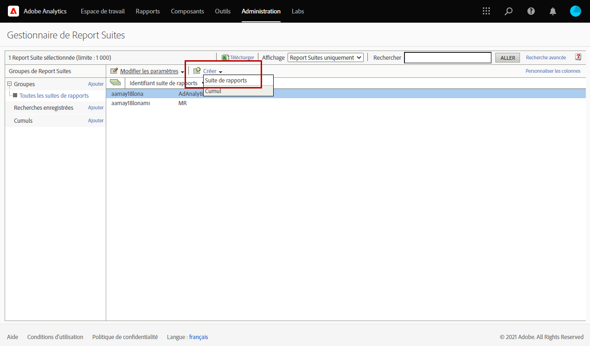

# Utilisation de Campaign et Adobe Analytics

Vous pouvez configurer Adobe Analytics pour intégrer Campaign et Analytics.

Cette intégration permet à Adobe Campaign et Adobe Analytics d’interagir par le biais du module complémentaire **Connecteurs Web Analytics**. Cette intégration envoie les indicateurs et les attributs des campagnes email diffusées par Adobe Campaign à Adobe Analytics.

[!DNL :speech_balloon:] En tant qu’utilisateur Cloud Services géré,  [contactez ](../start/campaign-faq.md#support) Adobe pour connecter Campaign aux services et solutions Adobe Experience Cloud. Adobe Identity Management Service (IMS) doit être mis en oeuvre pour votre instance. [En savoir plus](../start/connect.md#connect-ims). Le module complémentaire connecteur Web Analytics doit être installé sur votre environnement, via le package dédié.

Avec Adobe Analytics Connector, Adobe Campaign permet de mesurer l’audience Internet (Web Analytics). Les outils d’analyse Web permettent à Adobe Campaign de transférer des indicateurs et des attributs de campagne vers Analytics.

Le périmètre d’action de chaque outil est le suivant :

* **Adobe** Analytics marque les campagnes par e-mail lancées avec Adobe Campaign

* **Adobe** Campaign envoie les indicateurs et les attributs de campagne au connecteur, qui les transfère à son tour vers l&#39;outil d&#39;analyse Web.

>[!CAUTION]
>
>Adobe Analytics Connector n’est pas compatible avec les messages transactionnels (Message Center).

Pour configurer la connexion Campaign-Analytics, vous devez effectuer les opérations suivantes :

1. [Création de votre suite de rapports dans Adobe Analytics](#report-suite-analytics)
1. [Configuration des variables de conversion et des événements de succès](#configure-conversion-success)
1. [Configuration de votre compte externe dans Adobe Campaign](#external-account-ac)

## Créer votre suite de rapports Analytics {#report-suite-analytics}

Pour créer votre **[!UICONTROL suite de rapports]** dans [!DNL Adobe Analytics], procédez comme suit :

1. Dans [!DNL Adobe Analytics], sélectionnez l&#39;onglet **[!UICONTROL Admin]** puis cliquez sur **[!UICONTROL Tous les administrateurs]**.

   

1. Cliquez sur **[!UICONTROL Suites de rapports]**.

   

1. Sur la page **[!UICONTROL Gestionnaire de suites de rapports]**, cliquez sur **[!UICONTROL Créer]**, puis sur **[!UICONTROL Suite de rapports]**.

   Pour la procédure détaillée de création de **[!UICONTROL suite de rapports]**, consultez cette [section](https://experienceleague.adobe.com/docs/analytics/admin/manage-report-suites/new-report-suite/t-create-a-report-suite.html?lang=en#prerequisites).

   

1. Choisissez un modèle.

1. Configurez votre nouvelle suite de rapports avec les informations suivantes :

   * **[!UICONTROL Identifiant de suite de rapports]**
   * **[!UICONTROL Titre du site]**
   * **[!UICONTROL Fuseau horaire]**
   * **[!UICONTROL Date d’activation]**
   * **[!UICONTROL Estimation du nombre de pages vues par jour]**

   

1. Une fois configuré, cliquez sur **[!UICONTROL Créer une suite de rapports]**.

## Configuration des variables de conversion et des événements de succès {#configure-conversion-success}

Après avoir créé votre **[!UICONTROL suite de rapports]**, vous devez configurer vos **[!UICONTROL variables de conversion]** et **[!UICONTROL événements de succès]** comme suit :

1. Sélectionnez la **[!UICONTROL suite de rapports]** précédemment configurée.

1. À partir du bouton **[!UICONTROL Modifier les paramètres]**, sélectionnez **[!UICONTROL Conversion]** > **[!UICONTROL Variables de conversion]**.

   

1. Cliquez sur **[!UICONTROL Ajouter]** pour créer les identifiants nécessaires à la mesure de l&#39;impact de la campagne email, c&#39;est-à-dire le nom interne de la campagne (cid) et l&#39;identifiant de la table NmsBroadlog (bid).

   Pour savoir comment modifier les **[!UICONTROL variables de conversion]**, consultez cette [section](https://experienceleague.adobe.com/docs/analytics/admin/admin-tools/conversion-variables/t-conversion-variables-admin.html?lang=en#admin-tools).

   

1. Cliquez sur **[!UICONTROL Enregistrer]** lorsque vous avez terminé.

1. Ensuite, pour créer vos **[!UICONTROL Événements de succès]**, sélectionnez **[!UICONTROL Conversion]** > **[!UICONTROL Événements de succès]** à partir du bouton **[!UICONTROL Modifier les paramètres]**.

   

1. Cliquez sur **[!UICONTROL Ajouter]** pour configurer les **[!UICONTROL événements de succès]** suivants :

   * **[!UICONTROL Ont cliqué]**
   * **[!UICONTROL Ayant ouvert]**
   * **[!UICONTROL Clics des personnes]**
   * **[!UICONTROL Traités]**
   * **[!UICONTROL Différée]**
   * **[!UICONTROL Envoyés]**
   * **[!UICONTROL Rebonds au total]**
   * **[!UICONTROL Clics uniques]**
   * **[!UICONTROL Ouvertures uniques]**
   * **[!UICONTROL Désabonnement]**

   Pour savoir comment configurer les **[!UICONTROL événements de succès]**, reportez-vous à cette [section](https://experienceleague.adobe.com/docs/analytics/admin/admin-tools/success-events/t-success-events.html?lang=en#admin-tools)

   

1. Cliquez sur **[!UICONTROL Enregistrer]** lorsque vous avez terminé.

Une fois votre suite de rapports configurée, vous devez configurer les **[!UICONTROL comptes externes]** dans Adobe Campaign.

## Configuration de votre compte externe Campaign {#external-account-ac}

Vous devez maintenant configurer votre compte externe **[!UICONTROL Web Analytics]** dans Adobe Campaign pour activer la synchronisation entre les deux solutions.

Notez que si l’une de vos **[!UICONTROL suite de rapports]**, **[!UICONTROL variables de conversion]** ou **[!UICONTROL événements de succès]** n’est pas visible lors de la configuration de votre compte externe, cela signifie que vous ne disposez pas d’une autorisation pour ce nouveau composant dans le **[!UICONTROL profil de produit]** associé à l’utilisateur.

Pour plus d’informations à ce sujet, consultez la page [Profils de produit pour Adobe Analytics](https://experienceleague.adobe.com/docs/analytics/admin/admin-console/permissions/product-profile.html?lang=en#product-profile-admins) .

1. Accédez au dossier **[!UICONTROL Administration]** > **[!UICONTROL Plateforme]** > **[!UICONTROL Comptes externes]** de l’arborescence Adobe Campaign et cliquez sur **[!UICONTROL Nouveau]**.

   

1. Utilisez la liste déroulante pour sélectionner le type **[!UICONTROL Web Analytics]** et **[!UICONTROL Adobe Analytics]** dans la liste déroulante **[!UICONTROL Intégration]**.

   

1. Cliquez sur **[!UICONTROL Configurer]** en regard de la liste déroulante **[!UICONTROL Intégration]** .

1. Dans la fenêtre **[!UICONTROL Configurer l’intégration Analytics]** , associez votre compte externe à la suite de rapports créée précédemment en fournissant les informations suivantes :

   * **[!UICONTROL Email]**
   * **[!UICONTROL Org. IMS]**
   * **[!UICONTROL Société Analytics]**
   * **[!UICONTROL Suite de rapports]**

1. Dans la catégorie **[!UICONTROL eVars]** , mappez les deux **[!UICONTROL variables de conversion]** configurées dans [!DNL Adobe Analytics].

   

1. Dans la catégorie **[!UICONTROL Événements]**, mappez les dix **[!UICONTROL Événements de succès]** configurés dans [!DNL Adobe Analytics].

1. Cliquez sur **[!UICONTROL Envoyer]** lorsque vous avez terminé. Adobe Campaign va créer une **[!UICONTROL source de données]**, **[!UICONTROL mesures calculées]**, **[!UICONTROL segments de remarketing]** et **[!UICONTROL Classifications]** dans la **[!UICONTROL suite de rapports]** mappée.

   Une fois cette synchronisation entre [!DNL Adobe Analytics] et Adobe Campaign effectuée, vous pouvez fermer la fenêtre.

1. Les paramètres sont visibles à partir de l’onglet **[!UICONTROL Paramètres des données]** dans la fenêtre **[!UICONTROL Configurer l’intégration Analytics]**.

   À l’aide du bouton **[!UICONTROL Synchroniser]** , [!DNL Adobe Campaign] synchronise les modifications de nom effectuées dans [!DNL Adobe Analytics]. Si le composant est supprimé dans [!DNL Adobe Analytics], il est barré dans [!DNL Adobe Campaign] ou affiché avec un message **introuvable**.

   

1. Si nécessaire, vous pouvez ajouter ou supprimer des segments de l’onglet **[!UICONTROL Mettre à jour les segments]** .

1. Dans votre **[!UICONTROL Compte externe]**, cliquez sur **[!UICONTROL Enrichir la formule...]** lien permettant de modifier la formule de calcul des URL afin de spécifier les informations d&#39;intégration de l&#39;outil d&#39;analyse web (identifiants de campagne) et les domaines des sites dont l&#39;activité doit faire l&#39;objet d&#39;un tracking.

   

1. Indiquez le ou les noms de domaine des sites.

   

1. Cliquez sur **[!UICONTROL Suivant]** et vérifiez que les noms de domaines ont bien été enregistrés.

   

1. Au besoin, vous pouvez surcharger la formule de calcul. Pour cela, cochez la case et éditez la formule directement dans la fenêtre.

   >[!IMPORTANT]
   >
   >Ce mode de paramétrage est réservé à des utilisateurs experts : toute erreur dans cette formule peut entraîner l’arrêt des diffusions email.

1. L&#39;onglet **[!UICONTROL Avancé]** vous permet de modifier des paramètres plus techniques.

   * **[!UICONTROL Durée de vie]** : permet de définir un délai (en jours) après lequel les événements web récupérés dans Adobe Campaign par les workflows techniques. Par défaut : 180 jours.
   * **[!UICONTROL Persistance]** : permet de définir la période pendant laquelle tout événement web (un achat par exemple) peut être attribué à une opération de remarketing. Par défaut : 7 jours.

>[!NOTE]
>
>Si vous utilisez plusieurs outils de mesure d&#39;audience, vous pouvez sélectionner la valeur **[!UICONTROL Autre]** dans la liste déroulante **[!UICONTROL Partenaire]** lors de la création du compte externe. Un seul compte externe peut être référencé dans les propriétés des diffusions : vous devrez donc adapter la formule des URL trackées en ajoutant les paramètres attendus par Adobe ou tout autre outil de mesure utilisé.

## Workflow technique des processus d’analyse web {#technical-workflows-of-web-analytics-processes}

L&#39;échange de données entre Adobe Campaign et Adobe Analytics est géré par un workflow technique qui s&#39;exécute en tant que tâche en arrière-plan.

Ce workflow est disponible à partir de l&#39;arborescence de l&#39;Explorateur Campaign, sous le dossier **[!UICONTROL Administration]** > **[!UICONTROL Production]** > **[!UICONTROL Workflows techniques]** > **[!UICONTROL Processus d&#39;analyse Web]**.

Le workflow **[!UICONTROL Envoi des indicateurs et des attributs de campagne]** permet d&#39;envoyer les indicateurs des campagnes email via Adobe Campaign vers Adobe Experience Cloud à l&#39;aide d&#39;Adobe Analytics Connector. Ce workflow est déclenché à 4 heures du matin tous les jours et peut prendre 24 heures pour que les données soient envoyées à Analytics.

Veuillez noter que ce workflow ne devrait pas être redémarré. Dans le cas contraire, il renverrait toutes les données précédentes, ce qui peut fausser les résultats d’Analytics.

Les indicateurs concernés sont les suivants :

* **[!UICONTROL Messages à envoyer]** (@toDeliver)
* **[!UICONTROL Traités]** (@processed)
* **[!UICONTROL Succès]** (@success)
* **[!UICONTROL Nombre total d&#39;ouvertures]** (@totalRecipientOpen)
* **[!UICONTROL Destinataires ayant ouvert]** (@recipientOpen)
* **[!UICONTROL Nombre total de destinataires ayant cliqué]** (@totalRecipientClick)
* **[!UICONTROL Personnes ayant cliqué]** (@personClick)
* **[!UICONTROL Nombre de clics distincts]** (@recipientClick)
* **[!UICONTROL Désinscription (opt-out)]** (@optOut)
* **[!UICONTROL Erreurs]** (@error)

>[!NOTE]
>
>Les données envoyées correspondent au delta basé sur la dernière prise de photo, ce qui peut générer une valeur négative dans les données de mesure.

Les attributs envoyés sont les suivants :

* **[!UICONTROL Nom interne]** (@internalName)
* **[!UICONTROL Libellé]** (@label)
* **[!UICONTROL Libellé]** (operation/@label) : uniquement si le package **Campaign** est installé
* **[!UICONTROL Nature]** (operation/@nature) : uniquement si le package **Campaign** est installé
* **[!UICONTROL Tag 1]** (webAnalytics/@tag1)
* **[!UICONTROL Tag 2]** (webAnalytics/@tag2)
* **[!UICONTROL Tag 3]** (webAnalytics/@tag3)
* **[!UICONTROL Date de contact]** (scheduling/@contactDate)

## Suivi des diffusions {#tracking-deliveries-in-adobe-campaign}

Afin qu&#39;Adobe Experience Cloud puisse suivre l&#39;activité sur les sites après l&#39;envoi de diffusions par Adobe Campaign, il est nécessaire de référencer le connecteur correspondant dans les propriétés de la diffusion. Pour cela, procédez comme suit :

1. Ouvrez la diffusion de la campagne destinée à être trackée.

   

1. Ouvrez les propriétés de la diffusion.
1. Dans l’onglet **[!UICONTROL Web Analytics]**, sélectionnez le compte externe créé précédemment. Voir [Configuration de votre compte externe dans Adobe Campaign](#external-account-ac).

   

1. Vous pouvez maintenant envoyer votre diffusion et accéder au rapport correspondant dans Adobe Analytics.

**Rubriques connexes**

* [Campaign - Intégration des Triggers Experience Cloud](ac-triggers.md)
