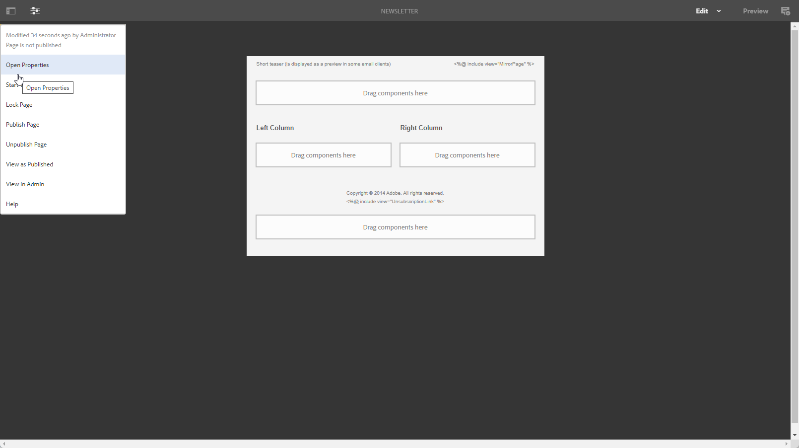

# Utilisation de Campaign et Adobe Experience Manager {#ac-aem}

L&#39;intégration entre Adobe Campaign et Adobe Experience Manager vous permet de gérer le contenu de vos diffusions email, ainsi que vos formulaires directement dans Adobe Experience Manager. Vous avez la possibilité d’importer **Adobe Experience Manager** contenu dans Campaign ou connectez-vous à **Adobe Experience Manager as a Cloud Service** , ce qui vous permet de modifier votre contenu directement dans l’interface Web.

 [Découvrez comment modifier votre contenu Adobe Experience Manager en tant que Cloud Service dans l’interface web de Campaign](https://experienceleague.adobe.com/docs/campaign-web/v8/msg/email/content/integrations/aem-content.html?lang=en)

 [En savoir plus sur Adobe Experience Manager dans ce document](https://experienceleague.adobe.com/docs/experience-manager-65/administering/integration/campaignonpremise.html?lang=fr#aem-and-adobe-campaign-integration-workflow)

## Création avec Adobe Experience Manager {#integrating-with-aem}

  En tant qu’utilisateur Managed Cloud Services, [contactez Adobe](../start/campaign-faq.md#support) pour intégrer Adobe Experience Manager à Campaign.

Cette intégration peut être utilisée, par exemple, pour créer une newsletter dans Adobe Experience Manager, qui sera ensuite utilisée dans le cadre d’une campagne e-mail dans Adobe Campaign.

**Depuis Adobe Experience Manager :**

1. Accédez à [!DNL Adobe Experience Manager] instance de création et cliquez sur Adobe l’expérience dans le coin supérieur gauche de la page. Choisir **[!UICONTROL Sites]** dans le menu.

   

1. Accès **[!UICONTROL Campagnes > Nom de votre marque (We.Shopping, dans le cas présent) > Zone principale > Email]**.

1. Cliquez sur **[!UICONTROL Créer]** et sélectionnez **[!UICONTROL Page]** dans le menu déroulant.

   

1. Sélectionnez la variable **[!UICONTROL Adobe Campaign Email]** modèle et nommez votre newsletter.

1. Après avoir créé votre page, accédez à la **[!UICONTROL Informations sur la page]** et cliquez sur **[!UICONTROL Ouvrir les propriétés]**.

   

1. Personnalisez votre contenu d&#39;email en ajoutant des composants, tels que des champs de personnalisation d&#39;Adobe Campaign. [En savoir plus](https://experienceleague.adobe.com/docs/experience-manager-65/content/sites/authoring/aem-adobe-campaign/campaign.html?lang=en#editing-email-content)

1. Une fois que votre email est prêt, accédez au **[!UICONTROL Informations sur la page]** et cliquez sur **[!UICONTROL Démarrer le workflow]**.

   

1. Dans la première liste déroulante, sélectionnez **[!UICONTROL Approuver Adobe Campaign]** en tant que modèle de processus et cliquez sur **[!UICONTROL Démarrer le workflow]**.

   

1. Une clause de non-responsabilité s’affiche en haut de la page et indique : `This page is subject to the workflow Approve for Adobe Campaign`. Cliquez sur **[!UICONTROL Terminer]** en regard de la clause de non-responsabilité pour confirmer la révision, puis cliquez sur **[!UICONTROL Ok]**.

1. Cliquez sur **[!UICONTROL Terminer]** puis sélectionnez **[!UICONTROL Validation de newsletter]** dans le **[!UICONTROL Étape suivante]** menu déroulant.

   

Votre newsletter est maintenant prête et synchronisée dans Adobe Campaign.

**Depuis Adobe Campaign :**

1. Dans l&#39;onglet **[!UICONTROL Campagnes]**, cliquez sur **[!UICONTROL Diffusions]** et sur **[!UICONTROL Créer]**.

1. Choisissez la **[!UICONTROL Diffusion email avec contenu AEM (mailAEMContent)]** du modèle **[!UICONTROL Modèle de diffusion]** menu déroulant.

   

1. Ajoutez un **[!UICONTROL Libellé]** à votre diffusion, puis cliquez sur **[!UICONTROL Continuer]**.

1. Cliquez sur **[!UICONTROL Synchroniser]** pour accéder à vos diffusions AEM.

   Si le bouton n’est pas visible dans votre interface, accédez à la **[!UICONTROL Propriétés]** et accéder au **[!UICONTROL Avancé]** . Assurez-vous que la variable **[!UICONTROL Mode d&#39;édition du contenu]** est configuré sur **[!UICONTROL AEM]** et saisissez les détails de votre instance AEM dans la variable **[!UICONTROL Compte AEM]** champ .

   

1. Sélectionnez la diffusion AEM précédemment créée dans [!DNL Adobe Experience Manager] et confirmer en cliquant sur **[!UICONTROL Ok]**.

1. Vous pouvez insérer directement des ressources à partir de votre [!DNL Adobe Experience Manager Assets] ou [!DNL Adobe Experience Manager Assets Library] lors de la modification d’un email dans Adobe Campaign. [En savoir plus](https://experienceleague.adobe.com/docs/experience-manager-cloud-service/assets/overview.html?lang=fr).

   Pour utiliser **Bibliothèque Adobe Experience Manager Assets**, accédez au **[!UICONTROL Propriétés]** de votre diffusion AEM et sélectionnez la variable **[!UICONTROL Avancé]** . Activez la variable **[!UICONTROL Utilisation au-dessus de l’instance AEM en tant que bibliothèque de ressources partagées]** .

   

1. Assurez-vous de cliquer sur le bouton **[!UICONTROL Actualiser le contenu]** chaque fois que des modifications sont apportées à votre diffusion AEM.

Votre email est maintenant prêt à être envoyé à votre audience.
