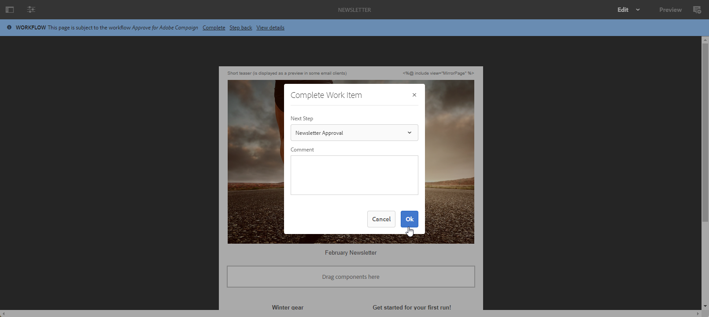

# Utiliser Campaign et Adobe Experience Manager {#ac-aem}

L&#39;intégration entre Adobe Campaign et Adobe Experience Manager vous permet de gérer le contenu de vos diffusions e-mail, ainsi que vos formulaires directement dans Adobe Experience Manager.

[Découvrez comment modifier votre contenu Adobe Experience Manager as a Cloud Service dans l’interface de Campaign Web](https://experienceleague.adobe.com/docs/campaign-web/v8/integrations/aem-content.html?lang=fr){target="_blank"}.

[En savoir plus sur Adobe Experience Manager dans ce document](https://experienceleague.adobe.com/docs/experience-manager-65/administering/integration/campaignonpremise.html?lang=fr#aem-and-adobe-campaign-integration-workflow){target="_blank"}.

>[!NOTE]
>
>En tant qu’utilisateur ou utilisatrice Managed Cloud Services, [contactez Adobe](../start/campaign-faq.md#support) pour intégrer Adobe Experience Manager à Campaign.

## Importer le contenu à partir d’Adobe Experience Manager {#integrating-with-aem}

Cette intégration peut être utilisée, par exemple, pour créer une newsletter dans Adobe Experience Manager, qui sera ensuite utilisée dans le cadre d’une campagne e-mail dans Adobe Campaign.

**Depuis Adobe Experience Manager :**

1. Accédez à l’instance de création [!DNL Adobe Experience Manager] et cliquez sur Adobe Experience dans le coin supérieur gauche de la page. Sélectionnez **[!UICONTROL Sites]** dans le menu.

   

1. Accédez à **[!UICONTROL Campagnes > Nom de votre marque (we.Shopping, dans le cas présent) > Zone principale > E-mail]**.

1. Cliquez sur **[!UICONTROL Créer]** et sélectionnez **[!UICONTROL Page]** dans le menu déroulant.

   

1. Sélectionnez le modèle **[!UICONTROL E-mail Adobe Campaign]** et nommez votre newsletter.

1. Une fois votre page créée, accédez au menu **[!UICONTROL Informations sur la page]**, puis cliquez sur **[!UICONTROL Ouvrir les propriétés]**.

   

1. Modifiez le contenu de votre e-mail en ajoutant des composants, par exemple des champs de personnalisation à partir d’Adobe Campaign. En savoir plus dans la [documentation d’Adobe Experience Manager](https://experienceleague.adobe.com/docs/experience-manager-65/content/sites/authoring/aem-adobe-campaign/campaign.html?lang=fr#editing-email-content){target="_blank"}.

1. Lorsque votre e-mail est prêt, accédez au menu **[!UICONTROL Informations sur la page]**, puis cliquez sur **[!UICONTROL Démarrer le workflow]**.

   

1. Dans la première liste déroulante, sélectionnez **[!UICONTROL Approuver Adobe Campaign]** en tant que modèle de workflow, puis cliquez sur **[!UICONTROL Démarrer le workflow]**.

   

1. Une clause de non-responsabilité s’affiche en haut de la page et indique : `This page is subject to the workflow Approve for Adobe Campaign`. Cliquez sur **[!UICONTROL Terminer]** en regard de la clause de non-responsabilité pour confirmer son examen, puis sélectionnez **[!UICONTROL OK]**.

1. Cliquez à nouveau sur **[!UICONTROL Terminé]**, puis sélectionnez **[!UICONTROL Approbation de la newsletter]** dans la liste déroulante **[!UICONTROL Étape suivante]**.

   

Votre newsletter est maintenant prête et synchronisée dans Adobe Campaign.

**Depuis Adobe Campaign :**

1. Dans l&#39;onglet **[!UICONTROL Campagnes]**, cliquez sur **[!UICONTROL Diffusions]** et sur **[!UICONTROL Créer]**.

1. Choisissez le modèle **[!UICONTROL Diffusion e-mail avec contenu AEM (mailAEMContent)]** dans le menu déroulant **[!UICONTROL Modèle de diffusion]**.

   

1. Ajoutez un **[!UICONTROL Libellé]** à votre diffusion, puis cliquez sur **[!UICONTROL Continuer]**.

1. Cliquez sur **[!UICONTROL Synchroniser]** pour accéder à vos diffusions AEM.

   Si le bouton n’est pas visible dans votre interface, accédez au bouton **[!UICONTROL Propriétés]** et sélectionnez l’onglet **[!UICONTROL Avancé]**. Assurez-vous que le champ **[!UICONTROL Mode de modification du contenu]** est configuré sur **[!UICONTROL AEM]** et saisissez les détails de votre instance AEM dans le champ **[!UICONTROL Compte AEM]**.

   

1. Sélectionnez la diffusion AEM précédemment créée dans [!DNL Adobe Experience Manager] et confirmez en cliquant sur **[!UICONTROL Ok]**.

   

1. Assurez-vous de cliquer sur le bouton **[!UICONTROL Actualiser le contenu]** chaque fois que des modifications sont apportées à votre diffusion AEM.

   

1. Pour supprimer la connexion entre Experience Manager et Campaign, cliquez sur **[!UICONTROL Désynchroniser]**.

Votre e-mail est maintenant prêt à être envoyé à votre audience.

## Importer des ressources à partir de la bibliothèque Adobe Experience Manager Assets {#assets-library}

En outre, vous pouvez directement insérer des ressources provenant de votre [!DNL Adobe Experience Manager Assets Library] tout en modifiant un e-mail ou une page de destination dans Adobe Campaign. Cette fonctionnalité est présentée dans la [documentation d’Adobe Experience Manager Assets](https://experienceleague.adobe.com/docs/experience-manager-65/content/assets/managing/manage-assets.html?lang=fr){target="_blank"}.

**Depuis Adobe Experience Manager :**

1. Accédez à l’instance de création [!DNL Adobe Experience Manager] et cliquez sur Adobe Experience dans le coin supérieur gauche de la page. Sélectionnez **[!UICONTROL Ressources]** `>` **[!UICONTROL Fichiers]** dans le menu.

   

1. Cliquez sur **Créer**, puis sur **Fichiers** pour importer votre ressource dans la **Bibliothèque Adobe Experience Manager Assets**. En savoir plus dans la [documentation d’Adobe Experience Manager](https://experienceleague.adobe.com/docs/experience-manager-65/content/assets/managing/manage-assets.html?lang=fr#uploading-assets){target="_blank"}.

   

1. Si nécessaire, renommez votre ressource en sélectionnant **Charger**.

Votre ressource est maintenant chargée dans votre **bibliothèque Adobe Experience Manager Assets**.

**Depuis Adobe Campaign :**

1. Dans Adobe Campaign, créez une nouvelle diffusion en accédant à l’onglet **Campagnes**, cliquez sur **Diffusions**, puis sur le bouton **Créer** au-dessus de la liste des diffusions existantes.

   

1. Sélectionnez un **modèle de diffusion** et nommez votre diffusion.

1. Définissez et personnalisez le contenu du message. [En savoir plus](../send/email.md)

1. Pour utiliser la **bibliothèque Adobe Experience Manager Assets**, accédez aux **[!UICONTROL Propriétés]** de votre diffusion AEM et sélectionnez l’onglet **[!UICONTROL Avancé]**.

   Choisissez votre **compte AEM** et activez l’option **[!UICONTROL Utiliser l’instance AEM ci-dessus en tant que bibliothèque de ressources partagées]**.

   

1. Dans l’icône **Image**, accédez au menu **[!UICONTROL Sélectionner une ressource partagée]**.

   

1. Dans la fenêtre de sélection, sélectionnez une image dans votre **bibliothèque Adobe Experience Manager Assets**, puis choisissez **Sélectionner**.

   

Votre ressource est maintenant chargée dans votre diffusion par e-mail. Vous pouvez maintenant spécifier l’audience cible, confirmer la diffusion et poursuivre l’envoi.
