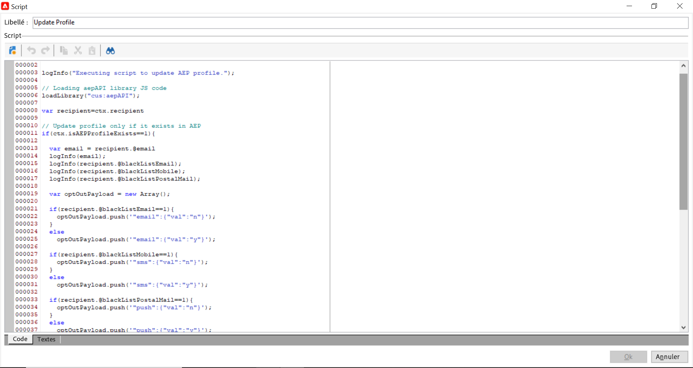

# Mise à jour de profils Adobe Experience Platform à partir de landing pages Adobe Campaign

L’intégration entre Adobe Campaign et Adobe Experience Platform vous permet de synchroniser facilement les données entre vos landing pages Adobe Campaign et Adobe Experience Platform. Avec cette intégration, vous pouvez effectuer les actions suivantes :

* Récupérer les attributs de profil Adobe Experience Platform pour afficher les informations mises à jour dans les landing pages Adobe Campaign,
* Envoyez à Adobe Experience Platform les attributs de profil mis à jour afin de mettre à jour les attributs correspondants en fonction de ce qui a été renseigné et envoyé dans les landing pages.

Les principales étapes de configuration de cette intégration sont les suivantes :

<table>
<tr>
<td><p><a href="#oauth">Configuration d’une connexion OAuth</a></p></td>
<td><p><a href="#source">Création d’une connexion source d’API HTTP</a></p></td>
<td><p><a href="#xtk">Ajout d’options d’authentification dans Campaign</a></p></td>
<td><p><a href="#javascript">Ajout de codes JavaScript dans Campaign</a></p></td>
<td><p><a href="#script">Configuration du workflow de landing page</a></p></td>
</table>

## Configuration d’une connexion Oauth {#oauth}

Les API Adobe Cloud Platform utilisent le protocole OAuth 2.0 pour l’authentification et l’autorisation. Pour connecter Adobe Experience Platform à Adobe Campaign à l’aide d’appels API, vous devez générer un jeton d’accès à l’aide de l’intégration OAuth créée dans la console Adobe Developer.

Pour ce faire, procédez comme suit :

1. Accédez à la console Adobe Developer.
1. Créez une nouvelle connexion API à l’aide du produit API Adobe Experience Platform. Les étapes détaillées pour obtenir un jeton d’accès OAuth 2.0 sont disponibles dans la section [Documentation de la console Adobe Developer](https://developer.adobe.com/developer-console/docs/guides/authentication/Tools/OAuthPlayground/).
1. Une fois la connexion créée, accédez à la **[!UICONTROL OAuth serveur à serveur]** et copiez les détails ci-dessous, qui sont requis dans Campaign pour l&#39;authentification :

   * ID CLIENT
   * SECRET CLIENT
   * ID D’ORGANISATION

   {width="70%"}

Maintenant que votre connexion Oauth est configurée, créez et configurez une nouvelle **[!UICONTROL API HTTP]** Connexion source pour lier Adobe Campaign à Adobe Experience Platform.

## Création d’une connexion source d’API HTTP {#source}

Une fois la connexion OAuth en place, l’étape suivante consiste à créer une **[!UICONTROL API HTTP]** Connexion source dans Adobe Experience Platform. Cette connexion vous permet de diffuser des données vers Adobe Experience Platform à l’aide d’API. Procédez comme suit :

1. Accès à Adobe Experience Platform **[!UICONTROL Sources]**, recherchez la variable **[!UICONTROL API HTTP]** source, puis cliquez sur **[!UICONTROL Ajouter des données]**.

   {width="70%"}

1. Configurez la connexion selon vos besoins. Des informations détaillées sur la configuration d’une connexion API HTTP sont disponibles dans la section [Documentation sur les sources Adobe Experience Platform](https://experienceleague.adobe.com/docs/experience-platform/sources/ui-tutorials/create/streaming/http.html).

   À l’emplacement **[!UICONTROL Authentification]** , basculez sur l’option **[!UICONTROL Activation de l’authentification]** pour vous authentifier à l’aide du jeton d’accès généré précédemment par le biais de l’intégration OAuth.

   {width="70%"}

1. Une fois la connexion source configurée, le point de terminaison de diffusion en continu s’affiche. Ce point de terminaison est requis pour ingérer des données dans Adobe Experience Platform.

   {width="70%"}

   Vous pouvez également accéder à un exemple du format de données ingéré dans Adobe Experience Platform en ouvrant le nouveau flux de données créé à partir de l’ **[!UICONTROL Flux de données]** .

   {width="70%"}

Maintenant que la connexion à la source de l’API HTTP est configurée, vous devez ajouter des options spécifiques à Adobe Campaign pour activer la connexion à Adobe Experience Platform.

## Ajout d’options d’authentification dans Adobe Campaign {#xtk}

Une fois la connexion à la source de l’API HTTP configurée, vous devez ajouter des options spécifiques à Adobe Campaign pour activer la connexion à Adobe Experience Platform. Vous pouvez le faire dans le menu Administration de campagnes ou lors de l’exécution du workflow de la landing page en ajoutant un **[!UICONTROL Code JavaScript]** activité.

Parcourez les onglets ci-dessous pour découvrir les deux méthodes :

>[!BEGINTABS]

>[!TAB Ajout d’options dans le menu Administration]

1. Accédez au **[!UICONTROL Administration]** > **[!UICONTROL Plateforme]** > **[!UICONTROL Options]**  .
1. Ajoutez les options suivantes avec les valeurs correspondantes dans la console Adobe Developer :

   * IMS_CLIENT_ID = cryptString(CLIENT ID)
   * IMS_CLIENT_SECRET = cryptString(CLIENT SECRET)
   * IMS_ORG_ID = ORGANIZID
   * IMS_CLIENT_API_KEY = cryptString(CLIENT ID)

   {width="70%"}

   >[!NOTE]
   >
   >La fonction cryptString() est utilisée pour chiffrer vos données d’authentification.

>[!TAB Ajouter des options à l&#39;aide d&#39;une activité Code JavaScript]

Pour configurer automatiquement ces options lors de l’exécution de votre workflow de landing pages, ajoutez une **[!UICONTROL Code JavaScript]** à votre workflow avec le code ci-dessous. [Découvrez comment configurer une activité Code JavaScript](https://experienceleague.adobe.com/docs/campaign/automation/workflows/wf-activities/action-activities/sql-code-and-JavaScript-code.html#JavaScript-code).

Lors de l&#39;exécution du workflow, les options sont automatiquement créées dans la console Campaign avec les valeurs fournies.

    &quot;
    loadLibrary(&quot;xtk:shared/nl.js&quot;);
    loadLibrary(&quot;xtk:shared/xtk.js&quot;);
    loadLibrary(&quot;xtk:shared/json2.js&quot;);
    loadLibrary(&quot;xtk:common.js&quot;);
    
    function setAuthCredentials()
    {
    setOption(&quot;IMS_CLIENT_ID&quot;, cryptString(&#39;CLIENT ID&#39;));
    setOption(&quot;IMS_CLIENT_SECRET&quot;, cryptString(&#39;CLIENT SECRET&#39;));
    setOption(&quot;IMS_ORG_ID&quot;, cryptString(&#39;ORGANIZATION ID&#39;));
    setOption(&quot;IMS_CLIENT_API_KEY&quot;, cryptString(&#39;CLIENT ID&#39;));
    }
    &quot;

>[!ENDTABS]

Maintenant que les options d’authentification sont configurées dans Campaign, vous devez créer des codes JavaScript personnalisés pour permettre la synchronisation des données entre Campaign et Adobe Experience Platform depuis votre page d’entrée.

## Ajout d’options à l’exécution du workflow {#javacript}

Pour permettre la synchronisation des données entre les landing pages et Adobe Experience Platform, des codes JavaScript personnalisés doivent être ajoutés à Adobe Campaign. Procédez comme suit :

1. Accédez au **[!UICONTROL Administration]** > **[!UICONTROL Configuration]** > **[!UICONTROL Codes JavaScript]** .
1. Créez de nouveaux codes JavaScript et copiez-collez les fragments de code ci-dessous.

   >[!NOTE]
   >
   >Le jeton d’accès et les données d’authentification sont automatiquement récupérés à partir des options configurées précédemment.

   {width="70%"}

+++  Script 1 - Chargement des attributs de profil de l’Experience Platform

   Ce code vérifie si le profil existe dans Adobe Experience Platform avant de charger la landing page. Il récupère les attributs de profil et les affiche dans les champs correspondants de la landing page.

   ```
   // API implementation to read profile from AEP
   function getProfileInfo(email)
   {
   var accessToken = getAccessToken();
   var request = new HttpClientRequest(('https://platform-stage.adobe.io/data/core/ups/access/entities?schema.name=_xdm.context.profile&entityId=' + email + '&entityIdNS=email&fields=identities,consents.marketing'));
   request.method = 'GET';
   request.header["Content-Type"] = "application/json";
   request.header["sandbox-name"] = "prod";
   request.header["x-gw-ims-org-id"] = getOption('IMS_ORG_ID');
   request.header["x-api-key"] = getOption('IMS_CLIENT_API_KEY');
   request.header["Authorization"] = "Bearer " + accessToken;
   request.execute();
   return request.response;
   }
   ```

+++

+++ Script 2 - Mise à jour des attributs de profil Experience Platform

   Ce code met à jour les attributs de profil dans Adobe Experience Platform avec les valeurs envoyées dans la page d’entrée.

   ```
   // API implementation to update profile in AEP
   loadLibrary("xtk:shared/nl.js");
   loadLibrary("xtk:shared/xtk.js");
   loadLibrary("xtk:shared/json2.js");
   loadLibrary("xtk:common.js");
   
   function updateProfileInAEP(profileUpdatePayload)
   {
   var accessToken = getAccessToken();
   var request = new HttpClientRequest('https://dcs-stg.adobedc.net/collection/64a300b84d61c0bcea4f0cd4ecaaa224a19477026d14f7e08b5408ffaf5e6162?syncValidation=false');
   request.method = 'POST';
   request.header["Content-Type"] = "application/json";
   request.header["sandbox-name"] = "prod";
   request.header["Authorization"] = "Bearer " + accessToken;
   var body = '{"header":{"schemaRef":{"id":"https://ns.adobe.com/campdev/schemas/35d8e567772e1a1093ed6cf9e41d2c1fec22eeb3a89583e1","contentType":"application/vnd.adobe.xed-full+json;version=1.0"},"imsOrgId":"A1F66F0D5C47D1950A494133@AdobeOrg","datasetId":"63c7fa2a20cce11b98cccb41","source":{"name":"testHTTPSourcesVinay - 03/06/2023 5:43 PM"}},"body":{"xdmMeta":{"schemaRef":{"id":"https://ns.adobe.com/campdev/schemas/35d8e567772e1a1093ed6cf9e41d2c1fec22eeb3a89583e1","contentType":"application/vnd.adobe.xed-full+json;version=1.0"}},"xdmEntity":' + profileUpdatePayload +'}}';
   request.body = body;
   request.execute();
   return request.response;
   }
   
   
   // Get Access token from OAuth-Server-to-server API call
   function getAccessToken() {
   var clientId = decryptString(getOption('IMS_CLIENT_ID'));
   var clientSecret = decryptString(getOption('IMS_CLIENT_SECRET'));
   var request = new HttpClientRequest(('https://ims-na1-stg1.adobelogin.com/ims/token/v2?grant_type=client_credentials' + '&client_id=' + clientId + '&client_secret=' + clientSecret + '&scope=openid,session,AdobeID,read_organizations,additional_info.projectedProductContext'));
   request.method = 'POST';
   request.execute();
   var response = request.response;
   if(response.code != 200){
   logError('GetAccessToken failed,', response.code, response.body);
   return;
   }
   var body = ''+response.body;
   var parsedResponse = JSON.parse(body);
   var accessToken = parsedResponse.access_token;
   logInfo("Access token generated successfully");
   return accessToken;
   }
   ```

+++

Maintenant que les codes JavaScript personnalisés sont créés dans Adobe Campaign, vous pouvez configurer le workflow contenant votre landing page afin d&#39;utiliser ces codes JavaScript pour la synchronisation des données.

## Configuration du workflow de landing page {#script}

Les codes JavaScript étant ajoutés à Adobe Campaign, vous pouvez les exploiter dans votre workflow de page d’entrée à l’aide de la fonction **[!UICONTROL Code JavaScript]** activités :

* Pour charger des données à partir d’un Experience Platform avant de charger la landing page, ajoutez une **[!UICONTROL Code JavaScript]** activité avant l’activité de page d’entrée et copiez-collez le script 1.

+++ Script 1 - Chargement des attributs de profil de l’Experience Platform

  ```
  // Script code to read profile from AEP.
  
  logInfo("Loading profile from AEP");
  loadLibrary("cus:aepAPI");
  var recipient=ctx.recipient;
  var email = recipient.@email;
  var response = getProfileInfo(email);
  ctx.isAEPProfileExists = 1;
  
  if(response.code == 404){
  ctx.isAEPProfileExists = 0
  logInfo("Profile with email" + email + " not found in AEP, ignoring the update activity");
  }
  else if(response.code == 200){
  var body = ''+response.body;
  var parsedResponse = JSON.parse(body);
  for (var key in parsedResponse) {
      var value =  parsedResponse[key];
      var marketing = value.entity.consents.marketing;
      logInfo("User Consent Details : " + JSON.stringify(marketing));   
      if(marketing.hasOwnProperty('email')&&marketing.email.hasOwnProperty('val')&&marketing.email.val=='n'){
      ctx.recipient.@blackListEmail = 1;
      }
      if(marketing.hasOwnProperty('sms')&&marketing.sms.hasOwnProperty('val')&&marketing.sms.val=='n'){
      ctx.recipient.@blackListMobile = 1;
      }
      if(marketing.hasOwnProperty('push')&&marketing.push.hasOwnProperty('val')&&marketing.push.val=='n'){
      ctx.recipient.@blackListPostalMail = 1;
      }
  } 
  }
  ```

+++

* Pour mettre à jour les attributs de profil Experience Platform avec les données envoyées dans la page d’entrée, ajoutez une **[!UICONTROL Code JavaScript]** activité après l’activité de page d’entrée et copier-coller le script 2.

+++ Script 2 - Mise à jour des attributs de profil Experience Platform

  ```
  // Script code to update profile in AEP and ACC.
  
  logInfo("Executing script to update AEP profile.");
  
  // Loading aepAPI library JS code
  loadLibrary("cus:aepAPI");
  
  var recipient=ctx.recipient
  
  // Update profile only if it exists in AEP
  if(ctx.isAEPProfileExists==1){
  
  var email = recipient.@email
  logInfo(email);
  logInfo(recipient.@blackListEmail);
  logInfo(recipient.@blackListMobile);
  logInfo(recipient.@blackListPostalMail);
  
  var optOutPayload = new Array();
  
  if(recipient.@blackListEmail==1){
      optOutPayload.push('"email":{"val":"n"}');
  }
  else
      optOutPayload.push('"email":{"val":"y"}');
  
  if(recipient.@blackListMobile==1){
      optOutPayload.push('"sms":{"val":"n"}');
  }
  else
      optOutPayload.push('"sms":{"val":"y"}');
  
  if(recipient.@blackListPostalMail==1){
      optOutPayload.push('"push":{"val":"n"}');
  }
  else
      optOutPayload.push('"push":{"val":"y"}');
  
  var profileUpdatePayload = '{'+ '"personalEmail":{"address":' + '\"' + email + '\"' + '},' +'"consents":{"marketing":{' + optOutPayload.toString() + '}}}';
  
  var response = updateProfileInAEP(profileUpdatePayload);
  if(response.code == 200){
  var body = '' + response.body;
  logInfo("AEP Profile Updated successfully, Response " + body);
  // Update ACC profile 
  recipient.@xtkschema = "nms:recipient";
  recipient.@_operation = "update";
  recipient.@_key="@id";
  xtk.session.Write(recipient);
  logInfo("ACC Profile Updated successfully");
  }
  else{
      logError('Server Error: ', response.code, response.body);
  } 
  }
  else {
  logInfo("Ignoring AEP profile update as profile doesn't exists.");
  
  // Update ACC profile   
  recipient.@xtkschema = "nms:recipient";
  recipient.@_operation = "update";
  recipient.@_key="@id";  
  xtk.session.Write(recipient);
  logInfo("ACC Profile Updated successfully");
  }
  ```

+++

>[!CAUTION]
>
>Veillez à personnaliser la charge utile dans chaque script en fonction de vos besoins spécifiques.
>
>Si vous n&#39;ajoutez aucun script avant l&#39;activité de landing page, aucune vérification de l&#39;existence du profil ne sera effectuée dans Adobe Experience Platform. Lorsque la landing page est envoyée et que le profil n&#39;existe pas, il est créé dans Adobe Experience Platform avec les attributs de la landing page.

Voici un exemple de workflow utilisant les activités de code JavaScript avant et après une landing page :

{width="70%"}

Voici un exemple d’une landing page et d’une activité de code JavaScript configurée pour mettre à jour les attributs de profil dans Adobe Experience Platform :

{width="70%"}

{width="70%" zoomable="yes"}

### Informations supplémentaires

* [Configurer une activité Code JavaScript](../../automation/workflow/sql-code-and-javascript-code.md#javascript-code)
* [Création d’une landing page ;](https://experienceleague.adobe.com/docs/campaign-classic/using/designing-content/editing-html-content/creating-a-landing-page.html)
* [Gestion des abonnements et des désabonnements](../start/subscriptions.md)
