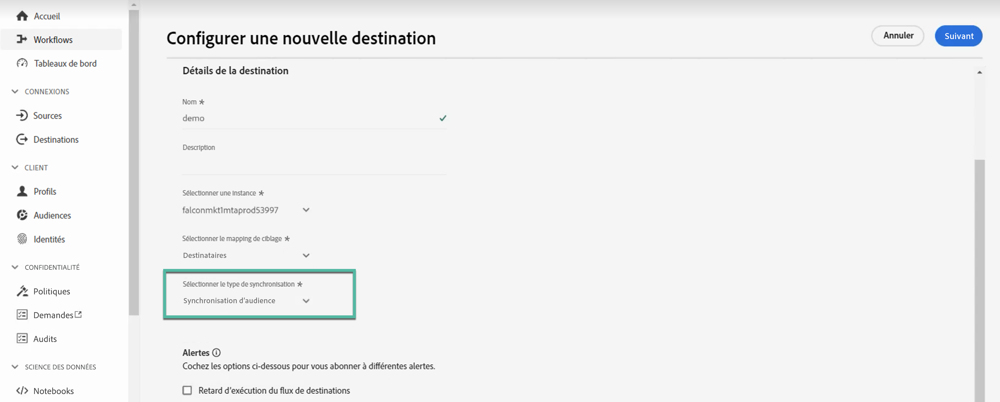
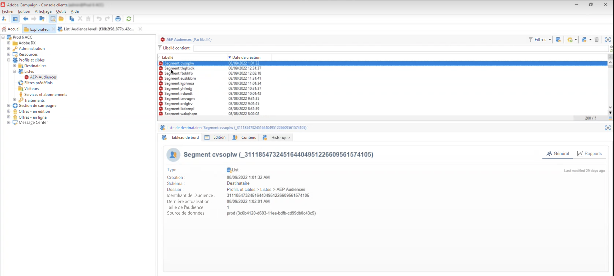
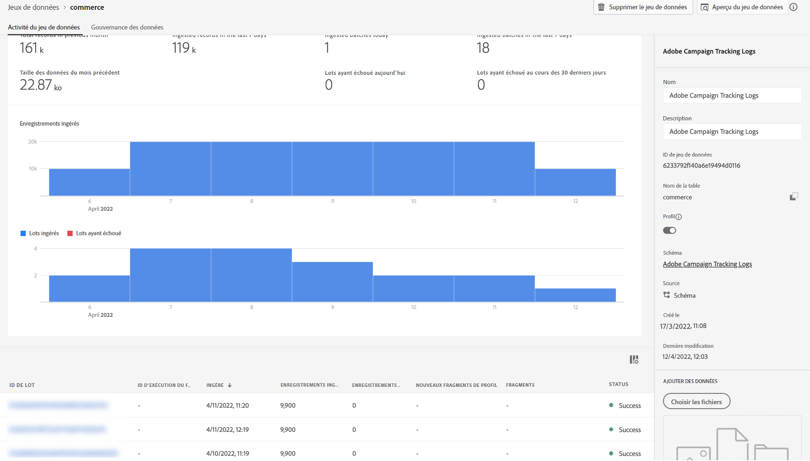
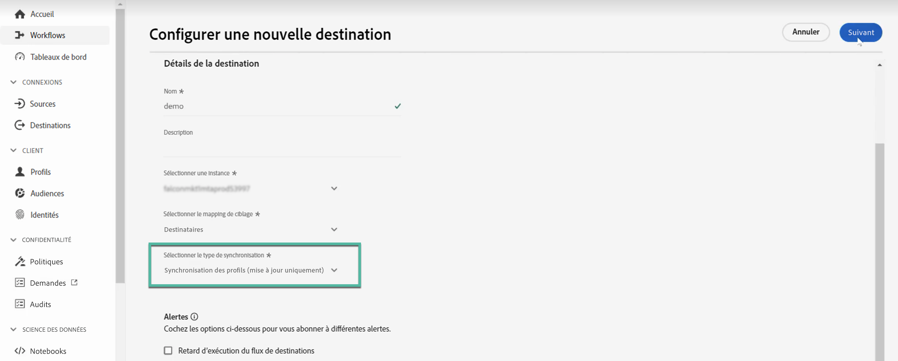

# Utiliser Campaign et Adobe Experience Platform

La destination et les connecteurs source d’Adobe Campaign Managed Cloud Services permettent une intégration transparente entre Adobe Campaign et Adobe Experience Platform. Avec cette intégration, vous pouvez :

* Envoyez des audiences Adobe Experience Platform vers Adobe Campaign, puis renvoyez les logs de diffusion et de suivi vers Adobe Experience Platform à des fins d’analyse,
* Importation des attributs de profil Adobe Experience Platform dans Adobe Campaign et mise en place d’un processus de synchronisation afin qu’ils puissent être mis à jour régulièrement.

## Envoyer des audiences Adobe Experience Platform à Campaign {#audiences}

Les principales étapes pour envoyer des audiences Adobe Experience Platform à Adobe Campaign et renvoyer les logs de diffusion et de tracking sont les suivantes :

* Utilisation d’un Adobe Campaign Managed Cloud Services **Connexion destination** pour envoyer des segments Experience Platform à Adobe Campaign :

   1. Accédez au catalogue des destinations Adobe Experience Platform et créez une nouvelle **[!UICONTROL Adobe Campaign Managed Cloud Services]** connexion.
   1. Fournissez des détails sur l’instance Campaign à utiliser et sélectionnez **[!UICONTROL Synchronisation de l’audience]** comme type de synchronisation.

      {width="800" align="center"}

   1. Sélectionnez les segments à envoyer à Adobe Campaign.
   1. Configurez les attributs que vous souhaitez exporter dans l’audience.
   1. Une fois le flux configuré, les audiences sélectionnées seront disponibles pour activation dans Adobe Campaign.

      {width="800" align="center"}

  Vous trouverez des informations détaillées sur la configuration de la destination dans la section [Documentation sur la connexion Adobe Campaign Managed Cloud Services](https://www.adobe.com/go/destinations-adobe-campaign-managed-cloud-services-en){target="_blank"}

* Utilisez une **connexion source** Adobe Campaign Managed Cloud Services pour envoyer les logs de diffusion et de tracking Adobe Campaign à Adobe Experience Platform :

  Pour ce faire, configurez une nouvelle **connexion source** Adobe Campaign Managed Cloud Services pour ingérer des événements Campaign dans Adobe Experience Platform. Fournissez des détails sur l’instance Campaign et le schéma à utiliser, sélectionnez un jeu de données où les données doivent être ingérées, puis configurez les champs à récupérer. [Découvrez comment créer une connexion source Adobe Campaign Managed Cloud Services](https://www.adobe.com/go/sources-campaign-ui-en)

  {width="800" align="center"}

## Synchronisation des attributs de profil entre Adobe Experience Platform et Adobe Campaign {#profile}

En connectant Adobe Campaign à Adobe Experience Platform, vous pouvez importer des attributs de profil supplémentaires liés à un profil sur Adobe Experience Platform et avoir un processus de synchronisation en place afin qu’ils soient mis à jour dans la base de données Adobe Campaign.

Supposons, par exemple, que vous capturiez des valeurs d’inclusion et d’exclusion dans Adobe Experience Platform. Avec cette connexion, vous pouvez importer ces valeurs dans Adobe Campaign et mettre en place un processus de synchronisation afin qu’elles soient mises à jour régulièrement.

>[!NOTE]
>
>La synchronisation des attributs de profil est disponible pour les profils déjà présents dans la base de données Adobe Campaign.

Les principales étapes de synchronisation des attributs de profil Adobe Experience Platform avec Adobe Campaign sont les suivantes :

1. Accédez au catalogue des destinations Adobe Experience Platform et créez une nouvelle **[!UICONTROL Adobe Campaign Managed Cloud Services]** connexion.
1. Fournissez des détails sur l’instance Campaign à utiliser et sélectionnez **[!UICONTROL Synchronisation des profils (mise à jour uniquement)]** comme type de synchronisation.

   {width="800" align="center"}

1. Sélectionnez les segments ciblant les profils à mettre à jour dans la base de données Adobe Campaign.
1. Configurez les attributs de profil que vous souhaitez mettre à jour dans Adobe Campaign.
1. Une fois le flux configuré, les attributs de profil sélectionnés seront synchronisés avec Adobe Campaign et mis à jour pour tous les profils ciblés par les segments configurés dans la destination.

Vous trouverez des informations détaillées sur la configuration de la destination dans la section [Documentation sur la connexion Adobe Campaign Managed Cloud Services](https://www.adobe.com/go/destinations-adobe-campaign-managed-cloud-services-en){target="_blank"}