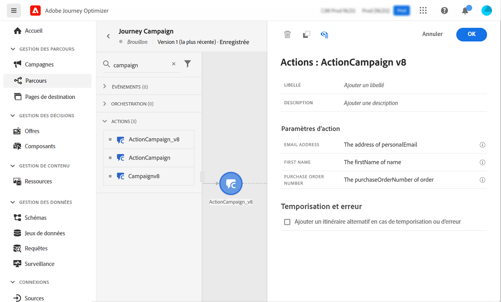

# Utiliser Campaign et Adobe Journey Optimizer

L’intégration entre Adobe Campaign et Adobe Journey Optimizer vous permet d’orchestrer des parcours client dans Adobe Journey Optimizer et d’envoyer des e-mails, des notifications push et/ou des SMS à l’aide des fonctionnalités de messagerie transactionnelle Adobe Campaign.

Les étapes de base consistent à créer un modèle de message transactionnel dans Campaign, puis à créer l’événement, l’action et la conception du parcours dans Adobe Journey Optimizer.

 [Découvrez cette intégration dans cet exemple complet](https://experienceleague.adobe.com/docs/journey-optimizer/using/orchestrate-journeys/about-journey-building/using-adobe-campaign-classic.html?lang=fr){target="_blank"}.

 [En savoir plus dans la documentation Journey Optimizer](https://experienceleague.adobe.com/docs/journey-optimizer/using/orchestrate-journeys/about-journey-building/using-adobe-campaign-classic.html?lang=fr){target="_blank"}.
