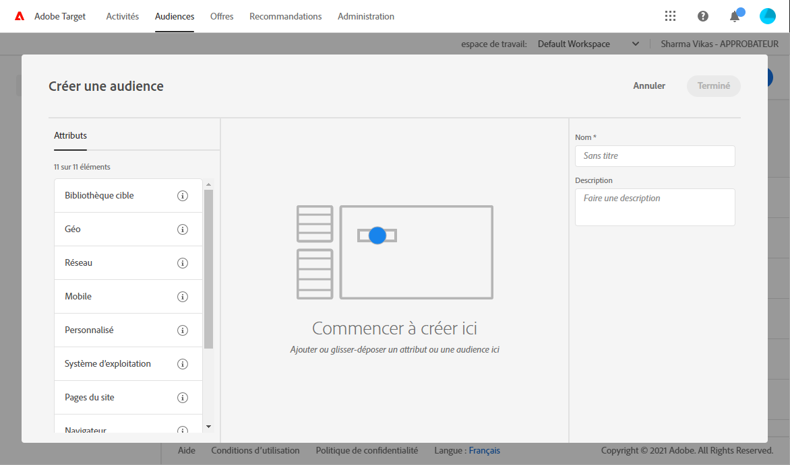

# Utilisation de Campaign et Adobe Target

Connectez Campaign et Target pour inclure une offre provenant d&#39;Adobe Target dans une diffusion e-mail Adobe Campaign.

Cette intégration vous aide à implémenter les cas d&#39;utilisation comme suit : lorsqu&#39;un destinataire ouvre un e-mail envoyé via Adobe Campaign, un appel à Adobe Target vous permet d&#39;afficher une version dynamique du contenu. Cette version dynamique est calculée en fonction des règles définies en amont, lors de la création de l&#39;e-mail.

>[!NOTE]
>L&#39;intégration prend uniquement en charge les images statiques. Les autres types de contenu ne peuvent pas être personnalisés.

[!DNL :speech_balloon:] En tant qu&#39;utilisateur Managed Cloud Services, [contactez Adobe](../start/campaign-faq.md#support) pour implémenter des triggers Experience Cloud avec Campaign.

Adobe Target peut utiliser les types de données suivants :

* Données issues de la base de données Adobe Campaign ;
* Segments associés à l&#39;identifiant visiteur dans Adobe Target, si les données utilisées ne sont pas soumises à des limitations légales ;
* données d&#39;Adobe Target : user agent, adresse IP, données de géolocalisation.

## Insertion d&#39;un contenu dynamique

Dans l&#39;exemple ci-dessous, vous apprendrez comment intégrer **une offre dynamique** provenant d&#39;Adobe Target dans un e-mail Adobe Campaign.

Nous souhaitons créer un message contenant une image qui change dynamiquement en fonction du pays du destinataire. Les données sont envoyées avec chaque demande de mbox et dépendent de l&#39;adresse IP du visiteur.

Dans cet e-mail, nous souhaitons que les images changent dynamiquement en fonction des expériences utilisateur suivantes :

* L&#39;e-mail est ouvert en France.
* L&#39;e-mail est ouvert aux États-Unis.
* Si aucune de ces conditions n&#39;est remplie, une image par défaut s&#39;affiche.

Les étapes suivantes doivent être complétées dans Adobe Campaign et Adobe Target :

1. [Insertion de l&#39;offre dynamique dans un e-mail](#inserting-dynamic-offer)
1. [Création d&#39;offres de redirection](#create-redirect-offers)
1. [Création d&#39;audiences](#audiences-target)
1. [Création d&#39;une activité de ciblage d&#39;expérience](#creating-targeting-activity)
1. [Prévisualisation et envoi du message](#preview-send-email)

### Insertion de l&#39;offre dynamique dans un e-mail {#inserting-dynamic-offer}

Dans Adobe Campaign, définissez la cible et le contenu de votre e-mail. Vous pouvez insérer une image dynamique à partir d&#39;Adobe Target.

Pour ce faire, spécifiez l&#39;URL de l&#39;image par défaut, le nom de l&#39;emplacement et les champs que vous souhaitez transférer à Adobe Target.

Dans Adobe Campaign, vous pouvez insérer une image dynamique de Target dans un e-mail de deux manières différentes :

* Si vous utilisez l&#39;éditeur Digital Content Editor, choisissez une image existante, puis sélectionnez **[!UICONTROL Insérer]** > **[!UICONTROL Image dynamique servie par Adobe Target]** depuis la barre d&#39;outils.

   

* Si vous utilisez l&#39;éditeur standard, placez le curseur à l&#39;endroit où vous souhaitez insérer l&#39;image et sélectionnez **[!UICONTROL Inclure]** > **[!UICONTROL Image dynamique servie par Adobe Target...]** dans le menu déroulant de personnalisation.

   

Vous pouvez ensuite définir les paramètres de l&#39;image :

* L&#39;URL de l&#39;**[!UICONTROL image par défaut]** correspond à l&#39;image affichée lorsqu&#39;aucune des conditions n&#39;est remplie. Vous pouvez également sélectionner une image dans votre bibliothèque de ressources.
* L&#39;**[!UICONTROL emplacement de la cible]** correspond au nom de l&#39;emplacement de votre offre dynamique. Vous devrez sélectionner cet emplacement dans votre activité Adobe Target.
* La **[!UICONTROL landing page]** vous permet de rediriger l&#39;image par défaut vers une landing page par défaut. Cette URL s&#39;applique uniquement lorsque l&#39;image par défaut est affichée dans l&#39;e-mail final. Elle est facultative.
* Les **[!UICONTROL Paramètres de décision additionnels]** définissent le mappage entre les champs définis dans les segments d&#39;Adobe Target et les champs d&#39;Adobe Campaign. Les champs d&#39;Adobe Campaign utilisés doivent avoir été spécifiés au niveau du &quot;rawbox&quot;. Dans notre exemple, nous avons ajouté le champ Pays.

Si vous utilisez les permissions d&#39;Enterprise pour les paramètres d&#39;Adobe Target, ajoutez la propriété correspondante dans ce champ. Pour en savoir plus sur les permissions de Target Enterprise, voir [cette page](https://experienceleague.adobe.com/docs/target/using/administer/manage-users/enterprise/properties-overview.html?lang=fr#administer).

### Création d&#39;offres de redirection {#create-redirect-offers}

Dans Adobe Target, vous pouvez créer différentes versions de votre offre. Selon chaque expérience utilisateur, vous pouvez créer une offre de redirection et spécifier l&#39;image qui sera affichée.

Dans notre cas, nous avons besoin de deux offres de redirection, la troisième (celle par défaut) étant définie dans Adobe Campaign.

1. Pour créer une offre de redirection dans Target Standard, cliquez sur **[!UICONTROL Offres (code)]** dans l&#39;onglet **[!UICONTROL Contenu]**.

1. Cliquez sur **[!UICONTROL Créer]**, puis sur **[!UICONTROL Offre de redirection]**.

   

1. Saisissez le nom de votre offre et l&#39;URL de votre image.

   

1. Suivez la même procédure pour l&#39;offre de redirection restante. Voir à ce propos [cette page](https://experienceleague.adobe.com/docs/target/using/experiences/offers/offer-redirect.html?lang=fr#experiences).

### Création d&#39;audiences {#audiences-target}

Dans Adobe Target, vous devez créer les deux audiences dans lesquelles les visiteurs de votre offre seront classés selon les différents contenus à diffuser. Pour chaque audience, ajoutez une règle pour définir qui pourra visualiser l&#39;offre.

1. Pour créer une audience avec Target, dans l&#39;onglet **[!UICONTROL Audiences]**, cliquez sur **[!UICONTROL Créer une audience]**.

   

1. Ajoutez un nom à l&#39;audience.

   

1. Cliquez sur **[!UICONTROL Ajouter une règle]** et sélectionnez une catégorie. La règle utilise des critères spécifiques pour cibler les visiteurs. Vous pouvez affiner les règles en ajoutant des conditions ou en créant des règles dans d&#39;autres catégories.

1. Suivez la même procédure pour les audiences restantes.

### Création d&#39;une activité de ciblage d&#39;expérience {#creating-targeting-activity}

Dans Adobe Target, il est nécessaire de créer une activité de ciblage d&#39;expérience, définir les différentes expériences et les associer aux offres correspondantes.

Vous devez d&#39;abord définir l&#39;audience :

1. Pour créer une activité de ciblage d&#39;expérience, dans l&#39;onglet **[!UICONTROL Activités]**, cliquez sur **[!UICONTROL Créer une activité]**, puis sur **[!UICONTROL Ciblage d&#39;expérience]**.

   

1. Sélectionnez **[!UICONTROL Formulaire]** comme **[!UICONTROL compositeur d&#39;expérience]**.

1. Choisissez une audience en cliquant sur le bouton **[!UICONTROL Changer l&#39;audience]**.

   

1. Sélectionnez l&#39;audience créée aux étapes précédentes.

   

1. Créez une autre expérience en cliquant sur **[!UICONTROL Ajouter le ciblage d&#39;expérience]**.

Ensuite, ajoutez un contenu pour chaque audience :

1. Sélectionnez le nom de l&#39;emplacement choisi lors de l&#39;insertion de l&#39;offre dynamique dans Adobe Campaign.

   

1. Cliquez sur le bouton de liste déroulante et sélectionnez **[!UICONTROL Modifier l&#39;offre de redirection]**.

   

1. Sélectionnez l&#39;offre de redirection précédemment créée.

   

1. Suivez la même procédure pour la deuxième expérience.

La fenêtre **[!UICONTROL Target]** résume votre activité. Au besoin, vous pouvez ajouter d&#39;autres expériences.

La fenêtre **[!UICONTROL Objectif et paramètres]** permet de personnaliser votre activité en définissant une priorité, un objectif ou une durée.

La section **[!UICONTROL Paramètres de création de rapports]** permet de sélectionner une action et d&#39;éditer les paramètres qui déterminent à quel moment votre objectif est atteint.

## Prévisualisation et envoi du message {#preview-send-email}

Dans Adobe Campaign, vous pouvez désormais prévisualiser votre e-mail et en tester le rendu pour différents destinataires.

Vous pouvez constater que l&#39;image change selon les différentes expériences créées.

Votre e-mail comprenant une offre dynamique provenant de Target peut maintenant être envoyé.

