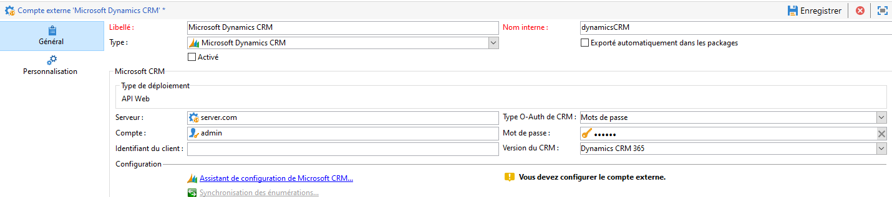

# Utilisation de Campaign et Microsoft Dynamics 365{#crm-ms-dynamics}

Activez vos données CRM lors d’une communication cross-canal : découvrez comment transférer des contacts de **Microsoft Dynamics 365** vers Adobe Campaign et partager les données de performances de la campagne (envois, ouvertures, clics et bounces) d’Adobe Campaign vers Microsoft Dynamics 365.

Une fois le paramétrage effectué, la synchronisation des données entre les systèmes s&#39;effectue via une activité de workflow dédiée. [En savoir plus](crm-data-sync.md).

>[!NOTE]
>
>Les versions de Microsoft Dynamics prises en charge sont présentées dans la [matrice de compatibilité](../start/compatibility-matrix.md) de Campaign.

Suivez les étapes ci-dessous pour configurer un compte externe dédié afin d’importer et d’exporter des données Microsoft Dynamics 365 vers Adobe Campaign.

Pour chaque système, ces étapes doivent être exécutées par un administrateur.

>[!CAUTION]
> Les étapes de cette documentation vous guideront tout au long de la création des intégrations/inscriptions impliquant l&#39;attribution d&#39;autorisations et/ou d&#39;accès administrateur. Vous êtes tenu de vous assurer que ces étapes sont conformes aux politiques de votre entreprise avant de les exécuter, et de les exécuter avec précaution.

## Configuration de Microsoft Dynamics 365 {#config-crm-microsoft}

Pour connecter Microsoft Dynamics 365 à Adobe Campaign via l’**API Web**, connectez-vous à [Microsoft Azure Directory](https://portal.azure.com) à l’aide d’informations d’identification d’**Administrateur global**, puis procédez comme suit :

1. Obtenez votre identifiant d’application Dynamics 365 (client). [En savoir plus](#get-client-id-microsoft)
1. Génération de l’identifiant de clé de certificat Microsoft Dynamics et de l’ID de clé. [En savoir plus](#config-certificate-key-id)
1. Configuration des autorisations. [En savoir plus](#config-permissions-microsoft)
1. Création d&#39;un utilisateur d&#39;application. [En savoir plus](#create-app-user-microsoft)
1. Codage de la clé privée. [En savoir plus](#configure-acc-for-microsoftt)


### Obtention de l&#39;identifiant client Dynamics 365 {#get-client-id-microsoft}

Pour obtenir l&#39;identifiant (client) d’application, vous devez enregistrer une application dans Azure Active Directory.

1. Parcourez **Azure Active Directory > Enregistrements des applications**, puis sélectionnez **Nouvel enregistrement**.
1. Saisissez un nom unique qui peut aider à identifier une instance, par exemple **adobecampaign`<instance identifier>`**.

Une fois que vous procédez à l’enregistrement, Microsoft Azure Directory affecte un **identifiant (client) d’application** unique à votre application. Vous aurez besoin de cet identifiant ultérieurement lors de la configuration de Dynamics 365 dans Adobe Campaign.

En savoir plus dans la [documentation de Microsoft Dynamics 365](https://docs.microsoft.com/powerapps/developer/common-data-service/walkthrough-register-app-azure-active-directory){target="_blank"}.

### Génération de l’identifiant de clé de certificat Microsoft Dynamics et de l’ID de clé {#config-certificate-key-id}

Pour obtenir l’**Identifiant de la clé de certificat (customKeyIdentifier)** et l’**identifiant de la clé (keyId)**, vous devez télécharger un certificat. Les certificats peuvent être utilisés comme secrets pour prouver l’identité de l’application lors de la demande d’un jeton. On peut également parler de clés publiques.

Procédez comme suit :

1. Parcourez **Azure Active Directory > Enregistrements des applications** et sélectionnez l&#39;application qui a été créée précédemment.
1. Sélectionnez **Certificats et secret**.
1. Dans l’onglet **Certificats**, cliquez sur **Téléchargement du certificat**.
1. Téléchargez votre certificat public.
1. Accédez au lien **Manifeste** pour obtenir l&#39;**identifiant de clé de certificat (customKeyIdentifier)** et l&#39;**identifiant de clé (keyId)**.

L’**identifiant de clé de certificat (customKeyIdentifier)** et l’**identifiant de clé (keyId)** sont nécessaires ultérieurement pour configurer votre compte externe CRM Microsoft Dynamics 365 à l’aide du certificat **[!UICONTROL Type O-Auth de CRM]**.

+++ Génération du certificat public

Pour générer le certificat, vous pouvez utiliser openssl.

Par exemple :

```
- openssl req -x509 -sha256 -nodes -days 365 -newkey rsa:2048 -keyout '<'private key name'>' -out '<'public certificate name'>
```

>[!NOTE]
>
>Vous pouvez modifier le nombre de jours, ici `-days 365`, dans l’exemple de code pour une période de validité du certificat plus longue.

Vous devez ensuite encoder le certificat en base64. Pour cela, vous pouvez utiliser l&#39;aide d&#39;un encodeur Base64 ou vous servir de la ligne de commande `base64 -w0 private.key` sous Linux.

+++

### Configuration des autorisations {#config-permissions-microsoft}

**Étape 1** : configurez les **autorisations obligatoires** pour l&#39;application qui a été créée.

1. Accédez à **Azure Active Directory > Enregistrements des applications** et sélectionnez l&#39;application qui a été créée précédemment.
1. Cliquez sur **Paramètres** en haut à gauche.
1. Sur **Autorisations obligatoires**, cliquez sur **Ajouter** et **Sélectionner une API > Dynamics CRM Online**.
1. Cliquez sur **Sélectionner**, activez la case **Accéder à Dynamics 365 en tant qu’utilisateurs de l’organisation** et cliquez sur **Sélectionner**.
1. Ensuite, dans l’application, sélectionnez le **Manifest** sous le menu **Gérer**.
1. Dans l’éditeur **Manifest**, définissez la propriété `allowPublicClient` de `null` sur `true` et cliquez sur **Enregistrer**.

**Étape 2** : autorisez le consentement administrateur

1. Accédez à **Répertoire actif Azure > Applications d’entreprise**.
1. Sélectionnez l’application à laquelle vous souhaitez accorder le consentement administrateur à l’échelle du client.
1. Dans le menu du volet de gauche, sélectionnez **Autorisations** sous **Sécurité**.
1. Cliquez sur **Accorder le consentement administrateur**.

Pour plus d&#39;informations à ce propos, consultez la [documentation Azure](https://docs.microsoft.com/azure/active-directory/manage-apps/grant-admin-consent#grant-admin-consent-from-the-azure-portal).

### Création d&#39;un utilisateur d&#39;application {#create-app-user-microsoft}

>[!NOTE]
>
> Cette étape est facultative avec l’authentification **[!UICONTROL Mots de passe]**.

L&#39;utilisateur de l&#39;application est l&#39;utilisateur que l&#39;application enregistrée ci-dessus utilisera. Toute modification apportée à Microsoft Dynamics à l&#39;aide de l&#39;application enregistrée ci-dessus sera effectuée via cet utilisateur.

**Étape 1** : Création d&#39;un utilisateur non interactif sur Azure Active Directory

1. Cliquez sur **Azure Active Directory > Utilisateurs** et sur **Nouvel utilisateur**.
1. Donnez un nom adapté que vous souhaitez utiliser et le nom d&#39;utilisateur doit être au format d&#39;un email.
1. Sélectionnez **Administrateur Dynamics 365** dans le **Rôle de répertoire**.

**Étape 2** : Attribuer une licence appropriée à l&#39;utilisateur créé

1. Dans [Microsoft Azure](https://portal.azure.com), cliquez sur **Application d&#39;administration**.
1. Accédez à **Utilisateurs > Utilisateurs actifs** et cliquez sur l&#39;utilisateur qui vient d&#39;être créé.
1. Cliquez sur **Modifier les licences de produit** et sélectionnez **Dynamics 365 Customer Engagement Plan**.
1. Cliquez sur **Fermer**.

**Étape 3** : Création d&#39;un utilisateur d&#39;application sur Dynamics CRM

1. Depuis [Microsoft Azure](https://portal.azure.com), accédez à **Paramètres > Sécurité > Utilisateurs**.
1. Cliquez dans la liste déroulante, sélectionnez **Utilisateurs de l&#39;application**, puis cliquez sur **Nouveau**.
1. Utilisez le même nom d&#39;utilisateur que celui créé dans Active Directory ci-dessus.
1. Affectez l&#39;**ID de l&#39;application** à [l&#39;application que vous avez créée précédemment](#get-client-id-microsoft).
1. Cliquez sur **Gérer les rôles** et sélectionnez le rôle **Administrateur système** pour l&#39;utilisateur.

## Configuration de Campaign {#configure-acc-for-microsoft}

### Création de la connexion{#new-ms-dyn-external-account}

Tout d’abord, vous devez créer le compte externe Microsoft Dynamics 365.

1. Parcourez le nœud **[!UICONTROL Administration > Plateforme > Comptes externes]** de l&#39;explorateur Campaign et créez un compte externe.
1. Sélectionnez le compte externe **[!UICONTROL Microsoft Dynamics CRM]** dans la section **Type**.
1. Sélectionnez la méthode d’authentification dans la liste déroulante **[!UICONTROL Type O-Auth de CRM]**.

   

   1. Pour configurer le compte externe Microsoft Dynamics CRM afin de vous connecter à Adobe Campaign avec des **mots de passe**, fournissez les détails suivants :

      * **Serveur** : URL de votre serveur Microsoft CRM. Pour trouver votre URL de serveur Microsoft CRM, accédez à votre compte Microsoft Dynamics CRM, puis cliquez sur Dynamics 365 et sélectionnez votre application. Vous pouvez ensuite trouver votre URL de serveur dans la barre d’adresse de votre navigateur, par exemple : https://myserver.crm.dynamics.com/.
      * **Compte** : compte utilisé pour se connecter à Microsoft CRM
      * **Mot de passe** : compte utilisé pour se connecter à Microsoft CRM
      * **Identifiant client** : identifiant (client) d’application qui se trouve sur le portail de gestion Microsoft Azure au niveau de la catégorie Mettre à jour votre code, dans le champ Identifiant du client.
      * **Version du CRM** : sélectionnez la version du CRM Dynamics 365 CRM.

   1. Pour configurer le compte externe Microsoft Dynamics CRM afin de vous connecter à Adobe Campaign avec un **Certificat**, fournissez les détails suivants :

      * **Serveur** : URL de votre serveur Microsoft CRM. Pour trouver votre URL de serveur Microsoft CRM, accédez à votre compte Microsoft Dynamics CRM, puis cliquez sur Dynamics 365 et sélectionnez votre application. Vous pouvez ensuite trouver votre URL de serveur dans la barre d’adresse de votre navigateur, par exemple : https://myserver.crm.dynamics.com/.
      * **Clé privée** : copiez/collez la clé privée, encodée en base64, comme expliqué dans [cette section](#config-certificate-key-id).
      * **Identifiant de clé** : clé disponible dans l’onglet **Manifeste** de votre application, en suivant la procédure décrite dans [cette section](#config-certificate-key-id).
      * **Identifiant de clé personnalisée** : identifiant disponible dans l’onglet **Manifeste** de votre application, en suivant la procédure décrite dans [cette section](#config-certificate-key-id).
      * **Identifiant du client** : identifiant (client) d’application qui se trouve sur le portail de gestion Microsoft Azure, comme expliqué dans [cette section](#get-client-id-microsoft).
      * **Version du CRM** : sélectionnez la version du CRM Dynamics 365 CRM.

1. Sélectionnez l’option **Activer** pour activer le compte dans Campaign.

>[!NOTE]
>
>Pour valider la configuration, procédez à une déconnexion/reconnexion à la console cliente Adobe Campaign.

### Sélection des tables à synchroniser{#ms-dyn-create-tables}

Vous pouvez maintenant configurer les tables à synchroniser.

1. Cliquez sur l’**[!UICONTROL Assistant de configuration de Microsoft CRM...]**.
1. Sélectionnez les tables à synchroniser et démarrez le processus.
1. Vérifiez le schéma généré dans Adobe Campaign, sous le nœud **[!UICONTROL Administration > Paramétrage > Schéma de données]**.

>[!NOTE]
>
>Veillez à ajouter à la liste autorisée deux URL : l’URL du serveur et `login.microsoftonline.com`. Pour ce faire, contactez votre représentant Adobe.

## Synchronisation des énumérations{#sfdc-enum-sync}

Une fois le schéma créé, vous pouvez synchroniser automatiquement les énumérations entre Dynamics 365 et Adobe Campaign.

1. Ouvrez l’assistant à partir du lien **[!UICONTROL Synchronisation des énumérations...]**.
1. Sélectionnez l&#39;énumération Adobe Campaign correspondant à l&#39;énumération Dynamics 365.
Vous pouvez remplacer toutes les valeurs d&#39;une énumération Adobe Campaign par celles du CRM : pour cela, sélectionnez **[!UICONTROL Oui]** dans la colonne **[!UICONTROL Remplacer]**.
1. Cliquez sur **[!UICONTROL Suivant]** puis **[!UICONTROL Démarrer]** pour lancer l&#39;import des énumérations.
1. Parcourez le nœud **[!UICONTROL Administration > Plateforme > Énumérations]** pour vérifier les valeurs importées.

Adobe Campaign et Microsoft Dynamics 365 sont maintenant connectés. Vous pouvez configurer la synchronisation des données entre les deux systèmes.

Pour synchroniser les données entre Adobe Campaign et Microsoft CRM, créez un workflow et utilisez l’activité **[!UICONTROL Connecteur CRM]**.

Pour en savoir plus sur la synchronisation des données, consultez [cette page](crm-data-sync.md).

### Types de données de champ pris en charge {#ms-dyn-supported-types}

Pour Microsoft Dynamics 365, les types d&#39;attribut pris en charge/non pris en charge sont répertoriés ci-dessous :


| Type d&#39;attribut | Pris en charge |
| --------------------------------------------------------------------------------- | --------- |
| Types simples : booléen, date et heure, nombre décimal, nombre à virgule flottante, doublon, nombre entier, entier long, chaîne | Oui |
| Devise (en tant que doublon) | Oui |
| mémo, nom de l&#39;entité, clé primaire, identifiant unique (en tant que chaînes) | Oui |
| Statut, liste de sélection (les valeurs possibles sont stockées dans des énumérations), état (chaîne) | Oui |
| propriétaire (comme chaîne) | Oui |
| Recherche (seules les recherches de référence d&#39;entité unique) | Oui |
| client | Non |
| Concernant | Non |
| PartyList | Non |
| ManagedProperty | Non |
