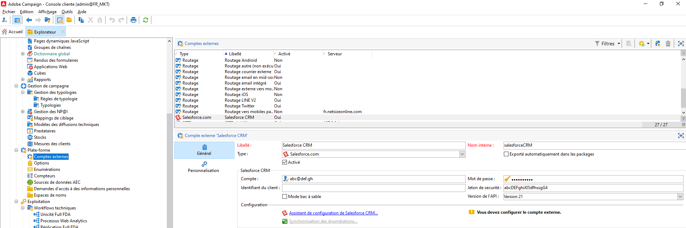
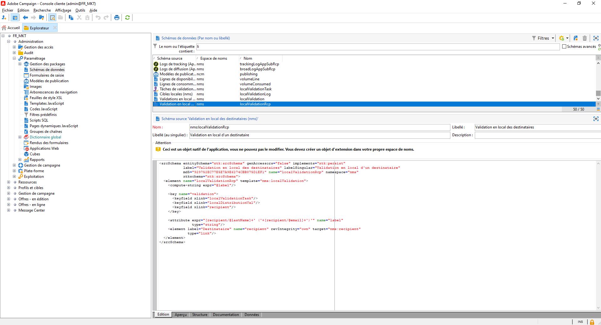
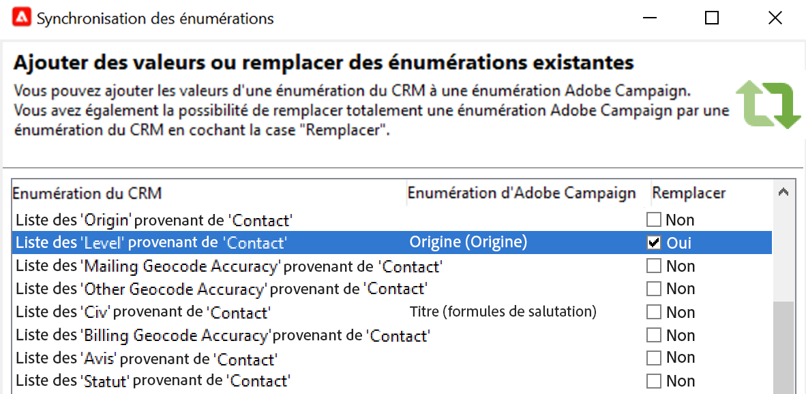

# Utilisation de Campaign et SFDC{#crm-sfdc}

Découvrez comment configurer le connecteur CRM Campaign pour connecter Campaign v8 à **Salesforce.com**.

Une fois le paramétrage effectué, la synchronisation des données entre les systèmes s&#39;effectue via une activité de workflow dédiée. [En savoir plus](crm-data-sync.md).

>[!NOTE]
>
>Les versions de SFDC prises en charge sont présentées dans Campaign. [Matrice de compatibilité](../start/compatibility-matrix.md).

Suivez les étapes ci-dessous pour configurer un compte externe dédié afin d’importer et d’exporter des données Salesforce vers Adobe Campaign.

## Création de la connexion{#new-sfdc-external-account}

Tout d’abord, vous devez créer le compte externe Salesforce.

1. Parcourez les **[!UICONTROL Administration > Plateforme > Comptes externes]** de l&#39;explorateur Campaign et créez un compte externe.
1. Sélectionner **[!UICONTROL Salesforce.com]** compte externe dans le **Type** .
1. Saisissez les paramètres pour activer la connexion.

   

   Pour configurer le compte externe Salesforce CRM afin de l’utiliser avec Adobe Campaign, vous devez fournir les détails suivants :

   * Entrez votre identifiant Salesforce dans la variable **[!UICONTROL Compte]** champ .
   * Saisissez votre mot de passe Salesforce.
   * Vous pouvez ignorer la variable **[!UICONTROL Identifiant du client]** champ .
   * Copier/coller votre Salesforce **[!UICONTROL Jeton de sécurité]**
   * Sélectionnez votre **[!UICONTROL Version de l’API]**. Les versions d’API SFDC prises en charge sont répertoriées dans Campaign. [Matrice de compatibilité](../start/compatibility-matrix.md).

1. Sélectionnez la **Activer** pour activer le compte dans Campaign.

>[!NOTE]
>
>Pour valider la configuration, vous devez procéder à une déconnexion/reconnexion à la console Adobe Campaign.

## Sélectionner les tableaux à synchroniser{#sfdc-create-tables}

Vous pouvez maintenant configurer les tableaux à synchroniser.

1. Cliquez sur le bouton **[!UICONTROL Assistant de configuration CRM Salesforce...]**.
1. Sélectionnez les tables à synchroniser et démarrez le processus.
1. Vérifiez le schéma généré dans Adobe Campaign, sous le noeud **[!UICONTROL Administration > Paramétrage > Schéma de données]**.

   Exemple d’un **Salesforce** schéma importé dans Campaign :

   

## Synchronisation des énumérations{#sfdc-enum-sync}

Une fois le schéma créé, vous pouvez synchroniser automatiquement les énumérations entre Salesforce et Adobe Campaign.

1. Ouvrez l’assistant à partir du  **[!UICONTROL Synchronisation des énumérations...]** lien.
1. Sélectionnez l&#39;énumération Adobe Campaign correspondant à l&#39;énumération Salesforce.
Vous pouvez remplacer toutes les valeurs d&#39;une énumération Adobe Campaign par celles du CRM : pour cela, sélectionnez **[!UICONTROL Oui]** dans la colonne **[!UICONTROL Remplacer]**.

   

1. Cliquez sur **[!UICONTROL Suivant]** puis **[!UICONTROL Début]** pour commencer à importer les énumérations.

1. Parcourez les **[!UICONTROL Administration > Plateforme > Enumérations]** pour vérifier les valeurs importées.

Adobe Campaign et Salesforce.com sont désormais connectés. Vous pouvez configurer la synchronisation des données entre les deux systèmes.

Pour synchroniser les données entre les données Adobe Campaign et SFDC, créez un workflow et utilisez la fonction **[!UICONTROL Connecteur CRM]** activité.

Pour en savoir plus sur la synchronisation des données, consultez [cette page](crm-data-sync.md).
