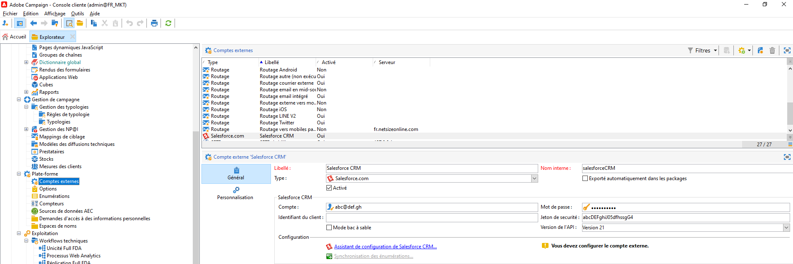
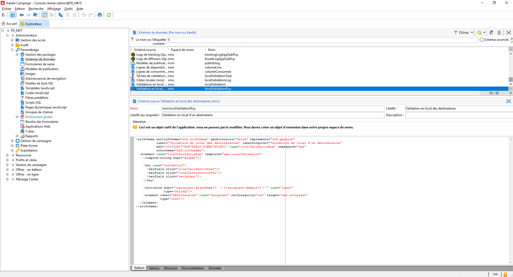
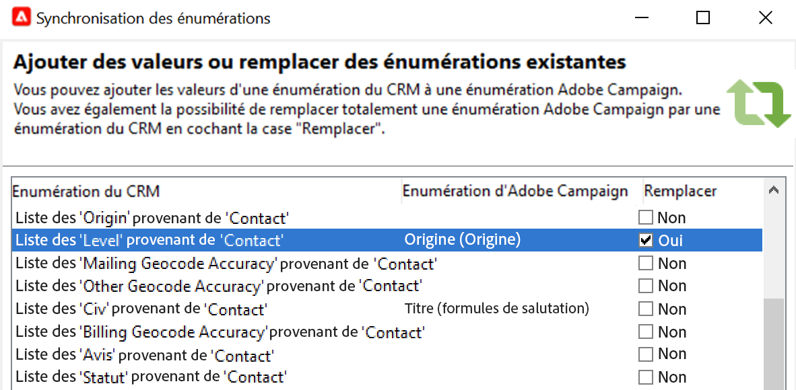

# Utilisation de Campaign et SFDC{#crm-sfdc}

Découvrez comment configurer le connecteur CRM Campaign pour connecter Campaign v8 à **Salesforce.com**.

Une fois le paramétrage effectué, la synchronisation des données entre les systèmes s&#39;effectue via une activité de workflow dédiée. [En savoir plus](crm-data-sync.md).

>[!NOTE]
>
>Les versions de SFDC prises en charge sont présentées dans la [matrice de compatibilité](../start/compatibility-matrix.md) de Campaign.

Suivez les étapes ci-dessous pour configurer un compte externe dédié afin d’importer et d’exporter des données Salesforce vers Adobe Campaign.

## Création de la connexion{#new-sfdc-external-account}

Tout d’abord, vous devez créer le compte externe Salesforce.

1. Parcourez le nœud **[!UICONTROL Administration > Plateforme > Comptes externes]** de l&#39;explorateur Campaign et créez un compte externe.
1. Sélectionnez le compte externe **[!UICONTROL Salesforce.com]** dans la section **Type**.
1. Saisissez les paramètres pour activer la connexion.

   

   Pour configurer le compte externe Salesforce CRM afin de l’utiliser avec Adobe Campaign, vous devez fournir les détails suivants :

   * Saisissez votre identifiant Salesforce dans le champ **[!UICONTROL Compte]**.
   * Saisissez votre mot de passe Salesforce.
   * Vous pouvez ignorer le champ **[!UICONTROL Identifiant du client]**.
   * Copiez/collez votre **[!UICONTROL Jeton de sécurité]** Salesforce.
   * Sélectionnez votre **[!UICONTROL Version de l’API]**. Les versions d’API SFDC prises en charge sont répertoriées dans la [matrice de compatibilité](../start/compatibility-matrix.md) de Campaign.

1. Sélectionnez l’option **Activer** pour activer le compte dans Campaign.

>[!NOTE]
>
>Pour approuver la configuration, vous devez procéder à une déconnexion/reconnexion à la console cliente Adobe Campaign.

## Sélection des tables à synchroniser{#sfdc-create-tables}

Vous pouvez maintenant configurer les tables à synchroniser.

1. Cliquez sur l’**[!UICONTROL Assistant de configuration Salesforce CRM...]**.
1. Sélectionnez les tables à synchroniser et démarrez le processus.
1. Vérifiez le schéma généré dans Adobe Campaign, sous le noeud **[!UICONTROL Administration > Paramétrage > Schéma de données]**.

   Exemple d’un schéma **Salesforce** importé dans Campaign :

   

## Synchronisation des énumérations{#sfdc-enum-sync}

Une fois le schéma créé, vous pouvez synchroniser automatiquement les énumérations entre Salesforce et Adobe Campaign.

1. Ouvrez l’assistant à partir du lien **[!UICONTROL Synchronisation des énumérations...]**.
1. Sélectionnez l’énumération d’Adobe Campaign correspondant à l’énumération Salesforce.
Vous pouvez remplacer toutes les valeurs d&#39;une énumération Adobe Campaign par celles du CRM : pour cela, sélectionnez **[!UICONTROL Oui]** dans la colonne **[!UICONTROL Remplacer]**.

   

1. Cliquez sur **[!UICONTROL Suivant]** puis **[!UICONTROL Démarrer]** pour lancer l&#39;import des énumérations.

1. Parcourez le nœud **[!UICONTROL Administration > Plateforme > Énumérations]** pour vérifier les valeurs importées. Pour en savoir plus sur les énumérations, consultez [cette page](../config/ui-settings.md#enumerations).

Adobe Campaign et Salesforce.com sont maintenant connectés. Vous pouvez configurer la synchronisation des données entre les deux systèmes.

Pour synchroniser les données entre Adobe Campaign et SFDC, créez un workflow et utilisez l’activité **[!UICONTROL Connecteur CRM]**.

Pour en savoir plus sur la synchronisation des données, consultez [cette page](crm-data-sync.md).

En savoir plus sur la gestion des énumérations dans Campaign [sur cette page](../config/enumerations.md).
