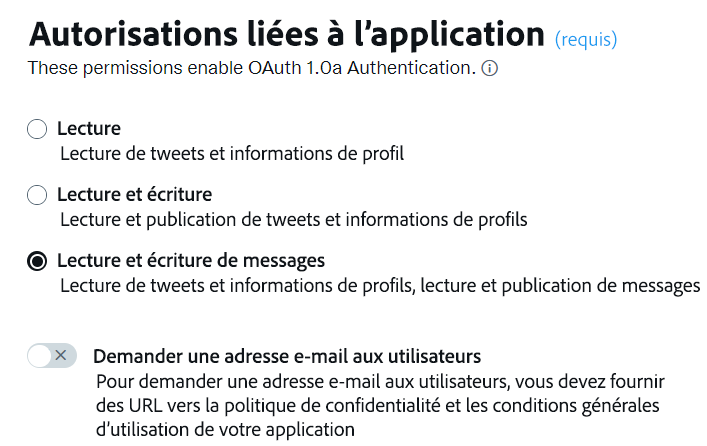
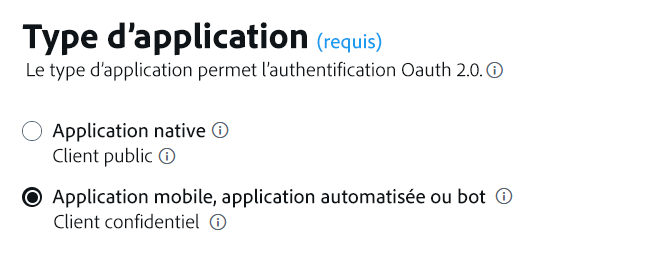
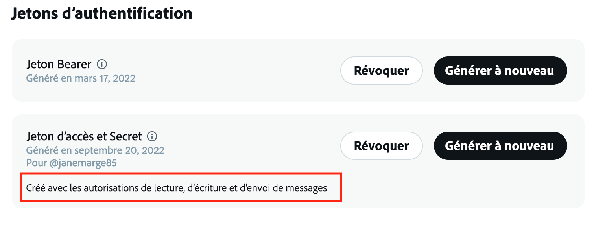
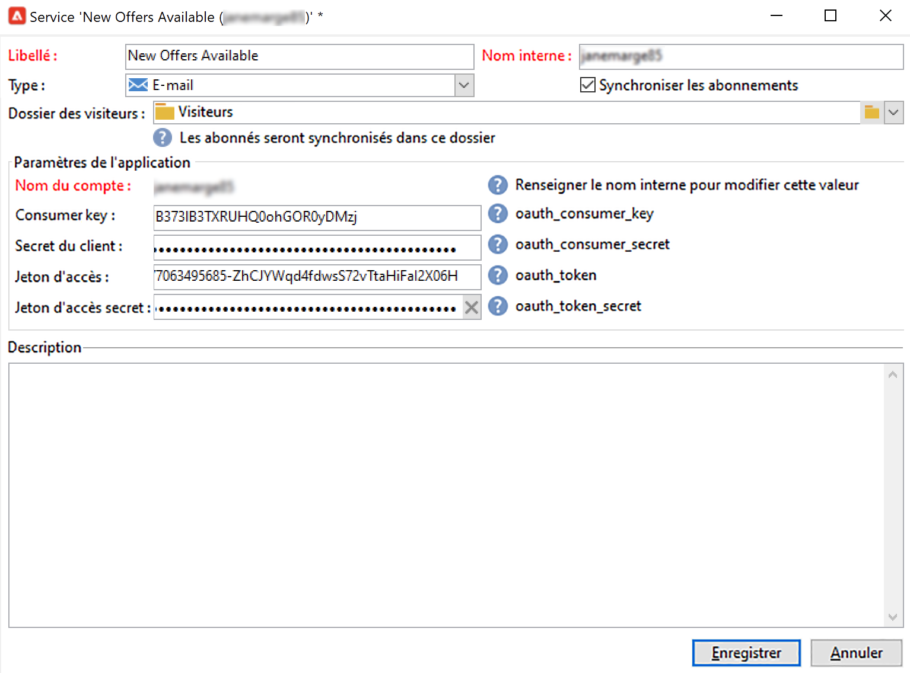
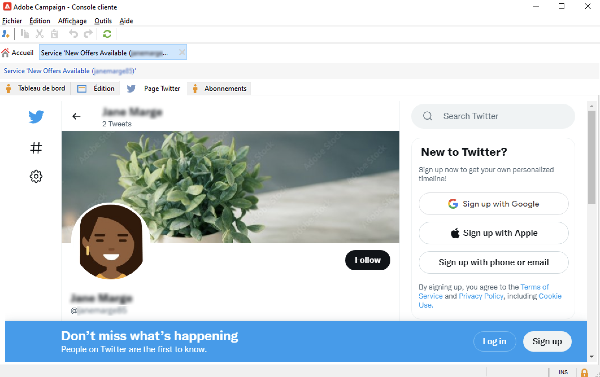

# Utiliser Campaign et X (Twitter) {#tw-ac-ovv}

Le module **Gestion des réseaux sociaux (Social Marketing)** vous permet d’interagir avec vos clientes et clients via X (anciennement Twitter). Utilisez cette fonctionnalité pour effectuer les actions suivantes :

* Publier des messages et envoyer des DM : utilisez Adobe Campaign Social Marketing pour publier des messages sur X. Vous pouvez également envoyer des messages directs à tous vos abonnées et abonnés.

* Collecter de nouveaux contacts : le marketing social d&#39;Adobe Campaign facilite également l&#39;acquisition de nouveaux contacts. Contactez les utilisateurs et demandez-leur s&#39;ils souhaitent partager leurs informations de profil. S&#39;ils acceptent, Adobe Campaign récupère automatiquement les données. Vous pouvez ainsi exécuter des campagnes de ciblage et, lorsque cela est possible, implémenter des stratégies cross-canal.

>[!NOTE]
>
>En tant qu’utilisateur ou utilisatrice Managed Cloud Services, [contactez Adobe](../start/campaign-faq.md#support) pour connecter Campaign à X. Le module complémentaire **Gestion des réseaux sociaux (Marketing des médias sociaux)** doit être installé sur votre environnement, par le biais du module dédié, et le compte externe Twitter doit être configuré.

Pour configurer Adobe Campaign afin de publier des posts sur vos comptes X, vous devez déléguer à Adobe Campaign les droits d’écriture sur ces comptes. Pour cela, vous devez effectuer les actions suivantes :

1. Vous inscrire sur X et créer un compte de développement. [En savoir plus](#dev-account)
1. Créer un compte X de test dédié à l’envoi de BAT (facultatif). [En savoir plus](#tw-test-account)
1. Créer une application X (une application par compte X). [En savoir plus](#create-an-app-on-twitter)
1. Créer un nouveau service pour **[!UICONTROL Twitter]** (un service par compte X). [En savoir plus](#create-tw-service)
1. Synchroniser votre compte X avec Campaign. [En savoir plus](#synchro-tw-accounts)

## Compte de développement X {#dev-account}

Pour commencer cette intégration, vous devez vous inscrire à un [Compte de développement X](https://developer.twitter.com){target="_blank"}.

Campaign utilise la version 1.1 de l’API X. Pour l’utiliser, vous devez demander un accès élevé via le portail destiné aux développeurs et aux développeuses. Pour en savoir plus sur l’accès élevé à X, consultez [cette page](https://developer.twitter.com/en/portal/products/elevated){target="_blank"}.

## Créer une application sur X {#create-an-app-on-twitter}

Une fois que vous avez reçu l’autorisation d’accès élevé, créez une application X pour permettre à Adobe Campaign de créer des publications sur votre compte X. Pour ce faire, procédez comme suit :

1. Connectez-vous à votre compte X.
1. Connectez-vous au [Portail de développement X](https://developer.twitter.com/en/apps){target="_blank"}.
1. Sélectionnez **Créer une application**.
1. Laissez-vous guider par l’assistant X.
1. Pour permettre à Adobe Campaign de créer des publications sur votre compte, modifiez les **Autorisations d’application** dans la section Configuration de l’authentification de l’utilisateur ou de l’utilisatrice de votre application. Sélectionnez **Lecture, écriture et messages directs**.

   

1. Dans la section **Type d’application**, sélectionnez **Application web, application automatisée ou robot**. Vous pouvez laisser le champ **URL de rappel** vide et enregistrer votre configuration.

   

1. Revenez au tableau de bord de votre application, sélectionnez votre application et accédez à l’onglet **Clés et jetons**. Sous **Jeton d’accès et secret**, si l’autorisation **Lecture, écriture et messages directs** n’est pas mentionnée, vous devez régénérer le jeton et le secret de votre application. Notez que toutes les clés et tous les jetons doivent être enregistrés lors de leur création. Vous en aurez besoin pour configurer votre service Campaign Twitter.

   

>[!NOTE]
>
>Vous avez besoin d’une application par compte X. Par conséquent, vous devez créer une autre application de test pour envoyer des BAT à votre compte de test.
>

## Créer un service Twitter dans Campaign {#create-tw-service}

Pour lier votre instance Campaign à votre compte X, créez un service **Twitter** et déléguez les droits d’écriture à Campaign.

>[!CAUTION]
>
>Créez un service **Twitter** par compte X. Par conséquent, vous devez créer un autre service de test pour envoyer des BAT à votre [compte de test](#tw-test-account).
>
>Chaque service **Twitter** doit également être créé par Adobe sur votre instance de mid-sourcing (MID). Contactez votre représentant Adobe pour que votre environnement soit configuré.
>

Pour entrer des paramètres, vous devez accéder à la fois à la console cliente d’Adobe Campaign et aux autorisations de votre application X.

1. Dans **Adobe Campaign**, accédez à l&#39;onglet **[!UICONTROL Profils et cibles]**, puis sélectionnez le lien **[!UICONTROL Services et abonnements]**.
1. Créez un service.
1. Sélectionnez le type **[!UICONTROL Twitter]**.
1. Renseignez le libellé et le nom interne du service.

   >[!CAUTION]
   >
   >Le **[!UICONTROL nom interne]** du service doit être identique au nom du compte X.
   >

1. Par défaut, les abonnés sont enregistrés dans le dossier **[!UICONTROL Visiteurs]**. Vous pouvez sélectionner un autre emplacement dans le champ **[!UICONTROL Dossier des visiteurs]**. [En savoir plus](../send/twitter.md#direct-tw-messages)

   

   >[!NOTE]
   >
   >L’option **[!UICONTROL Synchroniser les abonnements]** est activée par défaut : cette option récupère automatiquement la liste de vos abonnées et abonnés X afin que vous puissiez [leur envoyer des messages directs](../send/twitter.md#direct-tw-messages). La synchronisation est effectuée par un [workflow technique dédié](#synchro-tw-accounts).

1. À partir de votre application X, copiez le contenu des champs **Clé d’API** et **[Clé secrète d’API]** et collez-les dans les champs **[!UICONTROL Clé du client (consumer key)]** et **[!UICONTROL Secret du client]** de votre service **Twitter** de Campaign.

1. À partir de votre application X, copiez le contenu des champs **Jeton d’accès** et **Jeton d’accès secret**, puis collez-les dans les champs **[!UICONTROL Jeton d’accès]** et **[!UICONTROL Jeton d’accès secret]** de votre service **Twitter** de Campaign.

1. Dans la console client Campaign, cliquez sur **[!UICONTROL Enregistrer]**. Vous avez désormais délégué l’accès en écriture à Adobe Campaign.

Pour vérifier vos paramètres, vous pouvez :

* Modifier le service **Twitter** que vous venez de créer.
* Parcourir l’onglet **[!UICONTROL Page Twitter]** : votre compte Twitter doit s’afficher.
  

## Synchroniser votre compte X {#synchro-tw-accounts}

La synchronisation entre Campaign et X est gérée via des workflows techniques dédiés. Ces workflows sont stockés dans le dossier **[!UICONTROL Administration > Exploitation > Workflows techniques > Gestion des réseaux sociaux]**.

Ils sont arrêtés par défaut : vous devez les démarrer manuellement lorsque vous commencez à utiliser le module **Marketing social**.

Le workflow technique **[!UICONTROL Synchronisation des comptes Twitter]** synchronise les comptes X dans Adobe Campaign. Ce workflow récupère la liste des abonnées et abonnés X afin que vous puissiez leur envoyer des messages directs. [En savoir plus](../send/twitter.md#direct-tw-messages)

Par défaut, ce workflow est déclenché tous les jeudis à 7 h 30. Vous pouvez utiliser l’option **[!UICONTROL Exécuter la ou les tâches en attente maintenant]** pour démarrer le workflow à tout moment pendant que vous mettez en œuvre cette intégration.  Vous pouvez également modifier le planificateur pour modifier la fréquence de déclenchement du workflow. En savoir plus sur [cette page](../../automation/workflow/scheduler.md).

>[!CAUTION]
>
>Pour récupérer la liste des abonnées et abonnés X, l’option **[!UICONTROL Synchronisation des comptes Twitter]** doit être cochée pour le service associé au compte. [En savoir plus](#create-tw-service)

Les abonnés sont stockés dans un tableau spécifique : la table des visiteurs. Pour afficher la liste des abonnées et abonnés X, accédez à **[!UICONTROL Profils et cibles > Visiteurs et visiteuses]**.

Pour chaque personne abonnée, Adobe Campaign stocke les informations suivantes :

* **[!UICONTROL Origine]** : Twitter
* **[!UICONTROL ID externe]** : identifiant de l’utilisateur
* **[!UICONTROL Nom d’utilisateur]** : nom du compte de l’utilisateur
* **[!UICONTROL Nom complet]** : nom de l’utilisateur
* **[!UICONTROL Nombre d’amis]** : nombre d’abonnés au compte de l’utilisateur
* **[!UICONTROL Vérifié]** : ce champ indique si l’utilisateur possède un compte Twitter vérifié

Une fois cette configuration terminée, vous pouvez créer des publications sur vos comptes X et envoyer des messages directs à vos abonnées et abonnés. [En savoir plus](../send/twitter.md)

## Créer un compte X de test {#tw-test-account}

Outre le compte X, créez un compte X privé destiné à l’envoi de [BAT de publication](../send/twitter.md#send-tw-proofs). Pour ce faire, procédez comme suit :

1. Créez un nouveau compte X.
1. Accédez aux **Paramètres** du compte.
1. Accédez à **Confidentialité et sécurité**, puis à **Audience et identification**. Sélectionnez l’option **Protéger mes publications**. Vos publications et autres informations de compte ne sont visibles que par les personnes qui vous suivent.

Configurez votre application X et le service Campaign pour qu’ils fonctionnent avec ce compte de test, comme décrit ci-dessus.
