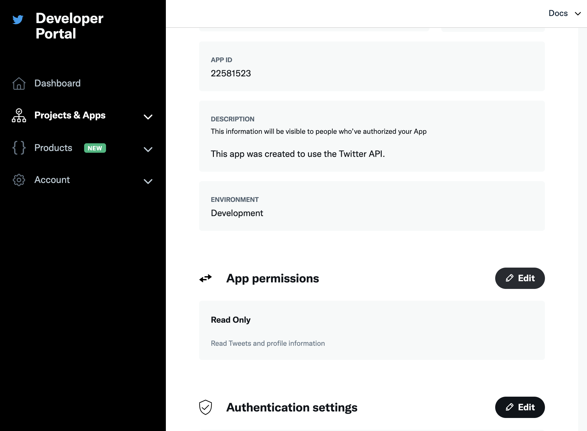

# Utilisation de Campaign et Twitter{#tw-ac-ovv}

Le module **Gestion des réseaux sociaux (Social Marketing)** vous permet d&#39;interagir avec vos clients via Twitter. Utilisez cette fonctionnalité pour :

* Envoyer des messages : utilisez le marketing social d&#39;Adobe Campaign pour publier des messages sur Twitter. Vous pouvez également envoyer des messages directs à tous les abonnés de vos comptes.

* Collecter de nouveaux contacts : le marketing social d&#39;Adobe Campaign facilite également l&#39;acquisition de nouveaux contacts. Contactez les utilisateurs et demandez-leur s&#39;ils souhaitent partager leurs informations de profil. S&#39;ils acceptent, Adobe Campaign récupère automatiquement les données. Vous pouvez ainsi exécuter des campagnes de ciblage et, lorsque cela est possible, implémenter des stratégies cross-canal.

En tant qu&#39;utilisateur Managed Cloud Services, [contactez Adobe](../start/campaign-faq.md#support) pour connecter Campaign à Twitter. Le module **Gestion des réseaux sociaux (Social Marketing)** doit être installé sur votre environnement, via le package dédié.

Pour configurer Adobe Campaign afin de publier des tweets sur vos comptes Twitter, vous devez déléguer à Adobe Campaign les droits d&#39;écriture sur ces comptes. Pour cela :

1. Créez un compte Twitter
1. Créez un compte Twitter de test dédié à l&#39;envoi de BAT
1. Créez une application Twitter (une application par compte Twitter)
1. Créez un service pour **[!UICONTROL Twitter]** (un service par compte Twitter)

## Créer un compte Twitter de test {#tw-test-account}

Outre le compte Twitter, créez un compte Twitter privé utilisable pour l&#39;envoi de [BAT de tweet](../send/twitter.md#send-tw-proofs). Pour ce faire, procédez comme suit :

1. Créez un compte Twitter.
1. Accédez aux **Paramètres** du compte.
1. Accédez à **Confidentialité et sécurité**, puis à **Audience et balisage**. Sélectionnez l&#39;option **Protéger vos tweets**. Vos tweets et autres informations de compte ne sont visibles que par les personnes qui vous suivent.

## Création d&#39;une application sur Twitter {#create-an-app-on-twitter}

Créez une application Twitter pour permettre à Adobe Campaign de publier des tweets sur votre compte Twitter.  Pour ce faire, procédez comme suit :

1. Connectez-vous à votre compte Twitter.
1. Connectez-vous au [Portail de développement Twitter](https://developer.twitter.com/en/apps).
1. Sélectionnez **Créer une application**.
1. Laissez-vous guider par l&#39;assistant Twitter.

   Pour permettre à Adobe Campaign de publier des tweets sur votre compte, modifiez la variable **Autorisations** de l&#39;application et sélectionnez **Lecture et écriture** pour la section **Accès**. Dans l&#39;onglet **Paramètres**, vous devez également laisser le champ **URL de callback** vide.

   

>[!NOTE]
>
>Vous avez besoin d&#39;une application par compte Twitter. Par conséquent, vous devez créer une autre application de test pour envoyer des BAT à votre compte de test.

## Créer un service Twitter dans Campaign {#create-tw-service}

Pour lier votre instance Campaign à votre compte Twitter, créez un service **Twitter** et déléguez les droits d&#39;écriture à Campaign.

Pour entrer des paramètres, vous devez accéder à la fois à la console Adobe Campaign et à un compte Twitter :

1. Ouvrez **Twitter** et à partir de la [page Projet et applications](https://developer.twitter.com/en/portal/projects-and-apps), sélectionnez l&#39;application créée précédemment. Accédez aux **Autorisations d&#39;application**.

   

   Modifiez l&#39;onglet **Clés et jetons** pour accéder aux détails de votre application.

1. Dans **Adobe Campaign**, accédez à l&#39;onglet **[!UICONTROL Profils et cibles]**, puis sélectionnez le lien **[!UICONTROL Services et abonnements]**.
1. Créez un service.
1. Sélectionnez le type **[!UICONTROL Twitter]**.

   >[!NOTE]
   >
   >L&#39;option **[!UICONTROL Synchroniser les abonnements]** est activée par défaut : cette option récupère automatiquement la liste de vos abonnés Twitter afin que vous puissiez [leur envoyer des messages directs](../send/twitter.md#direct-tw-messages). La synchronisation est effectuée par un [workflow technique dédié](#synchro-tw-accounts).

1. Renseignez le libellé et le nom interne du service.

   >[!CAUTION]
   >
   >Le **[!UICONTROL Nom interne]** du service doit être identique au nom du compte Twitter.

   Pour vérifier vos paramètres, vous pouvez :

   * Cliquer sur le bouton **[!UICONTROL Enregistrer]**.
   * Dans la vue d&#39;ensemble des services, sélectionnez le service **Twitter** que vous venez de créer.
   * Parcourez l&#39;onglet **[!UICONTROL Page Twitter]** : votre compte Twitter doit s&#39;afficher.

1. Par défaut, les abonnés sont enregistrés dans le dossier **[!UICONTROL Visiteurs]**. Vous pouvez sélectionner un autre emplacement dans le champ **[!UICONTROL Dossier des visiteurs]**. [En savoir plus](../send/twitter.md#direct-tw-messages)

1. À partir de l&#39;appli Twitter, copiez le contenu des champs **[!UICONTROL Clé du client (API Key)]** et **[!UICONTROL Secret du client (API Secret)]** et collez-les dans les champs **[!UICONTROL Clé du client]** et **[!UICONTROL Secret du client]** de votre service **Twitter** Campaign.

1. À partir de votre appli Twitter, copiez le contenu des champs **[!UICONTROL Jeton d&#39;accès]** et **[!UICONTROL Jeton d&#39;accès secret]**, puis collez-les dans les champs **[!UICONTROL Jeton d&#39;accès]** et **[!UICONTROL Jeton d&#39;accès secret]** de votre service **Twitter** Campaign.

1. Dans la console client Campaign, cliquez sur **[!UICONTROL Enregistrer]**. Vous avez désormais délégué l&#39;accès en écriture à Adobe Campaign.

>[!NOTE]
>
>Créez un service **Twitter** par compte Twitter. Par conséquent, vous devez créer un autre service de test pour envoyer des BAT à votre compte de test.

## Synchroniser votre compte Twitter {#synchro-tw-accounts}

La synchronisation entre Campaign et Twitter est gérée via des workflows techniques dédiés. Ces workflows sont stockés dans le dossier **[!UICONTROL Administration > Exploitation > Workflows techniques > Gestion des réseaux sociaux]**.

Ils sont arrêtés par défaut : vous devez les démarrer manuellement lorsque vous commencez à utiliser le module **Marketing social**.

Le workflow technique **[!UICONTROL Synchronisation du compte Twitter]** synchronise les comptes Twitter dans Adobe Campaign. Ce workflow récupère la liste des abonnés Twitter afin que vous puissiez leur envoyer des messages directs. [En savoir plus](../send/twitter.md#direct-tw-messages)

Par défaut, ce workflow est déclenché tous les jeudis à 7 h 30. Vous pouvez utiliser l&#39;option **[!UICONTROL Traitement anticipé de la (des) tâche(s)]** pour démarrer le workflow à tout moment pendant que vous mettez en œuvre cette intégration.  Vous pouvez également modifier le planificateur pour modifier la fréquence de déclenchement du workflow. Apprenez-en davantage dans la [documentation de Campaign Classic v7](https://experienceleague.adobe.com/docs/campaign-classic/using/automating-with-workflows/flow-control-activities/scheduler.html?lang=fr){target=&quot;_blank&quot;}.

>[!CAUTION]
>
>Pour récupérer la liste des abonnés Twitter, l&#39;option **[!UICONTROL Synchronisation des comptes Twitter]** doit être cochée pour le service associé au compte. [En savoir plus](#create-tw-service)

Les abonnés sont stockés dans un tableau spécifique : la table des visiteurs. Pour afficher la liste des abonnés Twitter, accédez à **[!UICONTROL Profils et cibles > Visiteurs]**.

Pour chaque abonné, Adobe Campaign stocke les informations suivantes :

* **[!UICONTROL Origine]** : nom du réseau social (Twitter)
* **[!UICONTROL ID externe]** : identifiant de l&#39;utilisateur
* **[!UICONTROL Pseudo]** : nom de compte de l&#39;utilisateur
* **[!UICONTROL Nom complet]** : nom de l&#39;utilisateur
* **[!UICONTROL Langue]** : langue de l&#39;utilisateur
* **[!UICONTROL Nombre d&#39;amis]** : nombre d&#39;abonnés au compte de l&#39;utilisateur
* **[!UICONTROL Fuseau horaire]** : fuseau horaire de l&#39;utilisateur
* **[!UICONTROL Vérifié]** : ce champ indique si l&#39;utilisateur possède un compte Twitter vérifié

Une fois cette configuration terminée, vous pouvez publier des tweets sur vos comptes Twitter et envoyer des messages directs à vos abonnés. [En savoir plus](../send/twitter.md)
