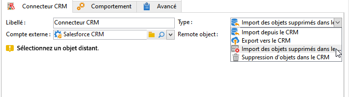
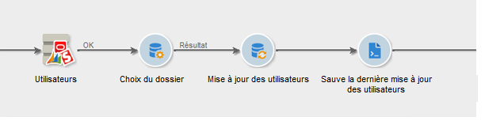

# Synchroniser les données entre Campaign et votre CRM {#data-synchronization}

La synchronisation des données entre Adobe Campaign et votre CRM est gérée par le **Connecteur CRM** activité de workflow.

Par exemple, pour importer les données Microsoft Dynamics dans Adobe Campaign, créez un workflow du type suivant :

Ce workflow importe les contacts depuis Microsoft Dynamics, les synchronise avec les données Adobe Campaign existantes, déduplique les contacts et met à jour la base de données Adobe Campaign.

L&#39;activité **[!UICONTROL Connecteur CRM]** doit être paramétrée pour synchroniser les données.

Avec cette activité, vous pouvez effectuer les actions suivantes :

* Import depuis le CRM - [En savoir plus](#importing-from-the-crm)
* Export vers le CRM - [En savoir plus](#exporting-to-the-crm)
* Import des objets supprimés dans le CRM - [En savoir plus](#importing-objects-deleted-in-the-crm)
* Suppression d&#39;objets dans le CRM - [En savoir plus](#deleting-objects-in-the-crm)

Sélectionnez le compte externe correspondant au CRM avec lequel vous souhaitez paramétrer la synchronisation puis choisissez l&#39;objet à synchroniser : comptes, opportunités, leads, contacts, etc.

La configuration de cette activité dépend ensuite du traitement à réaliser. Les différents types de paramétrages sont présentés ci-après.

## Import depuis le CRM {#importing-from-the-crm}

Pour importer des données depuis le CRM dans Adobe Campaign, vous devez réaliser un workflow du type :

1. Sélectionnez une opération de type **[!UICONTROL Import depuis le CRM]**.
1. Dans le **[!UICONTROL Objet distant]** , sélectionnez l’objet à importer. Cet objet correspond à l’une des tables créées dans Adobe Campaign lors de la configuration du connecteur.
1. Dans le **[!UICONTROL Champs distants]** , renseignez les champs à importer.

   Pour ajouter un champ, cliquez sur le bouton **[!UICONTROL Ajouter]** de la barre d&#39;outils puis sur l&#39;icône **[!UICONTROL Editer l&#39;expression]**.

   Au besoin, modifiez le format des données à l&#39;aide de la liste déroulante du **[!UICONTROL Conversion]** colonnes. Les types de conversion possibles sont détaillés dans la section [cette section](#data-format).

   >[!CAUTION]
   >
   >L&#39;identifiant de l&#39;enregistrement dans le CRM est obligatoire pour relier les objets côté CRM et côté Adobe Campaign. Il est automatiquement ajouté lors de la validation de la boîte.
   >
   >La date de la dernière modification côté CRM est également requise pour permettre l&#39;import incrémental des données.

1. Vous pouvez filtrer les données à importer selon vos besoins. Pour ce faire, cliquez sur le bouton **[!UICONTROL Modifier le filtre..]** lien.

   Dans l&#39;exemple suivant, Adobe Campaign n&#39;importera que les contact ayant eu une activité après le 1er novembre 2021.

   

   >[!CAUTION]
   >
   >Les limitations relatives au mode de filtrage des données sont présentées dans la section [cette section](#filtering-data).

1. Sélectionnez la **[!UICONTROL Utiliser l’index automatique...]** pour gérer automatiquement la synchronisation incrémentale des objets entre votre CRM et Adobe Campaign, selon la date et leur dernière modification.

   Pour plus d’informations, consultez [cette section](#variable-management).

### Gérer les variables {#variable-management}

Activez la variable **[!UICONTROL Index automatique]** pour ne collecter que les objets modifiés depuis la dernière importation.

La date de la dernière synchronisation est stockée dans l&#39;option indiquée dans la fenêtre de paramétrage, par défaut : **LASTIMPORT_&lt;%=instance.internalName%>_&lt;%=activityName%>**.

>[!NOTE]
>
>Cette note s&#39;applique uniquement à l&#39;activité **[!UICONTROL Connecteur CRM]** générique. Pour les autres activités CRM, le processus est automatique.
>
>Cette option doit être créée et renseignée manuellement sous **[!UICONTROL Administration]** > **[!UICONTROL Plateforme]** > **[!UICONTROL Options]**. Il doit s’agir d’une option de texte et sa valeur doit correspondre au format suivant : **aaaa/MM/jj hh:mm:ss**.
> 
>Pour tout autre import, vous devez mettre à jour manuellement cette option.

Vous pouvez indiquer le champ CRM distant à prendre en compte pour identifier les modifications les plus récentes.

Par défaut, les champs suivants sont utilisés (dans l&#39;ordre indiqué) :

* Pour Microsoft Dynamics : **modifiedon**,
* Pour Salesforce.com : **LastModifiedDate**, **SystemModstamp**.

L&#39;activation de l&#39;option **[!UICONTROL Index automatique]** génère trois variables, qui pourront être exploitées dans le workflow de synchronisation, via une activité de type **[!UICONTROL Code JavaScript]**. Ces variables sont les suivantes :

* **vars.crmOptionName**: nom de l’option contenant la date du dernier import.
* **vars.crmStartImport**: date de début (incluse) de la dernière importation de données.
* **vars.crmEndDate**: date de fin (exclue) de la dernière importation de données.

   >[!NOTE]
   >
   >Ces dates sont affichées au format suivant : **aaaa/MM/jj hh:mm:ss**.

### Filtrage des données {#filtering-data}

Afin d&#39;assurer un bon fonctionnement avec les différents CRM, les filtres doivent être créés selon les règles suivantes :

* Chaque niveau de filtrage ne peut utiliser qu&#39;un seul type d&#39;opérateur.
* L&#39;opérateur AND NOT n&#39;est pas supporté.
* Les comparaisons ne peuvent porter que sur des valeurs nulles (de type &#39;est vide&#39;/&#39;n&#39;est pas vide&#39;) ou des nombres. Lorsque la colonne Valeur (colonne de droite) est évaluée, le résultat de cette évaluation doit être une valeur numérique.
* Les données de la colonne Valeur sont évaluées en JavaScript.
* Les comparaisons de type JOIN ne sont pas supportées.
* L&#39;expression indiquée dans la colonne de gauche doit nécessairement être un champ. Elle ne peut pas être une combinaison de plusieurs expressions, un nombre, etc.

### Ordre de tri {#order-by}

Sous Microsoft Dynamics et Salesforce.com, vous pouvez trier les champs distants à importer, par ordre descendant ou ascendant.

Pour cela, cliquez sur le lien **[!UICONTROL Ordre de tri]** et ajoutez les colonnes dans la liste.

L&#39;ordre des colonnes dans la liste indique l&#39;ordre de tri :

### Identification des enregistrements {#record-identification}

Au lieu d&#39;importer des éléments inclus (et éventuellement filtrés) dans votre CRM, vous pouvez utiliser une population calculée au préalable dans le workflow.

Pour cela, sélectionnez l&#39;option **[!UICONTROL Utiliser la population calculée en amont]** et indiquez le champ contenant l&#39;identifiant distant.

Sélectionnez ensuite les champs à importer depuis la population entrante, comme dans l&#39;exemple ci-dessous :

## Exporter vers le CRM {#exporting-to-the-crm}

Exportez les données Adobe Campaign dans votre CRM pour copier l’intégralité de son contenu dans votre base de données CRM.

Pour exporter des données vers votre CRM, créez un workflow du type :

1. Sélectionnez une opération de type **[!UICONTROL Exporter vers le CRM]**.
1. Accédez au **[!UICONTROL Objet distant]** et sélectionnez l’objet à exporter. Cet objet correspond à l’une des tables créées dans Adobe Campaign lors de la configuration du connecteur.

   >[!CAUTION]
   >
   >La fonction d’exportation de la variable **[!UICONTROL Connecteur CRM]** peut insérer ou mettre à jour des champs dans votre CRM. Pour activer les mises à jour des champs dans le CRM, spécifiez la Principale clé de la table distante. Si la clé est manquante, les données sont insérées au lieu d&#39;être mises à jour.

1. Si vous devez effectuer des exportations plus rapides, cochez la case  **[!UICONTROL Exporter en lots]** .

   

1. Dans le **[!UICONTROL Mappage]** , cliquez sur **[!UICONTROL Nouveau]** pour indiquer les champs à exporter et leur mapping dans votre CRM.

   Pour ajouter un champ, cliquez sur le bouton **[!UICONTROL Ajouter]** de la barre d&#39;outils puis sur l&#39;icône **[!UICONTROL Editer l&#39;expression]**.

   >[!NOTE]
   >
   >Si aucune correspondance n’est définie pour un champ, les valeurs ne peuvent pas être mises à jour : ils sont insérés directement dans votre CRM.

   Au besoin, modifiez le format des données à l&#39;aide de la liste déroulante du **[!UICONTROL Conversion]** colonnes. Les types de conversion possibles sont détaillés dans la section [cette section](#data-format).

   >[!NOTE]
   >
   >La liste des enregistrements à exporter et le résultat de l&#39;export sont enregistrés dans un fichier temporaire qui reste accessible jusqu&#39;à ce que le workflow soit terminé ou redémarré. Cela vous permet de démarrer le processus en toute sécurité en cas d’erreur.

## Paramétrages additionnels {#additional-configurations}

### Sur le format des données saisies {#data-format}

Vous pouvez convertir à la volée le format des données lors de leur import depuis ou vers votre CRM.

Pour cela, sélectionnez la conversion à appliquer dans la colonne correspondante.

Le mode **[!UICONTROL par défaut]** applique une conversion automatique des données, qui correspond dans la plupart des cas, à un copier/coller des données. Toutefois, la gestion des fuseaux horaires est appliquée.

Les autres conversions possibles sont les suivantes :

* **[!UICONTROL Date uniquement]**: supprime les champs de type Date + Heure .
* **[!UICONTROL Sans décalage temporel]**: annule la gestion des fuseaux horaires appliquée dans le mode par défaut.
* **[!UICONTROL Copier/coller]**: utilise des données brutes telles que des chaînes (pas de conversion).

### Traitement des erreurs {#error-processing}

Dans le cadre d&#39;un import ou d&#39;un export de données, vous pouvez appliquer un traitement spécifique aux erreurs et rejets. Pour ce faire, sélectionnez la variable **[!UICONTROL Conserver les rejets dans un fichier]** et **[!UICONTROL Traiter les erreurs]** dans le **[!UICONTROL Comportement]** .

Ces options ajoutent les transitions sortantes associées.

Insérez ensuite les activités correspondantes afin de traiter les données. Par exemple, ajoutez une **Attente** des reprises d’activité et de planification pour les erreurs.

La transition sortante **[!UICONTROL Rejet]** permet d&#39;accéder au schéma de sortie qui contient les colonnes spécifiques relatives aux codes et messages d&#39;erreur. Pour Salesforce.com, cette colonne est **errorSymbol** (symbole de l&#39;erreur, différent du code de l&#39;erreur), **errorMessage** (description du contexte de l&#39;erreur).

## Import d&#39;objets supprimés dans le CRM {#importing-objects-deleted-in-the-crm}

Vous pouvez importer dans Adobe Campaign les objets supprimés dans votre CRM.

1. Sélectionnez une opération de type **[!UICONTROL Import des objets supprimés dans le CRM]**.
1. Accédez au **[!UICONTROL Objet distant]** et sélectionnez l’objet concerné par le processus. Cet objet correspond à l’une des tables créées dans Adobe Campaign lors de la configuration du connecteur.
1. Indiquez la période de suppression à prendre en compte dans la variable **[!UICONTROL Date de début]** et le **[!UICONTROL Date de fin]** (les dates sont incluses).

   >[!CAUTION]
   >
   >La période de suppression doit correspondre aux limites spécifiques à votre CRM. Par exemple, pour Salesforce.com, les éléments supprimés il y a plus de 30 jours ne peuvent pas être récupérés.

## Suppression d&#39;objets dans le CRM {#deleting-objects-in-the-crm}

Pour supprimer des objets dans votre CRM, indiquez la clé Principale des éléments distants à supprimer.

L&#39;onglet **[!UICONTROL Comportement]** vous permet d&#39;activer le traitement des rejets. Cette option génère une seconde transition en sortie de l&#39;activité **[!UICONTROL Connecteur CRM]**. Voir à ce sujet la section [Traitement des erreurs](#error-processing).
