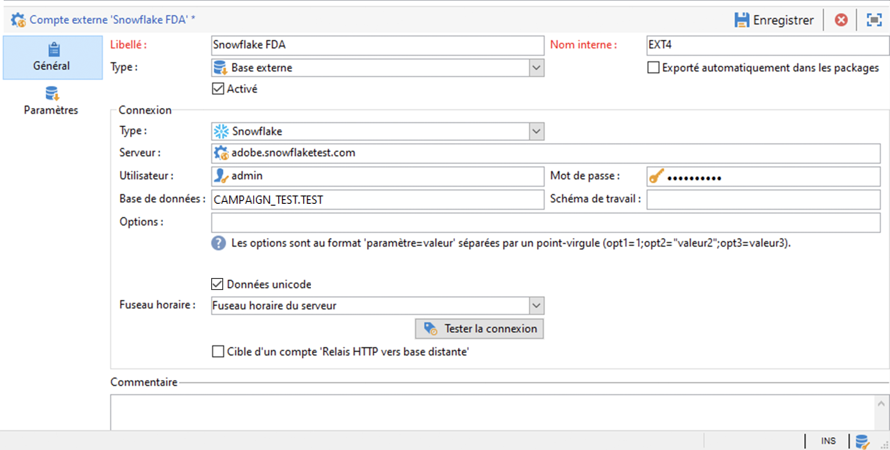
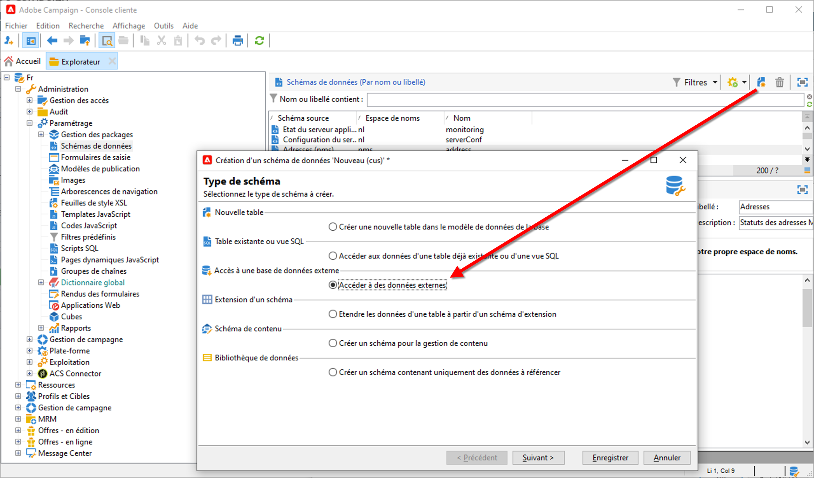
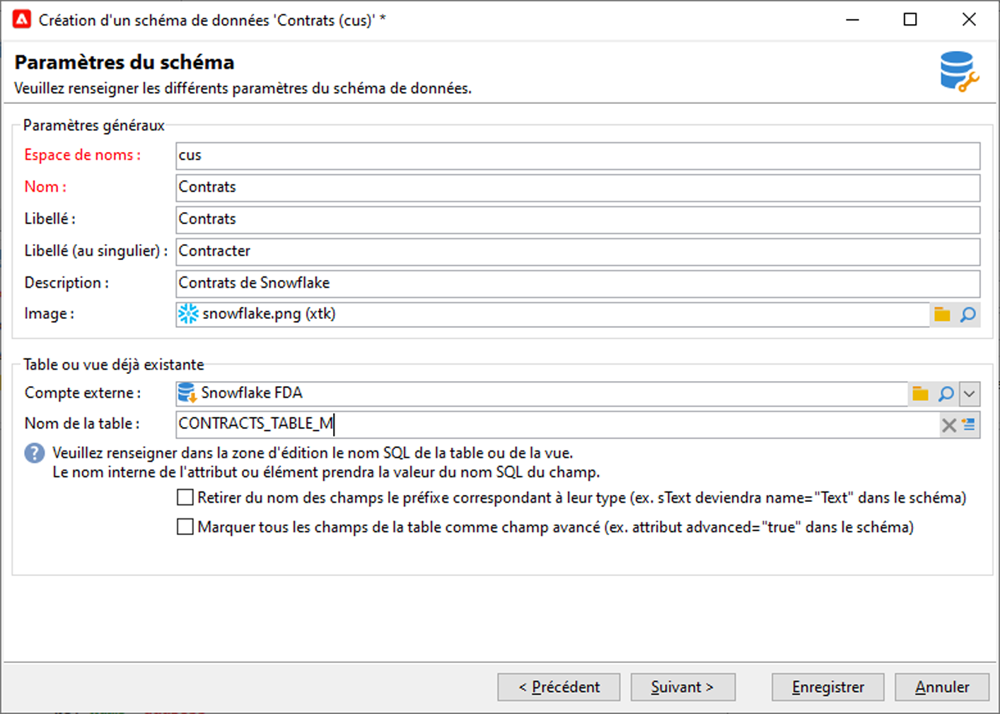
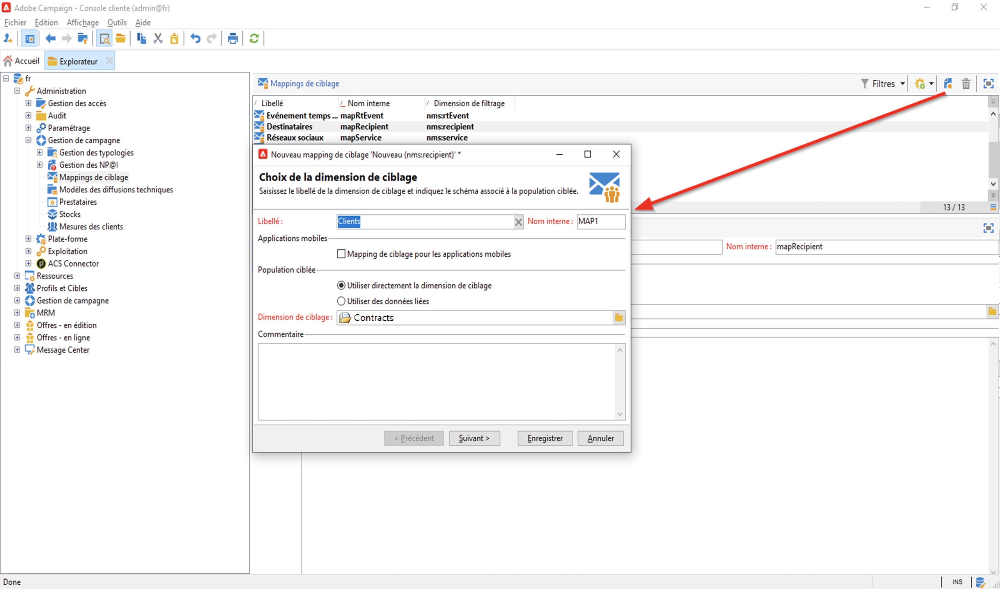
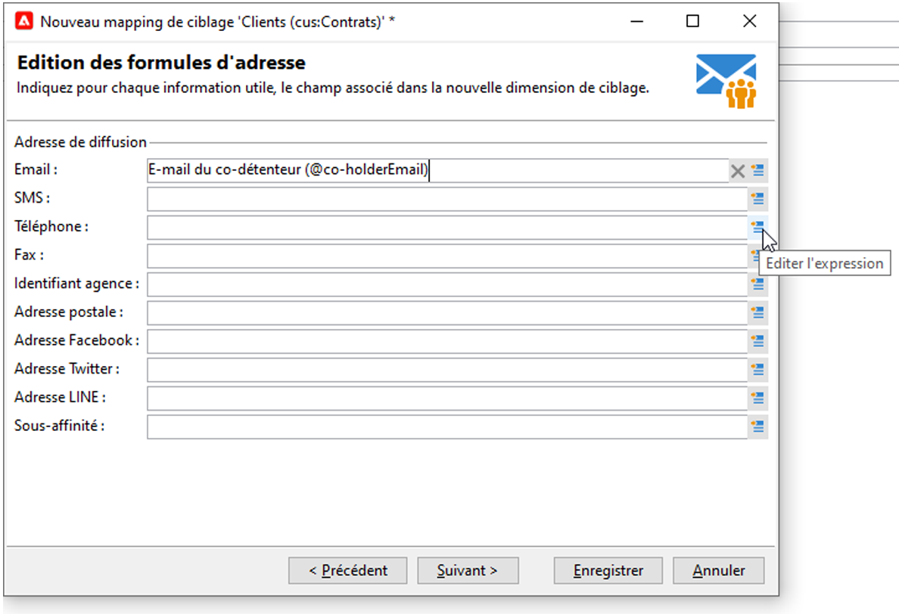
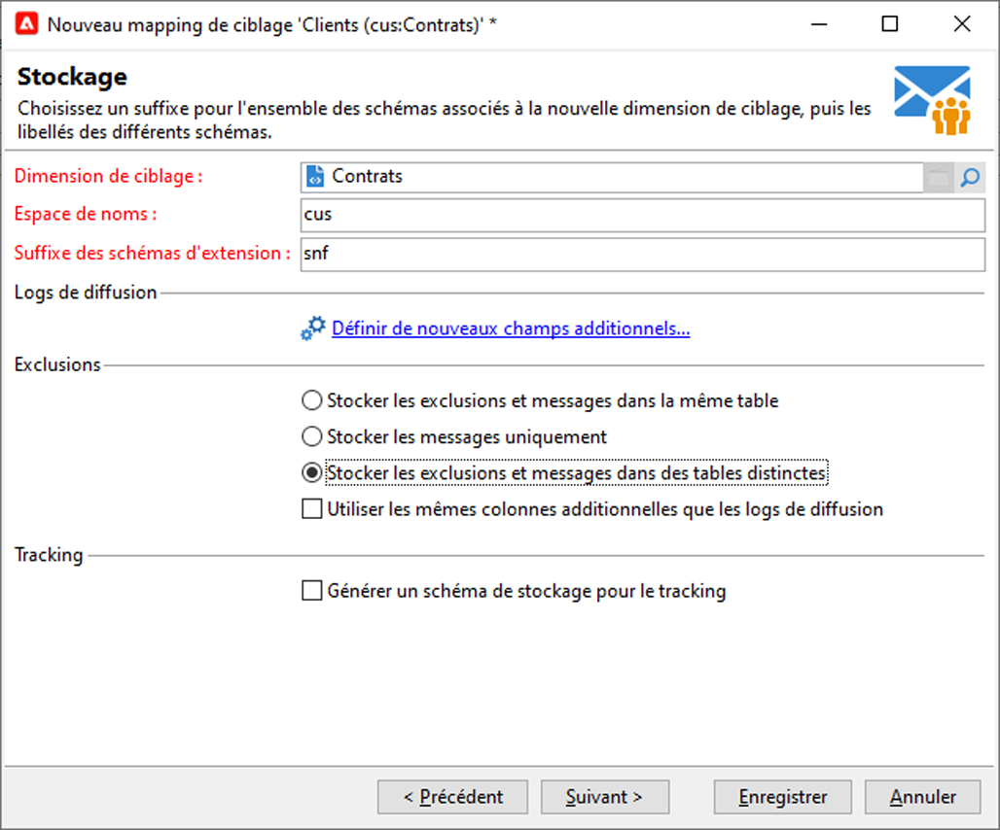
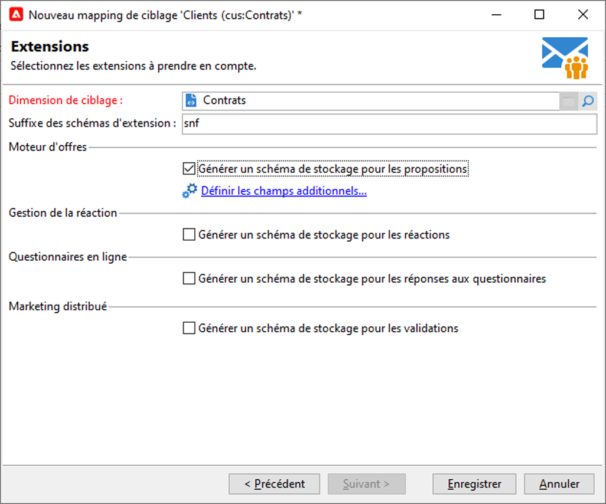

# Federated Data Access (FDA){#gs-fda}

Utilisez le connecteur FDA (Federated Data Access) pour connecter Campaign à une ou plusieurs **bases de données externes** et traiter les informations stockées dans celles-ci sans affecter vos données provenant des bases cloud de Campaign. Vous pouvez ensuite accéder à des données externes sans modifier la structure des données Adobe Campaign.

>[!NOTE]
>
>Les bases de données compatibles avec FDA sont répertoriées dans la [Matrice de compatibilité](../start/compatibility-matrix.md).

L&#39;option FDA de Campaign permet d&#39;étendre votre modèle de données dans une base de données tierce. Le module détecte automatiquement la structure des tables ciblées et utilise les données provenant des sources SQL.

Des **autorisations** spécifiques sont requises sur [!DNL Adobe Campaign] et sur la base de données externe pour interagir ensemble. En savoir plus dans [cette section](#fda-permissions).

## Bonnes pratiques et limites

* **Optimiser la personnalisation d&#39;un e-mail avec des données externes**

   Vous pouvez prétraiter la personnalisation des messages dans un workflow dédié. Pour ce faire, utilisez l&#39;option **[!UICONTROL Préparer les données de personnalisation avec un workflow]**, disponible dans l&#39;onglet **[!UICONTROL Analyse]** des propriétés de la diffusion.

   Cette option permet, lors de l&#39;analyse de la diffusion, de créer et d&#39;exécuter automatiquement un workflow qui stocke toutes les données liées à la cible dans une table temporaire, notamment les données issues des tables liées dans une base de données externe.

   Cette option améliore considérablement les performances lors de l&#39;exécution de l&#39;étape de personnalisation.

* **Limites de FDA**

   L&#39;option FDA est utilisée pour manipuler les données des bases de données externes en mode batch dans les workflows. Pour éviter les problèmes de performance, il n&#39;est pas recommandé d&#39;utiliser le module FDA dans le cadre d&#39;opérations unitaires, par exemple : personnalisation, interaction, messagerie en temps réel, etc.

   Evitez autant que possible les opérations nécessitant d&#39;utiliser à la fois la base Adobe Campaign et la base externe. Pour cela, vous pouvez :

   * exporter les données de la base Adobe Campaign vers la base externe et effectuer les opérations uniquement depuis la base externe avant de réimporter les résultats dans Adobe Campaign.

   * collecter les données de la base externe dans Adobe Campaign et effectuer les opérations localement.

   Si vous souhaitez effectuer de la personnalisation dans vos diffusions à l&#39;aide des données de la base externe, collectez les données à utiliser dans un workflow afin de les rendre disponibles dans une table temporaire. Utilisez alors les données de la table temporaire pour personnaliser votre diffusion.

   L&#39;option FDA est assujettie aux limitations du système de la base de données externe que vous utilisez.

## Étapes de configuration{#fda-configuration-steps}

Pour configurer l&#39;accès à une base de données externe avec FDA, les étapes de configuration sont les suivantes :

1. En tant qu&#39;utilisateur Adobe Managed Services, contactez Adobe pour installer les pilotes sur votre instance Campaign.
1. Une fois les pilotes installés, configurez le compte externe correspondant à votre base de données sur le serveur Adobe Campaign et testez le compte externe. [En savoir plus](#fda-external-account)
1. Créez le schéma de la base de données externe dans Adobe Campaign. Il est ainsi possible d&#39;identifier la structure des données de la base de données externe. [En savoir plus](#create-data-schema)
1. Si nécessaire, créez un mapping de ciblage à partir du schéma créé précédemment. Ceci est nécessaire si les destinataires de vos diffusions proviennent de la base de données externe. Cette implémentation s&#39;accompagne de limitations liées à la personnalisation des messages. [En savoir plus](#define-data-mapping)

## Compte externe de base de données externe{#fda-external-account}

Vous devez créer un compte externe spécifique pour connecter votre instance Campaign à votre base de données externe.

Pour ce faire, procédez comme suit :

1. Dans l&#39;**[!UICONTROL Explorateur]** Campaign, acédez à **[!UICONTROL Administration]** > `>`**[!UICONTROL Plateforme]** > `>`**[!UICONTROL Comptes externes]**.

1. Cliquez sur **[!UICONTROL Nouveau]**.

   >[!NOTE]
   >
   > Pour qu&#39;il soit actif, l&#39;option **[!UICONTROL Activé]** doit être cochée. Si nécessaire, désélectionnez ces option pour désactiver l&#39;accès à cette base de données sans supprimer son paramétrage.

1. Sélectionnez **[!UICONTROL Base de données externe]** en tant que **[!UICONTROL Type]** de compte externe.

1. Sélectionnez votre base de données externe dans la liste déroulante et configurez le compte externe. Vous devez indiquer les informations suivantes :

   * **[!UICONTROL Serveur]** : URL du serveur 

   * **[!UICONTROL Compte]** : nom de l&#39;utilisateur

   * **[!UICONTROL Mot de passe]** : mot de passe du compte utilisateur

   * **[!UICONTROL Base de données]** : nom de la base de données

      

1. Cliquez sur l&#39;onglet **[!UICONTROL Paramètres]**, puis sur le bouton **[!UICONTROL Déployer les fonctions]** pour créer des fonctions.

1. Une fois les paramètres renseignés, cliquez sur le bouton **[!UICONTROL Tester la connexion]** pour les valider.

1. Pour permettre à Adobe Campaign d&#39;accéder à cette base, vous devez déployer les fonctions SQL. Cliquez sur l&#39;onglet **[!UICONTROL Paramètres]** puis sur le bouton **[!UICONTROL Déployer les fonctions]**.

Vous pouvez définir des tablespaces de travail spécifiques pour les tables et pour les index dans l&#39;onglet **[!UICONTROL Paramètres]**.

Pour [!DNL Snowflake], le connecteur prend en charge les options suivantes :

| Option | Description |
|---|---|
| workschema | Schéma de base de données à utiliser pour les tables de travail. |
| warehouse | Nom de l&#39;entrepôt par défaut à utiliser. Il remplace la valeur par défaut de l&#39;utilisateur. |
| TimeZoneName | Vide par défaut. C&#39;est le fuseau horaire système du serveur applicatif Campaign Classic qui est utilisé. Il est possible d&#39;utiliser cette option pour forcer le paramètre de session TIMEZONE.  Pour plus d&#39;informations à ce sujet, consultez [cette page](https://docs.snowflake.net/manuals/sql-reference/parameters.html#timezone). |
| WeekStart | Paramètre de session WEEK_START. Par défaut, cette valeur est définie sur 0.  Pour plus d&#39;informations à ce sujet, consultez [cette page](https://docs.snowflake.com/en/sql-reference/parameters.html#week-start). |
| UseCachedResult | Paramètre de session USE_CACHED_RESULTS. Par défaut, cette valeur est définie sur TRUE. Il est possible d&#39;utiliser cette option pour désactiver les résultats de Snowflake mis en mémoire cache.  Pour plus d&#39;informations à ce sujet, voir [cette page](https://docs.snowflake.net/manuals/user-guide/querying-persisted-results.html). |

## Création du schéma de données{#create-data-schema}

Pour créer le schéma de la base externe dans Adobe Campaign, procédez comme suit :

1. Cliquez sur le bouton **[!UICONTROL Nouveau]** au-dessus de la liste des schémas de données et sélectionnez **[!UICONTROL Accéder à des données externes]**.

   

1. Saisissez le nom du schéma et sa description, puis sélectionnez le compte externe permettant la connexion à la base de données. Vous avez ainsi accès à la liste des tables disponibles dans la base externe. Sélectionnez la table contenant les données à collecter.

   

1. Cliquez sur **[!UICONTROL OK]** pour valider. Adobe Campaign détecte automatiquement la structure de la table sélectionnée et génère le schéma logique. Veuillez noter qu&#39;Adobe Campaign ne génère pas de liens.

1. Cliquez sur **[!UICONTROL Enregistrer]** pour en valider la création.

## Définir le mapping de ciblage{#define-data-mapping}

Vous pouvez définir un mapping sur les données d&#39;une table externe.

Pour cela, une fois que le schéma de la table externe a été créé, vous devez créer un nouveau mapping de diffusion afin d&#39;utiliser les données contenues dans cette table en tant que cible des actions de diffusions.

Pour ce faire, procédez comme suit :

1. Accédez à **[!UICONTROL Administration]** `>` **[!UICONTROL Gestion de campagne]** `>` **[!UICONTROL Mappings de ciblage]** à partir de l&#39;explorateur Adobe Campaign.

1. Créez un nouveau mapping de ciblage et sélectionnez le schéma que vous venez de créer comme dimension de ciblage.

   

1. Indiquez les champs où sont stockées les informations nécessaires à la diffusion (nom, prénom, e-mail, adresse postale, etc.).

   

1. Indiquez les paramètres relatifs au stockage des informations, et notamment le suffixe des schémas d&#39;extension, pour qu&#39;ils soient facilement identifiables.

   

   Vous pouvez choisir de stocker ou non les exclusions (**excludelog**), avec les messages (**broadlog**) ou dans une table distincte.

   Vous pouvez également gérer ou non le tracking pour ce mapping de diffusion (**trackinglog**).

1. Sélectionnez ensuite les extensions qui seront prises en compte. Le type d&#39;extension dépend des paramètres et options de votre plateforme (consultez votre contrat de licence).

   

   Cliquez sur le bouton **[!UICONTROL Enregistrer]** pour lancer la création du mapping de diffusion : toutes les tables liées sont créées automatiquement, selon les paramètres sélectionnés.

## Autorisations{#fda-permissions}

Des **autorisations** spécifiques sont requises sur [!DNL Adobe Campaign] et sur la base de données externe pour interagir ensemble.

Tout d&#39;abord, afin qu&#39;un utilisateur puisse effectuer des opérations sur une base externe via FDA, l&#39;opérateur doit disposer d&#39;un droit nommé spécifique dans [!DNL Adobe Campaign].

1. Sélectionnez le nœud **[!UICONTROL Administration > Gestion des accès > Droits nommés]** de l&#39;explorateur Adobe Campaign.
1. Créez un nouveau droit en indiquant le libellé de votre choix.
1. Saisissez le nom du droit nommé au format **user:base@server**, où :

   * **user** est le nom de l&#39;utilisateur dans la base de données externe
   * **base** est le nom de la base de données externe
   * **server** est le nom du serveur de la base de données externe

1. Enregistrez le droit nommé puis associez-le à l&#39;opérateur de votre choix à partir du nœud **[!UICONTROL Administration > Gestion des accès > Opérateurs]** de l&#39;explorateur Adobe Campaign.

Ensuite, pour traiter les données contenues dans une base de données externe, l&#39;opérateur Adobe Campaign doit au minimum avoir les autorisation en écriture sur cette base de données, afin de permettre la création des tables de travail. Ces tables sont automatiquement supprimées par Adobe Campaign.

Les autorisations suivantes sont nécessaires :

* **CONNECT** : connexion à la base distante
* **READ Data** : accès en lecture aux tables contenant les données du client
* **READ &#39;MetaData&#39;** : accès aux catalogues de données du serveur afin d&#39;obtenir la structure des tables
* **LOAD** : chargement en masse dans des tables de travail (opération nécessaire lorsque l&#39;on travaille sur des collections et des jointures)
* **CREATE/DROP** pour **TABLE/INDEX/PROCEDURE/FUNCTION** (uniquement pour les tables de travail générées par Adobe Campaign)
* **EXPLAIN** (recommandé) : pour la surveillance des performances en cas de problème
* **WRITE Data** (selon le scénario d&#39;intégration)

L&#39;administrateur de la base de données doit mettre en correspondance ces droits avec les droits spécifiques à chaque moteur de base de données, comme spécifié ci-dessous.

|   | Snowflake | Amazon Redshift |
|:-:|:-:|:-:|
| **Connexion à une base de données distante** | Privilèges USAGE ON WAREHOUSE, USAGE ON DATABASE et USAGE ON SCHEMA | Création d&#39;un utilisateur lié au compte AWS |
| **Création de tables** | Privilège CREATE TABLE ON SCHEMA  | Privilège CREATE |
| **Création d&#39;index** | N/A | Privilège CREATE |
| **Création de fonctions** | Privilège CREATE FUNCTION ON SCHEMA | Privilège USAGE ON LANGUAGE plpythonu pour pouvoir appeler des scripts Python externes |
| **Création de procédures** | N/A | Privilège python USAGE ON LANGUAGE pour pouvoir appeler des scripts Python externes |
| **Suppression d&#39;objets (tables, index, fonctions, procédures)** | Propriété de l&#39;objet | Être propriétaire de l&#39;objet ou être un super-utilisateur |
| **Surveillance des exécutions** | Privilège MONITOR sur l&#39;objet requis | Aucun privilège requis pour utiliser la commande EXPLAIN |
| **Écriture de données** | Privilèges INSERT et/ou UPDATE (selon l&#39;opération d&#39;écriture) | Privilèges INSERT et UPDATE |
| **Chargement de données dans des tables** | Privilèges CREATE STAGE ON SCHEMA, SELECT et INSERT sur la table ciblée | Privilèges SELECT et INSERT |
| **Accès aux données clientes** | Privilège(s) SELECT sur (FUTURE) TABLE(S) ou VIEW(S) | Privilège SELECT |
| **Accès aux métadonnées** | Privilège SELECT sur INFORMATION_SCHEMA SCHEMA | Privilège SELECT |

## Utiliser des données externes dans un workflow

Une fois le schéma de données créé, les données peuvent être traitées dans les workflows Adobe Campaign.

Plusieurs activités permettent d&#39;interagir avec les données d&#39;un base externe :

* **Filtrer sur les données externes** : l&#39;activité de **[!UICONTROL requête]** permet d&#39;ajouter des données externes et de les utiliser dans les paramètres de filtrage définis.

* **Créer des sous-ensembles** : l&#39;activité de **[!UICONTROL partage]** vous permet de créer des sous-ensembles. Vous pouvez utiliser des données externes pour définir les critères de filtrage à utiliser.

* **Charger la base de données externe** : vous pouvez utiliser les données externes dans l&#39;activité **[!UICONTROL Chargement (SGBD)]**.

* **Ajouter des informations et des liens** : l&#39;activité **[!UICONTROL Enrichissement]** permet d&#39;ajouter des données supplémentaires à la table de travail du workflow et de créer des liens vers une table externe. Dans ce contexte, elle peut utiliser des données provenant d&#39;une base de données externe.

Vous pouvez également définir directement une connexion à une base de données externe à partir de ces activités de workflow, pour une utilisation temporaire. Dans ce cas, elle sera stockée dans une base externe locale, réservée à une utilisation dans un workflow en cours. Elle ne sera pas enregistrée sur les comptes externes.

>[!CAUTION]
>
>Ce type de configuration ne doit être utilisé que temporairement pour collecter des données. La configuration du compte externe doit être préférée pour toute autre utilisation.

Par exemple, dans l&#39;activité **[!UICONTROL Requête]**, vous pouvez définir une connexion temporaire à une base externe comme suit :

1. Ouvrez l&#39;activité et cliquez sur le lien **[!UICONTROL Ajouter des données...]**
1. Sélectionnez les options des **[!UICONTROL Données externes]**.
1. Choisissez l&#39;option **[!UICONTROL En définissant localement la source de données]**.
1. Sélectionnez le moteur de la base de données cible dans la liste déroulante. Saisissez le nom du serveur et renseignez les paramètres d&#39;authentification. Indiquez également le nom de la base de données externe.
1. Sélectionnez la table où sont stockées les données. Vous pouvez saisir le nom de la table directement dans le champ correspondant ou cliquer sur l&#39;icône d&#39;édition pour accéder à la liste des tables de la base de données.
1. Cliquez sur le bouton **[!UICONTROL Ajouter]** pour définir un ou plusieurs champs de réconciliation entre les données de la base externe et celles de la base Adobe Campaign. Les icônes **[!UICONTROL Editer l&#39;expression]** des colonnes **[!UICONTROL Champ distant]** et **[!UICONTROL Champ local]** permettent d&#39;accéder à la liste des champs de chacune des tables.
1. Au besoin, indiquez une condition de filtrage et le mode de tri des données.
1. Sélectionnez les données additionnelles à collecter dans la base externe. Pour cela, double-cliquez sur le ou les champs à ajouter afin de les afficher parmi les **[!UICONTROL Colonnes de sortie]**.
1. Cliquez sur le bouton **[!UICONTROL Terminer]** pour valider ce paramétrage.
