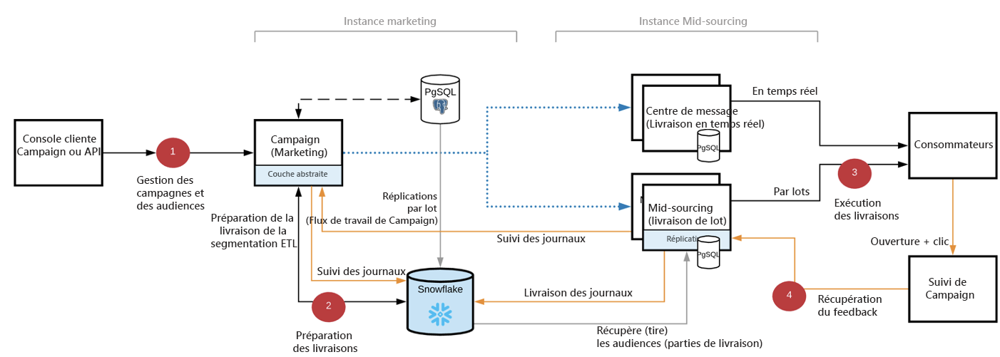
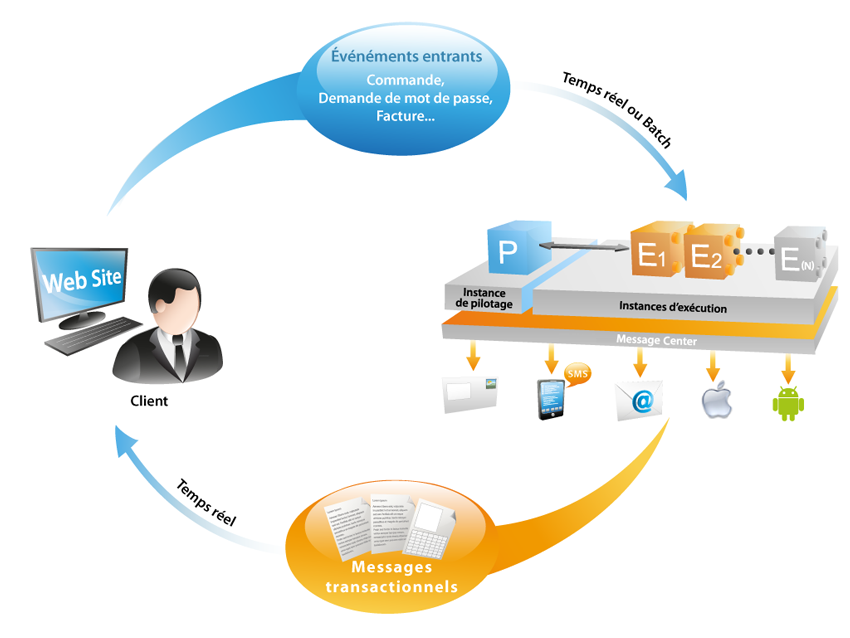

# Prise en main de l’architecture de Campaign{#gs-ac-archi}

## Environnements

Campaign est disponible sous la forme d’instances individuelles, chaque instance représentant un environnement Campaign complet.

Trois types d&#39;environnements sont disponibles avec le Cloud Service Campaign :

* **Environnement** de production : héberge les applications destinées aux professionnels.

* **Environnement d’évaluation** : utilisés pour divers tests de performance et de qualité avant que les modifications apportées à l’application ne soient transmises à l’environnement de production.

* **Environnement** de développement : permet aux développeurs d’implémenter Campaign dans les mêmes conditions d’exécution que les environnements d’évaluation et de production.

Vous pouvez exporter et importer des packages d’un environnement à un autre.

:[!DNL :arrow_upper_right:] : En savoir plus sur les packages dans la [documentation de Campaign Classic v7](https://experienceleague.adobe.com/docs/campaign-classic/using/getting-started/administration-basics/working-with-data-packages.html)

## Déploiement Mid-sourcing{#mid-sourcing-deployment}

La communication générale entre les serveurs et les processus est réalisée conformément au schéma suivant :

* Les modules de diffusion et de gestion des mails rebonds sont désactivés sur l&#39;instance.

* L&#39;application est configurée pour déléguer les envois des messages à un serveur de mid-sourcing distant via des appels SOAP (sur HTTP ou HTTPS).

>[!NOTE]
>
> Campaign v8 repose sur une architecture hybride. Si vous effectuez une transition depuis Campaign Classic v7, notez que toutes les diffusions passent par le serveur de mid-sourcing.
> Par conséquent, le routage interne est **impossible** dans Campaign v8 et le compte externe a été désactivé en conséquence.

## Architecture de Message Center{#transac-msg-archi}

Les messages transactionnels (Message Center) sont le module Campaign conçu pour gérer les messages de déclenchement.

[!DNL :bulb:] Découvrez comment envoyer des messages transactionnels dans  [cette section](../send/transactional.md).

En réponse à l’action d’un client sur un site web, un événement est envoyé à Campaign par le biais d’une API REST. Le modèle de message est renseigné avec les informations ou les données fournies par le biais de l’appel API et un message transactionnel est envoyé en temps réel au client. Ces messages peuvent être envoyés individuellement ou par lots par email, SMS ou notifications push.

Dans cette architecture spécifique, la cellule d&#39;exécution est séparée de l&#39;instance de pilotage pour assurer une haute disponibilité et une gestion de la charge.

* L’ **instance de contrôle** (ou instance marketing) est utilisée par les marketeurs et les équipes informatiques pour créer, configurer et publier des modèles de messages. Cette instance centralise également la surveillance et l’historique des événements.

   [!DNL :bulb:] Découvrez comment créer et publier des modèles de messages dans  [cette section](../send/transactional.md).

* **L’instance d’exécution** renvoie les événements entrants (réinitialisation du mot de passe ou commandes depuis un site web, par exemple) et envoie des messages personnalisés. Il peut y avoir plusieurs instances d&#39;exécution pour traiter les messages via l&#39;équilibreur de charge et augmenter le nombre d&#39;événements à mettre en place pour une disponibilité maximale.

>[!CAUTION]
>
>L&#39;instance de contrôle et la ou les instances d&#39;exécution doivent être installées sur des machines différentes. Elles ne peuvent pas partager la même instance Campaign.

:[!DNL :arrow_upper_right:] : L’architecture de Message Center est décrite dans la [documentation de Campaign Classic v7](https://experienceleague.adobe.com/docs/campaign-classic/using/transactional-messaging/introduction/transactional-messaging-architecture.html?lang=en#transactional-messaging)

### Authentification

Pour utiliser ces fonctionnalités, les utilisateurs d’Adobe Campaign se connectent à l’instance de pilotage afin de créer des modèles de messages transactionnels, de générer l’aperçu du message à l’aide d’une liste de contrôle, d’afficher des rapports et de surveiller les instances d’exécution.

* Instance d’exécution unique
Lors de l’interaction avec une instance d’exécution Message Center hébergée par un Adobe, un système externe peut d’abord récupérer un jeton de session (qui, par défaut, expire dans 24 heures), en effectuant un appel d’api vers la méthode de connexion de session, à l’aide d’un identifiant de compte et d’un mot de passe fournis.
Ensuite, avec le sessionToken fourni par l’instance d’exécution en réponse à l’appel ci-dessus, l’application externe peut lancer des appels d’api SOAP (rtEvents ou batchEvents) pour envoyer des communications, sans avoir à inclure dans chaque appel SOAP le login et le mot de passe du compte.

* Plusieurs instances d’exécution
Dans une architecture d’exécution multi-cellules avec plusieurs instances d’exécution derrière un équilibreur de charge, la méthode de connexion appelée par l’application externe passe par l’équilibreur de charge : pour cette raison, une authentification par jeton ne peut pas être utilisée. Une authentification par mot de passe/utilisateur est requise.

:[!DNL :arrow_upper_right:] : En savoir plus sur les événements de messages transactionnels dans la [documentation de Campaign Classic v7](https://experienceleague.adobe.com/docs/campaign-classic/using/transactional-messaging/introduction/event-description.html?lang=en#about-transactional-messaging-datamodel)