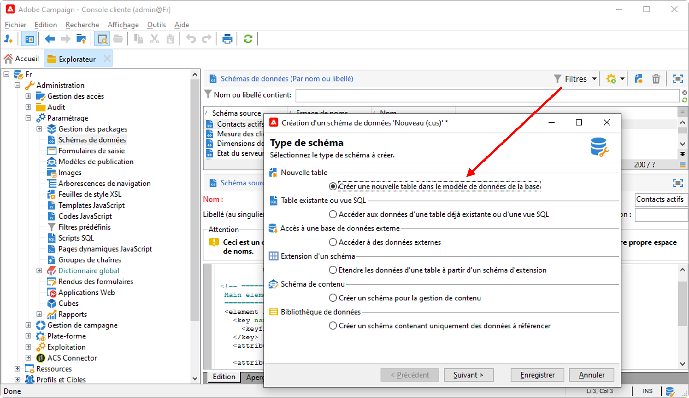

# Création d’un schéma{#create-new-schema}

Pour modifier, créer et paramétrer les schémas, cliquez sur le nœud **[!UICONTROL Administration > Paramétrage > Schémas de données]** de la console client Adobe Campaign.

>[!NOTE]
>
>Les schémas de données prédéfinis peuvent uniquement être supprimés par un administrateur de votre console Adobe Campaign Classic.


L’onglet **[!UICONTROL Édition]** affiche le contenu XML d’un schéma :


>[!NOTE]
>
>Le contrôle d’édition « Nom » permet de saisir la clé du schéma, composée du nom et de l’espace de noms. Les attributs « name » et « namespace » de l’élément racine du schéma sont automatiquement mis à jour dans la zone d’édition XML du schéma. Notez que certains espaces de noms sont internes uniquement. [En savoir plus](schemas.md#reserved-namespaces).

L’onglet **[!UICONTROL Aperçu]** génère automatiquement le schéma étendu :


>[!NOTE]
>
>L’enregistrement du schéma source lance automatiquement la génération du schéma étendu.

Si vous devez vérifier la structure complète d’un schéma, vous pouvez utiliser l’onglet **[!UICONTROL Aperçu]**. Si le schéma a été étendu, vous serez alors en mesure de visualiser toutes ses extensions. En complément, l’onglet **[!UICONTROL Documentation]** affiche tous les attributs et les éléments du schéma, ainsi que leurs propriétés (champ SQL, type/longueur, libellé, description). L’onglet **[!UICONTROL Documentation]** s’applique uniquement aux schémas générés.

## Cas d’utilisation : créer une table des contrats {#example--creating-a-contract-table}

L’exemple suivant montre la création d’une table pour les **contrats** dans la base de données. Cette table vous permet de stocker les noms, prénoms et adresses e-mail des titulaires et co-titulaires pour chaque contrat.

Pour cela, vous devez créer le schéma de la table puis procéder à la mise à jour de la structure de la base pour générer la table correspondante. Les étapes détaillées sont répertoriées ci-dessous.

1. Modifiez le nœud **[!UICONTROL Administration > Paramétrage > Schémas de données]** de l’arborescence Adobe Campaign et cliquez sur l’icône **[!UICONTROL Nouveau]**.
1. Sélectionnez l’option **[!UICONTROL Créer une nouvelle table dans le modèle de données de la base]** et cliquez sur **[!UICONTROL Suivant]**.

   

1. Indiquez le nom de la table et son espace de noms.

   

   >[!NOTE]
   >
   >Par défaut, les schémas créés par les utilisateurs sont stockés dans l’espace de noms « cus ». Voir à ce propos la section [Identification d&#39;un schéma](extend-schema.md#identification-of-a-schema).

1. Créez le contenu de la table. Nous vous recommandons d’utiliser l’assistant dédié pour vous assurer qu’aucun paramètre n’est manquant. Pour ce faire, cliquez sur le bouton **[!UICONTROL Insérer]** et sélectionnez le type de paramètre à ajouter.

   

1. Définissez les paramètres de la table des contrats :

   ```
   <srcSchema created="YYYY-MM-DD HH:MM:SS.TZ" desc="Active contracts" img="crm:crm/mscrm/mscrm_account_16x16.png"
           label="Contracts" labelSingular="Contract" lastModified="YYYY-MM-DD HH:MM:SS.TZ"
           mappingType="sql" name="Contracts" namespace="cus" xtkschema="xtk:srcSchema">
      <element dataSource="nms:extAccount:ffda" desc="Active contracts" img="crm:crm/mscrm/mscrm_account_16x16.png"
           label="Contracts" labelSingular="Contract" name="Contracts">
           <attribute name="holderName" label="Holder last name" type="string"/>
           <attribute name="holderFirstName" label="Holder first name" type="string"/>
           <attribute name="holderEmail" label="Holder email" type="string"/>
           <attribute name="co-holderName" label="Co-holder last name" type="string"/>           
           <attribute name="co-holderFirstName" label="Co-holder first name" type="string"/>           
           <attribute name="co-holderEmail" label="Co-holder email" type="string"/>    
           <attribute name="date" label="Subscription date" type="date"/>     
           <attribute name="noContract" label="Contract number" type="long"/> 
      </element>
   </srcSchema>
   ```

   Ajoutez le type d’énumération de contrat.

   ```
   <srcSchema created="AA-MM-DD HH:MM:SS.TZ" desc="Active contracts" img="crm:crm/mscrm/mscrm_account_16x16.png" label="Contracts" labelSingular="Contract" AA-MM-DD HH:MM:SS.TZ"mappingType="sql" name="Contracts" namespace="cus" xtkschema="xtk:srcSchema">
      <enumeration basetype="byte" name="typeContract">
         <value label="Home" name="home" value="0"/>
         <value label="Car" name="car" value="1"/>
         <value label="Health" name="health" value="2"/>
         <value label="Pension fund" name="pension fund" value="2"/>
      </enumeration>
      <element dataSource="nms:extAccount:ffda" desc="Active contracts" img="crm:crm/mscrm/mscrm_account_16x16.png"
           label="Contracts" labelSingular="Contract" name="Contracts">
           <attribute name="holderName" label="Holder last name" type="string"/>
           <attribute name="holderFirstName" label="Holder first name" type="string"/>
           <attribute name="holderEmail" label="Holder email" type="string"/>
           <attribute name="co-holderName" label="Co-holder last name" type="string"/>           
           <attribute name="co-holderFirstName" label="Co-holder first name" type="string"/>           
           <attribute name="co-holderEmail" label="Co-holder email" type="string"/>    
           <attribute name="date" label="Subscription date" type="date"/>     
           <attribute name="noContract" label="Contract number" type="long"/> 
      </element>
   </srcSchema>
   ```

1. Enregistrez le schéma et cliquez sur l’onglet **[!UICONTROL Structure]** pour générer la structure :

   

1. Mettez à jour la structure de la base de données pour créer la table à laquelle le schéma sera lié. Pour plus d’informations à ce sujet, consultez [cette section](update-database-structure.md).

