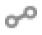

# Mapping de la base de données{#database-mapping}

Le mapping SQL de notre schéma d&#39;exemple donne le document XML suivant :

```
<schema mappingType="sql" name="recipient" namespace="cus" xtkschema="xtk:schema">
  <enumeration basetype="byte" name="gender">    
    <value label="Not specified" name="unknown" value="0"/>    
    <value label="Male" name="male" value="1"/>    
    <value label="Female" name="female" value="2"/> 
  </enumeration>  

  <element name="recipient" sqltable="CusRecipient">    
    <attribute desc="Recipient e-mail address" label="Email" length="80" name="email" sqlname="sEmail" type="string"/>    
    <attribute default="GetDate()" label="Date of creation" name="created" sqlname="tsCreated" type="datetime"/>    
    <attribute enum="gender" label="Gender" name="gender" sqlname="iGender" type="byte"/>    
    <element label="Location" name="location">      
      <attribute label="City" length="50" name="city" sqlname="sCity" type="string" userEnum="city"/>    
    </element>  
  </element>
</schema>
```

## Description {#description}

L&#39;élément racine du schéma n&#39;est plus **`<srcschema>`**, mais **`<schema>`**.

Nous sommes sur un autre type de document qui est généré automatiquement à partir du schéma source, on parle alors simplement de schéma. C&#39;est ce schéma qui sera utilisé par l&#39;application Adobe Campaign.

Les noms SQL sont déduits automatiquement en fonction du nom et du type de l&#39;élément.

Les règles de nommage des noms SQL sont les suivantes :

* table : concaténation de l&#39;espace de noms et du nom du schéma

   Dans notre exemple le nom de la table est renseigné à partir de l&#39;élément principal du schéma dans l&#39;attribut **sqltable** :

   ```
   <element name="recipient" sqltable="CusRecipient">
   ```

* champ : nom de l&#39;élément précédé d&#39;un préfixe défini en fonction de son type (&#39;i&#39; pour entier, &#39;d&#39; pour double, &#39;s&#39; pour chaîne, &#39;ts&#39; pour les dates, etc.)

   Le nom du champ est renseigné à partir de l&#39;attribut **sqlname** pour chaque **`<attribute>`** et **`<element>`** typé :

   ```
   <attribute desc="E-mail address of recipient" label="Email" length="80" name="email" sqlname="sEmail" type="string"/> 
   ```

>[!NOTE]
>
>Les noms SQL peuvent être surchargés à partir du schéma source, il faut renseigner les attributs &quot;sqltable&quot; ou &quot;sqlname&quot; sur l&#39;élément concerné.

Le script SQL de création de la table généré à partir du schéma étendu est le suivant :

```
CREATE TABLE CusRecipient(
  iGender NUMERIC(3) NOT NULL Default 0,   
  sCity VARCHAR(50),   
  sEmail VARCHAR(80),
  tsCreated TIMESTAMP Default NULL);
```

Les contraintes des champs SQL sont les suivantes :

* pas de valeurs nulles sur les types numériques et dates,
* les champs numériques sont initialisés à 0.

## Champs XML {#xml-fields}

Par défaut, tout élément **`<attribute>`** et **`<element>`** typé est mappé sur un champ SQL de la table du schéma de données. Vous pouvez toutefois référencer ce champ au format XML plutôt que SQL, ce qui signifie que les données sont stockées dans un champ mémo (&quot;mData&quot;) de la table contenant les valeurs de tous les champs XML. Le stockage de ces données est un document XML qui respecte la structure du schéma.

Pour renseigner un champ en XML, il faut ajouter l&#39;attribut **xml** avec la valeur &quot;true&quot; sur l&#39;élément concerné.

**Exemple** : voici deux exemples d&#39;utilisation des champs de type XML.

* Champ commentaire multi-lignes :

   ```
   <element name="comment" xml="true" type="memo" label="Comment"/>
   ```

* Description de données au format HTML :

   ```
   <element name="description" xml="true" type="html" label="Description"/>
   ```

   Le type &quot;html&quot; permet de stocker le contenu HTML dans une balise CDATA et d&#39;afficher un contrôle spécifique d&#39;édition HTML dans l&#39;interface cliente Adobe Campaign.

L&#39;utilisation de champs XML permet d&#39;ajouter des champs sans avoir à modifier la structure physique de la base. Un autre avantage est d&#39;utiliser moins de ressources (taille alouée des champs SQL, limite sur le nombre de champs par table, etc.).

## Gestion des clés {#management-of-keys}

Une table doit posséder au moins une clé permettant d&#39;identifier un enregistrement de la table.

Une clé est déclarée à partir de l&#39;élément principal du schéma de données.

```
<key name="name_of_key">
  <keyfield xpath="xpath_of_field1"/>
  <keyfield xpath="xpath_of_field2"/>
  ...
</key>
```

Les clés suivent les règles suivantes :

* Une clé peut référencer un ou plusieurs champs de la table.
* Une clé est dite primaire (ou prioritaire) lorsqu&#39;elle est renseignée en premier dans le schéma ou si elle contient l&#39;attribut **internal** avec la valeur &quot;true&quot;.

**Exemple**:

* Ajout d&#39;une clé sur l&#39;email et la ville :

   ```
   <srcSchema name="recipient" namespace="cus">
     <element name="recipient">
       <key name="email">
         <keyfield xpath="@email"/> 
         <keyfield xpath="location/@city"/> 
       </key>
   
       <attribute name="email" type="string" length="80" label="Email" desc="E-mail address of recipient"/>
       <element name="location" label="Location">
         <attribute name="city" type="string" length="50" label="City" userEnum="city"/>
       </element>
     </element>
   </srcSchema>
   ```

   Le schéma généré :

   ```
   <schema mappingType="sql" name="recipient" namespace="cus" xtkschema="xtk:schema">  
     <element name="recipient" sqltable="CusRecipient">    
      <key name="email">      
       <keyfield xpath="@email"/>      
       <keyfield xpath="location/@city"/>    
      </key>    
   
      <attribute desc="E-mail address of recipient" label="Email" length="80" name="email" sqlname="sEmail" type="string"/>    
      <element label="Location" name="location">      
        <attribute label="City" length="50" name="city" sqlname="sCity" type="string" userEnum="city"/>    
      </element>  
     </element>
   </schema>
   ```

* Ajout d&#39;une clé primaire ou interne sur le champ de nom &quot;id&quot; :

   ```
   <srcSchema name="recipient" namespace="cus">
     <element name="recipient">
       <key name="id" internal="true">
         <keyfield xpath="@id"/> 
       </key>
   
       <key name="email">
         <keyfield xpath="@email"/> 
       </key>
   
       <attribute name="id" type="long" label="Identifier"/>
       <attribute name="email" type="string" length="80" label="Email" desc="E-mail address of recipient"/>
     </element>
   </srcSchema>
   ```

   Le schéma généré :

   ```
   <schema mappingType="sql" name="recipient" namespace="cus" xtkschema="xtk:schema">  
     <element name="recipient" sqltable="CusRecipient">    
       <key name="email">      
         <keyfield xpath="@email"/>    
       </key>  
   
       <key internal="true" name="id">      
        <keyfield xpath="@id"/>    
       </key>    
   
       <attribute label="Identifier" name="id" sqlname="iRecipientId" type="long"/>    
       <attribute desc="E-mail address of recipient" label="Email" length="80" name="email" sqlname="sEmail" type="string"/>  
     </element>
   </schema>
   ```

### Clé primaire - Identifiant{#primary-key}

Dans le contexte d’un [Déploiement Entreprise (FFDA)](../architecture/enterprise-deployment.md), la clé Principale des tables Adobe Campaign est une **Identifiant unique universel (UUID)** généré automatiquement par le moteur de base de données. La valeur de clé est unique pour l&#39;ensemble de la base de données. Le contenu de la clé est automatiquement généré à l&#39;insertion de l&#39;enregistrement.

**Exemple**

Déclaration d&#39;une clé incrémentale dans le schéma source :

```
<srcSchema name="recipient" namespace="cus">
  <element name="recipient"  autopk="true" autouuid="true">
  ...
  </element>
</srcSchema>
```

Le schéma généré :

```
<schema mappingType="sql" name="recipient" namespace="cus" xtkschema="xtk:schema">  
  <element name="recipient"  autopk="true" autouuid="true" sqltable="CusRecipient"> 

    <key internal="true" name="id">
      <keyfield xpath="@id"/>
    </key>

    <attribute desc="Internal primary key" label="Primary key" name="id" sqlname="iRecipientId" type="long"/>
  </element>
</schema>
```

Outre la définition de la clé, un champ numérique nommé &quot;id&quot; a été ajouté dans le schéma étendu afin de contenir la clé primaire générée automatiquement.

>[!CAUTION]
>
>Un enregistrement avec une clé primaire à 0 est automatiquement inséré à la création de la table. Cet enregistrement est utilisé pour éviter les jointures externes, non efficaces sur les tables à volumes. Par défaut, toutes les clés étrangères sont initialisées avec la valeur 0, ce qui permet de toujours retourner un résultat sur la jointure lorsque la donnée n&#39;est pas renseignée.

## Liens : relation entre les tables {#links--relation-between-tables}

Un lien décrit l&#39;association d&#39;une table vers une autre table.

Les différents types d&#39;associations (dites &quot;cardinalités&quot;) sont les suivants :

* cardinalité 1-1 : à une occurrence de la table source peut correspondre au plus une occurrence de la table cible,
* cardinalité 1-N : à une occurrence de la table source peuvent correspondre plusieurs occurrences de la table cible, mais à une occurrence de la table cible peut correspondre au plus une occurrence de la table source,
* cardinalité N-N : à une occurrence de la table source peuvent correspondre plusieurs occurrences de la table cible et vice versa.

Dans l&#39;interface, vous pouvez distinguer facilement les différents types de relations grâce à leurs icônes.

Pour les relations de jointure avec une table/base de données de campagne :

*  : Cardinalité 1-1. Par exemple, entre un destinataire et une commande en cours. Un destinataire ne peut être associé qu&#39;à une seule occurrence à la fois de la table des commandes actuelle.
*  : Cardinalité 1-1, jointure externe. Par exemple, entre un destinataire et son pays. Un destinataire ne peut être associé qu&#39;à une seule occurrence dans la table des pays. Le contenu de la table des pays ne sera pas enregistré.
*  : Cardinalité 1-N. Par exemple, entre un destinataire et la table des abonnements. Un destinataire peut être associé à plusieurs occurrences dans la table des abonnements.

Pour les relations de jointure à l&#39;aide de Federated Database Access :

*  : Cardinalité 1-1
*  : Cardinalité 1-N

 Pour plus d&#39;informations sur les tables FDA, consultez la section [Federated Data Access](../connect/fda.md).

Un lien doit être déclaré dans le schéma possédant la clé étrangère de la table liée à partir de l&#39;élément principal :

```
<element name="name_of_link" type="link" target="key_of_destination_schema">
  <join xpath-dst="xpath_of_field1_destination_table" xpath-src="xpath_of_field1_source_table"/>
  <join xpath-dst="xpath_of_field2_destination_table" xpath-src="xpath_of_field2_source_table"/>
  ...
</element>
```

Les liens suivent les règles suivantes :

* La définition d&#39;un lien est renseignée sur un **`<element>`** de type **link** avec les attributs suivants :

   * **name** : nom du lien à partir de la table source,
   * **target** : nom du schéma cible,
   * **label** : libellé du lien,
   * **revLink** (optionnel) : nom du lien reverse à partir du schéma cible (déduit automatiquement par défaut),
   * **integrity** (optionnel) : intégrité référentielle de l&#39;occurrence de la table source envers l&#39;occurrence de la table cible. Les valeurs possibles sont les suivantes :

      * **define**: la suppression de l&#39;occurrence source est possible si elle n&#39;est plus référencée par une occurrence cible,
      * **normal** : la suppression de l&#39;occurrence source initialise les clés du lien sur l&#39;occurrence cible (mode par défaut), ce type d&#39;intégrité initiliase toutes les clés étrangères,
      * **own** : la suppression de l&#39;occurrence source entraîne la suppression de l&#39;occurrence cible,
      * **owncopy** : idem **own** (en cas de suppression) ou duplique les occurrences (en cas de duplication),
      * **neutral** : ne fait rien.
   * **revIntegrity** (optionnel) : intégrité sur le schéma cible (optionnel, &quot;normal&quot; par défaut),
   * **revCardinality** (optionnel) : avec la valeur &quot;single&quot; renseigne la cardinalité de type 1-1 (par défaut 1-N).
   * **externalJoin** (optionnel) : force la jointure externe
   * **revExternalJoin** (optionnel) : force la jointure externe sur le lien reverse


* Un lien fait référence à un ou plusieurs champs de la table source vers la table de destination. Il n&#39;est pas nécessaire de renseigner les champs constituant l&#39;élément `<join>`, car ils sont automatiquement déduits par défaut à l&#39;aide de la clé interne du schéma cible.
* Un lien est composé de deux demi-liens, le premier est déclaré à partir du schéma source et le second est créé automatiquement dans le schéma étendu du schéma cible.
* La jointure d&#39;un lien peut être externe (&quot;external join&quot;) en ajoutant l&#39;attribut **externalJoin** avec la valeur &quot;true&quot; (supporté sous PostgreSQL).

>[!NOTE]
>
>Les liens sont les éléments déclarés en fin de schéma.

### Exemple 1 {#example-1}

Relation 1-N vers la table de schéma &quot;cus:company&quot; :

```
<srcSchema name="recipient" namespace="cus">
  <element name="recipient">
    ...
    <element label="Company" name="company" revIntegrity="define" revLabel="Contact" target="cus:company" type="link"/>
  </element>
</srcSchema>
```

Le schéma généré :

```
<schema mappingType="sql" name="recipient" namespace="cus" xtkschema="xtk:schema">  
  <element name="recipient" sqltable="CusRecipient"> 
    ...
    <element label="Company" name="company" revLink="recipient" target="cus:company" type="link">      
      <join xpath-dst="@id" xpath-src="@company-id"/>    
    </element>    
    <attribute advanced="true" label="Foreign key of 'Company' link (field 'id')" name="company-id" sqlname="iCompanyId" type="long"/>
  </element>
</schema>
```

La définition du lien est complétée avec les champs composant la jointure, c&#39;est-à -dire la clé primaire avec son XPath (&quot;@id&quot;) dans le schéma destination et la clé étrangère avec son XPath (&quot;@company-id&quot;) dans le schéma.

La clé étrangère est ajoutée automatiquement dans un élément reprenant les même caractéristiques que le champ associé dans la table destination avec comme convention de nommage le nom du schéma cible suivi du nom du champ associé (&quot;company-id&quot; dans notre exemple).

Le schéma étendu de la cible (&quot;cus:company&quot;) :

```
<schema mappingType="sql" name="company" namespace="cus" xtkschema="xtk:schema">  
  <element name="company" sqltable="CusCompany"  autopk="true" autouuid="true"> 
    <key internal="true" name="id">      
      <keyfield xpath="@id"/>    
    </key>
    ...
    <attribute desc="Internal primary key" label="Primary key" name="id" sqlname="iCompanyId" type="long"/>
    ...
    <element belongsTo="cus:recipient" integrity="define" label="Contact" name="recipient" revLink="company" target="nms:recipient" type="link" unbound="true">      
      <join xpath-dst="@company-id" xpath-src="@id"/>    
    </element>
  </element>
</schema>
```

Un lien réverse vers la table &quot;cus:recipient&quot; a été ajouté avec les paramètres suivant :

* **name** : déduit automatiquement avec le nom du schéma source (peut être forcé avec l&#39;attribut &quot;revLink&quot; dans la définition du lien sur le schéma source)
* **revLink** : nom du lien réverse
* **target** : clé du schéma lié (schéma &quot;cus:recipient&quot;)
* **unbound** : le lien est déclaré comme élément de collection pour une cardinalité 1-N (par défaut)
* **integrity** : par défaut &quot;define&quot; (peut être forcée avec l&#39;attribut &quot;revIntegrity&quot; dans la définition du lien sur le schéma source)

Notez que la variable `autouuid="true"`s’applique dans le contexte d’un [Déploiement Entreprise (FFDA)](../architecture/enterprise-deployment.md) uniquement.

### Exemple 2 {#example-2}

Dans cet exemple, nous déclarons un lien vers la table de schéma &quot;nms:address&quot;. La jointure est externe et est renseignée explicitement avec l&#39;e-mail du destinataire et le champ &quot;@address&quot; de la table liée (&quot;nms:address&quot;).

```
<srcSchema name="recipient" namespace="cus">
  <element name="recipient"> 
    ...
    <element integrity="neutral" label="Info about email" name="emailInfo" revIntegrity="neutral" revLink="recipient" target="nms:address" type="link" externalJoin="true">      
      <join xpath-dst="@address" xpath-src="@email"/>
    </element>
  </element>
</srcSchema>
```

### Exemple 3 {#example-3}

Relation 1-1 vers la table de schéma &quot;cus:extension&quot; :

```
<element integrity="own" label="Extension" name="extension" revCardinality="single" revLink="recipient" target="cus:extension" type="link"/>
```

### Exemple 4 {#example-4}

Lien sur un dossier (schéma &quot;xtk:folder&quot;) :

```
<element default="DefaultFolder('nmsFolder')" label="Folder" name="folder" revDesc="Recipients in the folder" revIntegrity="own" revLabel="Recipients" target="xtk:folder" type="link"/>
```

La valeur par défaut retourne l&#39;identifiant du premier dossier éligible de type du paramètre renseigné dans la fonction &quot;DefaultFolder(&#39;nmsFolder&#39;)&quot;.

### Exemple 5 {#example-5}

Dans cet exemple, on souhaite créer une clé sur un lien (&quot;company&quot; vers le schéma &quot;cus:company&quot;) avec l&#39;attribut **xlink** et un champ de la table (&quot;email&quot;) :

```
<srcSchema name="recipient" namespace="cus">
  <element name="recipient">
    <key name="companyEmail"> 
      <keyfield xpath="@email"/>
      <keyfield xlink="company"/>
    </key>
    
    <attribute name="email" type="string" length="80" label="Email" desc="Recipient email"/>
    <element label="Company" name="company" revIntegrity="define" revLabel="Contact" target="cus:company" type="link"/>
  </element>
</srcSchema>
```

Le schéma généré :

```
<schema mappingType="sql" name="recipient" namespace="cus" xtkschema="xtk:schema">  
  <element name="recipient" sqltable="CusRecipient"> 
    <key name="companyEmail">      
      <keyfield xpath="@email"/>      
      <keyfield xpath="@company-id"/>    
    </key>

    <attribute desc="E-mail address of recipient" label="Email" length="80" name="email" sqlname="sEmail" type="string"/>
    <element label="Company" name="company" revLink="recipient" target="sfa:company" type="link">      
      <join xpath-dst="@id" xpath-src="@company-id"/>    
    </element>    
    <attribute advanced="true" label="Foreign key of link 'Company' (field 'id')" name="company-id" sqlname="iCompanyId" type="long"/>
  </element>
</schema>
```

La définition de la clé de nom &quot;companyEmail&quot; a été étendue avec la clé étrangère du lien &quot;company&quot;.
