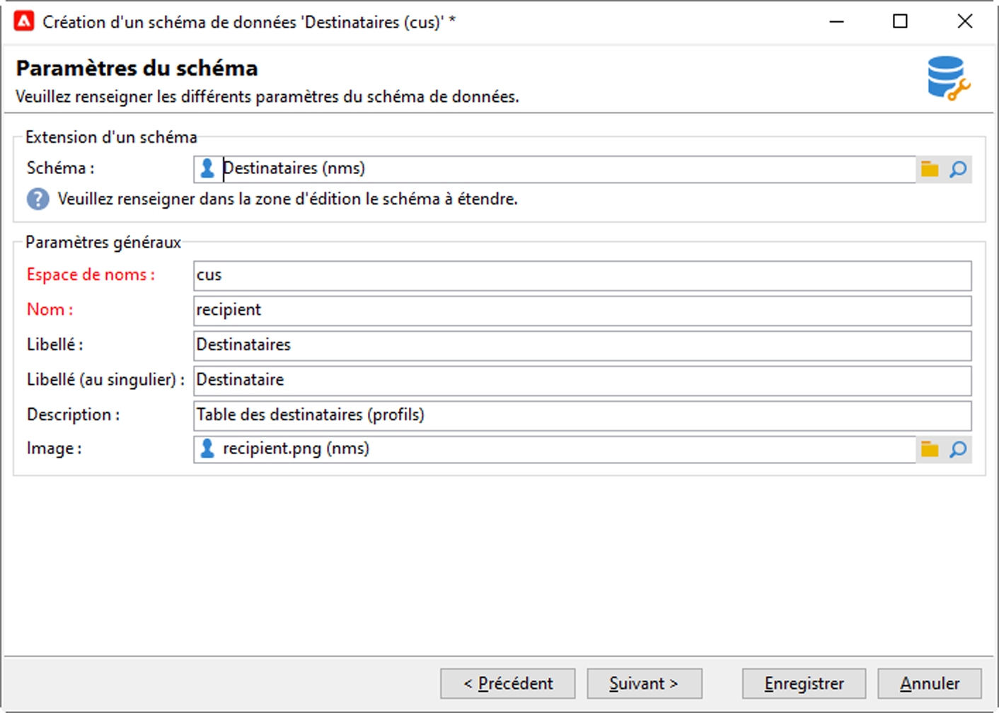

# Étendre un schéma{#extend-schemas}

En tant qu’utilisateur technique, vous pouvez personnaliser le modèle de données Campaign pour répondre aux besoins de votre mise en oeuvre : ajouter des éléments à un schéma existant, modifier un élément dans un schéma ou supprimer des éléments.

Les étapes clés pour personnaliser le modèle de données Campaign sont les suivantes :

1. Création d’un schéma d&#39;extension
1. Mettre à jour la base de données Campaign
1. Adaptez le formulaire de saisie

>[!CAUTION]
>Le schéma intégré ne doit pas être modifié directement. Si vous devez adapter un schéma intégré, vous devez l&#39;étendre.

: bulb: Pour une meilleure compréhension des tableaux intégrés de Campaign et de leur interaction, consultez [cette page](datamodel.md).

Pour étendre un schéma, procédez comme suit :

1. Accédez au dossier **[!UICONTROL Administration > Configuration > Data schémas]** dans l’Explorateur.
1. Cliquez sur le bouton **Nouveau** et sélectionnez **[!UICONTROL Étendre les données d&#39;un tableau à l&#39;aide d&#39;un schéma d&#39;extension]**.

   

1. Identifiez le schéma intégré à étendre et sélectionnez-le.

   

   Par convention, nommez le schéma d&#39;extension de la même manière que le schéma intégré et utilisez un espace de nommage personnalisé.

   

1. Une fois dans l’éditeur de schémas, ajoutez les éléments dont vous avez besoin à l’aide du menu contextuel, puis enregistrez.

   

   Dans l&#39;exemple ci-dessous, nous ajoutons l&#39;attribut MembershipYear, nous fixons une limite de longueur pour le nom (cette limite remplacera la valeur par défaut) et nous supprimons la date de naissance du schéma intégré.

   

   ```
   <srcSchema created="YY-MM-DD" desc="Recipient table" extendedSchema="nms:recipient"
           img="nms:recipient.png" label="Recipients" labelSingular="Recipient" lastModified="YY-MM-DD"
           mappingType="sql" name="recipient" namespace="cus" xtkschema="xtk:srcSchema">
    <element desc="Recipient table" img="nms:recipient.png" label="Recipients" labelSingular="Recipient"
          name="recipient">
   <attribute label="Member since" name="MembershipYear" type="long"/>
   <attribute length="50" name="lastName"/>
   <attribute _operation="delete" name="birthDate"/>
   </element>
   </srcSchema>
   ```
1. Déconnectez-vous et reconnectez-vous à Campaign pour vérifier la mise à jour de la structure du schéma dans l&#39;onglet **[!UICONTROL Structure]**.

   

1. Mettez à jour la structure de la base de données pour appliquer vos modifications. [En savoir plus](update-database-structure.md)

1. Une fois les modifications mises en oeuvre dans la base de données, vous pouvez adapter le formulaire d’entrée du destinataire pour rendre vos modifications visibles. [En savoir plus](forms.md)
