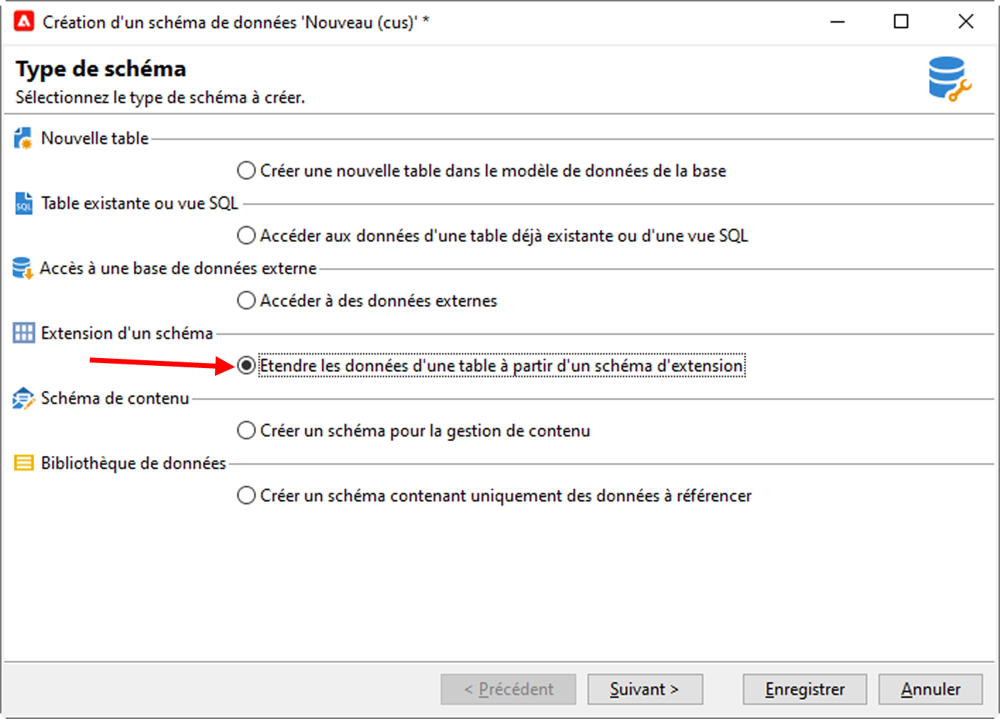
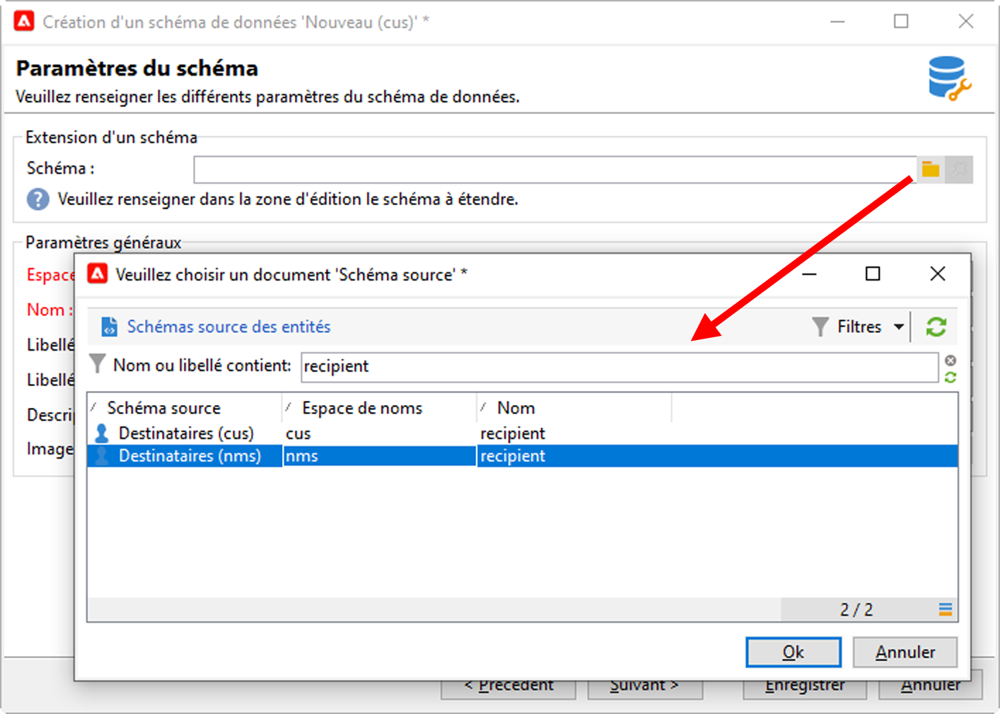

# Extension d’un schéma{#extend-schemas}

En tant qu’utilisateur technique, vous pouvez personnaliser le modèle de données Campaign pour répondre aux besoins de votre implémentation. Vous pouvez notamment ajouter des éléments à un schéma existant, modifier un élément dans un schéma ou supprimer des éléments.

Les étapes clés de personnalisation du modèle de données Campaign sont les suivantes :

1. Création d’un schéma d’extension
1. Mise à jour de la base de données Campaign
1. Adaptation du formulaire de saisie

>[!CAUTION]
>Le schéma prédéfini ne doit pas être modifié directement. Si vous devez adapter un schéma prédéfini, vous devez l’étendre.

[!DNL :bulb:] Pour une meilleure compréhension des tables intégrées de Campaign et de leur interaction, consultez [cette page](datamodel.md).

Pour étendre un schéma, procédez comme suit :

1. Accédez au dossier **[!UICONTROL Administration > Configuration > Schémas de données]** dans l’Explorateur.
1. Cliquez sur le bouton **Nouveau** et sélectionnez **[!UICONTROL Étendre les données d’une table à l’aide d’un schéma d’extension]**.

   

1. Identifiez le schéma prédéfini à étendre et sélectionnez-le.

   

   Par convention, nommez le schéma d’extension de la même manière que le schéma prédéfini et utilisez un espace de noms personnalisé.  Notez que certains espaces de noms sont internes uniquement. [En savoir plus](schemas.md#reserved-namespaces).

   

1. Une fois dans l’éditeur de schémas, ajoutez les éléments dont vous avez besoin à l’aide du menu contextuel, puis enregistrez votre schéma.

   

   Dans l’exemple ci-dessous, nous ajoutons l’attribut MembershipYear, fixons une limite de longueur pour le nom (cette limite remplacera la valeur par défaut) et supprimons la date de naissance du schéma prédéfini.

   

   ```
   <srcSchema created="YYYY-MM-DD" desc="Recipient table" extendedSchema="nms:recipient"
           img="nms:recipient.png" label="Recipients" labelSingular="Recipient" lastModified="YYYY-MM-DD"
           mappingType="sql" name="recipient" namespace="cus" xtkschema="xtk:srcSchema">
    <element desc="Recipient table" img="nms:recipient.png" label="Recipients" labelSingular="Recipient" name="recipient">
       <attribute label="Member since" name="MembershipYear" type="long"/>
       <attribute length="50" name="lastName"/>
       <attribute _operation="delete" name="birthDate"/>
   </element>
   </srcSchema>
   ```

1. Déconnectez-vous et reconnectez-vous à Campaign pour vérifier la mise à jour de la structure du schéma dans l’onglet **[!UICONTROL Structure]**.

   

1. Mettez à jour la structure de la base de données pour appliquer vos modifications. [En savoir plus](update-database-structure.md)

1. Une fois les modifications implémentées dans la base de données, vous pouvez adapter le formulaire de saisie du destinataire pour rendre vos modifications visibles. [En savoir plus](forms.md)
