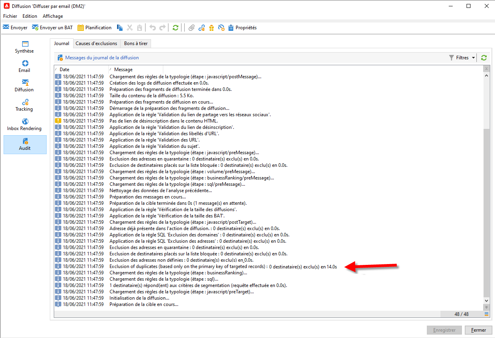
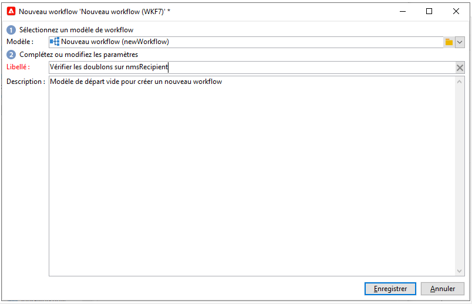
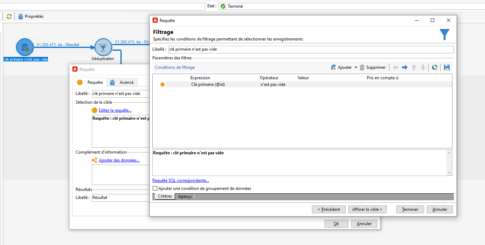
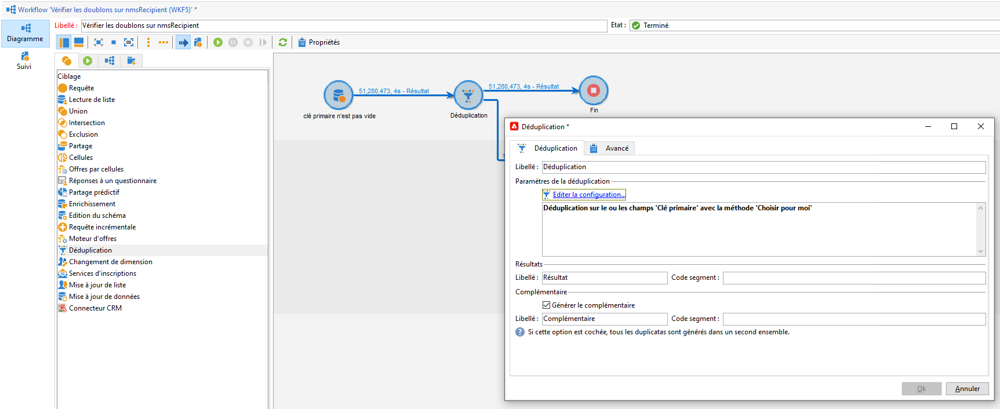
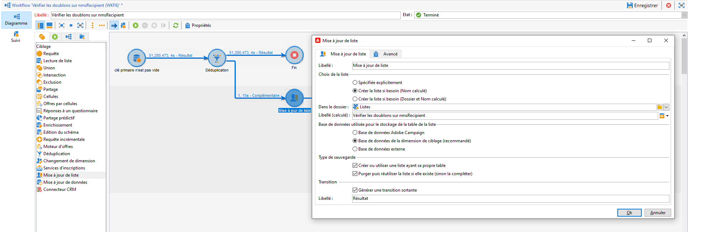
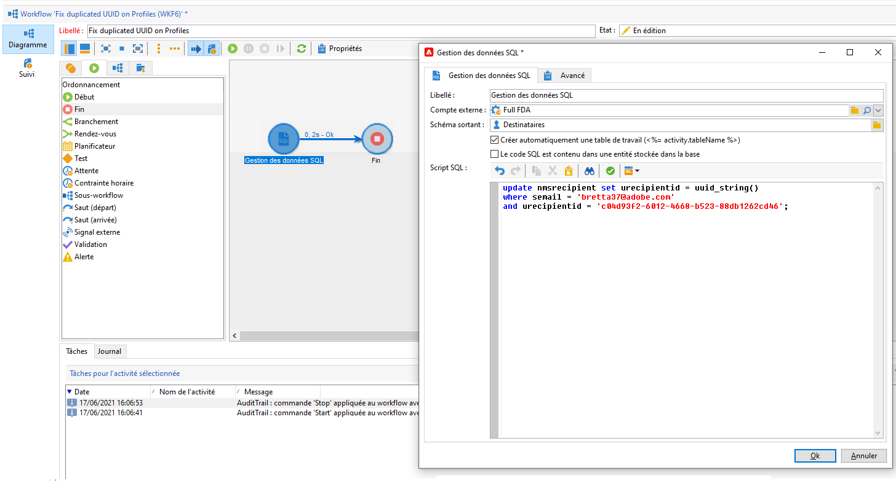

# Gestion des clés et unicité {#key-management}

Dans Campaign v8, la clé primaire est un identifiant universel unique (UUID), qui est une chaîne sur des caractères. Pour créer cet UUID, l&#39;élément principal du schéma doit contenir les attributs **autouuid** et **autopk** définis sur **true**.

Adobe campaign v8 est fourni avec Snowflake comme base de données principale. L&#39;architecture répartie de la base de données Snowflake ne fournit pas de mécanismes permettant de gérer l&#39;unicité d&#39;une clé dans un tableau. Les utilisateurs finaux assurent la cohérence des clés au sein de la base de données Adobe Campaign.

Pour préserver la cohérence de la base de données relationnelle, il est obligatoire d&#39;éviter les doublons sur les clés, et notamment sur les clés primaires. Les doublons sur des clés primaires entraînent des problèmes avec les activités de workflow de gestion des données telles que **Requête**, **Réconciliation**, **Mise à jour de données**, etc.

Adobe recommande d&#39;adopter une stratégie [Détecter](#detect-duplicates) et [Corriger](#correct-duplicates) dans le cadre de votre processus de gestion des données global, en cas de chargement de clés dupliquées dans la base de données.

## Détecter les doublons{#detect-duplicates}

Campaign comprend une nouvelle barrière de sécurité qui supprime automatiquement tout UUID dupliqué d&#39;une audience lors de la préparation de la diffusion. Ce nouveau mécanisme empêche toute erreur lors de la préparation d&#39;une diffusion.

>[!CAUTION]
>
>Les clés dupliquées ne sont pas limitées aux UUID. Cela peut se produire avec les identifiants, y compris les clés personnalisées créées dans les tables personnalisées.

En tant qu&#39;utilisateur final, vous pouvez vérifier ces informations dans les logs de diffusion : certains destinataires peuvent être exclus de la cible principale en raison de la clé dupliquée. Dans ce cas, l&#39;avertissement suivant s&#39;affiche : `Exclusion of duplicates (based on the primary key or targeted records)`.



Si cela arrive, vous pouvez créer un workflow pour identifier les clés en double. Vous pourrez alors corriger ces clés. Pour ce faire, suivez les étapes ci-après :

1. Créez un nouveau workflow.

   

1. Ajoutez une activité **Requête**.
1. Choisissez la table **Destinataire**.

   

1. Ajoutez une activité **Déduplication** et dédupliquez-la sur la clé primaire (UUID). Conservez un seul doublon et cochez l&#39;option **Générer le complémentaire** pour créer une transition sortante pour le ou les doublons.

   

1. Enregistrez le ou les doublons dans une liste à l&#39;aide d&#39;une activité Mise à jour de liste.

   

Vous pouvez désormais accéder directement aux destinataires dupliqués depuis la liste. Même si la transition ne contient que l&#39;une des lignes dupliquées, tous les doublons seront consignés dans la liste.


## Corriger les doublons{#correct-duplicates}

Pour corriger les doublons, les clients doivent mettre à jour les données de Campaign. Le type d&#39;action est étroitement lié à la nature des doublons et à la mise en œuvre. Nous pouvons faire face à de multiples cas qui doivent nécessiter une stratégie d&#39;atténuation différente (suppression, fusion ou mise à jour).

>[!IMPORTANT]
>
>Les clés primaires dupliquées vous empêchent d&#39;utiliser des activités de workflow intégrées pour sélectionner ou mettre à jour une ligne spécifique. En raison de l&#39;UUID dupliqué, la déduplication des données échoue et peut affecter l&#39;intégrité de votre base de données. Il est donc vivement recommandé de corriger les doublons.

Par exemple :

* **Cas 1** : destinataires en double partageant le même UUID et les mêmes informations de profil (même e-mail, prénom, etc.) : les destinataires ressemblent à de &quot;vrais&quot; doublons et l&#39;atténuation pourrait être de supprimer un des doublons.
Une autre approche pourrait consister à fusionner les informations d&#39;un destinataire dans l&#39;autre.

* **Cas 2** : destinataires en double avec le même UUID mais des informations de profil différentes (différent e-mail, prénom, etc.):
cette fois-ci, il semblerait qu&#39;il existe différents profils et que vous vouliez conserver les deux dans la base de données Campaign, ce qui signifie qu&#39;il vaut peut-être mieux mettre à jour l&#39;un des doublons et générer un nouvel UUID. [Apprenez-en davantage dans cet exemple](#deduplicate-sample).

Selon votre stratégie d&#39;atténuation, vous pouvez toujours interroger la liste à partir d&#39;un autre workflow, puis appliquer la mise à jour selon vos besoins. Pour plus d&#39;informations, contactez Adobe.

### Exemple de déduplication{#deduplicate-sample}

En cas de doublon de destinataires, vous pouvez conserver les deux enregistrements dans la base de données Campaign. Dans ce cas, vous devez mettre à jour l&#39;un d&#39;eux avec un nouvel UUID.

Pour exécuter une requête SQL de mise à jour sur une base de données cloud, vous pouvez utiliser l&#39;activité de workflow **Gestion des données SQL** et exécuter la mise à jour SQL suivante :

```sql
update nmsrecipient set urecipientid = uuid_string()
where semail = 'bretta37@adobe.com'
and urecipientid = 'c04d93f2-6012-4668-b523-88db1262cd46';
```



Une fois la ligne sélectionnée mise à jour avec un nouvel UUID, vous pouvez vérifier la ligne mise à jour dans l&#39;interface et constater que l&#39;UUID a été mis à jour comme prévu. Vous pouvez également détecter des doublons dans la base de données en exécutant le workflow **Détecter les doublons** [comme expliqué ici](#detect-duplicates).
