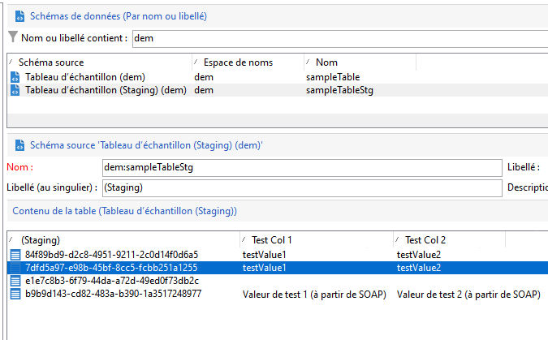
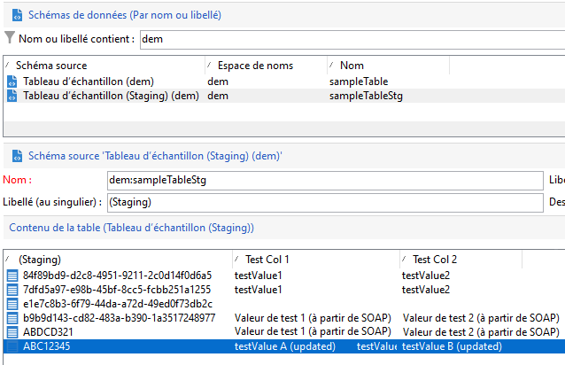
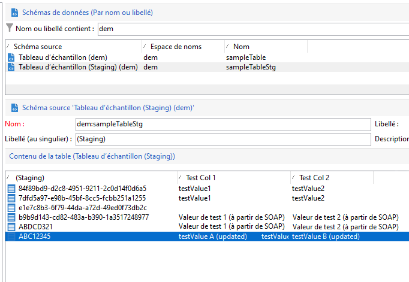

# Nouvelles API de Campaign{#gs-new-api}

Campaign v8 est fourni avec deux nouvelles API pour gérer les données entre la base de données locale Campaign et la base de données Cloud. Les conditions préalables à leur utilisation sont l’activation du mécanisme d’évaluation sur le schéma. [En savoir plus](staging.md).

* API d’ingestion : **xtk.session.ingest**

   Cette API est dédiée uniquement à l’insertion de données. [En savoir plus](#data-insert-api)

* API de mise à jour/suppression des données : **xtk.session.ingestExt**

   Cette API est utilisée pour mettre à jour ou supprimer des données. [En savoir plus](#data-update-api)

Un workflow intégré dédié synchronise les données dans la base de données cloud.

## Insérer des données{#data-insert-api}

L’API **xtk.session.ingest** est réservée à l’insertion de données. Aucune mise à jour/suppression.

### Insertion sans réconciliation

**Dans un workflow**

Utilisez le code suivant dans une activité **Code JavaScript** pour insérer des données dans la base de données Cloud sans réconciliation :

```
var xmlStagingSampleTable = <sampleTableStg
                                testcol1="testValue1"
                                testcol2="testValue2"
                                xtkschema="dem:sampleTableStg">
                            </sampleTableStg>;
strUuid = xtk.session.Ingest(xmlStagingSampleTable);
logInfo(strUuid);
```

Une fois le workflow exécuté, la table d&#39;évaluation est alimentée comme prévu.

**A partir d&#39;un appel SOAP**

1. Obtenez le jeton d’authentification.
1. Déclenchez l’API. La charge utile est la suivante :

   ```
   <soapenv:Envelope xmlns:soapenv="http://schemas.xmlsoap.org/soap/envelope/" xmlns:urn="urn:xtk:session">
   <soapenv:Header/>
   <soapenv:Body>
       <urn:Ingest>
           <urn:sessiontoken>___xxxxxxx-xxxx-xxx-xxx-xxxxxxxxxxx</urn:sessiontoken>
           <urn:domDoc>
               <sampleTableStg
                   testcol1="Test Value 1 (from SOAP)"
                   testcol2="Test Value 2 (from SOAP)"
                   xtkschema="dem:sampleTableStg">
               </sampleTableStg>
           </urn:domDoc>
       </urn:Ingest>
   </soapenv:Body>
   </soapenv:Envelope>
   ```

1. UUID est renvoyé à la réponse SOAP :

   ```
   <SOAP-ENV:Envelope xmlns:xsd="http://www.w3.org/2001/XMLSchema" xmlns:xsi="http://www.w3.org/2001/XMLSchema-instance" xmlns:ns="urn:wpp:default" xmlns:SOAP-ENV="http://schemas.xmlsoap.org/soap/envelope/">
   <SOAP-ENV:Body>
       <IngestResponse SOAP-ENV:encodingStyle="http://schemas.xmlsoap.org/soap/encoding/" xmlns="urn:wpp:default">
           <pstrSUuids xsi:type="xsd:string">e1e7c8b3-6f79-44da-a72d-49ed0f73db2c</pstrSUuids>
       </IngestResponse>
   </SOAP-ENV:Body>
   </SOAP-ENV:Envelope>
   ```

Par conséquent, le tableau intermédiaire est alimenté comme prévu.



### Insérer avec réconciliation

**Dans un workflow**

Utilisez le code suivant dans une activité **Code JavaScript** pour insérer des données dans la base de données Cloud avec réconciliation :

```
var xmlStagingSampleTable = <sampleTableStg  _key="@id" id="ABC12345"
                              testcol1="testValue1"
                              testcol2="testValue2"
                              xtkschema="dem:sampleTableStg">
                            </sampleTableStg>;         
strUuid = xtk.session.Ingest(xmlStagingSampleTable);
logInfo(strUuid);
```

Une fois le workflow exécuté, la table d&#39;évaluation est alimentée comme prévu.




**A partir d&#39;un appel SOAP**

1. Obtenez le jeton d’authentification.
1. Déclenchez l’API. La charge utile est la suivante :

   ```
   <soapenv:Envelope xmlns:soapenv="http://schemas.xmlsoap.org/soap/envelope/" xmlns:urn="urn:xtk:session">
   <soapenv:Header/>
   <soapenv:Body>
     <urn:Ingest>
        <urn:sessiontoken>___5e71f4bf-d38a-4ba8-ac15-35a958f7f138</urn:sessiontoken>
        <urn:domDoc>
           <sampleTableStg  _key="@id" id="ABDCD321"
                testcol1="Test Value 1 (from SOAP)"
                testcol2="Test Value 2 (from SOAP)"
                xtkschema="dem:sampleTableStg">
            </sampleTableStg>
        </urn:domDoc>
     </urn:Ingest>
    </soapenv:Body>
   </soapenv:Envelope>
   ```

1. Dans ce cas, l’UUID n’est pas renvoyé à la réponse, car il a été fourni dans la payload. La réponse est :

   ```
   <SOAP-ENV:Envelope xmlns:xsd="http://www.w3.org/2001/XMLSchema" xmlns:xsi="http://www.w3.org/2001/XMLSchema-instance" xmlns:ns="urn:wpp:default" xmlns:SOAP-ENV="http://schemas.xmlsoap.org/soap/envelope/">
   <SOAP-ENV:Body>
       <IngestResponse SOAP-ENV:encodingStyle="http://schemas.xmlsoap.org/soap/encoding/" xmlns="urn:wpp:default">
           <pstrSUuids xsi:type="xsd:string"/>
       </IngestResponse>
   </SOAP-ENV:Body>
   </SOAP-ENV:Envelope>
   ```

Par conséquent, le tableau intermédiaire est alimenté comme prévu.

## Mise à jour ou suppression de données{#data-update-api}

L’API **xtk.session.IngestExt** est optimisée pour la mise à jour/suppression des données. Pour insérer uniquement, préférez **xtk.session.ingest**. L’insertion fonctionne si la clé d’enregistrement ne se trouve pas dans la table d’évaluation.

### Insérer / mettre à jour

**Dans un workflow**

Utilisez le code suivant dans une activité **Code JavaScript** pour mettre à jour les données de la base de données Cloud :

```
var xmlStagingRecipient = <sampleTableStg  _key="@id" id="ABC12345"
                              testcol1="testValue A (updated)"
                              testcol2="testValue B (updated)"
                              xtkschema="dem:sampleTableStg">
                            </sampleTableStg>;
xtk.session.IngestExt(xmlStagingRecipient);
```

Une fois le workflow exécuté, la table d&#39;évaluation est mise à jour comme prévu.



**A partir d&#39;un appel SOAP**


1. Obtenez le jeton d’authentification.
1. Déclenchez l’API. La charge utile est la suivante :

   ```
   <soapenv:Envelope xmlns:soapenv="http://schemas.xmlsoap.org/soap/envelope/" xmlns:urn="urn:xtk:session">
   <soapenv:Header/>
   <soapenv:Body>
       <urn:IngestExt>
           <urn:sessiontoken>___444cd168-a1e2-4fb6-a2a8-73be9f133489</urn:sessiontoken>
           <urn:domDoc>
           <sampleTableStg  _key="@id" id="ABDCD321"
                   testcol1="Test Value E (from SOAP)"
                   testcol2="Test Value F (from SOAP)"
                   xtkschema="dem:sampleTableStg">
               </sampleTableStg>
           </urn:domDoc>
       </urn:IngestExt>
   </soapenv:Body>
   </soapenv:Envelope>
   ```

1. La réponse SOAP est la suivante :

   ```
   <SOAP-ENV:Envelope xmlns:xsd="http://www.w3.org/2001/XMLSchema" xmlns:xsi="http://www.w3.org/2001/XMLSchema-instance" xmlns:ns="urn:wpp:default" xmlns:SOAP-ENV="http://schemas.xmlsoap.org/soap/envelope/">
   <SOAP-ENV:Body>
       <IngestExtResponse SOAP-ENV:encodingStyle="http://schemas.xmlsoap.org/soap/encoding/" xmlns="urn:wpp:default"/>
   </SOAP-ENV:Body>
   </SOAP-ENV:Envelope>
   ```

Par conséquent, le tableau intermédiaire est mis à jour comme prévu.

## Gestion des abonnements {#sub-apis}

La gestion des abonnements dans Campaign est décrite dans [cette page](../start/subscriptions.md).

L&#39;insertion des données d&#39;inscription et de désinscription repose sur le [mécanisme d&#39;évaluation](staging.md) de la base de données locale de Campaign. Les informations sur les abonnés sont temporaires et stockées dans des tables intermédiaires de la base de données locale. Le workflow de synchronisation envoie ces données de la base locale vers la base de données Cloud. Par conséquent, les processus d’abonnement et de désabonnement sont **asynchrones**. Les demandes d’opt-in et d’opt-out sont traitées toutes les heures par le biais d’un workflow technique spécifique. [En savoir plus](../config/replication.md#tech-wf)


**Rubriques connexes**

* [JSAPI Campaign Classic v7](https://docs.adobe.com/content/help/en/campaign-classic/technicalresources/api/p-1.html)
