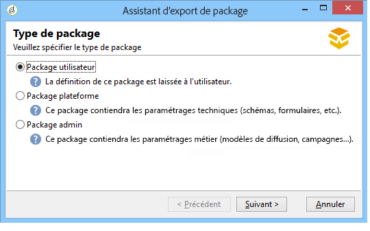
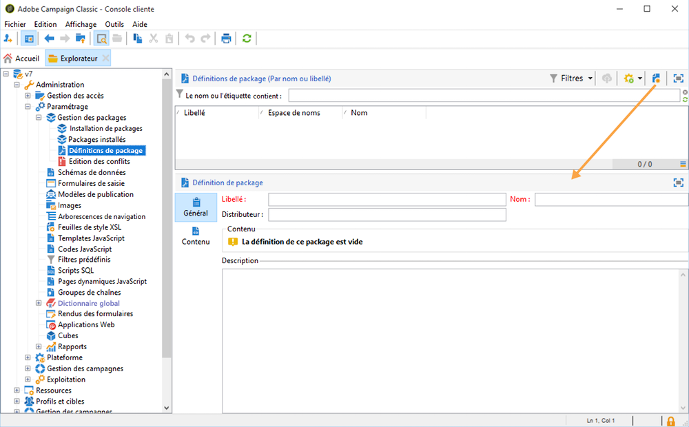
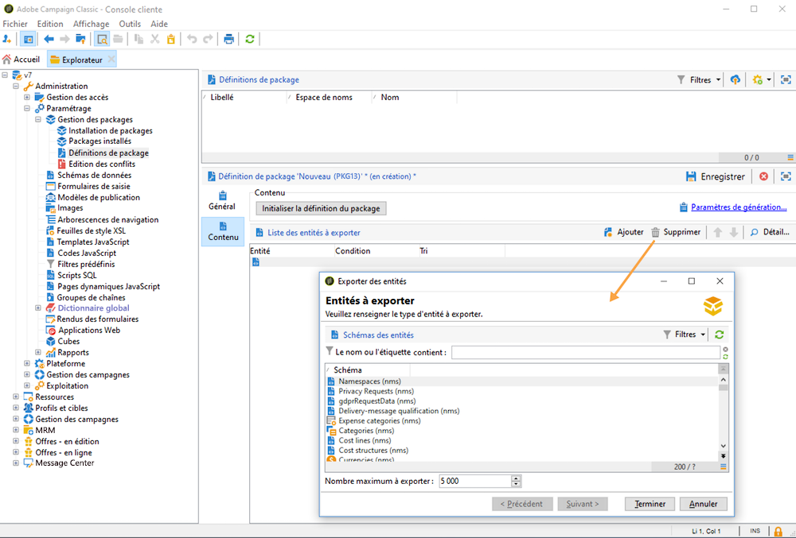
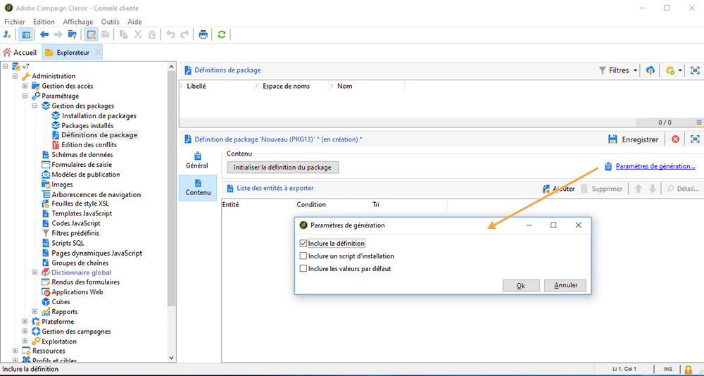

# Utiliser les packages de données{#data-packages}

## Commencer avec les packages {#gs-data-packages}

Vous pouvez utiliser des packages de données pour exporter et importer les données et paramètres personnalisés de votre plateforme. Un package peut contenir différents types de configurations et de composants, filtrés ou non.

Dans les packages de données Campaign, les entités de la base de données Adobe Campaign doivent être affichées dans des fichiers XML. Dans un package, chaque entité est représentée avec toutes ses données.

Le principe des **packages de données** consiste à exporter une configuration de données puis l’intégrer à un autre environnement Adobe Campaign. Découvrez comment conserver un ensemble cohérent de packages de données dans cette [section](#data-package-best-practices).

### Types de packages {#types-of-packages}

Vous pouvez travailler avec trois types de packages dans Adobe Campaign : les packages utilisateur, les packages plateforme et les packages admin.

* Un **package utilisateur** vous permet de choisir la liste des entités à exporter. Ce type de package gère les dépendances et vérifie les erreurs.
* Un **package plateforme** regroupe toutes les ressources techniques ajoutées (non livrées d’usine) : schémas, code JavaScript, etc.
* Un **package admin** regroupe tous les modèles et business objects ajoutés (non livrés d’usine) : modèles, bibliothèques, etc.

>[!CAUTION]
>
>Les packages **plateforme** et **admin** contiennent une liste prédéfinie d’entités à exporter. A chaque entité exportable sont associées des conditions de filtrage permettant d&#39;écarter les ressources livrées d&#39;usine du package créé.

## Structure de données {#data-structure}

La description d’un package de données est un document XML structuré respectant la grammaire du schéma de données **xrk:navtree**, comme dans l’exemple ci-dessous :

```xml
<package>
  <entities schema="nms:recipient">
    <recipient email="john.smith@adobe.com" lastName="Smith" firstName="John">      
      <folder _operation="none" name="nmsRootFolder"/>      
      <company _operation="none" name="Adobe"/>
    </recipient>
  </entities>
  <entities schema="sfa:company">
    <company name="Adobe">
      <location city="London" zipCode="W11 2BQ"/>
    </company>
  </entities>
</package>
```

Le document XML doit commencer et se terminer par l’élément `<package>`. Les éléments `<entities>` suivants répartissent les données par type de document. Un élément `<entities>` contient les données du package au format du schéma de données renseigné dans l’attribut **schema**. Les données d’un package ne doivent pas contenir de clés internes non compatibles entre les bases, comme les clés auto-générées (option **autopk**).

Dans notre exemple, les jointures sur les liens `folder` et `company` ont été remplacées par les clés dites de « haut niveau » sur les tableaux de destinations :

```xml
<recipient>
  <folder _operation="none" name="nmsRootFolder"/>
  <company _operation="none" name="Adobe"/>
</recipient>
```

L’attribut `operation` avec la valeur `none` définit un lien de réconciliation.

Un package de données peut être construit manuellement à partir de n’importe quel éditeur texte. Vous devez vous assurer que la structure du document XML soit conforme au schéma de données `xtk:navtree`. La console cliente est pourvue d’un module d’export et d’import de packages de données.

## Exporter des packages {#export-packages}

Les packages peuvent être exportés de trois manières différentes :

* Utilisez l’assistant d’**[!UICONTROL export de package]** pour exporter un ensemble d’objets dans un package unique. [En savoir plus](#export-a-set-of-objects-in-a-package)
* Pour exporter un **objet unique**, cliquez dessus avec le bouton droit et sélectionnez **[!UICONTROL Actions > Exporter dans un package]**.
* Utilisez les **définitions de packages** pour créer une structure de package dans laquelle vous ajoutez des objets qui seront exportés ultérieurement dans un package. [En savoir plus](#manage-package-definitions)

Une fois un package exporté, vous pourrez l’importer ainsi que toutes les entités ajoutées dans une autre instance Campaign.

### Exporter un ensemble d’objets dans un package {#export-a-set-of-objects-in-a-package}

Pour exporter un ensemble d’objets dans un package de données, procédez comme suit :

1. Accédez à l’assistant d’export de package via le menu **[!UICONTROL Outils > Avancé > Exporter le package…]** de l’explorateur.
1. Sélectionnez les [types de packages](#types-of-packages).

   

1. Cliquez sur le bouton **Ajouter** pour sélectionner les entités à exporter en tant que package.

   >[!CAUTION]
   >
   >Si vous exportez un dossier de type **[!UICONTROL Catégorie d’offre]**, **[!UICONTROL Environnement d’offre]**, **[!UICONTROL Programme]** ou **[!UICONTROL Plan]**, ne sélectionnez en aucun cas l’entité **xtk:folder** au risque de perdre une partie des données. Sélectionnez l’entité correspondant au dossier : **nms:offerCategory** pour les catégories d’offres, **nms:offerEnv** pour les environnements d’offres, **nms:program** pour les programmes et **nms:plan** pour les plans.

   Le mécanisme de dépendance contrôle la séquence d&#39;exportation des entités. Pour plus d&#39;informations, consultez la section [Gestion des dépendances](#manage-dependencies).

1. Cliquez sur **[!UICONTROL Suivant]** et définissez la requête de filtrage sur le type de document à extraire. Vous devez paramétrer la clause de filtrage pour l&#39;extraction des données.

   >[!NOTE]
   >
   >Le requêteur est présenté dans [cette section](../../automation/workflow/query.md).

1. Cliquez sur **[!UICONTROL Suivant]** et sélectionnez l’ordre de tri des données exportées.

1. Prévisualisez les données à extraire pour vérifier votre configuration.

1. La dernière étape de l’assistant d’export de package permet de démarrer l’export. Les données seront stockées dans le fichier indiqué dans le champ **[!UICONTROL Fichier]**.

### Gérer les dépendances {#manage-dependencies}

Le processus d’export effectue le suivi des liens entre les différents éléments exportés. Deux règles définissent le mécanisme :

* Les objets liés par un lien ayant une intégrité de type `own` ou `owncopy` sont exportés dans le même package que l’objet exporté.
* Les objets liés par un lien ayant une intégrité de type `neutral` ou `define` (lien défini) doivent être exportés indépendamment.

>[!NOTE]
>
>Les types d’intégrité liés aux éléments de schéma sont définis sur [cette page](database-links.md).

#### Exporter une campagne {#export-a-campaign}

Vous trouverez ci-dessous un exemple de la manière d’exporter une campagne. La campagne marketing à exporter contient les éléments suivants :
* Une tâche `MyTask`.
* Un `campaignWorkflow` workflow dans le dossier suivant : **[!UICONTROL Administration > Exploitation > Workflows techniques > Processus de campagne > MyWorkflow]**.

La tâche et le workflow sont exportés dans le même package que la campagne, car les schémas correspondants sont reliés par des liens ayant une intégrité de type `own`.

Le contenu du package est le suivant :

```xml
<?xml version='1.0'?>
<package author="Administrator (admin)" buildNumber="7974" buildVersion="7.1" img=""
label="" name="" namespace="" vendor="">
 <desc></desc>
 <version buildDate="2013-01-09 10:30:18.954Z"/>
 <entities schema="nms:operation">
  <operation duration="432000" end="2013-01-14" internalName="OP1" label="MyCampaign"
  modelName="opEmpty" start="2013-01-09">
   <controlGroup>
    <where filteringSchema=""/>
   </controlGroup>
   <seedList>
    <where filteringSchema="nms:seedMember"></where>
    <seedMember internalName="SDM1"></seedMember>
   </seedList>
   <parameter useAsset="1" useBudget="1" useControlGroup="1" useDeliveryOutline="1"
   useDocument="1" useFCPValidation="0" useSeedMember="1" useTask="1"
   useValidation="1" useWorkflow="1"></parameter>
   <fcpSeed>
    <where filteringSchema="nms:seedMember"></where>
   </fcpSeed>
   <owner _operation="none" name="admin" type="0"/>
   <program _operation="none" name="nmsOperations"/>
   <task end="2013-01-17 10:07:51.000Z" label="MyTask" name="TSK2" start="2013-01-16 10:07:51.000Z"
   status="1">
    <owner _operation="none" name="admin" type="0"/>
    <operation _operation="none" internalName="OP1"/>
    <folder _operation="none" name="nmsTask"/>
   </task>
   <workflow internalName="WKF12" label="CampaignWorkflow" modelName="newOpEmpty"
   order="8982" scenario-cs="Notification of the workflow supervisor (notifySupervisor)"
   schema="nms:recipient">
    <scenario internalName="notifySupervisor"/>
    <desc></desc>
    <folder _operation="none" name="Folder4"/>
    <operation _operation="none" internalName="OP1"/>
   </workflow>
  </operation>
 </entities>
</package>   
```

L’appartenance à un type de package est définie dans un schéma avec l’attribut `@pkgAdmin and @pkgPlatform`. Ces deux attributs reçoivent une expression XTK définissant les conditions d’appartenance au package.

```xml
<element name="offerEnv" img="nms:offerEnv.png" 
template="xtk:folder" pkgAdmin="@id != 0">
```

Enfin, l’attribut `@pkgStatus` permet de définir les règles d’export sur les éléments ou attributs. Selon la valeur de l’attribut, l’élément ou l’attribut sera présent dans le package exporté. Les trois valeurs possibles pour cet attribut sont les suivantes :

* `never` : n’exporte pas le champ/lien.
* `always` : force l’export de ce champ.
* `preCreate` : autorise la création de l’entité liée.

>[!NOTE]
>
>La valeur `preCreate` est admise uniquement sur les événements de type lien. Elle autorise à créer une entité qui n’est pas encore chargée dans le package exporté, ou encore à pointer vers celle-ci.

## Gérer les définitions de packages {#manage-package-definitions}

Les définitions de packages vous permettent de créer une structure de package dans laquelle vous ajoutez les entités qui seront exportées ultérieurement dans un même package. Vous pourrez ensuite importer ce package et toutes les entités ajoutées dans une autre instance Campaign.

### Créer une définition de package {#create-a-package-definition}

Les définitions de packages sont accessibles à partir du menu **[!UICONTROL Administration > Paramétrage > Gestion des packages > Définitions de packages]**.

Pour créer une définition de package, cliquez sur le bouton **[!UICONTROL Nouveau]**, puis remplissez les informations générales de la définition de package.



Vous pouvez ensuite ajouter des entités à la définition de package et l&#39;exporter dans un package de fichier XML.

**Rubriques connexes :**

* [Ajouter des entités à une définition de package](#add-entities-to-a-package-definition)
* [Paramétrer la génération des définitions de packages](#configure-package-definitions-generation)
* [Exporter des packages à partir d&#39;une définition de package](#export-packages-from-a-package-definition)

### Ajouter des entités à une définition de package {#add-entities-to-a-package-definition}

Dans l’onglet **[!UICONTROL Contenu]**, cliquez sur le bouton **[!UICONTROL Ajouter]** pour sélectionner les entités à exporter avec le package. Les bonnes pratiques lors de la sélection des entités sont présentées dans [cette section](#export-a-set-of-objects-in-a-package).



Les entités peuvent être ajoutées directement à une définition de package à partir de leur emplacement dans l&#39;instance. Pour ce faire, suivez les étapes ci-dessous :

1. Cliquez avec le bouton droit de la souris sur l&#39;entité désirée, puis sélectionnez **[!UICONTROL Actions > Exporter dans un package]**.

1. Sélectionnez **[!UICONTROL Ajout dans une définition de package]**, puis sélectionnez la définition de package dans laquelle vous voulez ajouter l&#39;entité.

1. L&#39;entité est ajoutée dans la définition de package, elle sera exportée avec le package (voir [cette section](#export-packages-from-a-package-definition)).

### Paramétrer la génération des définitions de packages {#configure-package-definitions-generation}

La génération de packages peut être paramétrée à partir de l&#39;onglet **[!UICONTROL Contenu]** de définition de package. Pour ce faire, cliquez sur le lien **[!UICONTROL Paramètres de génération]**.



* Utilisez l’option **[!UICONTROL Inclure la définition]** pour inclure la définition actuellement utilisée dans la définition de package.
* Utilisez l’option **[!UICONTROL Inclure un script d’installation]** pour ajouter un script JavaScript à exécuter à l’import du package. S’il est sélectionné, un onglet **[!UICONTROL Script]** est ajouté à l’écran de définition de package.
* Utilisez l’option **[!UICONTROL Inclure les valeurs par défaut]** pour ajouter les valeurs de tous les attributs des entités au package.

  Cette option n’est pas sélectionnée par défaut de manière à éviter les exports de longueur importante. Cela signifie que, par défaut, les attributs des entités avec des valeurs par défaut (« chaîne vide », « 0 » et « faux » si elles ne sont pas définies d’une autre façon dans le schéma) ne seront pas ajoutés dans le package et ne seront donc pas exportés.

  >[!CAUTION]
  >
  >Si l’instance où le package est importé contient des entités identiques à celles du package (par exemple, avec le même ID externe), leurs attributs ne seront pas mis à jour. Cela se produit si les attributs d’une instance précédente possèdent des valeurs par défaut, car ils ne sont pas inclus dans le package. Dans ce cas, la sélection de l’option **[!UICONTROL Inclure les valeurs par défaut]** empêcherait la fusion des versions, car tous les attributs de l’instance précédente seraient exportés avec le package.

### Exporter des packages à partir d&#39;une définition de package {#export-packages-from-a-package-definition}

Pour exporter un package à partir d’une définition de package, suivez les étapes ci-dessous :

1. Sélectionnez la définition de package à exporter, puis cliquez sur le bouton **[!UICONTROL Actions]** et sélectionnez **[!UICONTROL Exporter le package]**.
1. Vérifiez le nom et l’emplacement du fichier exporté.
1. Cliquez sur le bouton **[!UICONTROL Démarrer]** pour lancer l’export.

## Importer des packages {#import-packages}

L’assistant d’import de package est accessible à partir du menu principal **[!UICONTROL Outils > Avancé > Import de package]** de la console cliente.

### Installer un package depuis un fichier {#install-a-package-from-a-file}

Pour importer un package de données existant, procédez comme suit :

1. Accéder à l’assistant d’import via le menu principal **[!UICONTROL Outils > Avancé > Import de package]** de la console cliente.
1. Sélectionnez le fichier XML et cliquez sur **[!UICONTROL Ouvrir]**.

Le contenu du package à importer est alors affiché dans la section centrale de l&#39;éditeur.

Cliquez sur **[!UICONTROL Suivant]** puis sur **[!UICONTROL Démarrer]** pour lancer l&#39;import.

### Installer un package natif {#install-a-standard-package}

Les packages intégrés (ou packages standard) sont installés lors de la configuration d’Adobe Campaign. Selon vos autorisations, votre modèle de déploiement et votre offre de produit, vous pouvez importer de nouveaux packages standard.

Reportez-vous à votre contrat de licence pour savoir quels packages peuvent être installés.

## Bonnes pratiques relatives aux packages de données {#data-package-best-practices}

Cette section décrit comment organiser les packages de données de façon cohérente tout au long de la vie du projet.


### Versions

Effectuez toujours l’import dans la même version de la plateforme. Vous devez vérifier que vous déployez vos packages entre deux instances associées au même build. Ne forcez jamais l&#39;import et mettez toujours la plateforme à jour en premier (si le build est différent).

>[!IMPORTANT]
>
>L&#39;import entre différentes versions n&#39;est pas pris en charge par Adobe.

Accordez de l&#39;attention à la structure du schéma et de la base de données. L’import de packages avec schéma doit être suivi de la génération des schémas.

### Types de packages {#package-types}

Commencez par définir différents types de packages. Quatre types seulement sont utilisés :

**Entités**

* Tous les éléments spécifiques « xtk » et « nms » d’Adobe Campaign, tels que les schémas, les formulaires, les dossiers, les modèles de diffusion, etc.
* Vous pouvez considérer une entité à la fois comme un élément « admin » et comme un élément « plateforme ».
* Vous ne devez pas inclure plus d&#39;une entité dans un package lorsque vous le chargez sur une instance Campaign.

Si vous devez déployer votre configuration sur une nouvelle instance, vous pouvez importer tous vos packages d&#39;entités.

**Fonctionnalités**

Ce type de package a les avantages suivants :
* Répond à une exigence/spécification du client.
* Contient une ou plusieurs fonctionnalités.
* Doit contenir toutes les dépendances pour pouvoir exécuter la fonctionnalité sans aucun autre package.

**Campagnes**

Ce package n&#39;est pas obligatoire. Il est parfois utile de créer un type spécifique pour toutes les campagnes, même si une campagne peut être considérée comme une fonctionnalité.

**Mises à jour**

Une fois configurée, une fonctionnalité peut être exportée dans un autre environnement. Par exemple, le package peut être exporté d&#39;un environnement de développement vers un environnement de test. Dans ce test, un défaut est mis en évidence. Il doit être tout d&#39;abord corrigé dans l&#39;environnement de développement. Ensuite, le correctif doit être appliqué à la plateforme de test.

La première solution consisterait à réexporter l&#39;ensemble de la fonctionnalité. Cependant, pour éviter tout risque (comme la mise à jour d&#39;éléments indésirables), il est plus sûr d&#39;avoir un package ne contenant que la correction.

Nous vous recommandons donc de créer un package de « mise à jour » contenant un seul type d’entité pour la fonctionnalité.

Une mise à jour peut non seulement être constituée d&#39;un correctif, mais aussi d&#39;un nouvel élément de votre package d&#39;entité/de fonctionnalité/de campagne. Pour éviter de déployer l&#39;ensemble du package, vous pouvez exporter un package de mise à jour.

### Conventions de dénomination {#data-package-naming}

Les types étant définis, nous devons spécifier une convention de dénomination. Adobe Campaign ne permettant pas de créer des sous-dossiers pour les spécifications de package, les nombres constituent la meilleure solution pour assurer l’organisation. Les nombres servent de préfixes pour les noms de packages.

Par exemple, vous pouvez utiliser la convention suivante :

* Entité : de 1 à 99
* Fonctionnalité : de 100 à 199
* Campagne : de 200 à 299
* Mise à jour : de 5000 à 5999

#### Ordre des packages d’entités {#entity-packages-order}

Pour faciliter l’import, les packages d’entités doivent être classés au fur et à mesure de leur import.

Par exemple :

* 001 – Schéma
* 002 – Formulaire
* 003 – Images
* etc.

>[!NOTE]
>
>Les formulaires ne doivent être importés qu’**après** les mises à jour de schémas.


#### Documentation du package {#package-documentation}

Lorsque vous mettez à jour un package, vous devez toujours insérer un commentaire dans le champ de description pour donner des informations détaillées sur les modifications et les motifs (par exemple, « ajouter un nouveau schéma » ou « corriger un défaut »).

Les bonnes pratiques consistent également à indiquer la date de la mise à jour.

>[!IMPORTANT]
>
>Le champ de description peut contenir 2 000 caractères au maximum.
