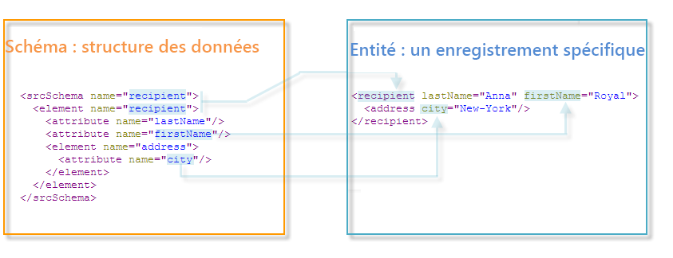
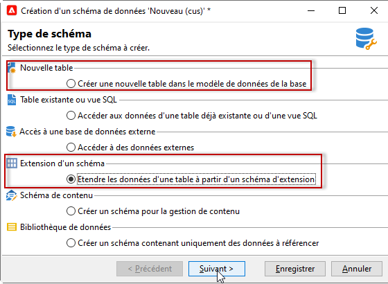
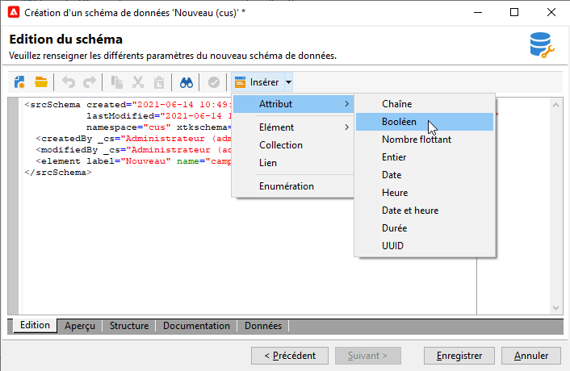
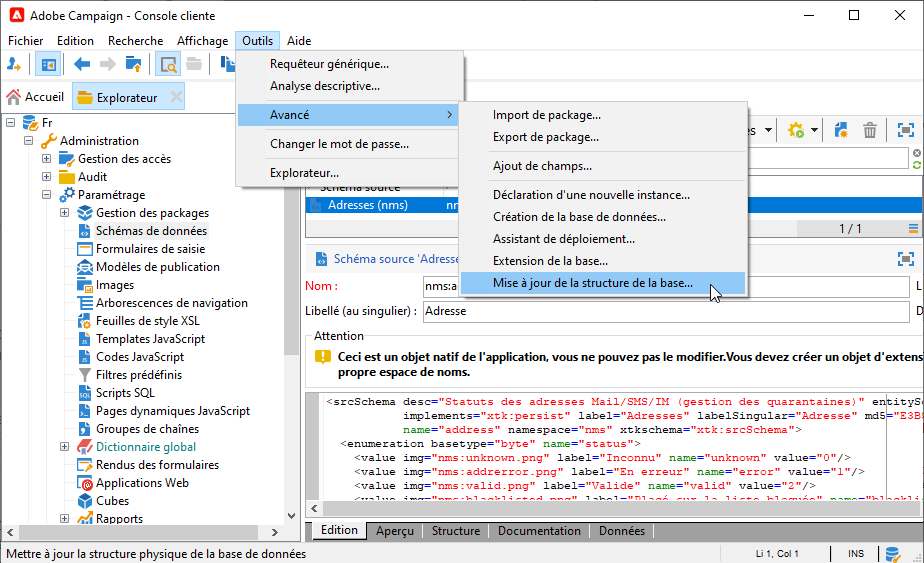

# Utilisation des schémas{#gs-ac-schemas}

La structure physique et logique des données véhiculées dans l&#39;application est décrite en XML et respecte une grammaire propre à Adobe Campaign appelée **schéma**.

Un schéma est un document XML associé à une table de la base de données, il définit la structuration des données et décrit la définition SQL de la table :

* le nom de la table,
* des champs ;
* les liens avec les autres tables,

mais aussi la structure XML utilisée pour stocker les données :

* Eléments et attributs
* la hiérarchie entre les éléments,
* les types des éléments et des attributs,
* Les valeurs par défaut
* les libellés, les descriptions et autres propriétés.

Les schémas servent à définir en base une entité. A chaque entité, correspond un schéma.

Dans Adobe Campaign, les schémas de données permettent de :

* définir la façon dont les objets de données de l&#39;application sont liés à des tables de la base de données ;
* définir des liens entre les différents objets de l&#39;application ;
* définir et décrire les champs individuels inclus dans chaque objet.

Pour une meilleure compréhension des tables intégrées de Campaign et de leur interaction, consultez [cette section](datamodel.md).

>[!CAUTION]
>
>Certains schémas Campaign prédéfinis comportent un schéma associé sur la base de données cloud. Ces schémas sont identifiés par l&#39;espace de noms **Xxl** et ne doivent pas être modifiés ou étendus.

## Syntaxe des schémas {#syntax-of-schemas}

L&#39;élément racine du schéma est **`<srcschema>`**. Il contient les sous-éléments **`<element>`** et **`<attribute>`**.

Le premier sous-élément **`<element>`** correspond à la racine de l&#39;entité.

```
<srcSchema name="recipient" namespace="cus">
  <element name="recipient">  
    <attribute name="lastName"/>
    <attribute name="email"/>
    <element name="location">
      <attribute name="city"/>
   </element>
  </element>
</srcSchema>
```

>[!NOTE]
>
>L&#39;élément racine de l&#39;entité porte le nom du schéma.



Les balises **`<element>`** définissent les noms des éléments d&#39;entité. Les balises **`<attribute>`** du schéma définissent les noms des attributs dans les balises **`<element>`** auxquelles elles ont été liées.

## Identification d&#39;un schéma {#identification-of-a-schema}

Un schéma de données est identifié par son nom et son espace de noms.

Un espace de noms permet de regrouper un ensemble de schémas par centres d&#39;intérêt. Par exemple, on utilisera l&#39;espace de noms **cus** pour le paramétrage spécifique aux clients (**customers**).

>[!CAUTION]
>
>Par convention, le nom de l&#39;espace de noms doit être concis et ne comprendre que des caractères autorisés conformes aux règles de nommage des noms XML.
>
>Les identifieurs ne doivent pas commencer par des caractères numériques.

## Espaces de noms réservés {#reserved-namespaces}

Certains espaces de noms sont réservés à la description des entités systèmes nécessaires au bon fonctionnement de l’application Adobe Campaign. L&#39;espace de noms suivant **ne doit pas être utilisé** pour identifier un nouveau schéma, dans quelque combinaison majuscule/minuscule que ce soit :

* **xxl** : réservé aux schémas de base de données cloud
* **xtk** : réservé aux données du système de la plateforme
* **nl** : réservé à l&#39;utilisation globale de l&#39;application
* **nms** : réservé aux diffusions (destinataire, diffusion, tracking, etc.)
* **ncm** : réservé à la gestion de contenu
* **temp** : réservé aux schémas temporaires
* **crm** : réservé à l&#39;intégration des connecteurs CRM

La clé d&#39;identification d&#39;un schéma est une chaîne construite avec l&#39;espace de noms et le nom séparés par le caractère &quot;:&quot;, par exemple **nms:recipient**.

## Création ou extension de schémas Campaign {#create-or-extend-schemas}

Pour ajouter un champ ou tout autre élément à l&#39;un des principaux schémas de données de Campaign, comme la table des destinataires (nms:recipient), vous devez étendre ce schéma.

 Pour plus d’informations, consultez la section [Extension d&#39;un schéma](extend-schema.md).

Pour ajouter un tout nouveau type de données qui n&#39;existe pas par défaut dans Adobe Campaign (une table des contrats par exemple), vous pouvez créer directement un schéma personnalisé.

 Pour plus d’informations, consultez la section [Création d&#39;un schéma](create-schema.md).




Une fois que vous avez créé ou étendu un schéma, il est recommandé de définir les éléments de son contenu XML dans l&#39;ordre présenté ci-dessous.

## Énumérations {#enumerations}

Les énumérations sont définies avant l&#39;élément principal du schéma. Elles permettent d&#39;afficher des valeurs dans une liste afin de restreindre les choix de l&#39;utilisateur pour un champ donné.

Exemple:

```
<enumeration basetype="byte" name="exTransactionTypeEnum" default="store">
<value label="Website" name="web" value="0"/>
<value label="Call Center" name="phone" value="1"/>
<value label="In Store" name="store" value="2"/>
</enumeration>
```

Quand vous définissez des champs, vous pouvez ensuite utiliser cette énumération de la façon suivante :

```
<attribute desc="Type of Transaction" label="Transaction Type" name="transactionType" 
type="string" enum="exTransactionTypeEnum"/>
```

>[!NOTE]
>
>Vous pouvez également ajouter des énumérations gérées par l&#39;utilisateur (accessibles depuis le nœud **[!UICONTROL Administration]** > **[!UICONTROL Plateforme]**) pour spécifier les valeurs d&#39;un champ donné. Cela peut être judicieux si vous envisagez d&#39;utiliser votre énumération en dehors du schéma sur lequel vous travaillez.

<!--
## Index {#index} 

In the context of a [FDA Snowflake deployment](../architecture/fda-deployment.md), you need to declare indexes. Indexes are the first elements declared in the main element of the schema. 

They can be unique or not, and reference one or more fields.

Examples:

```
<dbindex name="email" unique="true">
  <keyfield xpath="@email"/>
</dbindex>
```

```
<dbindex name="lastNameAndZip">
  <keyfield xpath="@lastName"/>
  <keyfield xpath="location/@zipCode"/>
</dbindex>
```

The **xpath** attribute points to the field in your schema that you wish to index.

>[!IMPORTANT]
>
>It is important to remember that the SQL query read performance gains provided by indexes also come with a performance hit on writing records. The indexes should therefore be used with precaution.

For more on indexes, refer to the [Indexed fields](database-mapping.md#indexed-fields) section.

-->

## Clés {#keys}

Chaque table doit posséder au moins une clé. Celle-ci est souvent définie automatiquement dans l&#39;élément principal du schéma au moyen de l’attribut **autopk** défini sur la valeur **true**.

En outre, dans le cadre d’un [Déploiement Enterprise (FFDA)](../architecture/enterprise-deployment.md), utilisez l’attribut **@autouuid** et définissez-le sur **true**.

La clé primaire peut également être définie au moyen de l&#39;attribut **internal**.

Exemple:

```
<key name="householdId" internal="true">
  <keyfield xpath="@householdId"/>
</key>
```

Dans cet exemple, au lieu de laisser l’attribut **@autopk** ou **@autouuid** créer une clé primaire par défaut nommée « id », on définit ici la clé primaire « householdId ».

>[!CAUTION]
>
>Lors de la création ou de l&#39;extension d&#39;un schéma, vous devez conserver la valeur de la séquence de la clé primaire (@pkSequence) pour l&#39;ensemble du schéma.

 En savoir plus sur les clés dans [cette section](database-mapping.md#management-of-keys).

## Attributs (champs) {#attributes--fields-}

Les attributs permettent de définir les champs composant votre objet de données. Utilisez le bouton **[!UICONTROL Insérer]** de la barre d&#39;outils d&#39;édition du schéma pour ajouter les modèles d&#39;attribut vides dans votre XML, à l&#39;endroit où se trouve votre curseur. En savoir plus dans [cette section](create-schema.md).



La liste complète des attributs est disponible dans la section consacrée aux éléments `<attribute>` de la [documentation de Campaign Classic v7](https://experienceleague.adobe.com/docs/campaign-classic/using/configuring-campaign-classic/schema-reference/elements-attributes/attribute.html?lang=fr#content-model). Voici quelques-uns des attributs les plus utilisés : **@advanced**, **@dataPolicy**, **@default**, **@desc**, **@enum**, **@expr**, **@label**, **@length**, **@name**, **@notNull**, **@required**, **@ref**, **@xml**, **@type**.

 Pour plus d&#39;informations sur chaque attribut, consultez la description des attributs dans la [documentation de Campaign Classic v7](https://experienceleague.adobe.com/docs/campaign-classic/using/configuring-campaign-classic/schema-reference/elements-attributes/schema-introduction.html?lang=fr#configuring-campaign-classic).

### Exemples {#examples}

Exemple de définition d&#39;une valeur par défaut :

```
<attribute name="transactionDate" label="Transaction Date" type="datetime" default="GetDate()"/>
```

Exemple d&#39;utilisation d&#39;un attribut commun en tant que modèle pour un champ également marqué comme obligatoire :

```
<attribute name="mobile" label="Mobile" template="nms:common:phone" required="true" />
```

Exemple de champ calculé masqué au moyen de l&#39;attribut **@advanced** :

```
<attribute name="domain" label="Email domain" desc="Domain of recipient email address" expr="GetEmailDomain([@email])" advanced="true" />
```

Exemple de champ XML également stocké dans un champ SQL et qui a un attribut **@dataPolicy** :

```
<attribute name="secondaryEmail" label="Secondary email address" length="100" xml="true" sql="true" dataPolicy="email" />
```

>[!CAUTION]
>
>Alors que la plupart des attributs sont associés selon une cardinalité 1-1 à un champ physique de la base de données, ce n&#39;est pas le cas pour les champs XML ni les champs calculés.\
>Un champ XML est stocké dans un champ memo (&quot;mData&quot;) de la table.\
>Un champ calculé en revanche est créé dynamiquement chaque fois qu&#39;une requête est lancée ; il n&#39;existe donc que dans la couche applicative.

## Liens {#links}

Les liens sont parmi les derniers éléments de l&#39;élément principal de votre schéma. Ils définissent comment les différents schémas de votre instance sont associés les uns aux autres.

Les liens sont déclarés dans le schéma qui contient la **clé étrangère** de la table à laquelle il est lié.

Il existe trois types de cardinalité : 1-1, 1-N et N-N. C&#39;est le type d&#39;association 1-N qui est utilisé par défaut.

### Exemples       {#examples-1}

Exemple de relation 1-N entre la table des destinataires (schéma d&#39;usine) et une table des transactions personnalisée :

```
<element label="Recipient" name="lnkRecipient" revLink="lnkTransactions" target="nms:recipient" type="link"/>
```

Exemple de relation 1-1 entre un schéma personnalisé &quot;Car&quot; (dans l&#39;espace de noms &quot;cus&quot;) et la table des destinataires :

```
<element label="Car" name="lnkCar" revCardinality="single" revLink="recipient" target="cus:car" type="link"/>
```

Exemple d&#39;une jointure externe entre la table des destinataires et une table des adresses reposant sur l&#39;adresse email et non une clé primaire :

```
<element name="emailInfo" label="Email Info" revLink="recipient" target="nms:address" type="link" externalJoin="true">
  <join xpath-dst="@address" xpath-src="@email"/>
</element>
```

&quot;xpath-dst&quot; correspond ici à la clé primaire dans le schéma cible et &quot;xpath-src&quot; à la clé étrangère dans le schéma source.

## Journal d’audit {#audit-trail}

Il peut être utile d&#39;ajouter à la fin de votre schéma un élément de suivi.

Procédez comme dans l&#39;exemple ci-dessous pour inclure les champs relatifs à la date de création, à l&#39;utilisateur qui a créé la donnée, à la date et à l&#39;auteur de la dernière modification pour toutes les données de votre table :

```
<element aggregate="xtk:common:auditTrail" name="auditTrail"/>
```

## Mettre à jour la structure de la base de données {#updating-the-database-structure}

Une fois vos modifications apportées et enregistrées, toutes les modifications susceptibles d&#39;avoir un impact sur la structure SQL doivent être appliquées à la base de données. Pour ce faire, utilisez l&#39;assistant de mise à jour de la base de données.



Pour plus d&#39;informations à ce sujet, consultez [cette section](update-database-structure.md).

>[!NOTE]
>
>Lorsque les modifications n’ont aucun impact sur la structure de la base de données, vous devez uniquement régénérer les schémas. Pour ce faire, sélectionnez le ou les schémas à mettre à jour, faites un clic droit et sélectionnez **[!UICONTROL Actions > Régénérer les schémas sélectionnés...]**.
