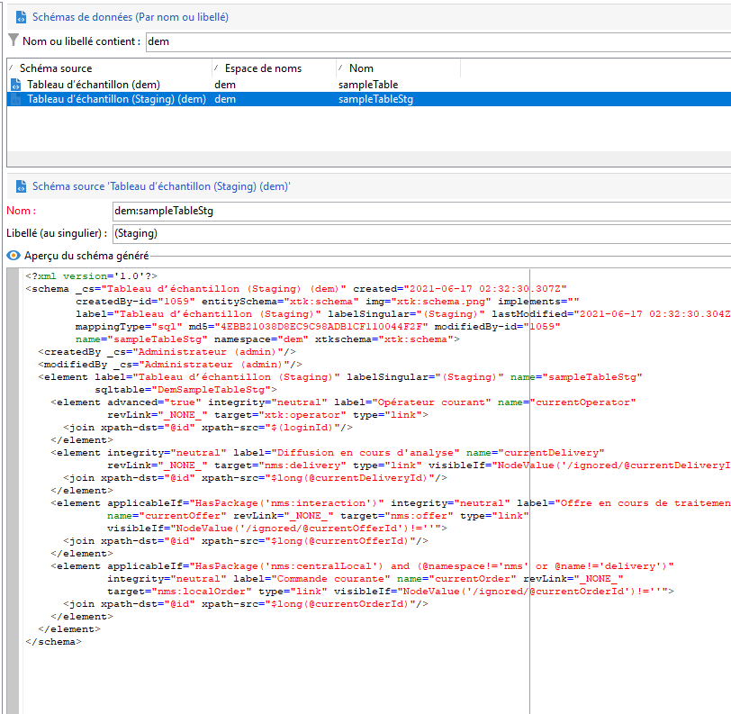

# Mécanisme d’évaluation de l’API Campaign

Avec la base de données Campaign Cloud, les appels unitaires d’explosion ne sont pas recommandés en raison des performances (latence et simultanéité). L’opération de lot est toujours préférable. Afin de garantir des performances optimales des API, Campaign gère toujours les appels API au niveau de la base de données locale.

Le mécanisme d&#39;évaluation de Campaign est disponible pour les tables intégrées et personnalisées. Il offre les avantages suivants :

* La structure du schéma de données est répliquée dans la table d’évaluation locale.
* Les nouvelles API pour l’ingestion se déplacent directement dans la table d’évaluation. [En savoir plus](new-apis.md)
* Un workflow planifié se déclenche toutes les heures et resynchronise les données vers la base de données cloud. [En savoir plus](../config/replication.md).

Certains schémas intégrés sont mis en scène par défaut, tels que nmsSubscriptionRcp, nmsAppSubscriptionRcp, nmsRecipient.

Les API de Campaign Classic v7 sont toujours disponibles, mais ne peuvent pas bénéficier de ce nouveau mécanisme d’évaluation : Les appels d’API sont acheminés directement vers la base de données Cloud. Adobe recommande d’utiliser le nouveau mécanisme d’évaluation autant que possible afin de réduire la pression globale et la latence sur la base de données de Campaign Cloud.

>[!CAUTION]
>
>Grâce à ce nouveau mécanisme, la synchronisation des données pour les abonnements, les désabonnements ou l’enregistrement mobile est désormais **asynchrone**.


## Étapes de mise en œuvre{#implement-staging}

Pour mettre en oeuvre le mécanisme d&#39;évaluation de Campaign sur une table spécifique, procédez comme suit :

1. Créez un exemple de schéma personnalisé sur la base de données Campaign Cloud. Aucune évaluation n’est activée à cette étape.

   ```
   <srcSchema _cs="Sample Table (dem)" created="YYYY-DD-MM"
           entitySchema="xtk:srcSchema" img="xtk:schema.png" label="Sample Table"
           lastModified="YYYY-DD-MM HH:MM:SS.TZ" mappingType="sql" md5="XXX"
           modifiedBy-id="0" name="sampleTable" namespace="dem" xtkschema="xtk:srcSchema">
   <element autopk="true" autouuid="true" dataSource="nms:extAccount:ffda" label="Sample Table"
           name="sampleTable">
       <attribute label="Test Col 1" length="255" name="testcol1" type="string"/>
       <attribute label="Test Col 2" length="255" name="testcol2" type="string"/>
   </element>
   </srcSchema>
   ```

   [!DNL :bulb:] Pour en savoir plus sur la création de schémas personnalisés, consultez  [cette page](create-schema.md).

1. Enregistrez et mettez à jour la structure de la base de données.  [En savoir plus](update-database-structure.md)

1. Activez le mécanisme d’évaluation dans la définition du schéma en ajoutant le paramètre **autoStg=&quot;true&quot;** .

   ```
   <srcSchema _cs="Sample Table (dem)" "YYYY-DD-MM"
           entitySchema="xtk:srcSchema" img="xtk:schema.png" label="Sample Table"
           lastModified="YYYY-DD-MM HH:MM:SS.TZ" mappingType="sql" md5="XXX"
           modifiedBy-id="0" name="sampleTable" namespace="dem" xtkschema="xtk:srcSchema">
   <element autoStg="true" autopk="true" autouuid="true" dataSource="nms:extAccount:ffda" label="Sample Table"
           name="sampleTable">
       <attribute label="Test Col 1" length="255" name="testcol1" type="string"/>
       <attribute label="Test Col 2" length="255" name="testcol2" type="string"/>
   </element>
   </srcSchema>
   ```

1. Enregistrez la modification. Un nouveau schéma d’évaluation est disponible, qui est une copie locale du schéma initial.

   

1. Mise à jour de la structure de la base de données. La table d&#39;évaluation sera créée sur la base de données locale de Campaign.
