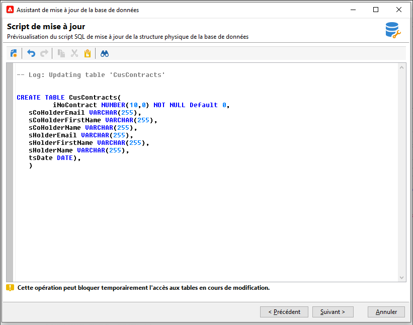

# Mettre à jour la structure de la base de données{#updating-the-database-structure}

Pour appliquer les modifications apportées aux schémas, lancez l&#39;Assistant Mise à jour de la base de données. Cet assistant est accessible via **[!UICONTROL Outils > Avancé > Mettre à jour la structure de base de données]**. Il vérifie si la structure physique de la base de données correspond à sa description logique et exécute les scripts de mise à jour SQL.

Les modules présents dans la base de données sont automatiquement renseignés et activés.

Suivez les étapes et visualisez le script SQL de mise à jour de la base de données :

>[!NOTE]
>
>Cette zone est en édition et peut être modifiée afin de supprimer ou ajouter du code SQL.

Lancez ensuite la mise à jour de la base de données :

