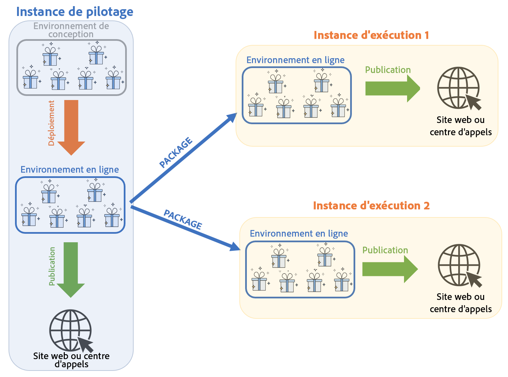
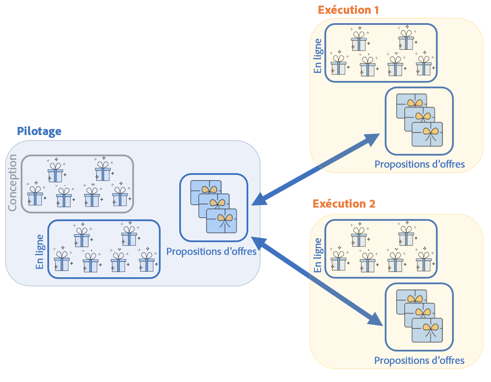
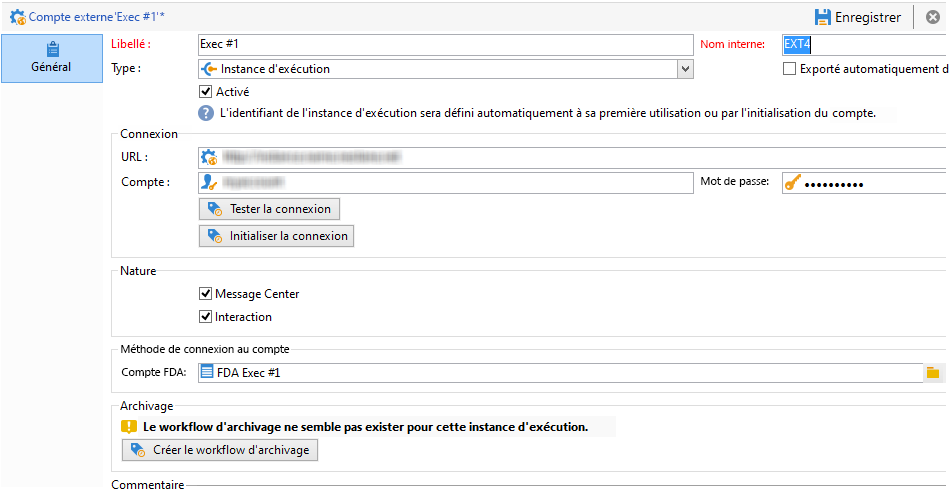
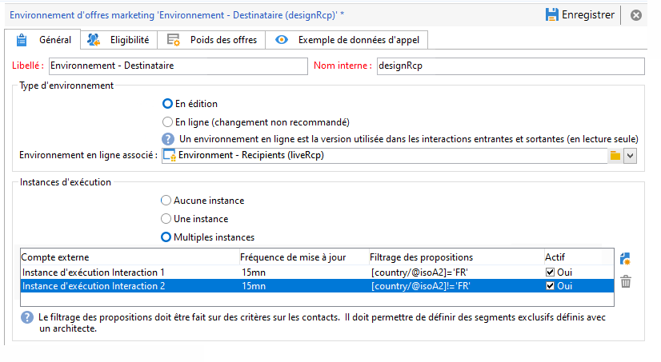
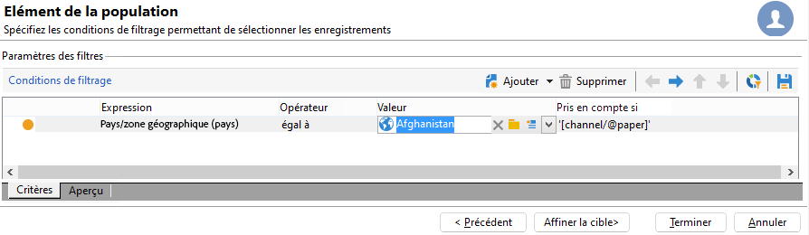

# Compréhension des environnements et de l&#39;architecture des interactions dans Campaign

## Environnements {#environments}

Pour chaque dimension de ciblage utilisée dans le cadre de la gestion des offres existe un duo d&#39;environnements :

* Un environnement **en édition** dans lequel le chargé d&#39;offres s&#39;occupe de créer et catégoriser les offres, de les modifier, de lancer le processus de validation afin qu&#39;elles puissent être utilisées. Les règles de chaque catégorie, les emplacements sur lesquels les offres peuvent être présentées et les filtres prédéfinis utilisés pour définir l&#39;éligibilité d&#39;une offre sont également définis dans cet environnement.

  Les catégories peuvent également être publiées manuellement dans l&#39;environnement en ligne.

  La validation des offres est détaillée [dans cette section](interaction-offer.md#approve-offers).

* Un environnement **en ligne** dans lequel se trouvent les offres approuvées de l&#39;environnement en édition, ainsi que les différents emplacements, filtres, catégories et règles configurés dans l&#39;environnement en édition. Lors d&#39;un appel au moteur d&#39;offres, ce dernier utilisera toujours les offres de l&#39;environnement en ligne.

Une offre n&#39;est déployée que sur les emplacements sélectionnés lors de la validation. Par conséquent, une offre peut être en ligne, mais inutilisable sur un emplacement qui est également en ligne.

## Interactions entrantes et sortantes {#interaction-types}

Le module Interaction d&#39;Adobe Campaign propose deux types d&#39;interactions :

* interactions **entrantes**, initiées par un contact. [En savoir plus](interaction-present-offers.md)
* interactions **sortantes**, initiées par un chargé de diffusion Campaign. [En savoir plus](interaction-send-offers.md)

Ces deux types d&#39;interactions peuvent être réalisés soit en **mode unitaire** (l&#39;offre est calculée pour un seul contact), soit en **mode batch** (l&#39;offre est calculée pour un ensemble de contacts). Généralement, les interactions entrantes sont réalisées en mode unitaire et les interactions sortantes en mode batch. Néanmoins, des exceptions peuvent exister, par exemple pour des [messages transactionnels](../send/transactional.md), pour lesquels l’interaction sortante est effectuée en mode unitaire.

Dès lors qu&#39;une offre peut ou doit être présentée (en fonction des paramétrages réalisés), le moteur d&#39;offre joue le rôle d&#39;intermédiaire : il calcule automatiquement la meilleure offre possible pour un contact parmi celles disponibles, en combinant les données recueillies sur le contact et les différentes règles applicables définies dans l&#39;application.


## Architecture répartie

Pour être en mesure d&#39;assurer l&#39;évolutivité et d&#39;offrir un service 24h/24, 7j/7 sur le canal entrant, le module **Interaction** est implémenté dans une architecture distribuée. Ce type d&#39;architecture est déjà utilisé avec [Message Center](../architecture/architecture.md#transac-msg-archi) et est constitué de plusieurs instances :

* une ou plusieurs instances de pilotage dédiées au canal sortant et contenant la base marketing et l&#39;environnement en édition
* une ou plusieurs instances d&#39;exécution dédiées au canal entrant



Les instances de pilotage sont dédiées au canal entrant et contiennent la version en ligne du catalogue. Chaque instance d&#39;exécution est indépendante et dédiée à un segment de contact (par exemple, une instance d&#39;exécution par pays). Les appels au moteur d&#39;offre doivent être effectués directement sur l&#39;instance d&#39;exécution (une URL spécifique par instance d&#39;exécution). Étant donné que la synchronisation entre les instances n&#39;est pas automatique, les interactions d&#39;un même contact doivent être envoyées à travers la même instance.

### Synchronisation {#synchronization}

La synchronisation des offres s&#39;effectue par packages. Sur les instances d&#39;exécution, tous les objets de catalogue sont précédés du nom du compte externe. Cela signifie que plusieurs instances de pilotage (instances de développement et de production, par exemple) peuvent être prises en charge sur une même instance d&#39;exécution.

>[!CAUTION]
>
>Utilisez des noms internes courts et explicites.

Les offres sont automatiquement déployées puis publiées sur les instances d&#39;exécution et l&#39;instance de pilotage.

Les offres supprimées dans l&#39;environnement en édition sont désactivées sur toutes les instances en ligne. Les propositions et offres obsolètes sont automatiquement supprimées sur toutes les instances après la période de purge (spécifiée dans l’assistant de déploiement de chaque instance) et la période glissante (spécifiée dans les règles de typologie des propositions entrantes).



Un workflow est créé pour chaque environnement et compte externe pour la synchronisation des propositions. La fréquence de synchronisation peut être ajustée pour chaque environnement et compte externe.

Vous devez prendre en compte les mécanismes de synchronisation suivants :

* Si vous utilisez la fonction de basculement (fall back) d&#39;un environnement anonyme vers un environnement identifié, ces deux environnements doivent être sur la même instance d&#39;exécution.
* La synchronisation entre plusieurs instances d&#39;exécution n&#39;est pas effectuée en temps réel. Les interactions d’un même contact doivent être envoyées à la même instance. L&#39;instance de pilotage doit être dédiée au canal sortant (pas de temps réel).
* La base de données marketing n&#39;est pas automatiquement synchronisée. Les données marketing utilisées dans les règles de poids et d&#39;éligibilité doivent être dupliquées sur les instances d&#39;exécution. Ce processus n’est pas fourni en standard, vous devez le développer pendant la période d’intégration.
* La synchronisation des propositions s&#39;effectue exclusivement par connexion FDA.
* Si vous utilisez Interaction et Message Center sur une même instance, la synchronisation s&#39;effectuera par protocole FDA dans les deux cas.

### Configuration des packages {#packages-configuration}

Les éventuelles extensions de schéma directement liées à **Interaction** (offres, propositions, destinataires, etc.) doit être déployé sur les instances d&#39;exécution.

Le package **Interaction** est installé sur toutes les instances (de pilotage et d&#39;exécution). Deux packages supplémentaires sont disponibles : l&#39;un pour les instances de pilotage et l&#39;autre pour chaque instance d&#39;exécution.

>[!NOTE]
>
>Lors de l&#39;installation du package, les champs de type **long** de la table **nms:proposition** tels que l&#39;identifiant de la proposition, deviennent des champs de type **int64**. Ce type de données est détaillé dans la documentation de [Campaign Classic v7](https://experienceleague.adobe.com/docs/campaign-classic/using/configuring-campaign-classic/schema-reference/schema-structure.html?lang=fr#mapping-the-types-of-adobe-campaign-dbms-data){target="_blank"}.

La durée de conservation des données est configurée sur chaque instance (via la fenêtre **[!UICONTROL Purge des données]** dans l&#39;assistant de déploiement). Sur les instances d&#39;exécution, cette période doit correspondre à la profondeur historique nécessaire au calcul des règles de typologie (période glissante) et d&#39;éligibilité.

Sur les instances de pilotage :

1. Créez un compte externe par instance d&#39;exécution :

   

   * Renseignez le libellé et un nom interne court et explicite.
   * Sélectionnez le type **[!UICONTROL Instance d&#39;exécution]**.
   * Cochez l&#39;option **[!UICONTROL Activé]**.
   * Renseignez les paramètres de connexion à l&#39;instance d&#39;exécution.
   * Chaque instance d&#39;exécution doit être associée à un identifiant. Cet identifiant est attribué lorsque vous cliquez sur le bouton **[!UICONTROL Initialiser la connexion]**.
   * Cochez le type d&#39;application utilisée : **[!UICONTROL Message Center]**, **[!UICONTROL Interaction]**, ou les deux.
   * Saisissez le compte FDA utilisé. Un opérateur doit être créé sur les instances d&#39;exécution et doit posséder les droits de lecture et d&#39;écriture suivants sur la base de données de l&#39;instance en question :

     ```
     grant SELECT ON nmspropositionrcp, nmsoffer, nmsofferspace, xtkoption, xtkfolder TO user;
     grant DELETE, INSERT, UPDATE ON nmspropositionrcp TO user;
     ```

   >[!NOTE]
   >
   >L&#39;adresse IP de l&#39;instance de pilotage doit être autorisée sur les instances d&#39;exécution.

1. Configurez l&#39;environnement :

   

   * Ajoutez la liste des instances d&#39;exécutions.
   * Définissez pour chacune la fréquence de synchronisation et les critères de filtrage (par exemple par pays).

     >[!NOTE]
     >
     >Si vous rencontrez une erreur, vous pouvez consulter les workflows de synchronisation et les notifications d&#39;offres. Ils se trouvent dans les workflows techniques de l’application.

Si, pour des raisons d&#39;optimisation, une partie seulement de la base de données marketing est dupliquée sur les instances d&#39;exécution, vous pouvez spécifier un schéma restreint lié à l&#39;environnement pour permettre aux utilisateurs d&#39;utiliser uniquement les données disponibles sur les instances d&#39;exécution. Vous pouvez créer une offre en utilisant des données qui ne sont pas disponibles sur les instances d&#39;exécution. Pour cela, vous devez désactiver la règle sur les autres canaux en limitant cette règle au canal sortant (champ **[!UICONTROL Pris en compte si]**).



### Options de maintenance {#maintenance-options}

Voici la liste des options de maintenance disponibles sur l&#39;instance de pilotage :

>[!CAUTION]
>
>Ces options ne doivent être utilisées que dans des cas de maintenance spécifiques.

* **`NmsInteraction_LastOfferEnvSynch_<offerEnvId>_<executionInstanceId>`** : date de dernière synchronisation d&#39;un environnement sur une instance donnée.
* **`NmsInteraction_LastPropositionSynch_<propositionSchema>_<executionInstanceIdSource>_<executionInstanceIdTarget>`** : date de dernière synchronisation des propositions d&#39;un schéma donné d&#39;une instance vers une autre.
* **`NmsInteraction_MapWorkflowId`** : option contenant la liste de tous les workflows de synchronisation générés.

L&#39;option suivante est disponible sur les instances d&#39;exécution :

**NmsExecutionInstanceId** : option contenant l&#39;identifiant de l&#39;instance.

### Installation des packages {#packages-installation}

Si votre instance ne possédait pas le package **Interaction** auparavant, aucune migration n’est nécessaire. Par défaut, la table des propositions sera en 64 bits une fois les packages installés.

>[!CAUTION]
>
>Selon le volume de propositions existantes dans votre instance, cette opération peut être très longue.

* Si votre instance comporte peu ou pas de propositions, aucune modification manuelle de la table des propositions n&#39;est nécessaire. La modification sera effectuée lors de l’installation des packages.
* Si votre instance comporte de nombreuses propositions, il est préférable de modifier la structure de la table des propositions avant d&#39;installer les packages de contrôle et de les exécuter. Nous vous recommandons d’exécuter les requêtes pendant une période de faible activité.

>[!NOTE]
>
>Si vous avez effectué des paramétrages spécifiques dans la table des propositions, adaptez les requêtes en conséquence.


Deux méthodes sont disponibles :

**Table de travail** (recommandée)

```
CREATE TABLE NmsPropositionRcp_tmp AS SELECT * FROM nmspropositionrcp WHERE 0=1;
ALTER TABLE nmspropositionrcp_tmp
  ALTER COLUMN ipropositionid TYPE bigint,
  ALTER COLUMN iinteractionid TYPE bigint;
INSERT INTO nmspropositionrcp_tmp SELECT * FROM nmspropositionrcp;
DROP TABLE nmspropositionrcp;
CREATE INDEX proposition_id ON NmsPropositionRcp (ipropositionid);
CREATE INDEX nmspropositionrcp_deliveryid ON NmsPropositionRcp (ideliveryid);
CREATE INDEX nmspropositionrcp_lastmodified ON NmsPropositionRcp (tslastmodified);
CREATE INDEX nmspropositionrcp_offerid ON NmsPropositionRcp (iofferid);
CREATE INDEX nmspropositionrcp_offerspaceid ON NmsPropositionRcp (iofferspaceid);
CREATE INDEX nmspropositionrcp_recipientidid ON NmsPropositionRcp (irecipientid);
ALTER TABLE nmspropositionrcp_tmp RENAME TO nmspropositionrcp;
```

**Alter Table**

```
ALTER TABLE nmspropositionrcp
  ALTER COLUMN ipropositionid TYPE bigint,
  ALTER COLUMN iinteractionid TYPE bigint;
```
