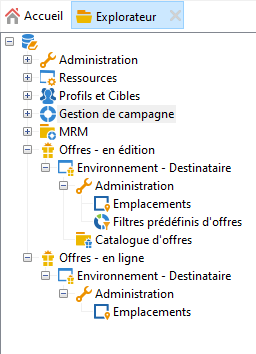
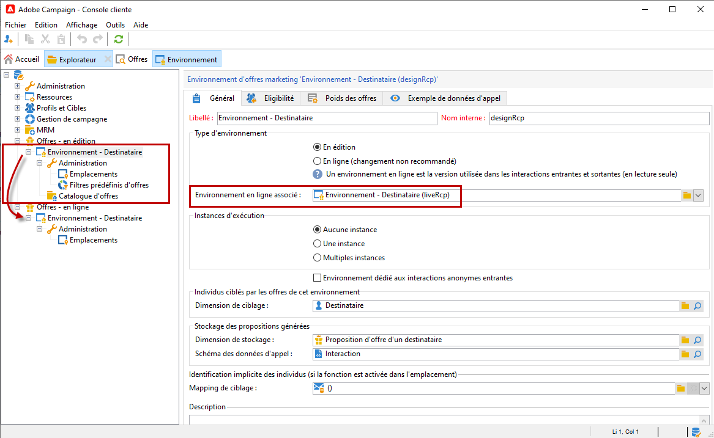
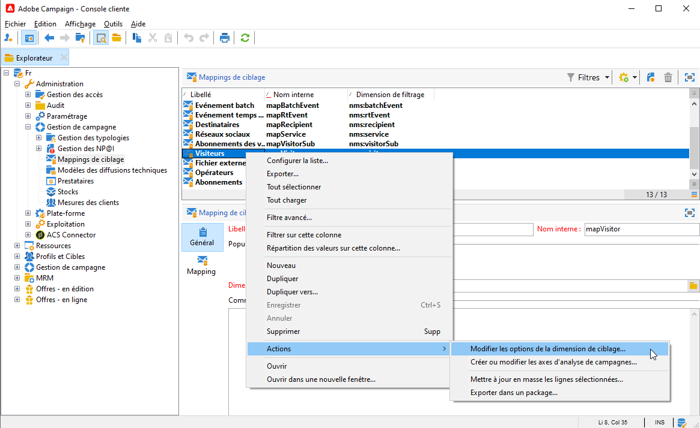
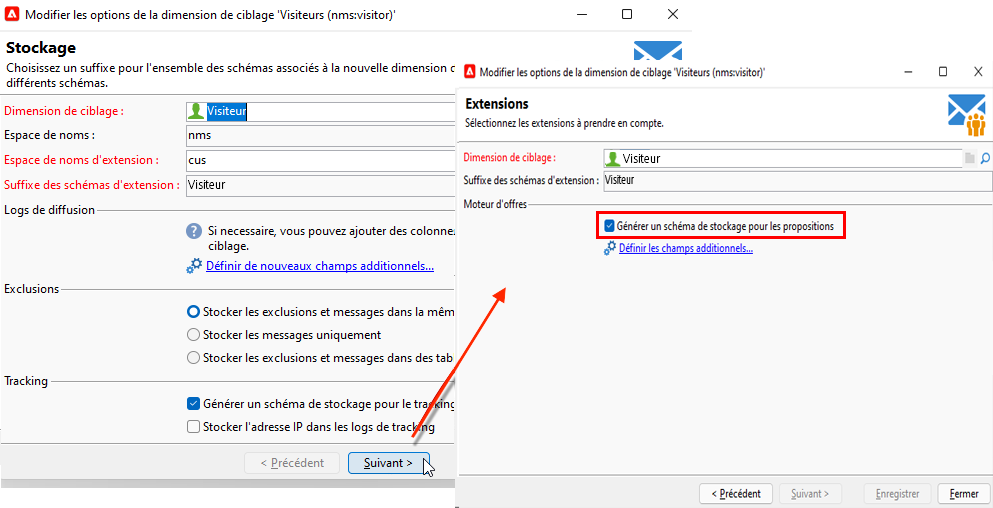
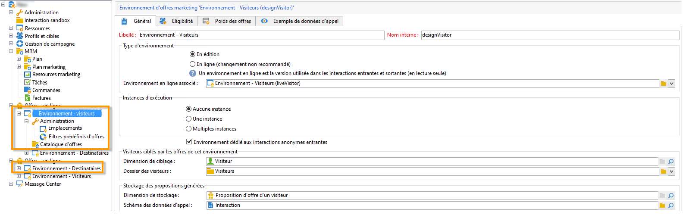

# Utilisation des environnements{#work-with-environments}

## Environnements en ligne et en édition{#live-design-environments}

Interaction fonctionne avec deux types d&#39;environnements d&#39;offres :

* des environnements d&#39;offres **[!UICONTROL En édition]**, dans lesquels les offres sont en cours de création et peuvent être modifiées. Ces offres ne sont pas encore passées par un cycle de validation et ne sont donc pas diffusées aux contacts.
* des environnements d&#39;offres **[!UICONTROL En ligne]** qui contiennent les offres validées, telles qu&#39;elles sont présentées aux contacts. Les offres contenues dans ces environnements sont en lecture seule.

Chaque environnement **[!UICONTROL En édition]** est associé à un environnement **[!UICONTROL En ligne]**. Lorsqu&#39;une offre est finalisée, son contenu et ses règles d&#39;éligibilité passent par un cycle de validation. Lorsque le cycle de validation est complet, l&#39;offre concernée est automatiquement déployée dans l&#39;environnement **[!UICONTROL En ligne]**. Dès lors, elle est disponible pour être diffusée.

Par défaut, Campaign comprend un environnement **[!UICONTROL En édition]** et un environnement **[!UICONTROL En ligne]** qui lui est associé. Les deux environnements sont préconfigurés pour cibler la [table de destinataires native](../dev/datamodel.md#ootb-profiles).

>[!NOTE]
>
>Pour cibler la table des destinataires, vous devez utiliser l&#39;assistant de mapping de ciblage pour créer les environnements. [En savoir plus](#creating-an-offer-environment).

Les chargés de diffusion peuvent uniquement afficher l&#39;environnement **[!UICONTROL En ligne]** et exploiter les offres pour les diffuser. Les chargés d&#39;offres peuvent consulter et utiliser l&#39;environnement **[!UICONTROL En édition]**, et consulter l&#39;environnement **[!UICONTROL En ligne]**. [En savoir plus](interaction-operators.md)

## Création dʼun environnement pour les interactions anonymes{#create-an-offer-environment}

Par défaut, Campaign comprend un environnement intégré pour cibler la table des destinataires (offres identifiées). Pour cibler une autre table, par exemple les profils anonymes qui visitent votre site web pour des interactions entrantes, vous devez mettre à jour votre configuration.

Procédez comme suit :

1. Accédez à **[!UICONTROL Administration]** > **[!UICONTROL Gestion de campagne]** > **[!UICONTROL Mappings de ciblage]**, cliquez avec le bouton droit sur le mapping de ciblage à utiliser et sélectionnez **[!UICONTROL Actions]** > **[!UICONTROL Modifier les options de la dimension de ciblage]**.

   

1. Cliquez sur **[!UICONTROL Suivant]**, sélectionnez l&#39;option **[!UICONTROL Générer un schéma de stockage pour les propositions]** et cliquez sur **[!UICONTROL Enregistrer]**.

   

   >[!NOTE]
   >
   >Si la case est déjà cochée, décochez-la puis recochez-la.

1. Adobe Campaign crée les deux environnements **[!UICONTROL En édition]** et **[!UICONTROL En ligne]** correspondant au mapping de ciblage activé précédemment. L&#39;environnement est préparamétré avec les informations de ciblage.

Si vous avez activé le mapping **[!UICONTROL Visiteurs]**, la case **[!UICONTROL Environnement dédié aux interactions anonymes entrantes]** est automatiquement cochée dans l&#39;onglet **[!UICONTROL Général]** de l&#39;environnement.

Cette option permet d&#39;activer les fonctions spécifiques aux interactions anonymes, notamment dans le paramétrage des emplacements de l&#39;environnement. Vous pourrez ainsi paramétrer des options permettant de basculer d&#39;un environnement &quot;identifié&quot; à un environnement &quot;anonyme&quot;.

Vous pouvez par exemple lier un emplacement dʼenvironnement de destinataire (contact identifié) à un emplacement correspondant dʼenvironnement de visiteur (contact non identifié). Ainsi, différentes offres seront mises à la disposition du contact, en fonction du caractère identifié ou non de ce dernier. Voir à ce sujet la section [Créer des emplacements](interaction-offer-spaces.md).

>[!NOTE]
>
>Pour plus d&#39;informations sur les interactions anonymes sur canal entrant, consultez la section [Interactions anonymes](anonymous-interactions.md).
